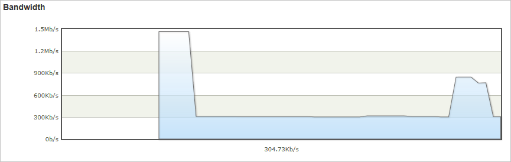
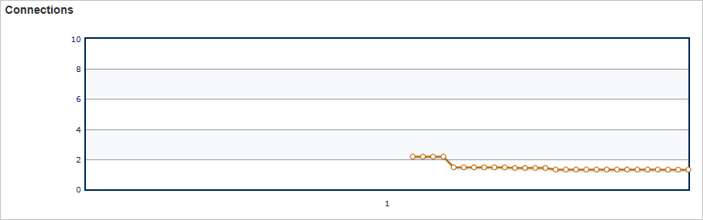

<properties
    pageTitle="Réel-temps statistiques dans Azure CDN | Microsoft Azure"
    description="Statistiques en temps réel fournissent des données en temps réel sur les performances du Azure CDN lors de la remise du contenu à vos clients."
    services="cdn"
    documentationCenter=""
    authors="camsoper"
    manager="erikre"
    editor=""/>

<tags
    ms.service="cdn"
    ms.workload="tbd"
    ms.tgt_pltfrm="na"
    ms.devlang="na"
    ms.topic="article"
    ms.date="07/28/2016"
    ms.author="casoper"/>

# Statistiques en temps réel dans Microsoft Azure CDN

[AZURE.INCLUDE [cdn-premium-feature](../../includes/cdn-premium-feature.md)]

## Vue d’ensemble

Ce document explique les statistiques en temps réel dans Microsoft Azure CDN.  Cette fonctionnalité fournit des données en temps réel, tels que la bande passante statuts cache et connexions simultanées à votre profil CDN lors de la remise du contenu à vos clients. Cela active l’analyse continue de l’état de votre service à tout moment, y compris les événements de mise en service.

Les graphiques suivants sont disponibles :

* [Bande passante](#bandwidth)
* [Codes d’état](#status-codes)
* [Statuts de cache](#cache-statuses)
* [Connexions](#connections)

## L’accès à des statistiques en temps réel

1. Dans le [Portail Azure](https://portal.azure.com), accédez à votre profil CDN.

    

2. À partir de la carte de profil CDN, cliquez sur le bouton **Gérer** .

    

    Le portail de gestion CDN s’ouvre.

3. Placez le curseur sur l’onglet **Analytique** , puis placez le curseur sur le Lanceur de **Statistiques en temps réel** .  Cliquez sur **objet volumineux HTTP**.

    

    Les graphiques statistiques en temps réel sont affichés.
    
Chacune des graphiques affiche des statistiques en temps réel pour la période sélectionnée, en commençant lors du chargement de la page.  Les graphiques mettre à jour automatiquement après quelques secondes.  Le bouton **Actualiser le graphique** , le cas échéant, efface le graphique, après laquelle il affiche uniquement les données sélectionnées.

## Bande passante

Le graphique de **la bande passante** affiche la quantité de bande passante utilisée pour la plateforme actuelle sur l’intervalle de temps sélectionné. La partie ombrée du graphique indique la bande passante. Le nombre exact de bande passante en cours d’utilisation s’affiche directement en dessous du graphique en courbes.

## Codes d’état

Le graphique de **Codes d’état** indique la fréquence à laquelle certains codes de réponse HTTP sont produisent sur l’intervalle de temps sélectionné.

> [AZURE.TIP]  Pour obtenir une description de chaque option de code de statut HTTP, voir [Codes d’état HTTP Azure CDN](https://msdn.microsoft.com/library/mt759238.aspx).

Liste des codes d’état HTTP s’affiche directement au-dessus du graphique. Cette liste indique chaque code d’état qui peut être inclus dans le graphique en courbes et le nombre d’occurrences par seconde pour ce code d’état actuel. Par défaut, une ligne s’affiche pour chacun de ces codes d’état dans le graphique. Toutefois, vous pouvez choisir de surveiller uniquement les codes d’état qui ont une signification particulière pour la configuration de votre fournisseur. Pour ce faire, vérifier les codes de statut souhaité et désactivez toutes les autres options, puis cliquez sur **Actualiser le graphique**. 

Vous pouvez masquer temporairement les données consignées pour un code d’état particulier.  Dans la légende directement en dessous du graphique, cliquez sur le code d’état que vous souhaitez masquer. Le code d’état est masqué immédiatement à partir du graphique. Cliquez de nouveau sur ce code d’état entraînera cette option s’affiche à nouveau.

## Statuts de cache

Le graphique de **Cache statuts** indique la fréquence à laquelle certains types de statuts de cache sont produisent sur l’intervalle de temps sélectionné. 

> [AZURE.TIP]  Pour obtenir une description de chaque option de code de statut de cache, voir [Codes de statut Azure CDN Cache](https://msdn.microsoft.com/library/mt759237.aspx).

Liste des codes de statut de cache s’affiche directement au-dessus du graphique. Cette liste indique chaque code d’état qui peut être inclus dans le graphique en courbes et le nombre d’occurrences par seconde pour ce code d’état actuel. Par défaut, une ligne s’affiche pour chacun de ces codes d’état dans le graphique. Toutefois, vous pouvez choisir de surveiller uniquement les codes d’état qui ont une signification particulière pour votre configuration CDN. Pour ce faire, vérifier les codes de statut souhaité et désactivez toutes les autres options, puis cliquez sur **Actualiser le graphique**. 

Vous pouvez masquer temporairement les données consignées pour un code d’état particulier.  Dans la légende directement en dessous du graphique, cliquez sur le code d’état que vous souhaitez masquer. Le code d’état est masqué immédiatement à partir du graphique. Cliquez de nouveau sur ce code d’état entraînera cette option s’affiche à nouveau.

## Connexions

Ce graphique indique le nombre de connexions ont été établi à vos serveurs de bord. Chaque demande d’un bien transmission à nos résultats CDN dans une connexion.

## Étapes suivantes

- Être informé des [alertes en temps réel dans Azure CDN](cdn-real-time-alerts.md)
- Aller plus loin avec [des rapports HTTP avancés](cdn-advanced-http-reports.md)
- Analyser les [modèles d’utilisation](cdn-analyze-usage-patterns.md)

