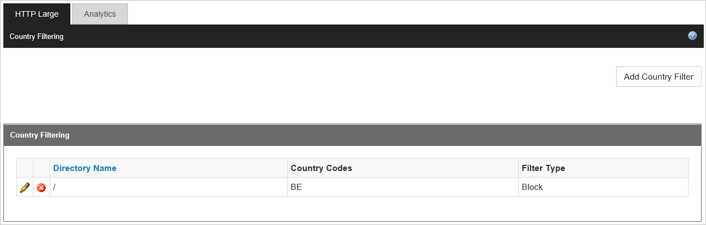

<properties
    pageTitle="Limiter l’accès à votre contenu Azure CDN par pays | Microsoft Azure"
    description="Découvrez comment limiter l’accès à votre contenu Azure CDN en utilisant la fonctionnalité de filtrage Geo."
    services="cdn"
    documentationCenter=""
    authors="camsoper, rli"
    manager="erikre"
    editor=""/>

<tags
    ms.service="cdn"
    ms.workload="tbd"
    ms.tgt_pltfrm="na"
    ms.devlang="na"
    ms.topic="article"
    ms.date="10/13/2016"
    ms.author="casoper"/>

#Limiter l’accès à votre contenu par pays - Verizon

> [AZURE.SELECTOR]
- [Verizon](cdn-restrict-access-by-country.md)
- [Akamai Standard](cdn-restrict-access-by-country-akamai.md)

##Vue d’ensemble

Lorsqu’un utilisateur demande votre contenu par défaut, le contenu est pris en charge quelle que soit l’endroit où l’utilisateur fait cette demande à partir de. Dans certains cas, vous souhaiterez limiter l’accès à votre contenu par pays. Cette rubrique explique comment utiliser la fonctionnalité de **Filtrage Geo** afin de configurer le service pour autoriser ou bloquer l’accès par pays.

> [AZURE.IMPORTANT] Les produits Verizon et Akamai fournissent les mêmes fonctionnalités de filtrage geo, mais diffère de l’interface utilisateur. Ce document décrit l’interface de **Azure CDN Standard de Verizon** et **Azure CDN Premium auprès de Verizon**. Pour geo-filtrage avec **Azure CDN Standard à partir d’Akamai**, voir [limiter l’accès à votre contenu par pays - Akamai](cdn-restrict-access-by-country-akamai.md).

Pour plus d’informations sur les considérations qui s’appliquent à la configuration de ce type de restriction, consultez la section [Considérations](cdn-restrict-access-by-country.md#considerations) à la fin de la rubrique.  

>[AZURE.NOTE] Une fois la configuration a été configurée, elle s’applique à tous les points de terminaison **Azure CDN de Verizon** dans ce profil Azure CDN.

##Étape 1 : Définir le chemin d’accès

Lorsque vous configurez un filtre de pays, vous devez spécifier le chemin d’accès relatif à l’emplacement auquel les utilisateurs seront autorisés ou accès refusés. Vous pouvez appliquer le filtrage de pays pour tous vos fichiers avec « / » ou dossiers sélectionnés en spécifiant des chemins d’accès.

Filtre de chemin d’accès du répertoire exemple :

    /                                 
    /Photos/
    /Photos/Strasbourg

##Étape 2 : Définir l’action : bloquer ou autoriser

**Bloc :** Les utilisateurs des pays spécifiés seront être refuser l’accès aux ressources demandées à partir de ce chemin d’accès récursive. Si aucune option de filtrage pays n’ont été configurées pour cet emplacement, puis tous les autres utilisateurs seront autorisés à accéder.

**Autoriser :** Seuls les utilisateurs des pays spécifiés seront autorisés à accéder aux ressources demandées à partir de ce chemin d’accès récursive.

##Étape 3 : Définir les pays

Sélectionnez les pays que vous souhaitez bloquer ou autoriser le chemin d’accès. Pour plus d’informations, voir [Azure CDN Verizon de codes de pays spécifiques](https://msdn.microsoft.com/library/mt761717.aspx).

Par exemple, la règle de blocage /Photos/Strasbourg/filtrer les fichiers, notamment :

    http://<endpoint>.azureedge.net/Photos/Strasbourg/1000.jpg
    http://<endpoint>.azureedge.net/Photos/Strasbourg/Cathedral/1000.jpg

##Codes de pays

La fonctionnalité de **Filtrage Geo** utilise des codes de pays pour définir les pays à partir de laquelle une demande est autorisée ou bloquée pour un répertoire sécurisé. Vous trouverez les codes de pays dans [Azure CDN Verizon de codes de pays spécifiques](https://msdn.microsoft.com/library/mt761717.aspx). Si vous spécifiez (Europe) « l’Union européenne » ou « PA » (Pacifique), un sous-ensemble des adresses IP provenant de n’importe quel pays dans la mesure où régions sont bloquées et autorisées.

##Considérations relatives à la

- Il peut prendre jusqu'à 90 minutes pour que les modifications à votre configuration de filtrage des pays prenne effet.
- Cette fonctionnalité ne prend pas en charge les caractères génériques (par exemple, « * »).
- Le pays filtrage configuration associée le chemin d’accès relatif sera appliquée de manière récursive ce chemin d’accès.
- Une seule règle peut être appliquée à la même chemin d’accès relatif (vous ne pouvez pas créer plusieurs filtres de pays qui pointent vers le même chemin relatif. Toutefois, un dossier peut avoir plusieurs filtres pays. Il s’agit en raison de la nature récursive de filtres de pays. En d’autres termes, un filtre de pays différents peut être affecté à un sous-dossier d’un dossier préconfiguré.
