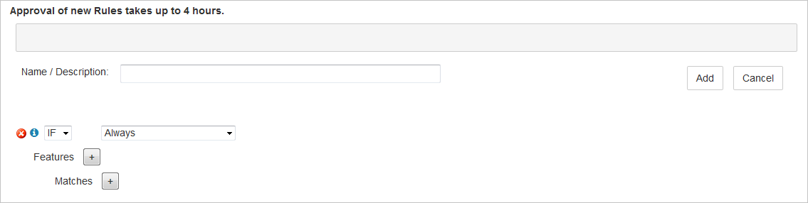

<properties
    pageTitle="Le comportement par défaut HTTP dans Azure CDN à l’aide du moteur de règles | Microsoft Azure"
    description="Le moteur de règles vous permet de personnaliser comment les requêtes HTTP sont gérés par Azure CDN, par exemple bloquer la remise de certains types de contenu, définir une stratégie de mise en cache et modifier les en-têtes HTTP."
    services="cdn"
    documentationCenter=""
    authors="camsoper"
    manager="erikre"
    editor=""/>

<tags
    ms.service="cdn"
    ms.workload="tbd"
    ms.tgt_pltfrm="na"
    ms.devlang="na"
    ms.topic="article"
    ms.date="07/28/2016"
    ms.author="casoper"/>

# Remplacer comportement HTTP par défaut à l’aide du moteur de règles

[AZURE.INCLUDE [cdn-premium-feature](../../includes/cdn-premium-feature.md)]

## Vue d’ensemble

Le moteur de règles vous permet de personnaliser la gestion des demandes HTTP, tels que bloquer la remise de certains types de contenu, définir une stratégie de mise en cache et modification des en-têtes HTTP.  Ce didacticiel va vous montrer création d’une règle qui remplacera le comportement du cache de biens CDN.  Contenu vidéo est également disponible dans la section «[Voir aussi](#see-also)».

## Didacticiel

1. À partir de la carte de profil CDN, cliquez sur le bouton **Gérer** .

    

    Le portail de gestion CDN s’ouvre.

2. Cliquez sur l’onglet **HTTP volumineux** , suivi par le **Moteur de règles**.

    Options pour une nouvelle règle sont affichées.

    

    >[AZURE.IMPORTANT] L’ordre dans lequel plusieurs règles sont répertoriés affecte la façon dont ils sont gérés. Une règle suivante peut-être remplacer les actions spécifiées par une règle antérieure.
    
3. Entrez un nom dans la **nom / Description** zone de texte.

4. Identifier le type de la règle s’applique à des requêtes.  Par défaut, la condition de correspondance **toujours** est sélectionnée.  Vous allez utiliser **toujours** pour ce didacticiel, laissez sélectionnés.

    

    >[AZURE.TIP] Il existe de nombreux types de correspondance conditions disponibles dans la liste déroulante.  Cliquez sur l’icône d’information bleu à gauche de la condition de correspondance montre la condition actuellement sélectionnée dans le détail.
    >
    >Pour obtenir la liste complète des conditions de correspondance dans le détail, voir [règles moteur correspond à Condition et détails sur les fonctionnalités](https://msdn.microsoft.com/library/mt757336.aspx#Anchor_0).

5.  Cliquez sur le **+** bouton en regard de **fonctionnalités** pour ajouter une nouvelle fonctionnalité.  Dans la liste déroulante située à gauche, sélectionnez **Forcer interne Max-Age**.  Dans la zone de texte qui s’affiche, entrez **300**.  Conservez les valeurs par défaut restantes.

    

    >[AZURE.NOTE] Comme avec des conditions de correspondance, en cliquant sur l’icône d’information bleue à gauche de la nouvelle fonctionnalité affiche plus d’informations sur cette fonctionnalité.  Dans le cas d' **Force interne Max-Age**, nous sommes substituant des en-têtes de **Contrôle du Cache** et la **date d’expiration** de l’actif au contrôle lorsque le nœud de bord CDN d’actualisation du bien à l’origine.  Notre exemple de 300 secondes signifie que le nœud de bord CDN cache du bien pendant 5 minutes avant d’actualiser les biens de son origine.
    >
    >Pour obtenir la liste complète des fonctionnalités dans le détail, voir [règles moteur correspondance une Condition et une fonctionnalité de détails](https://msdn.microsoft.com/library/mt757336.aspx#Anchor_1).

6.  Cliquez sur le bouton **Ajouter** pour enregistrer la nouvelle règle.  La nouvelle règle est maintenant en attente d’approbation. Une fois qu’elle a été approuvée, l’état ne pourra **En attente XML** au **Format XML Active**.

    >[AZURE.IMPORTANT] Modifications de règles peuvent prendre jusqu'à 90 minutes propager dans le CDN.

## Voir aussi
* [Vendredi azure : puissantes fonctionnalités Premium nouveau de Azure CDN](https://azure.microsoft.com/documentation/videos/azure-cdns-powerful-new-premium-features/) (vidéo)
* [Condition de correspondance moteur de règles et les détails de la fonctionnalité](https://msdn.microsoft.com/library/mt757336.aspx)
