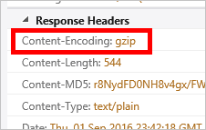

<properties
    pageTitle="Résolution des problèmes de compression de fichier dans Azure CDN | Microsoft Azure"
    description="Résoudre les problèmes de compression des fichiers Azure CDN."
    services="cdn"
    documentationCenter=""
    authors="camsoper"
    manager="erikre"
    editor=""/>

<tags
    ms.service="cdn"
    ms.workload="tbd"
    ms.tgt_pltfrm="na"
    ms.devlang="na"
    ms.topic="article"
    ms.date="09/01/2016"
    ms.author="casoper"/>
    
# Résolution des problèmes de compression des fichiers CDN

Cet article vous permet de résoudre les problèmes de [compression des fichiers CDN](cdn-improve-performance.md).

Si vous avez besoin d’une aide supplémentaire à tout moment dans cet article, vous pouvez contacter experts Azure sur [la Azure MSDN et les forums de débordement de pile](https://azure.microsoft.com/support/forums/). Par ailleurs, vous pouvez également créer un incident de support Azure. Accédez au [site d’assistance Azure](https://azure.microsoft.com/support/options/) , puis cliquez sur **Obtenir un Support**.

## Symptôme

Compression de votre point de terminaison est activée, mais les fichiers sont retournés compressées.

>[AZURE.TIP] Pour vérifier que si vos fichiers sont retournés compressés, vous devez utiliser un outil comme [Fiddler](http://www.telerik.com/fiddler) ou de votre navigateur [Outils de développement](https://developer.microsoft.com/microsoft-edge/platform/documentation/f12-devtools-guide/).  En-têtes de réponse à cocher HTTP retournés avec votre CDN mis en cache du contenu.  S’il existe un en-tête nommé `Content-Encoding` avec une valeur de **gzip**, **bzip2**ou **compressé**, votre contenu est compressé.
>
>

## Cause

Il existe plusieurs causes possibles, y compris :

- Le contenu demandé n’est pas éligible pour la compression.
- Compression n’est pas activée pour le type de fichier demandé.
- La requête HTTP contenait pas un en-tête de demande d’un type de compression valide.

## Étapes de dépannage

> [AZURE.TIP] Comme avec déploiement de nouveaux points de terminaison, modifications de la configuration CDN prennent un certain temps de se propager via le réseau.  En règle générale, les modifications sont appliquées dans les 90 minutes.  Si c’est la première fois que vous avez configuré compression pour votre point de terminaison CDN, vous devez prendre en compte en attente heures 1 et 2 pour vous assurer que la compression paramètres ont été propagées aux POP. 

### Vérifier la demande

Tout d’abord, nous devons procéder à un contrôle de validité rapide lors de la demande.  Vous pouvez utiliser de votre navigateur [Outils de développement](https://developer.microsoft.com/microsoft-edge/platform/documentation/f12-devtools-guide/) pour afficher les demandes.

- Vérifier la demande est envoyée à l’URL de votre point de terminaison, `<endpointname>.azureedge.net`et pas votre origine.
- Vérifiez la demande contient un en-tête **Encodage-acceptation** et la valeur pour cet en-tête **gzip**, **compressé**ou **bzip2**.

> [AZURE.NOTE] Profils **Azure CDN à partir d’Akamai** prend uniquement en charge le codage de **gzip** .

### Vérifier les paramètres de compression (profil CDN Standard)

> [AZURE.NOTE] Cette étape s’applique uniquement si votre profil CDN est un profil **Azure CDN Standard de Verizon** ou **Azure CDN Standard à partir d’Akamai** . 

Naviguez jusqu'à votre point de terminaison dans le [portail Azure](https://portal.azure.com) et cliquez sur le bouton **configurer** .

- Vérifiez la compression est activée.
- Vérifier le type MIME pour le contenu à compresser est inclus dans la liste des formats compressés.

### Vérifier les paramètres de compression (profil CDN Premium)

> [AZURE.NOTE] Cette étape s’applique uniquement si votre profil CDN est un profil **Azure CDN Premium auprès de Verizon** .

Naviguez jusqu'à votre point de terminaison dans le [portail Azure](https://portal.azure.com) et cliquez sur le bouton **Gérer** .  Le portail supplémentaire s’ouvre.  Placez le curseur sur l’onglet **Grande HTTP** , puis placez le curseur sur le Lanceur de **Paramètres du Cache** .  Cliquez sur **Compression**. 

- Vérifiez la compression est activée.
- Vérifiez que la liste de **Types de fichiers** contient une liste séparée par des virgules (sans espace) des types MIME.
- Vérifier le type MIME pour le contenu à compresser est inclus dans la liste des formats compressés.

### Vérifier que le contenu est mis en cache

> [AZURE.NOTE] Cette étape s’applique uniquement si votre profil CDN est un profil **Azure CDN de Verizon** (Standard ou Premium).

À l’aide des outils de développement de votre navigateur, vérifiez les en-têtes de réponse pour vous assurer que le fichier est mis en cache dans la région dans lequel il est demandé.

- Vérifiez que l’en-tête de réponse **serveur** .  L’en-tête doit avoir le format **plateforme (ID POP/serveur)**, comme illustré dans l’exemple suivant.
- Vérifiez que l’en-tête de réponse **X Cache** .  L’en-tête doit indiquer **d’accès**.  

### Vérifiez le fichier répond à la configuration requise de taille

> [AZURE.NOTE] Cette étape s’applique uniquement si votre profil CDN est un profil **Azure CDN de Verizon** (Standard ou Premium).

Pour pouvoir bénéficier de compression, un fichier doit répondre aux exigences taille suivantes :

- Supérieure à 128 octets.
- Inférieure à 1 Mo.

### Vérifiez la demande auprès du serveur d’origine d’un en-tête **Via**

L’en-tête **Via** HTTP indique au serveur web que la demande est passée par un serveur proxy.  Par défaut des serveurs web IIS Microsoft ne pas compresser les réponses lorsque la demande contient un en-tête **Via** .  Pour ignorer ce problème, effectuez les opérations suivantes :

- **IIS 6**: [définir HcNoCompressionForProxies = « FALSE » dans les propriétés de métabase IIS](https://msdn.microsoft.com/library/ms525390.aspx)
- **IIS 7 et jusqu'à**: [définissez **noCompressionForHttp10** et **noCompressionForProxies** sur False dans la configuration du serveur](http://www.iis.net/configreference/system.webserver/httpcompression)

