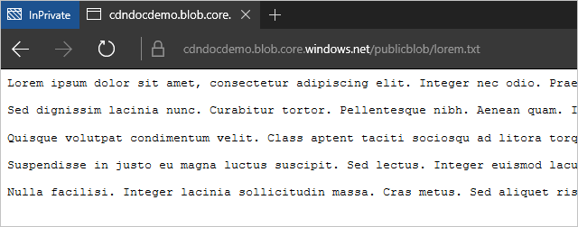
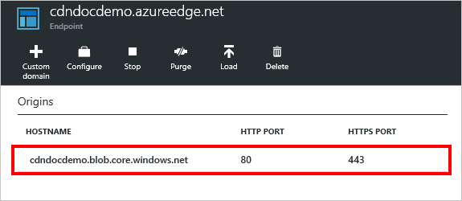
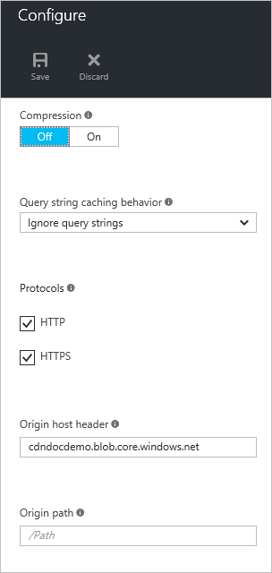

<properties
    pageTitle="Résolution des problèmes de points de terminaison Azure CDN retour d’état 404 | Microsoft Azure"
    description="Résolution des problèmes 404 codes de réponse avec points de terminaison Azure CDN."
    services="cdn"
    documentationCenter=""
    authors="camsoper"
    manager="erikre"
    editor=""/>

<tags
    ms.service="cdn"
    ms.workload="tbd"
    ms.tgt_pltfrm="na"
    ms.devlang="na"
    ms.topic="article"
    ms.date="07/28/2016"
    ms.author="casoper"/>
    
# Résolution des problèmes de points de terminaison CDN renvoi 404 statuts

Cet article vous permet de résoudre les problèmes avec les [points de terminaison CDN](cdn-create-new-endpoint.md) retour de 404 erreurs.

Si vous avez besoin d’une aide supplémentaire à tout moment dans cet article, vous pouvez contacter experts Azure sur [la Azure MSDN et les forums de débordement de pile](https://azure.microsoft.com/support/forums/). Par ailleurs, vous pouvez également créer un incident de support Azure. Accédez au [site d’assistance Azure](https://azure.microsoft.com/support/options/) et cliquez sur **Obtenir un Support**.

## Manifestation

Vous avez créé un profil CDN et un point de terminaison, mais votre contenu ne semble pas être disponibles sur le CDN.  Les utilisateurs essaient d’accéder à votre contenu via l’URL CDN recevoir des codes d’état HTTP 404. 

## Cause

Il existe plusieurs causes possibles, y compris :

- Origine du fichier n’est pas visible du CDN
- Le point de terminaison est mal configuré, à l’origine du CDN rechercher au mauvais endroit
- L’hôte est rejet de l’en-tête d’hôte à partir du CDN
- Le point de terminaison n’a pas eu le temps de se propager dans le CDN

## Étapes de dépannage

> [AZURE.IMPORTANT] Après avoir créé un point de terminaison CDN, il immédiatement sera pas disponible pour une utilisation, comme le temps requis pour l’enregistrement de se propager par le biais du CDN.  Les profils <b>Azure CDN à partir d’Akamai</b> , propagation se termine généralement au sein d’une minute.  Les profils <b>Azure CDN de Verizon</b> , propagation doivent effectuer généralement dans les 90 minutes, mais dans certains cas, peut prendre plus de temps.  Si vous effectuez les étapes décrites dans ce document et que vous rencontrez toujours des 404 réponses, vous pouvez attendre quelques heures pour vérifier à nouveau avant d’ouvrir un tickets de support.

### Archiver le fichier d’origine

Tout d’abord, nous devons vérifier que le fichier que nous mis en cache n’est disponible sur notre origin et est accessible au public.  La méthode la plus rapide qui consiste à ouvrir un navigateur dans une en privé ou une fenêtre session accédez directement au fichier.  Simplement, tapez ou collez l’URL dans la zone adresse et voir si qui résulte dans le fichier souhaité.  Dans cet exemple, je vais utiliser un fichier que j’utilise dans un compte de stockage Azure, accessible en `https://cdndocdemo.blob.core.windows.net/publicblob/lorem.txt`.  Comme vous pouvez le voir, il passe avec succès le test.

> [AZURE.WARNING] Alors que c’est le moyen le plus rapide et plus facile à vérifier que votre fichier est disponible publiquement, des configurations réseau de votre organisation peuvent donner l’impression que ce fichier est accessible au public lorsqu’elle est, en fait, visible uniquement aux utilisateurs de votre réseau (même si elle est hébergé dans Azure).  Si vous avez un navigateur externe à partir de laquelle vous pouvez tester, par exemple un appareil mobile n’est pas connecté au réseau de votre organisation, ou une machine virtuelle dans Azure, qui serait préférable.

### Vérifiez les paramètres d’origine

À présent que nous avons vérifié que le fichier est accessible au public sur internet, nous devons vérifier les paramètres d’origine.  Dans le [Portail Azure](https://portal.azure.com), accédez à votre profil CDN, cliquez sur le point de terminaison que vous effectuez un dépannage.  Dans la carte de **point de terminaison** résultante, cliquez sur l’origine.  

La carte **d’origine** s’affiche. 

#### Nom d’hôte et le type d’origine

Vérifier que le **type d’origine** est correct et vérifiez que le **nom d’hôte d’origine**.  Dans mon exemple, `https://cdndocdemo.blob.core.windows.net/publicblob/lorem.txt`, la partie du nom d’hôte de l’URL est `cdndocdemo.blob.core.windows.net`.  Comme vous pouvez le voir dans la capture d’écran, c’est correct.  Pour le stockage Azure, dans le navigateur et origines Service Cloud, le champ **nom d’hôte d’origine** est une liste déroulante, afin que nous n’avez pas besoin à vous soucier est correctement orthographié.  Cependant, si vous utilisez une origine personnalisée, il est *absolument* que votre nom d’hôte est correctement orthographié !

#### Ports HTTP et HTTPS

L’autre chose à cochez cette case est votre **HTTP** et les **ports HTTPS**.  Dans la plupart des cas, 80 et 443 sont corrects et vous n’aurez besoin d’aucune modification.  Toutefois, si le serveur d’origine est à l’écoute sur un autre port, qui devez être représentée ici.  Si vous n’êtes pas sûr, accédez à l’URL de votre fichier d’origine.  Les spécifications HTTP et HTTPS spécifier les ports 80 et 443 par défaut. Dans mon URL, `https://cdndocdemo.blob.core.windows.net/publicblob/lorem.txt`, un port n’est pas spécifié, afin que la valeur par défaut 443 est supposé égal et mes paramètres sont corrects.  

Toutefois, supposons que l’URL de votre fichier d’origine que vous avez testé précédemment est `http://www.contoso.com:8080/file.txt`.  Remarque le `:8080` à la fin du segment nom d’hôte.  Ce signe indique le navigateur utilise le port `8080` pour vous connecter au serveur web `www.contoso.com`, de sorte que vous devez entrer 8080 dans le champ **port HTTP** .  Il est important de noter que ces paramètres port affectent uniquement le port le point de terminaison utilise pour extraire des informations à l’origine.

> [AZURE.NOTE] Points de terminaison **Azure CDN à partir d’Akamai** ne permettent pas la plage de ports TCP complète pour origines.  Pour une liste des ports d’origine qui ne sont pas autorisés, voir [Azure CDN à partir de Ports d’origine Akamai autorisés](https://msdn.microsoft.com/library/mt757337.aspx).  
  
### Vérifiez les paramètres de point de terminaison

Dans la carte de **point de terminaison** , cliquez sur le bouton **configurer** .

Carte de **configuration** du point de terminaison s’affiche.

#### Protocoles

Pour les **protocoles**, vérifiez que le protocole utilisé par les clients est activée.  Le même protocole utilisé par le client sera celle utilisée pour accéder à l’origine, il est important de disposer les ports origin configurées correctement dans la section précédente.  Le point de terminaison écoute uniquement sur les ports par défaut HTTP et HTTPS (80 et 443), quel que soit les ports d’origine.

Nous allons revenir à notre exemple hypothétique avec `http://www.contoso.com:8080/file.txt`.  Comme vous vous souviendrez, Contoso spécifiés `8080` en tant que leur HTTP port, mais supposons également qu’ils spécifié `44300` en tant que leur port HTTPS.  Si elles créé un point de terminaison nommé `contoso`, son nom d’hôte du point de terminaison CDN serait `contoso.azureedge.net`.  Une demande de `http://contoso.azureedge.net/file.txt` est une demande HTTP, afin que le point de terminaison utiliserez le protocole HTTP sur le port 8080 pour récupérer à l’origine.  Une demande sécurisée via HTTPS, `https://contoso.azureedge.net/file.txt`, provoque le point de terminaison d’utiliser HTTPS sur le port 44300 lorsque élaborer le fichier à partir de l’origine.

#### En-tête de l’hôte origine

L' **en-tête de l’hôte origine** est la valeur d’en-tête hôte envoyée à l’origine avec chaque demande.  Dans la plupart des cas, il doit être identique à l' **origine hostname** nous vérifiés précédemment.  Une valeur incorrecte dans ce champ ne provoque généralement 404 statuts, mais il est probable que d’autres statuts 4xx, selon ce que prévoit l’origine.

#### Chemin d’accès d’origine

Enfin, nous devons vérifier notre **chemin d’accès d’origine**.  Par défaut est vide.  Vous devez utiliser uniquement ce champ si vous voulez limiter l’étendue des ressources hébergée d’origine que vous souhaitez rendre disponibles sur le CDN.  

Par exemple, dans mon point de sortie, j’ai voulu toutes les ressources sur mon compte de stockage soit disponible, donc je laissé **chemin d’accès d’origine** vide.  Cela signifie qu’une demande de `https://cdndocdemo.azureedge.net/publicblob/lorem.txt` entraîne une connexion à partir de mon point de terminaison `cdndocdemo.core.windows.net` que les demandes `/publicblob/lorem.txt`.  De même, une demande de `https://cdndocdemo.azureedge.net/donotcache/status.png` entraîne la demande de point de terminaison `/donotcache/status.png` à l’origine.

Mais que se passe-t-il si je ne veux pas utiliser le CDN pour chaque chemin d’accès sur mon origine ?  Supposons que je souhaite uniquement exposer les `publicblob` chemin d’accès.  Si j’ai entrez */publicblob* dans Mon champ **chemin d’accès d’origine** , qui va entraîner l’extrémité à insérer */publicblob* avant chaque demande effectuée à l’origine.  Cela signifie que la demande de `https://cdndocdemo.azureedge.net/publicblob/lorem.txt` prendra maintenant réellement la partie de la demande de l’URL, `/publicblob/lorem.txt`et ajoutez `/publicblob` au début. Cela se traduit par une demande de `/publicblob/publicblob/lorem.txt` à l’origine.  Si ce chemin d’accès n’est pas résolu à un fichier existant, l’origine renverra un statut 404.  L’URL correcte pour récupérer lorem.txt dans cet exemple serait réellement `https://cdndocdemo.azureedge.net/lorem.txt`.  Notez que nous ne pas inclure le chemin d’accès */publicblob* tout, car la partie de la demande de l’URL est `/lorem.txt` et ajoute le point de terminaison `/publicblob`, ce qui donne `/publicblob/lorem.txt` passé la demande à l’origine.
