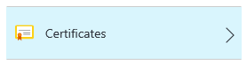
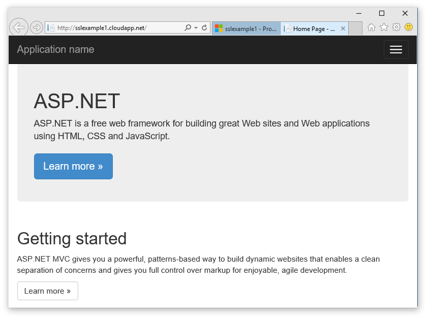

<properties 
    pageTitle="Configurez SSL pour un service cloud | Microsoft Azure" 
    description="Découvrez comment spécifier un point de terminaison HTTPS pour un rôle web et comment télécharger un certificat SSL pour sécuriser votre application. Ces exemples utilisent le portail Azure." 
    services="cloud-services" 
    documentationCenter=".net" 
    authors="Thraka" 
    manager="timlt" 
    editor=""/>

<tags 
    ms.service="cloud-services" 
    ms.workload="tbd" 
    ms.tgt_pltfrm="na" 
    ms.devlang="na" 
    ms.topic="article" 
    ms.date="10/04/2016"
    ms.author="adegeo"/>

# Configuration de SSL pour une application dans Azure

> [AZURE.SELECTOR]
- [Portail Azure](cloud-services-configure-ssl-certificate-portal.md)
- [Portail classique Azure](cloud-services-configure-ssl-certificate.md)

Secure Socket Layer (SSL) de chiffrement est la méthode plus couramment utilisée de sécuriser les données envoyées sur internet. Cette tâche courante explique comment spécifier un point de terminaison HTTPS pour un rôle web et comment télécharger un certificat SSL pour sécuriser votre application.

> [AZURE.NOTE] Les procédures dans cette tâche s’appliquent aux Services Cloud Azure ; pour les Services d’application, voir [ce](../app-service-web/web-sites-configure-ssl-certificate.md).

Cette tâche utilise un déploiement de production ; Vous trouverez des informations sur l’utilisation d’un déploiement intermédiaire à la fin de cette rubrique.

Lisez [ce](cloud-services-how-to-create-deploy-portal.md) tout d’abord si vous n’avez pas encore créé un service cloud.

[AZURE.INCLUDE [websites-cloud-services-css-guided-walkthrough](../../includes/websites-cloud-services-css-guided-walkthrough.md)]

## Étape 1 : Obtenir un certificat SSL

Pour configurer SSL pour une application, vous devez tout d’abord obtenir un certificat SSL signé par une autorité de certification (CA), un tiers approuvé qui émet des certificats à cet effet. Si vous n’en avez pas déjà, vous devez obtenir une société qui vend des certificats SSL.

Le certificat doit répondre aux exigences suivantes pour les certificats SSL dans Azure :

-   Le certificat doit contenir une clé privée.
-   Le certificat doit être créé pour l’échange de clés, exportable vers un fichier d’échange d’informations personnelles (.pfx).
-   Nom de sujet du certificat doit correspondre le domaine utilisé pour accéder au service cloud. Vous ne pouvez pas obtenir un certificat SSL à partir d’une autorité de certification (CA) pour le domaine cloudapp.net. Vous devez vous procurer un nom de domaine personnalisé à utiliser pour accéder à votre service. Lorsque vous demandez un certificat à partir d’une autorité de certification nom de sujet du certificat doit correspondre au nom de domaine personnalisé utilisé pour accéder à votre application. Par exemple, si votre nom de domaine est **contoso.com** demander un certificat à partir de votre autorité de certification pour * **. contoso.com** ou * *www.contoso.com**.
-   Le certificat doit utiliser un minimum de chiffrement 2048 bits.

À des fins de test, vous pouvez [créer](cloud-services-certs-create.md) et utiliser un certificat auto-signé. Un certificat auto-signé n’est pas authentifié par une autorité de certification et pouvez utiliser le domaine cloudapp.net comme l’URL de site Web. Par exemple, la tâche ci-dessous utilise un certificat auto-signé dans lequel le nom commun (NC) utilisé dans le certificat est **sslexample.cloudapp.net**.

Ensuite, vous devez inclure d’informations sur le certificat dans votre définition de service et les fichiers de configuration de service.

## Étape 2 : Modifier les fichiers de définition et la configuration du service

Votre application doit être configurée pour utiliser le certificat, et un point de terminaison HTTPS doit être ajouté. Par conséquent, la définition de service et les fichiers de configuration de service doivent être mis à jour.

1.  Dans votre environnement de développement, ouvrez le fichier de définition de service (CSDEF), ajouter une section de **certificats** dans la section **WebRole** et inclure les informations suivantes sur le certificat (et les certificats intermédiaires) :

        <WebRole name="CertificateTesting" vmsize="Small">
        ...
            <Certificates>
                <Certificate name="SampleCertificate" 
                             storeLocation="LocalMachine" 
                             storeName="My"
                             permissionLevel="limitedOrElevated" />
                <!-- IMPORTANT! Unless your certificate is either
                self-signed or signed directly by the CA root, you
                must include all the intermediate certificates
                here. You must list them here, even if they are
                not bound to any endpoints. Failing to list any of
                the intermediate certificates may cause hard-to-reproduce
                interoperability problems on some clients.-->
                <Certificate name="CAForSampleCertificate"
                             storeLocation="LocalMachine"
                             storeName="CA"
                             permissionLevel="limitedOrElevated" />
            </Certificates>
        ...
        </WebRole>

    La section **certificats** définit le nom de notre certificat, son emplacement et le nom de la banque où elle se trouve.
    
    Autorisations (`permisionLevel` attribut) peuvent être définies pour une des opérations suivantes :

  	| Valeur d’autorisation  | Description |
  	| ----------------  | ----------- |
  	| limitedOrElevated | **(Par défaut)** Tous les processus de rôle peuvent accéder à la clé privée. |
  	| avec élévation de privilèges          | Uniquement les processus élevés peuvent accéder à la clé privée.|

2.  Dans votre fichier de définition de service, ajoutez un élément **InputEndpoint** dans la section **points de terminaison** pour activer HTTPS :

        <WebRole name="CertificateTesting" vmsize="Small">
        ...
            <Endpoints>
                <InputEndpoint name="HttpsIn" protocol="https" port="443" 
                    certificate="SampleCertificate" />
            </Endpoints>
        ...
        </WebRole>

3.  Dans votre fichier de définition de service, ajoutez un élément **de liaison** dans la section **Sites** . Cette opération ajoute une liaison HTTPS pour établir une correspondance entre le point de terminaison de votre site :

        <WebRole name="CertificateTesting" vmsize="Small">
        ...
            <Sites>
                <Site name="Web">
                    <Bindings>
                        <Binding name="HttpsIn" endpointName="HttpsIn" />
                    </Bindings>
                </Site>
            </Sites>
        ...
        </WebRole>

    Toutes les modifications nécessaires au fichier de définition du service ont été achevées, mais vous avez encore besoin d’ajouter les informations du certificat vers le fichier de configuration de service.

4.  Dans votre fichier de configuration de service (CSCFG), ServiceConfiguration.Cloud.cscfg, ajoutez une section de **certificats** dans la section **rôle** , remplacez la valeur d’empreinte numérique d’exemple ci-dessous avec celui de votre certificat :

        <Role name="Deployment">
        ...
            <Certificates>
                <Certificate name="SampleCertificate" 
                    thumbprint="9427befa18ec6865a9ebdc79d4c38de50e6316ff" 
                    thumbprintAlgorithm="sha1" />
                <Certificate name="CAForSampleCertificate"
                    thumbprint="79d4c38de50e6316ff9427befa18ec6865a9ebdc" 
                    thumbprintAlgorithm="sha1" />
            </Certificates>
        ...
        </Role>

(L’exemple ci-dessus utilise **sha1** pour l’algorithme empreinte numérique. Spécifier la valeur appropriée pour l’algorithme de votre certificat d’empreinte numérique).

À présent que la définition de service et les fichiers de configuration de service ont été mis à jour, créez un package votre déploiement pour le téléchargement vers Azure. Si vous utilisez **cspack**, n’utilisez pas l’indicateur **/generateConfigurationFile** , car qui remplaceront les informations de certificat que vous venez d’insérer.

## Étape 3 : Télécharger un certificat

Se connecter au portail et...

1. Sélectionnez votre service cloud dans le portail, sélectionnez votre **Service Cloud**. (Qui est dans la section **toutes les ressources** ). 
    
    

2. Cliquez sur **certificats**.

    

3. Indiquez le **fichier**, **votre mot de passe**, puis cliquez sur **Télécharger**.

## Étape 4 : Se connecter à l’instance de rôle à l’aide de HTTPS

Maintenant que votre déploiement est en cours d’exécution dans Azure, vous pouvez vous connecter à l’aide de HTTPS.
    
1.  Cliquez sur l' **URL du Site** pour ouvrir le navigateur web.

    

2.  Dans votre navigateur web, modifier le lien pour utiliser **https** au lieu de **http**et puis accédez à la page.

    >[AZURE.NOTE] Si vous utilisez un certificat auto-signé, lorsque vous naviguez vers un point de terminaison HTTPS associée le certificat auto-signé qu'affiche une erreur de certificat dans le navigateur. L’utilisation d’un certificat signé par une autorité de certification approuvée élimine ce problème ; en attendant, vous pouvez ignorer l’erreur. (Une autre option consiste à ajouter le certificat auto-signé au magasin de certificats de l’autorité de certification approuvée de l’utilisateur).

    

    >[AZURE.TIP] Si vous voulez utiliser SSL pour un déploiement intermédiaire au lieu d’un déploiement de production, vous devez tout d’abord déterminer l’URL utilisée pour le déploiement intermédiaire. Une fois que votre service cloud a été déployé, l’URL à l’environnement intermédiaire est déterminé par l' **ID du déploiement** GUID au format suivant :`https://deployment-id.cloudapp.net/`  
      
    >Créer un certificat avec le nom commun (NC) égal à l’URL basée sur GUID (par exemple, **328187776e774ceda8fc57609d404462.cloudapp.net**). Utiliser le portail pour ajouter le certificat à votre service cloud intermédiaire. Ensuite, ajoutez les informations de certificat à vos fichiers CSDEF et CSCFG, réorganiser votre application et mettre à jour votre déploiement intermédiaire pour utiliser le nouveau lot.

## Étapes suivantes

* [Configuration générale de votre service cloud](cloud-services-how-to-configure-portal.md).
* Découvrez comment [déployer un service cloud](cloud-services-how-to-create-deploy-portal.md).
* Configurez un [nom de domaine personnalisé](cloud-services-custom-domain-name-portal.md).
* [Gérer votre service cloud](cloud-services-how-to-manage-portal.md).
