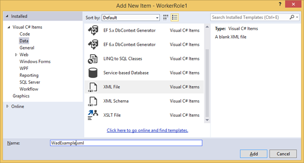

<properties
    pageTitle="Comment utiliser les diagnostics de Windows Azure (.NET) avec les Services Cloud | Microsoft Azure"
    description="À l’aide des diagnostics de Windows Azure pour collecter des données à partir d’Azure cloud Services pour débogage, mesurer les performances, surveillance, l’analyse du trafic et plus."
    services="cloud-services"
    documentationCenter=".net"
    authors="rboucher"
    manager="jwhit"
    editor=""/>

<tags
    ms.service="cloud-services"
    ms.workload="tbd"
    ms.tgt_pltfrm="na"
    ms.devlang="dotnet"
    ms.topic="article"
    ms.date="01/25/2016"
    ms.author="robb"/>


# <a name="enabling-azure-diagnostics-in-azure-cloud-services"></a>Activer les Diagnostics Azure dans les Services en nuage Azure

Voir [Vue d’ensemble des Diagnostics Azure](../azure-diagnostics.md) pour un arrière-plan sur Azure Diagnostics.


## <a name="how-to-enable-diagnostics-in-a-worker-role"></a>Comment activer les Diagnostics dans un rôle de collaborateur

Cette procédure pas à pas décrit comment mettre en œuvre un rôle de collaborateur Azure qui émet des données de télémétrie à l’aide de la classe source d’événement .NET. Diagnostics de Windows Azure est utilisé pour collecter les données de télémétrie et le stocker dans un compte de stockage Azure. Lorsque vous créez un rôle de collaborateur Visual Studio active automatiquement Diagnostics 1.0 dans le cadre de la solution dans Azure SDK pour .NET 2.4 et les versions antérieures. Suivez les instructions ci-dessous décrivent le processus de création du rôle de collaborateur, désactivation des Diagnostics 1.0 à partir de la solution et déploiement Diagnostics 1.2 ou 1.3 à votre rôle de collaborateur.

### <a name="pre-requisites"></a>Conditions préalables
Cet article suppose que vous avez un abonnement Azure et utilisez Visual Studio 2013 avec le Kit de développement Azure. Si vous ne disposez pas d’un abonnement Azure, vous pouvez vous inscrire pour [Version d’évaluation gratuite][]. Veillez à [installer et configurer Azure PowerShell version 0.8.7 ou version ultérieure][].

### <a name="step-1-create-a-worker-role"></a>Étape 1 : Créer un rôle de collaborateur
1.  Lancez **Visual Studio 2013**.
2.  Créer un projet **Azure Cloud Service** à partir du modèle de **Cloud** qui cible .NET Framework 4.5.  Nommez le projet « WadExample », puis cliquez sur Ok.
3.  Sélectionnez le **Rôle de travail** , puis cliquez sur Ok. Le projet est créé.
4.  Dans l' **Explorateur de solutions**, double-cliquez sur le fichier de propriétés **WorkerRole1** .
5.  Dans la **Configuration** de l' onglet désactivez la case à cocher **Activer les Diagnostics** pour désactiver les Diagnostics 1.0 (Azure SDK 2.4 et eariler).
6.  Créer votre solution pour vérifier que vous n’avez aucune erreur.

### <a name="step-2-instrument-your-code"></a>Étape 2 : Instrument votre code
Remplacez le contenu de WorkerRole.cs par le code suivant. La classe SampleEventSourceWriter, héritée de la [Classe source d’événement][], mettent en œuvre, quatre méthodes d’enregistrement : **SendEnums**, **MessageMethod**, **SetOther** et **HighFreq**. Le premier paramètre de la méthode **WriteEvent** définit l’ID de l’événement correspondante. La méthode Run met en œuvre une boucle qui appelle chacune des méthodes de journalisation implémentées dans la classe **SampleEventSourceWriter** toutes les 10 secondes.

    using Microsoft.WindowsAzure.ServiceRuntime;
    using System;
    using System.Diagnostics;
    using System.Diagnostics.Tracing;
    using System.Net;
    using System.Threading;

    namespace WorkerRole1
    {
    sealed class SampleEventSourceWriter : EventSource
    {
        public static SampleEventSourceWriter Log = new SampleEventSourceWriter();
        public void SendEnums(MyColor color, MyFlags flags) { if (IsEnabled())  WriteEvent(1, (int)color, (int)flags); }// Cast enums to int for efficient logging.
        public void MessageMethod(string Message) { if (IsEnabled())  WriteEvent(2, Message); }
        public void SetOther(bool flag, int myInt) { if (IsEnabled())  WriteEvent(3, flag, myInt); }
        public void HighFreq(int value) { if (IsEnabled()) WriteEvent(4, value); }

    }

    enum MyColor
    {
        Red,
        Blue,
        Green
    }

    [Flags]
    enum MyFlags
    {
        Flag1 = 1,
        Flag2 = 2,
        Flag3 = 4
    }

    public class WorkerRole : RoleEntryPoint
    {
        public override void Run()
        {
            // This is a sample worker implementation. Replace with your logic.
            Trace.TraceInformation("WorkerRole1 entry point called");

            int value = 0;

            while (true)
            {
                Thread.Sleep(10000);
                Trace.TraceInformation("Working");

                // Emit several events every time we go through the loop
                for (int i = 0; i < 6; i++)
                {
                    SampleEventSourceWriter.Log.SendEnums(MyColor.Blue, MyFlags.Flag2 | MyFlags.Flag3);
                }

                for (int i = 0; i < 3; i++)
                {
                    SampleEventSourceWriter.Log.MessageMethod("This is a message.");
                    SampleEventSourceWriter.Log.SetOther(true, 123456789);
                }

                if (value == int.MaxValue) value = 0;
                SampleEventSourceWriter.Log.HighFreq(value++);
            }
        }

        public override bool OnStart()
        {
            // Set the maximum number of concurrent connections
            ServicePointManager.DefaultConnectionLimit = 12;

            // For information on handling configuration changes
            // see the MSDN topic at http://go.microsoft.com/fwlink/?LinkId=166357.

            return base.OnStart();
        }
    }
    }


### <a name="step-3-deploy-your-worker-role"></a>Étape 3 : Déployez votre rôle de collaborateur
1.  Déployez votre rôle de collaborateur sur Azure à partir de Visual Studio en sélectionnant le projet **WadExample** dans l’Explorateur de solutions puis le **Publier** dans le menu **Générer** .
2.  Choisissez votre abonnement.
3.  Dans la boîte de dialogue **Paramètres de publication de Microsoft Azure** sélectionnez **Créer un nouveau...**.
4.  Dans la boîte de dialogue **créer un Service Cloud et compte de stockage** , entrez un **nom** (par exemple, « WadExample ») et sélectionnez une région ou affinité du groupe.
5.  Configurer l' **environnement** mis en **œuvre**.
6.  Modifier les autres **paramètres** le cas échéant, puis cliquez sur **Publier**.
7.  Une fois terminé déploiement vérifier dans le portail classique Azure que votre service cloud se trouve dans un état **en cours d’exécution** .

### <a name="step-4-create-your-diagnostics-configuration-file-and-install-the-extension"></a>Étape 4 : Créer votre fichier de configuration de Diagnostics et installez l’extension
1.  Téléchargez la définition de schéma de fichier de configuration publics en exécutant la commande PowerShell suivante :
2.
        (Get-AzureServiceAvailableExtension - NomExtension 'PaaSDiagnostics' - ProviderNamespace 'Microsoft.Azure.Diagnostics'). PublicConfigurationSchema | Out-fichier-codage utf8 - chemin d’accès « WadConfig.xsd »

2.  Ajouter un fichier XML à votre projet **WorkerRole1** par un clic droit sur le projet **WorkerRole1** , puis sélectionnez **Ajouter** -> **Un nouvel élément...**  ->  **Éléments visual c#** -> **données** -> **Fichier XML**. Nommez le fichier « WadExample.xml ».

    

3.  Associer le WadConfig.xsd le fichier de configuration. Vérifiez que la fenêtre de l’éditeur WadExample.xml est la fenêtre active. Appuyez sur **F4** pour ouvrir la fenêtre de **Propriétés** . Cliquez sur la propriété de **schémas** dans la fenêtre **Propriétés** . Cliquez sur le bouton **...** dans la propriété **schémas** . Cliquez sur l' **Ajouter...** bouton et accédez à l’emplacement où vous avez enregistré le fichier XSD et sélectionnez le fichier WadConfig.xsd. Cliquez sur **OK**.
4.  Remplacez le contenu du fichier de configuration WadExample.xml par le code XML suivant et enregistrez le fichier. Ce fichier de configuration définit quelques compteurs de performance pour recueillir : une pour l’utilisation du processeur et une pour l’utilisation de la mémoire. Puis la configuration définit les quatre événements correspondant aux méthodes de la classe SampleEventSourceWriter.

```
        <?xml version="1.0" encoding="utf-8"?>
        <PublicConfig xmlns="http://schemas.microsoft.com/ServiceHosting/2010/10/DiagnosticsConfiguration">
            <WadCfg>
                <DiagnosticMonitorConfiguration overallQuotaInMB="25000">
                <PerformanceCounters scheduledTransferPeriod="PT1M">
                    <PerformanceCounterConfiguration counterSpecifier="\Processor(_Total)\% Processor Time" sampleRate="PT1M" unit="percent" />
                    <PerformanceCounterConfiguration counterSpecifier="\Memory\Committed Bytes" sampleRate="PT1M" unit="bytes"/>
                    </PerformanceCounters>
                    <EtwProviders>
                        <EtwEventSourceProviderConfiguration provider="SampleEventSourceWriter" scheduledTransferPeriod="PT5M">
                            <Event id="1" eventDestination="EnumsTable"/>
                            <Event id="2" eventDestination="MessageTable"/>
                            <Event id="3" eventDestination="SetOtherTable"/>
                            <Event id="4" eventDestination="HighFreqTable"/>
                            <DefaultEvents eventDestination="DefaultTable" />
                        </EtwEventSourceProviderConfiguration>
                    </EtwProviders>
                </DiagnosticMonitorConfiguration>
            </WadCfg>
        </PublicConfig>
```

### <a name="step-5-install-diagnostics-on-your-worker-role"></a>Étape 5 : Installer Diagnostics sur votre rôle de collaborateur
Les applets de commande PowerShell pour la gestion des Diagnostics sur un rôle web ou de travail sont : Set-AzureServiceDiagnosticsExtension, Get-AzureServiceDiagnosticsExtension et supprimer AzureServiceDiagnosticsExtension.

1.  Ouvrez la session PowerShell Azure.
2.  Exécuter le script pour installer Diagnostics sur votre rôle de collaborateur (remplacez *StorageAccountKey* par la clé de compte de stockage pour votre compte de stockage wadexample) :

```
    $storage_name = "wadexample"
    $key = "<StorageAccountKey>"
    $config_path="c:\users\<user>\documents\visual studio 2013\Projects\WadExample\WorkerRole1\WadExample.xml"
    $service_name="wadexample"
    $storageContext = New-AzureStorageContext -StorageAccountName $storage_name -StorageAccountKey $key
    Set-AzureServiceDiagnosticsExtension -StorageContext $storageContext -DiagnosticsConfigurationPath $config_path -ServiceName $service_name -Slot Staging -Role WorkerRole1
```

### <a name="step-6-look-at-your-telemetry-data"></a>Étape 6 : Aperçu de vos données de télémétrie
Dans **l’Explorateur de serveurs** Visual Studio naviguez vers le compte de stockage wadexample. Après le cloud service a été exécuté environ 5 minutes, vous devez voir les tables **WADEnumsTable**, **WADHighFreqTable**, **WADMessageTable**, **WADPerformanceCountersTable** et **WADSetOtherTable**. Double-cliquez sur l’une des tables pour afficher la télémétrie qui ont été collectée.
    


## <a name="configuration-file-schema"></a>Schéma de fichier de configuration

Le fichier de configuration Diagnostics définit des valeurs qui sont utilisées pour initialisation les paramètres de configuration de diagnostic au démarrage de l’agent de diagnostics. Consultez la [dernière référence de schéma](https://msdn.microsoft.com/library/azure/mt634524.aspx) pour les valeurs valides et des exemples.

## <a name="troubleshooting"></a>Résolution des problèmes

Si vous rencontrez des problèmes, voir [Dépannage Azure Diagnostics](../azure-diagnostics-troubleshooting.md) pour vous aider aux problèmes courants.

## <a name="next-steps"></a>Étapes suivantes
[Pour afficher la liste de machine virtuelle-Diagnostics de Windows Azure articles connexes](azure-diagnostics.md#cloud-services) pour modifier les données que vous collectez, résoudre les problèmes ou en savoir plus sur les diagnostics en général.


[Cours de la source d’événement]: http://msdn.microsoft.com/library/system.diagnostics.tracing.eventsource(v=vs.110).aspx

[Debugging an Azure Application]: http://msdn.microsoft.com/library/windowsazure/ee405479.aspx   
[Collect Logging Data by Using Azure Diagnostics]: http://msdn.microsoft.com/library/windowsazure/gg433048.aspx
[Version d’évaluation gratuite]: http://azure.microsoft.com/pricing/free-trial/
[Installer et configurer Azure PowerShell version 0.8.7 ou version ultérieure]: http://azure.microsoft.com/documentation/articles/install-configure-powershell/
