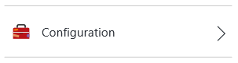
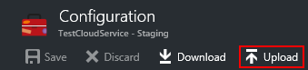

<properties 
    pageTitle="Comment faire pour configurer un service cloud (portail) | Microsoft Azure" 
    description="Découvrez comment configurer des services cloud dans Azure. Apprenez à mettre à jour de la configuration du service cloud et configurer l’accès à distance sur des instances de rôle. Ces exemples utilisent le portail Azure." 
    services="cloud-services" 
    documentationCenter="" 
    authors="Thraka" 
    manager="timlt" 
    editor=""/>

<tags 
    ms.service="cloud-services" 
    ms.workload="tbd" 
    ms.tgt_pltfrm="na" 
    ms.devlang="na" 
    ms.topic="article" 
    ms.date="10/11/2016"
    ms.author="adegeo"/>

# Comment faire pour configurer les Services en nuage

> [AZURE.SELECTOR]
- [Portail Azure](cloud-services-how-to-configure-portal.md)
- [Portail classique Azure](cloud-services-how-to-configure.md)

Vous pouvez configurer les paramètres d’un service cloud plus couramment utilisés dans le portail Azure. Ou, si vous souhaitez mettre à jour vos fichiers de configuration directement, télécharger un fichier de configuration de service pour mettre à jour, puis téléchargez le fichier mis à jour et mettre à jour le service en nuage avec les modifications de configuration. Dans les deux cas, les mises à jour de configuration sont transférées à toutes les instances de rôle.

Vous pouvez également gérer les instances de rôles du service cloud ou de bureau à distance dans celles-ci.

Azure permet d’uniquement garantir disponibilité de service 99,95 % pendant les mises à jour de configuration si vous avez au moins deux instances de rôle pour chaque rôle. Qui permet à une machine virtuelle traiter les demandes des clients pendant l’autre mise à jour. Pour plus d’informations, consultez [Les contrats de niveau de Service](https://azure.microsoft.com/support/legal/sla/).

## Modifier un service cloud

Après avoir ouvert le [portail Azure](https://portal.azure.com/), accédez à votre service cloud. À partir de là vous gérez de nombreux aspects de celle-ci. 

Les liens de **paramètres** ou **tous les paramètres de** la carte de **paramètres** où vous pouvez modifier les **Propriétés**, modifiez la **Configuration**, gérer les **certificats**, le programme d’installation de **règles d’alerte**et gérer les **utilisateurs** qui ont accès à ce service cloud seront ouvre.

>[AZURE.NOTE]
>Impossible de modifier le système d’exploitation utilisé pour le service cloud à l’aide du **portail Azure**, vous pouvez uniquement modifier ce paramètre via le [portail classique Azure](http://manage.windowsazure.com/). Ceci est détaillée [ici](cloud-services-how-to-configure.md#update-a-cloud-service-configuration-file).

## Surveillance des mots clés

Vous pouvez ajouter des alertes à votre service cloud. Cliquez sur **paramètres** > **Règles d’alerte** > **Ajouter une alerte**. 

À partir de là, vous pouvez configurer une alerte. Avec la zone de liste déroulante **Mertic** , vous pouvez configurer une alerte pour les types suivants de données.

- Lecture du disque
- Écriture disque
- Réseau dans
- Déconnecter du réseau
- Pourcentage processeur 

### Configurer le contrôle à partir d’une vignette métrique

Au lieu d’utiliser des **paramètres** > **Règles d’alerte**, vous pouvez cliquer sur une des vignettes métriques dans la section **analyse** de la cuillère **service Cloud** .

À partir de là, vous pouvez personnaliser le graphique utilisé avec la vignette ou ajouter une règle d’alerte.

## Redémarrage, créer une nouvelle image ou Bureau à distance

Pour le moment, vous ne pouvez pas configurer Bureau à distance à l’aide du **portail Azure**. Toutefois, vous pouvez configurer celui-ci via le [portail classique Azure](cloud-services-role-enable-remote-desktop.md), [PowerShell](cloud-services-role-enable-remote-desktop-powershell.md), ou [Visual Studio](../vs-azure-tools-remote-desktop-roles.md). 

Tout d’abord, cliquez sur l’instance du service cloud.

À partir de la carte que s’ouvre uou permettant de lancer une connexion Bureau à distance, de redémarrer à distance l’instance ou créer une nouvelle image à distance (commencer par une nouvelle image) l’instance.

## Reconfigurer votre .cscfg

Vous devrez peut-être vous reconfigurer cloud service via le fichier de [configuration du service (cscfg)](cloud-services-model-and-package.md#cscfg) . Vous devez tout d’abord télécharger votre fichier .cscfg, modifiez-le, puis téléchargez-le.

1. Cliquez sur l’icône **paramètres** ou sur le lien de **tous les paramètres** pour ouvrir la carte de **paramètres** .

    

2. Cliquez sur l’élément de **Configuration** .

    

3. Cliquez sur le bouton **Télécharger** .

    

4. Une fois que vous mettez à jour le fichier de configuration de service, télécharger et appliquer les mises à jour de configuration :

     
    
5. Sélectionnez le fichier .cscfg, puis cliquez sur **OK**.

            
## Étapes suivantes

* Découvrez comment [déployer un service cloud](cloud-services-how-to-create-deploy-portal.md).
* Configurez un [nom de domaine personnalisé](cloud-services-custom-domain-name-portal.md).
* [Gérer votre service cloud](cloud-services-how-to-manage-portal.md).
* Configurer des [certificats ssl](cloud-services-configure-ssl-certificate-portal.md).