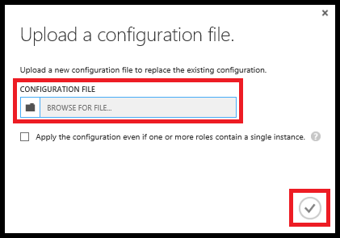

<properties 
    pageTitle="Comment faire pour configurer un service cloud (portal classique) | Microsoft Azure" 
    description="Découvrez comment configurer des services cloud dans Azure. Apprenez à mettre à jour de la configuration du service cloud et configurer l’accès à distance sur des instances de rôle." 
    services="cloud-services" 
    documentationCenter="" 
    authors="Thraka" 
    manager="timlt" 
    editor=""/>

<tags 
    ms.service="cloud-services" 
    ms.workload="tbd" 
    ms.tgt_pltfrm="na" 
    ms.devlang="na" 
    ms.topic="article" 
    ms.date="10/11/2016"
    ms.author="adegeo"/>

# Comment faire pour configurer les Services en nuage

> [AZURE.SELECTOR]
- [Portail Azure](cloud-services-how-to-configure-portal.md)
- [Portail classique Azure](cloud-services-how-to-configure.md)

Vous pouvez configurer les paramètres d’un service cloud plus couramment utilisés dans le portail classique Azure. Ou, si vous souhaitez mettre à jour vos fichiers de configuration directement, télécharger un fichier de configuration de service pour mettre à jour, puis téléchargez le fichier mis à jour et mettre à jour le service en nuage avec les modifications de configuration. Dans les deux cas, les mises à jour de configuration sont transférées à toutes les instances de rôle.

Le portail classique Azure vous permet également de pour [Activer la connexion Bureau à distance pour un rôle dans les Services en nuage Azure](cloud-services-role-enable-remote-desktop.md)

Azure peut uniquement disponibilité 99,95 % service pendant les mises à jour de configuration si vous avez au moins deux instances de rôle pour chaque rôle. Qui permet à une machine virtuelle traiter les demandes des clients pendant l’autre mise à jour. Pour plus d’informations, consultez [Les contrats de niveau de Service](https://azure.microsoft.com/support/legal/sla/).

## Modifier un service cloud

1. Dans le [portail classique Azure](http://manage.windowsazure.com/), cliquez sur **Les Services en nuage**et cliquez sur le nom du service cloud, puis cliquez sur **configurer**.

    
    
    Dans la page **configurer** , vous pouvez configurer la surveillance des mots clés, mettre à jour les paramètres de rôle et choisissez le système d’exploitation invité et famille instances de rôle. 

2. Dans la **surveillance des mots clés**, définir le niveau de surveillance sur commentaires ou minimales et configurer les chaînes de connexion diagnostics requis pour la surveillance détaillée.

3. Pour les rôles de service (regroupés par rôle), vous pouvez mettre à jour les paramètres suivants :
    
    >**Paramètres**  
    >Modifiez les valeurs de paramètres de configuration divers qui sont spécifiés dans les éléments *ConfigurationSettings* du fichier de configuration (.cscfg) du service.
    >
    >**Certificats**  
    >Modifier l’empreinte numérique du certificat qui est utilisé dans le chiffrement SSL pour un rôle. Pour modifier un certificat, vous devez tout d’abord télécharger le nouveau certificat (dans la page **certificats** ). Mettre à jour l’empreinte numérique dans la chaîne de certificat affichée dans les paramètres de rôle.

4. Dans le **système d’exploitation**, vous pouvez modifier la famille de systèmes d’exploitation ou la version des instances de rôles ou choisissez **automatique** pour activer les mises à jour automatiques de la version du système d’exploitation actuel. Les paramètres de système d’exploitation s’appliquent aux rôles web et les rôles de travail, mais ne concernent pas Machines virtuelles.

    Pendant le déploiement, la dernière version du système d’exploitation est installée sur toutes les instances de rôle, et les systèmes d’exploitation sont mis à jour automatiquement par défaut. 
    
    Si vous avez besoin pour votre service cloud s’exécute sur une version du système d’exploitation différent en raison d’exigences de compatibilité dans votre code, vous pouvez choisir une famille de systèmes d’exploitation et la version. Lorsque vous choisissez une version du système d’exploitation spécifique, mises à jour automatique du système d’exploitation pour le service en nuage sont suspendus. Vous devrez peut-être vérifier que les systèmes d’exploitation recevoir des mises à jour.
    
    Si vous résolvez tous les problèmes de compatibilité dotées de vos applications avec la dernière version du système d’exploitation, vous pouvez activer les mises à jour automatique du système d’exploitation en définissant la version du système d’exploitation sur **automatique**. 
    
    

5. Pour enregistrer vos paramètres de configuration et les dirige vers les instances de rôle, cliquez sur **Enregistrer**. (Cliquez sur **Annuler** pour annuler les modifications). **Enregistrer** et **Annuler** sont ajoutés à la barre de commandes après avoir modifié un paramètre.

## Mettre à jour un fichier de configuration de service cloud

1. Télécharger un fichier de configuration de service cloud (.cscfg) avec la configuration actuelle. Dans la page **configurer** pour le service cloud, cliquez sur **Télécharger**. Puis cliquez sur **Enregistrer**, ou cliquez sur **Enregistrer sous** pour enregistrer le fichier.

2. Une fois que vous mettez à jour le fichier de configuration de service, télécharger et appliquer les mises à jour de configuration :

    1. Dans la page **configurer** , cliquez sur **Télécharger**.
    
        
    
    2. Dans un **fichier de Configuration**, utilisez **Parcourir** pour sélectionner le fichier .cscfg mis à jour.
    
    3. Si votre service cloud contient tous les rôles qui ont une seule instance, activez la case à cocher **Appliquer configuration même si un ou plusieurs rôles contiennent une seule occurrence** pour activer les mises à jour de configuration pour les rôles continuer.
    
        Sauf si vous définissez au moins deux instances de chaque rôle, Azure ne garantit pas au moins 99,95 % disponibilité de votre service cloud au cours des mises à jour de configuration de service. Pour plus d’informations, consultez [Les contrats de niveau de Service](https://azure.microsoft.com/support/legal/sla/).
    
    4. Cliquez sur **OK** (coche). 

## Étapes suivantes

* Découvrez comment [déployer un service cloud](cloud-services-how-to-create-deploy.md).
* Configurez un [nom de domaine personnalisé](cloud-services-custom-domain-name.md).
* [Gérer votre service cloud](cloud-services-how-to-manage.md).
* [Activer la connexion Bureau à distance pour un rôle dans les Services en nuage Azure](cloud-services-role-enable-remote-desktop.md)
* Configurer des [certificats ssl](cloud-services-configure-ssl-certificate.md).
