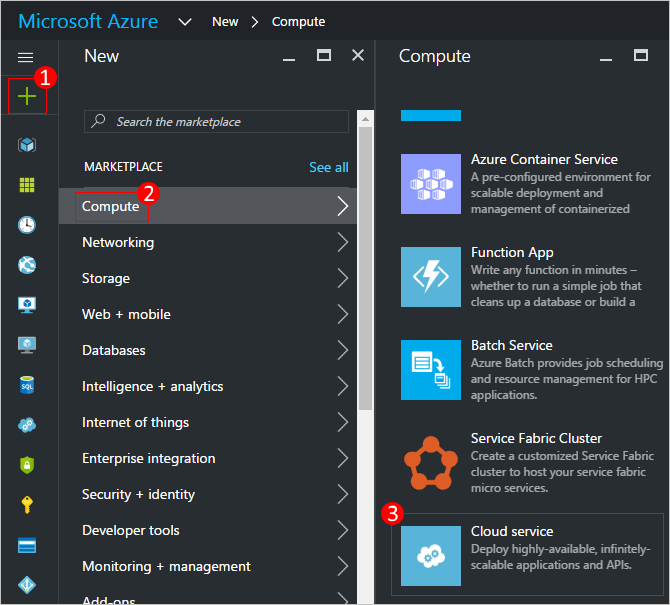
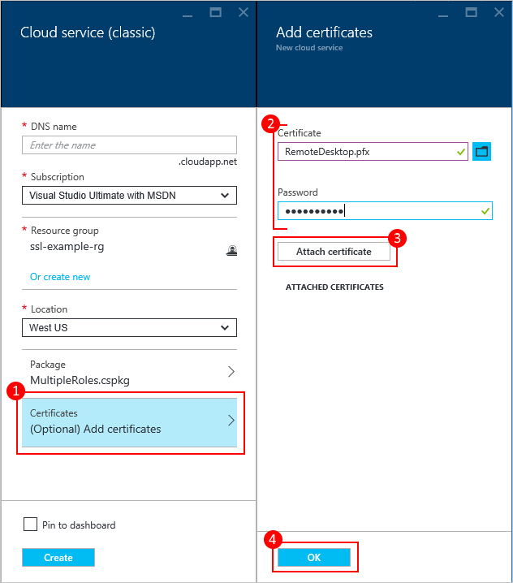

<properties
    pageTitle="Comment créer et déployer un service cloud | Microsoft Azure"
    description="Découvrez comment créer et déployer un service cloud à l’aide du portail Azure."
    services="cloud-services"
    documentationCenter=""
    authors="Thraka"
    manager="timlt"
    editor=""/>

<tags
    ms.service="cloud-services"
    ms.workload="tbd"
    ms.tgt_pltfrm="na"
    ms.devlang="na"
    ms.topic="article"
    ms.date="10/11/2016"
    ms.author="adegeo"/>

# Comment créer et déployer un service cloud

> [AZURE.SELECTOR]
- [Portail Azure](cloud-services-how-to-create-deploy-portal.md)
- [Portail classique Azure](cloud-services-how-to-create-deploy.md)

Le portail Azure propose deux méthodes vous permettant de créer et déployer un service cloud : *Créez rapide* et *Personnalisée*.

Cet article explique comment utiliser la méthode rapide créer pour créer un nouveau service cloud, puis utilisez **Télécharger** pour télécharger et déployer un package de service cloud dans Azure. Lorsque vous utilisez cette méthode, le portail Azure rend des liens utiles disponibles pour achever toutes les conditions que vous accédez. Si vous êtes prêt à déployer votre service cloud lors de sa création, vous pouvez effectuer les deux à la fois à l’aide personnalisée créer.

> [AZURE.NOTE] Si vous envisagez de publier votre service de nuage à partir de Visual Studio Team Services (VSTS), utilisez Création rapide et définissez la publication VSTS à partir de démarrage rapide pour les Azure ou le tableau de bord. Pour plus d’informations, voir [Remise continue à Azure par à l’aide de Visual Studio Team Services][TFSTutorialForCloudService], ou consultez l’aide de la page de **Démarrage rapide** .

## Concepts
Trois composants sont requises pour déployer une application comme un service cloud dans Azure :

- **Définition de service**  
  Le fichier de définition du service cloud (.csdef) définit le modèle de service, y compris le nombre de rôles.

- **Configuration du service**  
  Le fichier de configuration du service cloud (.cscfg) fournit les paramètres de configuration pour le cloud services et individuels rôles, y compris le nombre d’instances de rôle.

- **Package de service**  
  Le package de service (.cspkg) contient le code de l’application et configurations ainsi que le fichier de définition de service.

Vous pouvez en savoir plus sur ces et comment créer un package [ici](cloud-services-model-and-package.md).

## Préparer votre application
Avant de déployer un service cloud, vous devez créer le package de service cloud (.cspkg) à partir de votre code d’application et un fichier de configuration du service cloud (.cscfg). Le Kit de développement Azure fournit des outils de préparation de ces fichiers de déploiement requis. Vous pouvez installer le Kit de développement à partir de la page [Téléchargements de packs linguistiques Azure](https://azure.microsoft.com/downloads/) , dans la langue dans laquelle vous souhaitez développer votre code de l’application.

Trois fonctionnalités du service cloud nécessitent une configuration spéciale avant d’exporter un package de service :

- Si vous voulez déployer un service cloud qui utilise Secure Sockets Layer (SSL) pour le chiffrement de données, [Configurez votre application](cloud-services-configure-ssl-certificate-portal.md#modify) pour SSL.

- Si vous voulez configurer les connexions de bureau à distance sur des instances de rôle, [Configurez les rôles](cloud-services-role-enable-remote-desktop.md) Bureau à distance. Vous pouvez uniquement faire dans le portail classique.

- Si vous voulez configurer les détaillée surveillance pour votre service cloud, activer Azure Diagnostics pour le service cloud. *Surveillance minimale* (niveau de surveillance par défaut) utilise des compteurs de performance collectées à partir des systèmes d’exploitation hôte instances de rôle (machines virtuelles). *Commentaires surveillance* recueille des mesures supplémentaires basées sur des données de performance au sein des instances de rôle pour activer l’analyse détaillée des problèmes qui se produisent pendant le traitement de l’application. Pour savoir comment activer les Diagnostics Azure, voir [activation diagnostics dans Azure](cloud-services-dotnet-diagnostics.md).

Pour créer un service cloud avec les déploiements de rôles web ou les rôles de travail, vous devez [créer le package de service](cloud-services-model-and-package.md#servicepackagecspkg).

## Avant de commencer

- Si vous n’avez pas installé le Kit de développement Azure, cliquez sur **Installer Azure SDK** pour ouvrir la [page de téléchargements Azure](https://azure.microsoft.com/downloads/)et puis téléchargez le Kit de développement pour la langue dans laquelle vous souhaitez développer votre code. (Vous aurez la possibilité de le faire ultérieurement).

- Si toutes les instances de rôle besoin d’un certificat, créez les certificats. Les services en nuage nécessitent un fichier .pfx avec une clé privée. [Vous pouvez télécharger les certificats à Azure]() en tant que vous créez et déployez le service cloud.

- Si vous envisagez de déployer le service de nuage à un groupe affinité, créez le groupe affinité. Vous pouvez utiliser un groupe affinité à déployer votre service cloud et autres services Azure au même emplacement dans une zone. Vous pouvez créer le groupe affinité dans la zone **réseaux** du portail classique Azure, dans la page **groupes affinité** .

## Créez et déployez

1. Connectez-vous au [portail Azure](https://portal.azure.com/).
2. Cliquez sur **Nouveau > Machines virtuelles**, puis faites défiler vers le bas jusqu'à et cliquez sur **Service Cloud**.

    

3. En bas de la page d’informations qui s’affiche, cliquez sur **créer**. 
4. Dans la nouvelle carte de **Service Cloud** , entrez une valeur pour le **nom de DNS**.
5. Créer un **Groupe de ressources** ou sélectionnez-en un.
6. Sélectionnez un **emplacement**.
7. Cliquez sur **Package**. Cette action ouvre la carte **télécharger un package** . Renseignez les champs requis.  

     Si un de vos rôles contient une instance unique, assurez-vous de **que déployer même si un ou plusieurs rôles contiennent une seule instance** est sélectionnée.

8. Vérifiez que l’option **Démarrer déploiement** est sélectionnée.
9. Cliquez sur **OK** , qui se ferme la carte **télécharger un package** .
10. Si vous ne possédez pas de certificats à ajouter, cliquez sur **créer**.

    

## Télécharger un certificat

Si votre package de déploiement a été [configuré pour utiliser des certificats](cloud-services-configure-ssl-certificate-portal.md#modify), vous pouvez télécharger le certificat maintenant.

1. Sélectionnez les **certificats**et sur la carte de **certificats ajouter** , sélectionnez le fichier .pfx de certificat SSL puis fournir le **mot de passe** pour le certificat,
2. Cliquez sur **joindre un certificat**et puis cliquez sur **OK** dans la carte de **certificats ajouter** .
3. Cliquez sur **créer** dans la carte de **Service Cloud** . Lorsque le déploiement a atteint l’état **prêt** , vous pouvez procéder aux étapes suivantes.

    

## Vérifier votre déploiement est terminé

1. Cliquez sur l’instance du service cloud.

    L’état doit indiquer que le service est **en cours d’exécution**.

2. Sous **Essentials**, cliquez sur l' **URL du Site** pour ouvrir votre service cloud dans un navigateur web.

    

[TFSTutorialForCloudService]: http://go.microsoft.com/fwlink/?LinkID=251796

## Étapes suivantes

* [Configuration générale de votre service cloud](cloud-services-how-to-configure-portal.md).
* Configurez un [nom de domaine personnalisé](cloud-services-custom-domain-name-portal.md).
* [Gérer votre service cloud](cloud-services-how-to-manage-portal.md).
* Configurer des [certificats ssl](cloud-services-configure-ssl-certificate-portal.md).