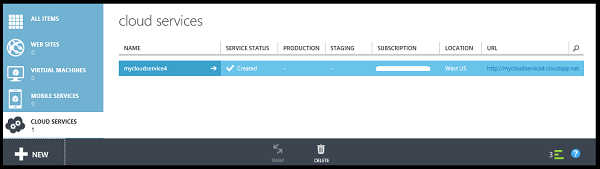
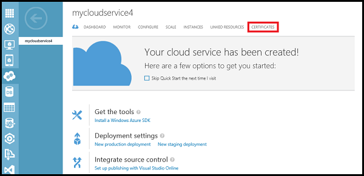
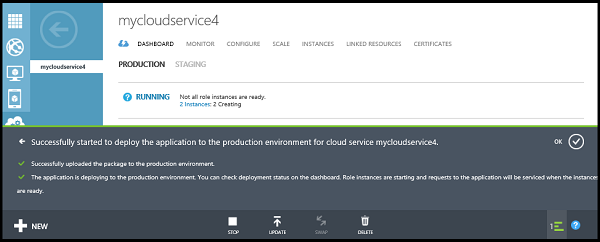

<properties
    pageTitle="Comment créer et déployer un service cloud | Microsoft Azure"
    description="Découvrez comment créer et déployer un service cloud à l’aide de la méthode rapide créer dans Azure."
    services="cloud-services"
    documentationCenter=""
    authors="Thraka"
    manager="timlt"
    editor=""/>

<tags
    ms.service="cloud-services"
    ms.workload="tbd"
    ms.tgt_pltfrm="na"
    ms.devlang="na"
    ms.topic="article"
    ms.date="09/06/2016"
    ms.author="adegeo"/>

# Comment créer et déployer un Service Cloud

> [AZURE.SELECTOR]
- [Portail Azure](cloud-services-how-to-create-deploy-portal.md)
- [Portail classique Azure](cloud-services-how-to-create-deploy.md)

Le portail classique Azure propose deux méthodes vous permettant de créer et déployer un service cloud : **Créez rapide** et **Personnalisée**.

Cette rubrique explique comment utiliser la méthode rapide créer pour créer un nouveau service cloud, puis utilisez **Télécharger** pour télécharger et déployer un package de service cloud dans Azure. Lorsque vous utilisez cette méthode, le portail classique Azure rend des liens utiles disponibles pour achever toutes les conditions que vous accédez. Si vous êtes prêt à déployer votre service cloud lors de sa création, vous pouvez effectuer les deux à la fois à l’aide **Personnalisée créer**.

> [AZURE.NOTE] Si vous envisagez de publier votre service de nuage à partir de Visual Studio Team Services (VSTS), utilisez Création rapide et définissez la publication VSTS à partir de **Démarrage rapide** ou le tableau de bord. Pour plus d’informations, voir [Remise continue à Azure par à l’aide de Visual Studio Team Services][TFSTutorialForCloudService], ou consultez l’aide de la page de **Démarrage rapide** .

## Concepts
Trois composants sont nécessaires pour déployer une application comme un service cloud dans Azure :

- **Définition de service**  
  Le fichier de définition du service cloud (.csdef) définit le modèle de service, y compris le nombre de rôles.

- **Configuration du service**  
  Le fichier de configuration du service cloud (.cscfg) fournit les paramètres de configuration pour le cloud services et individuels rôles, y compris le nombre d’instances de rôle.

- **Package de service**  
  Le package de service (.cspkg) contient le code de l’application et configurations ainsi que le fichier de définition de service.
  
Vous pouvez en savoir plus sur ces et comment créer un package [ici](cloud-services-model-and-package.md).

## Préparer votre application
Avant de déployer un service cloud, vous devez créer le package de service cloud (.cspkg) à partir de votre code d’application et un fichier de configuration du service cloud (.cscfg). Le Kit de développement Azure fournit des outils de préparation de ces fichiers de déploiement requis. Vous pouvez installer le Kit de développement à partir de la page [Téléchargements de packs linguistiques Azure](https://azure.microsoft.com/downloads/) , dans la langue dans laquelle vous souhaitez développer votre code de l’application.

Trois fonctionnalités du service cloud nécessitent une configuration spéciale avant d’exporter un package de service :

- Si vous voulez déployer un service cloud qui utilise Secure Sockets Layer (SSL) pour le chiffrement de données, [Configurez votre application](cloud-services-configure-ssl-certificate.md#step-2-modify-the-service-definition-and-configuration-files) pour SSL.

- Si vous voulez configurer les connexions de bureau à distance sur des instances de rôle, [Configurez les rôles](cloud-services-role-enable-remote-desktop.md) Bureau à distance.

- Si vous voulez configurer les détaillée surveillance pour votre service cloud, activer Azure Diagnostics pour le service cloud. *Surveillance minimale* (niveau de surveillance par défaut) utilise des compteurs de performance collectées à partir des systèmes d’exploitation hôte instances de rôle (machines virtuelles). « Surveillance détaillée * recueille des mesures supplémentaires basées sur des données de performance au sein des instances de rôle pour activer l’analyse détaillée des problèmes qui se produisent pendant le traitement de l’application. Pour savoir comment activer les Diagnostics Azure, voir [Activation des Diagnostics dans Azure](cloud-services-dotnet-diagnostics.md).

Pour créer un service cloud avec les déploiements de rôles web ou les rôles de travail, vous devez [créer le package de service](cloud-services-model-and-package.md#servicepackagecspkg).

## Avant de commencer

- Si vous n’avez pas installé le Kit de développement Azure, cliquez sur **Installer Azure SDK** pour ouvrir la [page de téléchargements Azure](https://azure.microsoft.com/downloads/)et puis téléchargez le Kit de développement pour la langue dans laquelle vous souhaitez développer votre code. (Vous aurez la possibilité de le faire ultérieurement).

- Si toutes les instances de rôle besoin d’un certificat, créez les certificats. Les services en nuage nécessitent un fichier .pfx avec une clé privée. Vous pouvez [télécharger les certificats à Azure](cloud-services-configure-ssl-certificate.md#step-3-upload-a-certificate) que vous créez et déployez le service cloud.

- Si vous envisagez de déployer le service de nuage à un groupe affinité, créez le groupe affinité. Vous pouvez utiliser un groupe affinité à déployer votre service cloud et autres services Azure au même emplacement dans une zone. Vous pouvez créer le groupe affinité dans la zone **réseaux** du portail classique Azure, dans la page **groupes affinité** .

## Comment : créer un service cloud à l’aide de création rapide

1. Dans le [portail classique Azure](http://manage.windowsazure.com/), cliquez sur **Nouveau**>**Calculer**>**Service Cloud**>**Création rapide**.

    

2. Sous **URL**, entrez un nom de sous-domaine à utiliser dans l’URL publique pour accéder à votre service cloud dans les déploiements de production. Format d’URL pour les déploiements de production : http://*myURL*. cloudapp.net.

3. Dans la **région ou affinité du groupe**, sélectionnez le groupe d’affinité pour déployer le service de nuage à ou région géographique. Sélectionnez un groupe affinité si vous voulez déployer votre service cloud sur le même emplacement que d’autres services Azure au sein d’une région.

4. Cliquez sur **créer un Service Cloud**.

    

    Vous pouvez surveiller l’état du processus dans la zone de message en bas de la fenêtre.

    La zone **Services Cloud** s’ouvre avec le nouveau service cloud affiché. Lorsque le statut devient créé, la création de service cloud est terminée.

    

## Comment : télécharger le certificat d’un service cloud

1. Dans le [portail classique Azure](http://manage.windowsazure.com/), cliquez sur **Les Services en nuage**, cliquez sur le nom du service cloud, puis cliquez sur **certificats**.

    

2. Cliquez sur **télécharger un certificat** ou sur **Télécharger**.

3. Dans un **fichier**, utilisez **Parcourir** pour sélectionner le certificat (fichier .pfx).

4. Dans **mot de passe**, entrez la clé privée pour le certificat.

5. Cliquez sur **OK** (coche).

    

    Vous pouvez visionner la progression du téléchargement dans la zone de message, illustré ci-dessous. Une fois le téléchargement terminé, le certificat est ajouté à la table. Dans la zone de message, cliquez sur OK pour fermer le message.

    

## Comment : déployer un service cloud

1. Dans le [portail classique Azure](http://manage.windowsazure.com/), cliquez sur **Les Services en nuage**, cliquez sur le nom du service cloud, puis cliquez sur **tableau de bord**.

2. Cliquez sur **télécharger un nouveau déploiement de production** ou sur **Télécharger**.

3. **Étiquette de déploiement**, entrez un nom pour le nouveau déploiement - par exemple, MyCloudServicev4.

3. Dans le **Package**, utilisez **Parcourir** pour sélectionner le fichier de package de service (.cspkg) à utiliser.

4. Dans la **Configuration**, utilisez **Parcourir** pour sélectionner le fichier de configuration de service (.cscfg) à utiliser.

5. Si le service en nuage doit inclure tous les rôles avec une seule instance, sélectionnez la case à cocher **déployer même si un ou plusieurs rôles contiennent une seule occurrence** pour l’activer continuer.

    Azure ne garantissent 99,95 % l’accès au service cloud au cours des mises à jour de service et de la maintenance si chaque rôle possède au moins deux instances. Si nécessaire, vous pouvez ajouter des instances de rôle supplémentaires dans la page **d’échelle** une fois que vous déployez le service cloud. Pour plus d’informations, consultez [Les contrats de niveau de Service](https://azure.microsoft.com/support/legal/sla/).

6. Cliquez sur **OK** (coche) pour lancer le déploiement de service cloud.

    

    Vous pouvez surveiller l’état du déploiement apparaît dans la zone de message. Cliquez sur OK pour masquer le message.

    

## Vérifier votre déploiement est terminé

1. Cliquez sur **tableau de bord**.

    L’état doit indiquer que le service est **en cours d’exécution**.

2. Sous **coup de œil rapide**, cliquez sur l’URL du site pour ouvrir votre service cloud dans un navigateur web.

    

[TFSTutorialForCloudService]: cloud-services-continuous-delivery-use-vso.md
 
## Étapes suivantes

* [Configuration générale de votre service cloud](cloud-services-how-to-configure.md).
* Configurez un [nom de domaine personnalisé](cloud-services-custom-domain-name.md).
* [Gérer votre service cloud](cloud-services-how-to-manage.md).
* Configurer des [certificats ssl](cloud-services-configure-ssl-certificate.md).