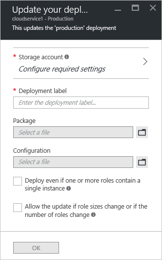

<properties 
    pageTitle="Tâches de gestion courantes cloud service | Microsoft Azure" 
    description="Découvrez comment gérer les services de cloud dans le portail Azure. Ces exemples utilisent le portail Azure." 
    services="cloud-services" 
    documentationCenter="" 
    authors="Thraka" 
    manager="timlt" 
    editor=""/>

<tags 
    ms.service="cloud-services" 
    ms.workload="tbd" 
    ms.tgt_pltfrm="na" 
    ms.devlang="na" 
    ms.topic="article" 
    ms.date="08/02/2016"
    ms.author="adegeo"/>

# Comment gérer les Services en nuage

> [AZURE.SELECTOR]
- [Portail Azure](cloud-services-how-to-manage-portal.md)
- [Portail classique Azure](cloud-services-how-to-manage.md)

Votre service cloud est géré dans la zone **Services en nuage (classique)** du portail Azure. Cet article décrit certaines actions courantes que vous devez procéder lors de la gestion de vos services cloud. Incluant une mise à jour, suppression, mise à l’échelle et promouvoir un déploiement intermédiaire en production.

Plus d’informations sur la façon de mettre à l’échelle de votre service cloud sont disponibles [ici](cloud-services-how-to-scale-portal.md).

## Comment : mettre à jour un rôle du service cloud ou le déploiement

Si vous devez mettre à jour le code d’application pour votre service cloud, utilisez **mettre à jour** sur la carte de service cloud. Vous pouvez mettre à jour un seul rôle ou tous les rôles. Pour mettre à jour, vous pouvez télécharger un fichier de configuration de service ou le nouveau lot de service.

1. Dans le [portail Azure][], sélectionnez le service de nuage à mettre à jour. Cette étape s’ouvre la carte d’instance de service cloud.

2. Dans la carte, cliquez sur le bouton **mettre à jour** .

    

3. Mettre à jour le déploiement avec un nouveau fichier de package de service (.cspkg) et un fichier de configuration de service (.cscfg).

    

4. **Vous pouvez également** mettre à jour l’étiquette de déploiement et du compte de stockage. 

5. Si tous les rôles n'ont qu’une seule instance de rôle, sélectionnez le **déploiement même si un ou plusieurs rôles contiennent une seule occurrence** pour activer la mise à niveau continuer. 

    Azure peut uniquement garantir la disponibilité de service 99,95 % au cours d’une mise à jour de service cloud si chaque rôle possède au moins deux instances de rôle (machines virtuelles). Avec deux instances de rôle, une machine virtuelle traiter les demandes des clients tandis que l’autre est mis à jour.

6. Cochez cette case **Démarrer le déploiement** pour la mise à jour appliqué une fois le téléchargement du package terminée.

7. Cliquez sur **OK** pour lancer le service de mise à jour.

## Comment : échanger des déploiements pour promouvoir un déploiement intermédiaire vers production

Lorsque vous décidez de déployer une nouvelle version d’un service cloud, partage et tester votre nouvelle version dans votre environnement intermédiaire du service cloud. Utilisez **intervertir** pour basculer les URL à laquelle les deux déploiements sont évoqués et promouvoir une nouvelle version en production. 

Vous pouvez échanger des déploiements à partir de la page **Services Cloud** ou le tableau de bord.

1. Dans le [portail Azure][], sélectionnez le service de nuage à mettre à jour. Cette étape s’ouvre la carte d’instance de service cloud.

2. Dans la carte, cliquez sur le bouton **intervertir** .

    

3. L’invite de confirmation suivante s’ouvre.

    

4. Une fois que vous vérifiez les informations de déploiement, cliquez sur **OK** pour remplacer les déploiements.

    L’échange de déploiement se passe-t-il rapidement la seule chose qui change étant les adresses IP virtuelles (VIP) pour les déploiements.

    Pour enregistrer les coûts de calcul, vous pouvez supprimer le déploiement intermédiaire après avoir vérifié que votre déploiement de production fonctionne comme prévu.

## Comment : lier une ressource à un service cloud

Le portail Azure ne pas relier ressources telles que le portail classique Azure actif effectue. À la place, déployer des ressources supplémentaires sur le même groupe de ressources utilisé par le Service Cloud.

## Comment : supprimer des déploiements et un service cloud

Avant de pouvoir supprimer un service cloud, vous devez supprimer chaque déploiement existant.

Pour enregistrer les coûts de calcul, vous pouvez supprimer le déploiement intermédiaire après avoir vérifié que votre déploiement de production fonctionne comme prévu. Vous êtes facturé pour cluster les coûts des instances de rôle déployé qui sont bloquées.

Utilisez la procédure suivante pour supprimer un déploiement ou votre service cloud. 

1. Dans le [portail Azure][], sélectionnez le service de nuage à supprimer. Cette étape s’ouvre la carte d’instance de service cloud.

2. Dans la carte, cliquez sur le bouton **Supprimer** .

    

3. Vous pouvez supprimer le service en nuage entière en cochant **service Cloud et ses déploiements** ou choisissez le **déploiement de Production** ou le **déploiement de la mise en attente**.

     

4. Cliquez sur le bouton **Supprimer** en bas.

5. Pour supprimer le service cloud, cliquez sur **Supprimer le service cloud**. À l’invite de confirmation, cliquez sur **Oui**.

> [AZURE.NOTE]
> Lorsqu’un service cloud est supprimé et surveillance détaillée est configuré, vous devez supprimer manuellement les données à partir de votre compte de stockage. Pour savoir où trouver les tables de mesures, voir [cet](cloud-services-how-to-monitor.md) article.

[Portail Azure]: https://portal.azure.com

## Étapes suivantes

* [Configuration générale de votre service cloud](cloud-services-how-to-configure-portal.md).
* Découvrez comment [déployer un service cloud](cloud-services-how-to-create-deploy-portal.md).
* Configurez un [nom de domaine personnalisé](cloud-services-custom-domain-name-portal.md).
* Configurer des [certificats ssl](cloud-services-configure-ssl-certificate-portal.md).