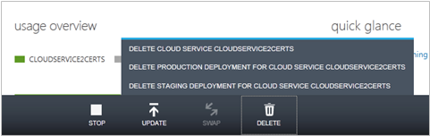

<properties 
    pageTitle="Tâches courantes de cloud service gestion (standard) | Microsoft Azure" 
    description="Découvrez comment gérer les services de cloud dans le portail classique Azure." 
    services="cloud-services" 
    documentationCenter="" 
    authors="Thraka" 
    manager="timlt" 
    editor=""/>

<tags 
    ms.service="cloud-services" 
    ms.workload="tbd" 
    ms.tgt_pltfrm="na" 
    ms.devlang="na" 
    ms.topic="article" 
    ms.date="08/10/2016"
    ms.author="adegeo"/>

# Comment gérer les Services en nuage

> [AZURE.SELECTOR]
- [Portail Azure](cloud-services-how-to-manage-portal.md)
- [Portail classique Azure](cloud-services-how-to-manage.md)

Dans la zone **Cloud Services** du portail Azure classique, vous pouvez mettre à jour un rôle de service ou d’un déploiement, promouvoir un déploiement intermédiaire en production, lier des ressources à votre service cloud afin que vous puissiez voir les dépendances des ressources et mettre à l’échelle les ressources entre eux et supprimer un service cloud ou un déploiement.

## Comment : mettre à jour un rôle du service cloud ou le déploiement

Si vous devez mettre à jour le code d’application pour votre service cloud, utilisez **mettre à jour** sur le tableau de bord, page **Services en nuage** ou page **Instances** . Vous pouvez mettre à jour un seul rôle ou tous les rôles. Vous devez télécharger un package de service et un fichier de configuration de service.

1. Dans le [portail classique Azure](https://manage.windowsazure.com/), sur le tableau de bord, page **Services en nuage** ou **Instances de** page, cliquez sur **mettre à jour**.

    

2. **Étiquette de déploiement**, entrez un nom pour identifier le déploiement (par exemple, mycloudservice4). Vous trouverez l’étiquette de déploiement sous **démarrage rapide** sur le tableau de bord.

3. Dans le **Package**, utilisez **Parcourir** pour télécharger le fichier de package de service (.cspkg).

4. Dans la **Configuration**, utilisez **Parcourir** pour télécharger le fichier de configuration de service (.cscfg).

5. Dans le **rôle**, sélectionnez **tout** si vous souhaitez mettre à niveau de tous les rôles dans le service cloud. Pour effectuer une mise à jour seul rôle, sélectionnez le rôle à mettre à jour. Même si vous sélectionnez un rôle spécifique pour mettre à jour, les mises à jour dans le fichier de configuration de service sont appliquées à tous les rôles.

6. Si la mise à jour modifie le nombre de rôles ou la taille de n’importe quel rôle, activez la case à cocher **Autoriser mettre à jour si les tailles de rôle ou le nombre de rôles est modifié** pour activer la mise à jour continuer. 

    N’oubliez pas que si vous changez la taille d’un rôle (autrement dit, la taille d’une machine virtuelle qui héberge une instance de rôle) ou le nombre de rôles, chaque instance de rôle (machine virtuelle) doit être ré-image et des données locales seront perdues.

7. Si tous les rôles service n'ont qu’une seule instance de rôle, sélectionnez le **jour même si un ou plusieurs rôle contiennent une case à cocher uniques** pour activer la mise à niveau continuer. 

    Azure peut uniquement garantir la disponibilité de service 99,95 % au cours d’une mise à jour de service cloud si chaque rôle possède au moins deux instances de rôle (machines virtuelles). Qui permet à une machine virtuelle traiter les demandes des clients pendant l’autre mise à jour.

8. Cliquez sur **OK** (coche) pour lancer le service de mise à jour.

## Comment : échanger des déploiements pour promouvoir un déploiement intermédiaire vers production

Utilisez **intervertir** pour promouvoir un déploiement intermédiaire d’un service cloud en production. Lorsque vous décidez de déployer une nouvelle version d’un service cloud, vous pouvez l’étape et testez votre nouvelle version dans votre environnement intermédiaire du service cloud pendant que vos clients utilisent la version actuelle en production. Lorsque vous êtes prêt à promouvoir la nouvelle version de production, vous pouvez utiliser **intervertir** pour basculer les URL à laquelle les deux déploiements adressés. 

Vous pouvez échanger des déploiements à partir de la page **Services Cloud** ou le tableau de bord.

1. Dans le [portail classique Azure](https://manage.windowsazure.com/), cliquez sur **Services de Cloud**.

2. Dans la liste des services en nuage, cliquez sur le service cloud pour le sélectionner.

3. Cliquez sur **Remplacer**.

    L’invite de confirmation suivante s’ouvre.

    

4. Une fois que vous vérifiez les informations de déploiement, cliquez sur **Oui** pour remplacer les déploiements.

    L’échange de déploiement se passe-t-il rapidement la seule chose qui change étant les adresses IP virtuelles (VIP) pour les déploiements.

    Pour enregistrer les coûts de calcul, vous pouvez supprimer le déploiement dans l’environnement intermédiaire lorsque vous êtes certain que le nouveau déploiement de production fonctionne comme prévu.

## Comment : lier une ressource à un service cloud

Pour afficher votre cloud dépendances du service sur d’autres ressources, vous pouvez lier une instance de base de données SQL Azure ou un compte de stockage du service cloud. Vous pouvez lier et dissocier des ressources sur la page **Ressources liées** et contrôlez leur utilisation du tableau de bord du service cloud. Si un compte de stockage liée a surveillance activé, vous pouvez surveiller Total des requêtes dans le tableau de bord de service cloud.

Cliquez sur **lien** pour lier une base de données SQL existant ou nouvel instance ou le stockage des compte à votre service cloud. Vous pouvez ensuite adapter la base de données ainsi que le rôle de service de nuage qui utilise dans la page **d’échelle** . (Un compte de stockage redimensionne automatiquement l’utilisation croissante.) Pour plus d’informations, voir [comment adapter un Service Cloud et ressources liées](cloud-services-how-to-scale.md). 

Vous pouvez également contrôler, gérer et adapter la base de données dans le nœud de **bases de données** du portail classique Azure. 

« Liaison » d’une ressource dans ce sens ne connecter votre application à la ressource. Si vous créez une nouvelle base de données à l’aide du **lien**, vous devez ajouter les chaînes de connexion à votre code de l’application et puis mise à niveau du service cloud. Vous devez également ajouter des chaînes de connexion si votre application utilise des ressources dans un compte de stockage liées.

La procédure suivante décrit comment lier une nouvelle instance de base de données SQL, déployée sur un nouveau serveur de base de données SQL, à un service cloud.

### Pour lier une instance de base de données SQL sur un service cloud

1. Dans le [portail classique Azure](http://manage.windowsazure.com/), cliquez sur **Services de Cloud**. Cliquez ensuite sur le nom du service cloud pour ouvrir le tableau de bord.

2. Cliquez sur **ressources liées**.

    La page **Ressources liées** s’ouvre.

    

3. Cliquez sur **lien une ressource** ou **lien**.

    L’Assistant **Liaison ressource** démarre.

    

4. Cliquez sur **créer une nouvelle ressource** ou **lier une ressource existante**.

5. Choisissez le type de ressource à lier. Dans le [portail classique Azure](http://manage.windowsazure.com/), cliquez sur **Base de données SQL**. (Le portail classique Azure Preview ne reconnaît pas lier un compte de stockage à un service cloud.)

6. Pour terminer la configuration de base de données, suivez les instructions de l’aide de la zone de **Bases de données SQL** du portail classique Azure.

    Vous pouvez suivre l’avancement de l’opération d’attache dans la zone de message.

    

    Lors de la liaison est terminée, vous pouvez surveiller l’état de la ressource liée dans le tableau de bord de service cloud. Pour plus d’informations sur la mise à l’échelle d’une base de données SQL liée, Découvrez [comment mettre à l’échelle d’un Service Cloud et ressources liées](cloud-services-how-to-scale.md).

### Supprimer la liaison avec une ressource liée

1. Dans le [portail classique Azure](http://manage.windowsazure.com/), cliquez sur **Services de Cloud**. Cliquez ensuite sur le nom du service cloud pour ouvrir le tableau de bord.

2. Cliquez sur **Ressources liées**et sélectionnez la ressource.

3. Cliquez sur **Dissocier**. Puis cliquez sur **Oui** à l’invite de confirmation.

    Vous avez dissocié une base de données SQL n’a aucun effet sur la base de données ou les connexions de l’application à la base de données. Vous pouvez toujours gérer la base de données dans la zone de **Bases de données SQL** du portail classique Azure.

## Comment : supprimer des déploiements et un service cloud

Avant de pouvoir supprimer un service cloud, vous devez supprimer chaque déploiement existant.

Pour enregistrer les coûts de calcul, vous pouvez supprimer votre déploiement intermédiaire après avoir vérifié que votre déploiement de production fonctionne comme prévu. Vous êtes cluster facturée les coûts des instances de rôle même si un service cloud n’est pas en cours d’exécution.

Utilisez la procédure suivante pour supprimer un déploiement ou votre service cloud. 

1. Dans le [portail classique Azure](http://manage.windowsazure.com/), cliquez sur **Services de Cloud**.

2. Sélectionnez le service cloud, puis cliquez sur **Supprimer**. (Pour sélectionner un service cloud sans ouvrir le tableau de bord, cliquez sur n’importe où, sauf le nom dans l’entrée du service cloud.)

    Si vous disposez d’un déploiement dans intermédiaire ou de production, vous verrez un menu de choix similaire à celui ci-dessous en bas de la fenêtre. Avant de pouvoir supprimer le service cloud, vous devez supprimer les déploiements existants.

    

3. Pour supprimer un déploiement, cliquez sur **Supprimer le déploiement de production** ou **Supprimer le déploiement intermédiaire**. À l’invite de confirmation, cliquez sur **Oui**. 

4. Si vous envisagez de supprimer le service cloud, répétez l’étape 3, si nécessaire, pour supprimer d’autres votre déploiement.

5. Pour supprimer le service cloud, cliquez sur **Supprimer le service cloud**. À l’invite de confirmation, cliquez sur **Oui**.

> [AZURE.NOTE]
> Si la surveillance détaillée est configurée pour votre service cloud, Azure ne supprime pas les données d’analyse de votre compte de stockage lorsque vous supprimez le service cloud. Vous devrez supprimer manuellement les données. Pour savoir où trouver les tables de mesures, voir « comment : accès détaillée analyse des données à l’extérieur du portail classique Azure » dans [la section aux Services Cloud moniteur](cloud-services-how-to-monitor.md).

## Étapes suivantes

 * [Configuration générale de votre service cloud](cloud-services-how-to-configure.md).
* Découvrez comment [déployer un service cloud](cloud-services-how-to-create-deploy.md).
* Configurez un [nom de domaine personnalisé](cloud-services-custom-domain-name.md).
* Configurer des [certificats ssl](cloud-services-configure-ssl-certificate.md).
