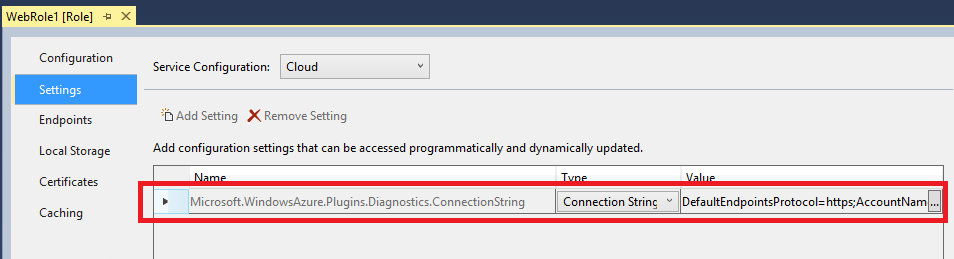

<properties 
    pageTitle="Comment faire pour surveiller un service cloud | Microsoft Azure" 
    description="Découvrez comment contrôler les services de cloud à l’aide du portail classique Azure." 
    services="cloud-services" 
    documentationCenter="" 
    authors="rboucher" 
    manager="timlt" 
    editor=""/>

<tags 
    ms.service="cloud-services" 
    ms.workload="tbd" 
    ms.tgt_pltfrm="na" 
    ms.devlang="na" 
    ms.topic="article" 
    ms.date="08/04/2015" 
    ms.author="robb"/>


# <a name="how-to-monitor-cloud-services"></a>Comment faire pour surveiller les Services en nuage

[AZURE.INCLUDE [disclaimer](../../includes/disclaimer.md)]

Vous pouvez surveiller `key` indicateurs de performance pour vos services cloud dans le portail classique Azure. Vous pouvez définir le niveau de contrôle minimale et détaillée pour chaque rôle de service et que vous pouvez personnaliser la surveillance s’affiche. Données d’analyse détaillées sont stockées dans un compte de stockage, vous pouvez accéder à l’extérieur du portail. 

Surveillance apparaît dans le portail classique Azure est configurable. Vous pouvez choisir les mesures que vous voulez contrôler dans la liste d’indicateurs dans la page **Moniteur** , et vous pouvez choisir les mesures à tracer dans les graphiques mesures sur la page **surveiller** et le tableau de bord. 

## <a name="concepts"></a>Concepts

Par défaut, surveillance minimale est fourni pour un nouveau service cloud à l’aide des compteurs de performance collectés à partir du système d’exploitation hôte pour les instances de rôles (machines virtuelles). Les mesures minimales sont limités à pourcentage processeur, données dans, données sortantes, débit de lecture disque et débit des écritures disque. Configuration de l’analyse détaillée, vous pouvez recevoir mesures supplémentaires basées sur des données de performance dans les machines virtuelles (instances de rôle). Les mesures détaillées activer analyse plus approfondie des problèmes qui se produisent pendant le fonctionnement des applications.

Par défaut des données de compteur de performance à partir d’instances de rôle sont échantillonnées et transférées à partir de l’instance de rôle à intervalles de 3 minutes. Lorsque vous activez la surveillance détaillée, les données de compteur de performances brutes sont regroupées pour chaque instance de rôle et pour plusieurs instances de rôle pour chaque rôle à intervalles de 5 minutes, 1 heure et 12 heures. Les données agrégées sont supprimées après 10 jours.

Après avoir activé la surveillance détaillée, les données d’analyse agrégées sont stockées dans des tableaux dans votre compte de stockage. Pour activer le contrôle détaillée pour un rôle, vous devez configurer une chaîne de connexion diagnostics que les liens vers le compte de stockage. Vous pouvez utiliser des comptes de stockage différentes pour différents rôles.

Notez que l’activation de l’analyse détaillée augmente les coûts de stockage liés au stockage de données, le transfert de données et les transactions de stockage. Surveillance minimales ne nécessite pas un compte de stockage. Les données pour les indicateurs qui sont exposés au niveau de la surveillance minimal ne sont pas stockées dans votre compte de stockage, même si vous définissez le niveau de surveillance explicite.


## <a name="how-to-configure-monitoring-for-cloud-services"></a>Comment : configurer l’analyse des services en nuage

Utilisez les procédures suivantes pour configurer l’analyse des commentaires ou minimales dans le portail classique Azure. 

### <a name="before-you-begin"></a>Avant de commencer

- Créer un compte de stockage pour stocker les données d’analyse. Vous pouvez utiliser des comptes de stockage différentes pour différents rôles. Pour plus d’informations, voir l’aide pour les **Comptes de stockage**, ou Découvrez [comment créer un compte de stockage](/manage/services/storage/how-to-create-a-storage-account/).

- Activer les Diagnostics Azure pour vos rôles de service cloud. Voir [Configuration des Diagnostics pour les Services Cloud](https://msdn.microsoft.com/library/azure/dn186185.aspx#BK_EnableBefore).

Vérifiez que la chaîne de connexion diagnostics se trouve dans la configuration du rôle. Vous ne pouvez pas activer le contrôle détaillée jusqu'à ce que vous activez Diagnostics Azure et incluez une chaîne de connexion diagnostics dans la configuration du rôle.   

> [AZURE.NOTE] Projets ciblage Azure SDK 2.5 automatiquement contenait pas la chaîne de connexion diagnostics dans le modèle de projet. Vous devez ajouter manuellement la chaîne de connexion diagnostics à la configuration du rôle de ces projets.

**Pour ajouter manuellement des chaîne de connexion diagnostics à la configuration de rôle**

1. Ouvrez le projet de Service Cloud dans Visual Studio
2. Double-cliquez sur le **rôle** pour ouvrir le Concepteur de rôle et sélectionnez l’onglet **paramètres**
3. Recherchez un paramètre nommé **Microsoft.WindowsAzure.Plugins.Diagnostics.ConnectionString**. 
4. Si ce paramètre n’est pas présent, cliquez sur le bouton **Ajouter un paramètre** à ajouter à la configuration et de modifier le type pour le nouveau paramétrage **ConnectionString**
5. Définissez la valeur de chaîne de connexion l’en cliquant sur le bouton **...** . Boîte de dialogue permettant de sélectionner un compte de stockage s’ouvre.

    

### <a name="to-change-the-monitoring-level-to-verbose-or-minimal"></a>Pour modifier le niveau de surveillance détaillée ou minimales

1. Dans le [portail classique Azure](https://manage.windowsazure.com/), ouvrez la page **configurer** pour le déploiement de service cloud.

2. Dans le **niveau**, cliquez sur **commentaires** ou **minimales**. 

3. Cliquez sur **Enregistrer**.

Après avoir activé la surveillance détaillée, vous devez commencer s’affichent les données d’analyse dans le portail classique Azure au sein de l’heure.

Les données de compteur de performances brutes et les données d’analyse agrégées sont stockées dans le compte de stockage de tables qualifié par l’ID de déploiement pour les rôles. 

## <a name="how-to-receive-alerts-for-cloud-service-metrics"></a>Comment : recevoir des alertes pour les mesures de service cloud

Vous pouvez recevoir des alertes en fonction de votre service cloud chiffres de surveillance. Dans la page **Gestion des Services** du portail Azure classique, vous pouvez créer une règle pour déclencher une alerte lorsque la mesure que vous choisissez atteigne une valeur que vous spécifiez. Vous pouvez également choisir d’avoir des messages envoyés au déclenchement de l’alerte. Pour plus d’informations, voir [Comment : recevoir des Notifications d’alerte et gérer les règles d’alerte dans Azure](http://go.microsoft.com/fwlink/?LinkId=309356).

## <a name="how-to-add-metrics-to-the-metrics-table"></a>Comment : ajouter des indicateurs à la table indicateurs

1. Dans le [portail classique Azure](http://manage.windowsazure.com/), ouvrez la page **Moniteur** pour le service cloud.

    Par défaut, la table Indicateurs affiche un sous-ensemble des mesures disponibles. L’illustration montre les mesures de commentaires par défaut pour un service cloud, qui est limité au compteur de performance Mémoire\méga, avec des données recueillies au niveau du rôle. **Ajouter des indicateurs** permet de sélectionner les mesures de regroupement et au niveau du rôle supplémentaires pour surveiller dans le portail classique Azure.

    
 
2. Pour ajouter des indicateurs à la table indicateurs :

    1. Cliquez sur **Ajouter des indicateurs** pour ouvrir **Choisir les indicateurs**, illustré ci-dessous.

        La première symétrique disponible est développée pour afficher les options disponibles. Pour chaque indicateur, l’option supérieure affiche des données d’analyse agrégées pour tous les rôles. En outre, vous pouvez choisir des rôles individuels pour afficher des données pour.

        

    2. Pour sélectionner des mesures à afficher

        - Cliquez sur la flèche vers le bas par la valeur métrique pour développer les options de surveillance.
        - Activez la case à cocher pour chaque option analyse que vous voulez afficher.

        Vous pouvez afficher jusqu'à 50 indicateurs dans le tableau indicateurs.

        > [AZURE.TIP] Dans l’analyse détaillée, la liste mesures peut contenir des douzaines de mesures. Pour afficher une barre de défilement, placez le curseur sur le côté droit de la boîte de dialogue. Pour filtrer la liste, cliquez sur l’icône de recherche et entrer du texte dans la zone de recherche, comme illustré ci-dessous.
    
        


3. Une fois que vous avez fini de sélectionner les mesures, cliquez sur OK (coche).

    Les mesures sélectionnées sont ajoutés à la table indicateurs, comme illustré ci-dessous.

    

 
4. Pour supprimer une mesure de la table indicateurs, cliquez sur la métrique pour le sélectionner, puis cliquez sur **Supprimer métrique**. (Vous uniquement voir **Métrique supprimer** lorsque vous avez une métrique sélectionnée.)

### <a name="to-add-custom-metrics-to-the-metrics-table"></a>Pour ajouter des indicateurs personnalisés à la table indicateurs

Les **commentaires** niveau de surveillance fournit une liste des mesures par défaut que vous pouvez surveiller sur le portail. De plus, vous pouvez surveiller les indicateurs personnalisés ou compteurs définis par votre application via le portail.

Les étapes suivantes impliquent que vous avez activé sur **commentaires** niveau de surveillance et que vous avez configurer votre application pour collecter et transférer des compteurs de performance personnalisés. 

Pour afficher les compteurs de performance personnalisés dans le portail, vous devez mettre à jour la configuration dans le conteneur de contrôle wad :
 
1. Ouvrez le conteneur de contrôle wad blob dans votre compte de stockage diagnostics. Vous pouvez utiliser Visual Studio ou n’importe quel autre Explorateur de stockage pour effectuer cette action.

    

2. Recherchez le chemin d’accès blob à l’aide du modèle **RoleName/DeploymentId/RoleInstance** pour trouver la configuration de l’instance du rôle. 

    
3. Téléchargez le fichier de configuration de l’instance du rôle et mettre à jour pour inclure les compteurs de performance personnalisés. Par exemple contrôler *l’écriture disque octets/sec* pour le *lecteur C* , ajoutez ce qui suit sous **PerformanceCounters\Subscriptions** nœud

    ```xml
    <PerformanceCounterConfiguration>
    <CounterSpecifier>\LogicalDisk(C:)\Disk Write Bytes/sec</CounterSpecifier>
    <SampleRateInSeconds>180</SampleRateInSeconds>
    </PerformanceCounterConfiguration>
    ```
4. Enregistrer les modifications et téléchargez le fichier de configuration vers l’emplacement du même remplacer le fichier existant dans le blob.
5. Basculer en mode détaillé dans la configuration du portail classique Azure. Si vous utilisiez déjà en mode détaillé, vous devrez afficher/masquer en minimales et inversement détaillée.
6. Le compteur de performance personnalisé maintenant seront disponible dans la boîte de dialogue **Ajouter des indicateurs** . 

## <a name="how-to-customize-the-metrics-chart"></a>Comment : personnaliser le graphique de mesures

1. Dans la table indicateurs, sélectionnez métrique jusqu'à 6 à tracer sur le graphique indicateurs. Pour sélectionner une mesure, cliquez sur la case à cocher sur le côté gauche. Pour supprimer une métrique du graphique indicateurs, désactivez la case correspondante dans la table des indicateurs.

    Lorsque vous sélectionnez métrique dans la table des mesures, les mesures sont ajoutés au graphique indicateurs. Sur un affichage étroit, une liste déroulante **n plus** contienne des en-têtes métriques qui ne tient pas l’affichage.

 
2. Pour basculer entre l’affichage des valeurs relatives (valeur finale uniquement pour chaque métrique) et absolue (axe Y affiché), sélectionnez Relative ou absolue dans la partie supérieure du graphique.

    

3. Pour modifier la période la métrique graphique s’ouvre, sélectionnez 1 hour, 24 heures ou jours 7 dans la partie supérieure du graphique.

    

    Dans le graphique indicateurs tableau de bord, la méthode pour le tracé métriques est différente. Un ensemble standard de métriques est disponible, et indicateurs sont ajoutées ou supprimées en sélectionnant l’en-tête métrique.

### <a name="to-customize-the-metrics-chart-on-the-dashboard"></a>Pour personnaliser le graphique indicateurs dans le tableau de bord

1. Ouvrez le tableau de bord pour le service cloud.

2. Ajouter ou supprimer des indicateurs dans le graphique :

    - Pour tracer une nouvelle mesure, activez la case à cocher pour la mesure dans les en-têtes de graphique. Dans un affichage étroit, cliquez sur la flèche vers le bas en **??metrics *n*** pour tracer une mesure de que la zone d’en-tête graphique ne peut pas afficher.

    - Pour supprimer une mesure qui est tracée sur le graphique, désactivez la case à cocher par son en-tête.

3. Basculer entre les **références relatives** et **absolues** affiche.

4. Cliquez sur 1 heure, 24 heures, soit 7 jours de données à afficher.

## <a name="how-to-access-verbose-monitoring-data-outside-the-azure-classic-portal"></a>Comment : accès détaillée analyse des données à l’extérieur du portail classique Azure

Données d’analyse détaillées sont stockées dans des tables dans les comptes de stockage que vous spécifiez pour chaque rôle. Pour chaque déploiement de service cloud, six tableaux est créés par le rôle. Deux tables sont créées pour chacune d’elles (5 minutes, 1 heure et 12 heures). Une de ces tables stocke les agrégations au niveau du rôle. l’autre table stocke les agrégations instances de rôle. 

Les noms des tables ont le format suivant :

```
WAD*deploymentID*PT*aggregation_interval*[R|RI]Table
```

Dans cet exemple :

- *deploymentID* correspond au GUID assigné pour le déploiement de service cloud

- *aggregation_interval* = 5 M, 1 H ou 12 H

- niveau de rôle agrégations = R

- agrégations instances de rôle = intégrité Référentielle

Par exemple, les tableaux suivants stocker les données d’analyse détaillées agrégées à intervalles 1 heure :

```
WAD8b7c4233802442b494d0cc9eb9d8dd9fPT1HRTable (hourly aggregations for the role)

WAD8b7c4233802442b494d0cc9eb9d8dd9fPT1HRITable (hourly aggregations for role instances)
```
