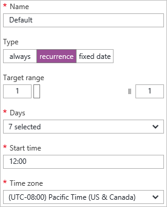

<properties
    pageTitle="Automatique adapter un service cloud dans le portail | Microsoft Azure"
    description="Découvrez comment utiliser le portail pour configurer des règles d’échelle automatique pour un rôle de cloud service web ou collaborateur dans Azure."
    services="cloud-services"
    documentationCenter=""
    authors="Thraka"
    manager="timlt"
    editor=""/>

<tags
    ms.service="cloud-services"
    ms.workload="tbd"
    ms.tgt_pltfrm="na"
    ms.devlang="na"
    ms.topic="article"
    ms.date="09/06/2016"
    ms.author="adegeo"/>

# Comment un service cloud à l’échelle automatique

> [AZURE.SELECTOR]
- [Portail Azure](cloud-services-how-to-scale-portal.md)
- [Portail classique Azure](cloud-services-how-to-scale.md)

Conditions peuvent être définies pour un rôle de collaborateur service cloud qui déclencher une échelle ou arrière opération. Les conditions pour le rôle peuvent être basées sur disque, le processeur ou le chargement de réseau du rôle. Vous pouvez également définir une conditation basée sur une file d’attente ou la métrique d’une autre ressource Azure associé à votre abonnement.

>[AZURE.NOTE] Cet article se concentre sur les rôles web et collaborateur Service Cloud. Lorsque vous créez une machine virtuelle (classique) directement, s’il est hébergé dans un service cloud. Vous pouvez mettre à l’échelle une machine virtuelle standard en associant avec une [disponibilité définie](../virtual-machines/virtual-machines-windows-classic-configure-availability.md) et manuellement les activer ou désactiver.

## Considérations relatives à la

Vous devez prendre en compte les informations suivantes avant de configurer mise à l’échelle de votre application :

- Mise à l’échelle n’est affecté par l’utilisation de base. Plus grande instances de rôle utilisent plus de cœurs. Vous pouvez adapter une application uniquement dans la limite de cœurs pour votre abonnement. Par exemple, si votre abonnement a une limite de vingt cœurs et que vous exécutez une application avec deux support Tabloïd cloud services (un total de quatre cœurs), vous pouvez uniquement évoluer vers d’autres déploiements de service cloud dans votre abonnement en 16 cœurs. Pour plus d’informations sur les tailles, consultez [Tailles de Service Cloud](cloud-services-sizes-specs.md) .

- Vous pouvez mettre à l’échelle en fonction d’un seuil de message file d’attente. Pour plus d’informations sur l’utilisation des files d’attente, voir [comment utiliser le Service de stockage file d’attente](../storage/storage-dotnet-how-to-use-queues.md).

- Vous pouvez également mettre à l’échelle d’autres ressources associées à votre abonnement.

- Pour activer la disponibilité de votre application, vous devez vous assurer qu’elle est déployée avec deux ou plusieurs instances de rôle. Pour plus d’informations, consultez [Les contrats de niveau de Service](https://azure.microsoft.com/support/legal/sla/).

## Où se trouve échelle

Après avoir sélectionné votre service cloud, vous devez disposer de la carte de service cloud visible.

1. Dans la carte de service cloud, sur la vignette **rôles et les Instances** , sélectionnez le nom du service cloud.   
**IMPORTANT**: veillez à cliquer sur le rôle de service cloud, pas l’instance de rôle qui se trouve sous le rôle.

    

2. Sélectionnez la vignette **d’échelle** .

    

## Échelle automatique

Vous pouvez configurer les paramètres d’échelle pour un rôle avec deux modes **manuelle** ou **automatique**. Manuel est celui escompté, vous définissez le nombre d’instances absolu. Toutefois, automatique permet à l’ensemble de règles qui régissent comment et de le beaucoup vous est conseillé de diminuer.

Définissez l’option **d’échelle par** aux **règles de planification et de performances**.

1. Un profil existant.
2. Ajouter une règle pour le profil parent.
3. Ajouter un autre profil.

Sélectionnez **Ajouter un profil**. Le profil détermine le mode que vous souhaitez utiliser pour l’échelle : **toujours**, **périodicité**, **date fixe**.

Une fois que vous avez configuré les règles et le profil, sélectionnez l’icône **Enregistrer** dans la partie supérieure.

#### Profil

Le profil définit instances minimales et maximales pour l’échelle, et également lorsque cette plage échelle est active.

* **Toujours**

    Toujours conserver la plage d’instances disponibles.  

    
    
* **Périodicité**

    Choisissez un ensemble de jours de la semaine à l’échelle.

    
    
* **Date fixe**

    Une plage de dates fixe à l’échelle le rôle.

    

Une fois que vous avez configuré le profil, sélectionnez le bouton **OK** en bas de la cuillère de profil.

#### Règle

Règles sont ajoutées à un profil et représentent une condition qui doit déclencher l’échelle. 

Le déclencheur règle est basé sur une métrique du service cloud (utilisation de l’UC, l’activité du disque ou activité réseau) à laquelle vous pouvez ajouter une valeur conditionnelle. En outre, vous pouvez avoir le déclencheur basé sur une file d’attente ou la métrique d’une autre ressource Azure associé à votre abonnement.

Une fois que vous avez configuré la règle, sélectionnez le bouton **OK** en bas de la cuillère règle.

## Revenir à l’échelle manuelle

Accédez aux [paramètres d’échelle](#where-scale-is-located) et définissez l’option **d’échelle par** **un nombre d’instances entrer manuellement**.

Cela supprime la mise à l’échelle automatique du rôle et puis vous pouvez définir le nombre d’instances de directement. 

1. L’option échelle (manuelle ou automatique).
2. Un curseur instance de rôle pour définir les instances pour s’adapter aux.
3. Instances de ce rôle pour s’adapter aux.

Une fois que vous avez configuré les paramètres d’échelle, sélectionnez l’icône **Enregistrer** dans la partie supérieure.

