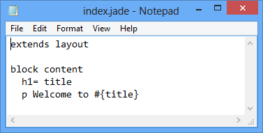
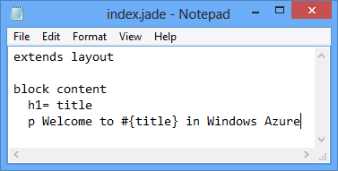

<properties 
    pageTitle="Web App avec Express (Node.js) | Microsoft Azure" 
    description="Didacticiel qui s’appuie sur le didacticiel service cloud et montre comment utiliser le module Express." 
    services="cloud-services" 
    documentationCenter="nodejs" 
    authors="rmcmurray" 
    manager="wpickett" 
    editor=""/>

<tags 
    ms.service="cloud-services" 
    ms.workload="tbd" 
    ms.tgt_pltfrm="na" 
    ms.devlang="nodejs" 
    ms.topic="article" 
    ms.date="08/11/2016" 
    ms.author="robmcm"/>

# Créer une application web Node.js à l’aide de Express sur un Service Cloud Azure

Node.js inclut un ensemble minimal de fonctionnalités dans l’environnement d’exécution centralisé.
Les développeurs utilisent souvent 3ème modules tiers pour fournir des fonctionnalités supplémentaires lors du développement d’une application Node.js. Dans ce didacticiel, vous allez créer une nouvelle application en utilisant le module [Express][] , qui fournit une infrastructure MVC pour créer des applications web Node.js.

Capture d’écran de l’application terminée est inférieur à :

##Créer un projet de Service Cloud

Procédez comme suit pour créer un nouveau projet de service cloud nommé « expressapp » :

1. Dans le **Menu Démarrer** ou **l’Écran de démarrage**, recherchez les **Windows PowerShell**. Enfin, avec le bouton droit de **Windows PowerShell** et sélectionnez **Exécuter en tant qu’administrateur**.

    

    [AZURE.INCLUDE [install-dev-tools](../../includes/install-dev-tools.md)]

2. Accédez à la **c :\\nœud** répertoire, puis entrez les commandes suivantes pour créer une solution nommé **expressapp** et un rôle web nommé **WebRole1**:

        PS C:\node> New-AzureServiceProject expressapp
        PS C:\Node\expressapp> Add-AzureNodeWebRole
        PS C:\Node\expressapp> Set-AzureServiceProjectRole WebRole1 Node 0.10.21

    > [AZURE.NOTE] Par défaut, **Ajouter AzureNodeWebRole** utilise une version antérieure de Node.js. L’instruction **Set-AzureServiceProjectRole** ci-dessus indique à Azure à utiliser v0.10.21 du nœud.  Notez que les paramètres respectent la casse.  Vous pouvez vérifier que la version correcte de Node.js a été sélectionnée en vérifiant la propriété **moteurs** dans **WebRole1\package.json**.

##Installer Express

1. Installer le Générateur de Express en exécutant la commande suivante :

        PS C:\node\expressapp> npm install express-generator -g

    Le résultat de la commande npm doit ressembler au résultat ci-dessous. 

    

2. Accédez au répertoire **WebRole1** et utilisez la commande expresse pour générer une nouvelle application :

        PS C:\node\expressapp\WebRole1> express

    Vous devrez remplacer votre ancienne application. Entrez **y** ou sur **Oui** pour continuer. Express génère le fichier app.js et une structure de dossiers pour la création de votre application.

    

5.  Pour installer les dépendances supplémentaires définis dans le fichier package.json, entrez la commande suivante :

        PS C:\node\expressapp\WebRole1> npm install

    

6.  Utilisez la commande suivante pour copier le fichier **bin/www** sur **server.js**. Il s’agit pour permettre le service cloud vous trouver le point d’entrée pour cette application.

        PS C:\node\expressapp\WebRole1> copy bin/www server.js

    Une fois cette commande terminée, vous devez disposer d’un fichier **server.js** dans le répertoire WebRole1.

7.  Modifier la **server.js** pour supprimer une du '.' caractères à partir de la ligne suivante.

        var app = require('../app');

    Après avoir apporté cette modification, la ligne doit apparaître comme suit.

        var app = require('./app');

    Cette modification est nécessaire étant donné que nous avons déplacé le fichier (anciennement **bin/www**,) dans le même répertoire que le fichier d’application soit nécessaire. Après avoir apporté cette modification, enregistrez le fichier **server.js** .

8.  Utilisez la commande suivante pour exécuter l’application dans l’émulateur Azure :

        PS C:\node\expressapp\WebRole1> Start-AzureEmulator -launch

    

## Modification de l’affichage

Maintenant modifier l’affichage pour afficher le message « Bienvenue sur Express dans Azure ».

1.  Entrez la commande suivante pour ouvrir le fichier index.jade :

        PS C:\node\expressapp\WebRole1> notepad views/index.jade

    

    Jade est le moteur d’affichage par défaut utilisé par les applications Express. Pour plus d’informations sur le moteur d’affichage Jade, voir [http://jade-lang.com][].

2.  Modifier la dernière ligne de texte en ajoutant **dans Azure**.

    

3.  Enregistrez le fichier, quittez le bloc-notes.

4.  Actualisez votre navigateur et vous verrez vos modifications.

    

Après le test de l’application, utilisez l’applet de commande **Stop AzureEmulator** pour arrêter l’émulateur.

##Publication de l’Application vers Azure

Dans la fenêtre PowerShell Azure, utilisez l’applet de commande **Publier AzureServiceProject** pour déployer l’application sur un service cloud

    PS C:\node\expressapp\WebRole1> Publish-AzureServiceProject -ServiceName myexpressapp -Location "East US" -Launch

Une fois l’opération de déploiement terminé, votre navigateur s’ouvre et affiche la page web.

## Étapes suivantes

Pour plus d’informations, voir le [Centre de développement Node.js](/develop/nodejs/).

  [Node.js Web Application]: http://www.windowsazure.com/develop/nodejs/tutorials/getting-started/
  [Express]: http://expressjs.com/
  [http://Jade-lang.com]: http://jade-lang.com

 
