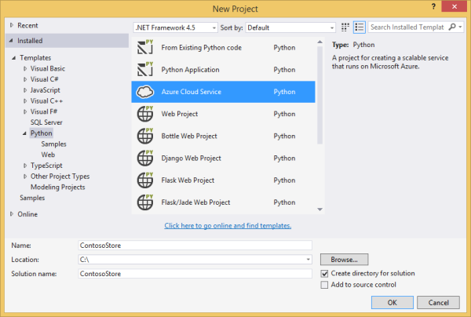
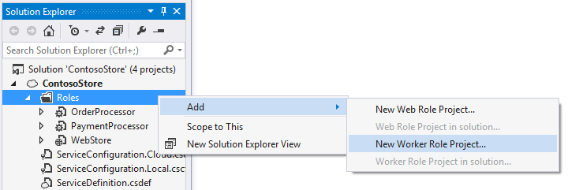

<properties
    pageTitle="Rôles web et collaborateur Python avec Visual Studio | Microsoft Azure"
    description="Vue d’ensemble de l’utilisation de Python Tools pour Visual Studio pour créer des services cloud Azure, y compris les rôles web et les rôles de travail."
    services="cloud-services"
    documentationCenter="python"
    authors="thraka"
    manager="timlt"
    editor=""/>

<tags
    ms.service="cloud-services"
    ms.workload="tbd"
    ms.tgt_pltfrm="na"
    ms.devlang="python"
    ms.topic="hero-article"
    ms.date="08/03/2016"
    ms.author="adegeo"/>


# <a name="python-web-and-worker-roles-with-python-tools-for-visual-studio"></a>Rôles web et collaborateur Python avec Python Tools pour Visual Studio

Cet article fournit une vue d’ensemble de l’utilisation des rôles Python web et de travail à l’aide de [Python Tools pour Visual Studio][]. Vous allez apprendre à utiliser Visual Studio pour créer et déployer un Service Cloud simple qui utilise Python.

## <a name="prerequisites"></a>Conditions préalables

 - Visual Studio 2013 ou 2015
 - [Outils Python pour Visual Studio][] (PTVS)
 - [Outils SDK Azure pour VS 2013][] ou [Outils SDK Azure VS 2015][]
 - [Python 2.7 32 bits][] ou [Python 3.5 32 bits][]

[AZURE.INCLUDE [create-account-and-websites-note](../../includes/create-account-and-websites-note.md)]

## <a name="what-are-python-web-and-worker-roles"></a>Quels sont les rôles web et collaborateur Python ?

Azure fournit trois calculent des modèles pour les applications en cours d’exécution : [fonctionnalité d’applications Web dans le Service d’application Azure][execution model-web sites], [Machines virtuelles Azure][execution model-vms]et [Les Services en nuage Azure][execution model-cloud services]. Les trois modèles prennent en charge les Python. Services en nuage, qui incluent les rôles web et collaborateur, fournissent *plateforme en tant que Service (PaaS)*. Au sein d’un service cloud, un rôle web fournit un serveur web Internet Information Services (IIS) dédié pour héberger des applications web frontaux, tandis qu’un rôle de collaborateur peut exécuter asynchrones, longue ou des tâches indépendamment d’interaction de l’utilisateur ou d’entrée.

Pour plus d’informations, voir [qu’est un Service Cloud ?].

> [AZURE.NOTE]*Vous souhaitez créer un site Web simple ?*
Si votre scénario implique simplement un simple site Web frontaux, envisagez d’utiliser la fonctionnalité d’applications Web léger dans le Service d’application Azure. Vous pouvez facilement mettre à niveau vers un Service Cloud croissance de votre site Web et à vos besoins. Consultez le <a href="/develop/python/">Centre de développement Python</a> des articles qui traitent de développement de la fonctionnalité d’applications Web dans le Service d’application Azure.
<br />


## <a name="project-creation"></a>Création d’un projet

Dans Visual Studio, vous pouvez sélectionner **Azure Cloud Service** dans la boîte de dialogue **Nouveau projet** , sous **Python**.



Dans l’Assistant Azure Cloud Service, vous pouvez créer des rôles web et de travail.


Le modèle de rôle de collaborateur est fourni avec du code réutilisable pour vous connecter à un compte de stockage Azure ou Bus des services Azure.


Vous pouvez ajouter des rôles web ou de travail à un service cloud existant à tout moment.  Vous pouvez choisir d’ajouter des projets existants dans votre solution ou créer de nouveaux.



Votre service cloud peut contenir des rôles activées dans différentes langues.  Par exemple, vous pouvez avoir un rôle web Python implémenté à l’aide de Django, avec Python ou rôles collaborateur c#.  Vous pouvez communiquer facilement entre vos rôles à l’aide des files d’attente Bus des services ou files d’attente de stockage.

## <a name="install-python-on-the-cloud-service"></a>Installer Python sur le service en nuage

>[AZURE.WARNING] Les scripts de configuration sont installés avec Visual Studio (au moment de la que dernière mise à jour de cet article) ne fonctionnent pas. Cette section décrit une solution de contournement.

Le principal problème avec les scripts de configuration sont qu’ils n’installent pas python. Commencez par définir deux [tâches de démarrage](cloud-services-startup-tasks.md) dans le fichier [ServiceDefinition.csdef](cloud-services-model-and-package.md#servicedefinitioncsdef) . La première tâche (**PrepPython.ps1**) télécharge et installe le runtime Python. La deuxième tâche (**PipInstaller.ps1**) s’exécute pip pour installer des dépendances, que vous devrez peut-être.

Les scripts ci-dessous ont été écrits ciblage Python 3.5. Si vous souhaitez utiliser la version 2.x de python, la valeur du fichier de variables **PYTHON2** **sur** pour les deux tâches de démarrage et la tâche d’exécution : `<Variable name="PYTHON2" value="<mark>on</mark>" />`.


```xml
<Startup>

  <Task executionContext="elevated" taskType="simple" commandLine="bin\ps.cmd PrepPython.ps1">
    <Environment>
      <Variable name="EMULATED">
        <RoleInstanceValue xpath="/RoleEnvironment/Deployment/@emulated" />
      </Variable>
      <Variable name="PYTHON2" value="off" />
    </Environment>
  </Task>

  <Task executionContext="elevated" taskType="simple" commandLine="bin\ps.cmd PipInstaller.ps1">
    <Environment>
      <Variable name="EMULATED">
        <RoleInstanceValue xpath="/RoleEnvironment/Deployment/@emulated" />
      </Variable>
      <Variable name="PYTHON2" value="off" />
    </Environment>
    
  </Task>

</Startup>
```

Les variables **PYTHON2** et **PYPATH** doit être ajoutée à la tâche de démarrage de travail. La variable **PYPATH** est utilisée uniquement si la variable **PYTHON2** est définie sur **activé**.

```xml
<Runtime>
  <Environment>
    <Variable name="EMULATED">
      <RoleInstanceValue xpath="/RoleEnvironment/Deployment/@emulated" />
    </Variable>
    <Variable name="PYTHON2" value="off" />
    <Variable name="PYPATH" value="%SystemDrive%\Python27" />
  </Environment>
  <EntryPoint>
    <ProgramEntryPoint commandLine="bin\ps.cmd LaunchWorker.ps1" setReadyOnProcessStart="true" />
  </EntryPoint>
</Runtime>
```

#### <a name="sample-servicedefinitioncsdef"></a>Exemple ServiceDefinition.csdef

```xml
<?xml version="1.0" encoding="utf-8"?>
<ServiceDefinition name="AzureCloudServicePython" xmlns="http://schemas.microsoft.com/ServiceHosting/2008/10/ServiceDefinition" schemaVersion="2015-04.2.6">
  <WorkerRole name="WorkerRole1" vmsize="Small">
    <ConfigurationSettings>
      <Setting name="Microsoft.WindowsAzure.Plugins.Diagnostics.ConnectionString" />
      <Setting name="Python2" />
    </ConfigurationSettings>
    <Startup>
      <Task executionContext="elevated" taskType="simple" commandLine="bin\ps.cmd PrepPython.ps1">
        <Environment>
          <Variable name="EMULATED">
            <RoleInstanceValue xpath="/RoleEnvironment/Deployment/@emulated" />
          </Variable>
          <Variable name="PYTHON2" value="off" />
        </Environment>
      </Task>
      <Task executionContext="elevated" taskType="simple" commandLine="bin\ps.cmd PipInstaller.ps1">
        <Environment>
          <Variable name="EMULATED">
            <RoleInstanceValue xpath="/RoleEnvironment/Deployment/@emulated" />
          </Variable>
          <Variable name="PYTHON2" value="off" />
        </Environment>
      </Task>
    </Startup>
    <Runtime>
      <Environment>
        <Variable name="EMULATED">
          <RoleInstanceValue xpath="/RoleEnvironment/Deployment/@emulated" />
        </Variable>
        <Variable name="PYTHON2" value="off" />
        <Variable name="PYPATH" value="%SystemDrive%\Python27" />
      </Environment>
      <EntryPoint>
        <ProgramEntryPoint commandLine="bin\ps.cmd LaunchWorker.ps1" setReadyOnProcessStart="true" />
      </EntryPoint>
    </Runtime>
    <Imports>
      <Import moduleName="RemoteAccess" />
      <Import moduleName="RemoteForwarder" />
    </Imports>
  </WorkerRole>
</ServiceDefinition>
```


Ensuite, créez les fichiers **PrepPython.ps1** et **PipInstaller.ps1** dans la **. / bin** dossier de votre rôle.

#### <a name="preppythonps1"></a>PrepPython.ps1

Ce script installe python. Si la variable d’environnement **PYTHON2** est définie sur **dans** puis Python 2.7 seront installé, dans le cas contraire Python 3.5 est installé.

```powershell
$is_emulated = $env:EMULATED -eq "true"
$is_python2 = $env:PYTHON2 -eq "on"
$nl = [Environment]::NewLine

if (-not $is_emulated){
    Write-Output "Checking if python is installed...$nl"
    if ($is_python2) {
        & "${env:SystemDrive}\Python27\python.exe"  -V | Out-Null
    }
    else {
        py -V | Out-Null
    }

    if (-not $?) {

        $url = "https://www.python.org/ftp/python/3.5.2/python-3.5.2-amd64.exe"
        $outFile = "${env:TEMP}\python-3.5.2-amd64.exe"

        if ($is_python2) {
            $url = "https://www.python.org/ftp/python/2.7.12/python-2.7.12.amd64.msi"
            $outFile = "${env:TEMP}\python-2.7.12.amd64.msi"
        }
        
        Write-Output "Not found, downloading $url to $outFile$nl"
        Invoke-WebRequest $url -OutFile $outFile
        Write-Output "Installing$nl"

        if ($is_python2) {
            Start-Process msiexec.exe -ArgumentList "/q", "/i", "$outFile", "ALLUSERS=1" -Wait
        }
        else {
            Start-Process "$outFile" -ArgumentList "/quiet", "InstallAllUsers=1" -Wait
        }

        Write-Output "Done$nl"
    }
    else {
        Write-Output "Already installed"
    }
}
```

#### <a name="pipinstallerps1"></a>PipInstaller.ps1

Ce script appelle pip et toutes les dépendances installe dans le fichier **requirements.txt** . Si la variable d’environnement **PYTHON2** est définie sur **dans** puis Python 2.7 seront utilisée, sinon Python 3.5 sera utilisé.

```powershell
$is_emulated = $env:EMULATED -eq "true"
$is_python2 = $env:PYTHON2 -eq "on"
$nl = [Environment]::NewLine

if (-not $is_emulated){
    Write-Output "Checking if requirements.txt exists$nl"
    if (Test-Path ..\requirements.txt) {
        Write-Output "Found. Processing pip$nl"

        if ($is_python2) {
            & "${env:SystemDrive}\Python27\python.exe" -m pip install -r ..\requirements.txt
        }
        else {
            py -m pip install -r ..\requirements.txt
        }

        Write-Output "Done$nl"
    }
    else {
        Write-Output "Not found$nl"
    }
}
```

#### <a name="modify-launchworkerps1"></a>Modifier LaunchWorker.ps1

>[AZURE.NOTE] Dans le cas d’un projet de **rôle de travail** , fichier **LauncherWorker.ps1** est nécessaire pour exécuter le fichier de démarrage. Dans un projet de **rôle web** , le fichier de démarrage est défini à la place dans les propriétés du projet.

Le **bin\LaunchWorker.ps1** a été créé pour effectuer un grand nombre de travail de préparation, mais il ne fonctionne pas vraiment. Remplacez le contenu de ce fichier avec le script suivant.

Ce script appelle le fichier **worker.py** à partir de votre projet python. Si la variable d’environnement **PYTHON2** est définie sur **dans** puis Python 2.7 seront utilisée, sinon Python 3.5 sera utilisé.

```powershell
$is_emulated = $env:EMULATED -eq "true"
$is_python2 = $env:PYTHON2 -eq "on"
$nl = [Environment]::NewLine

if (-not $is_emulated)
{
    Write-Output "Running worker.py$nl"

    if ($is_python2) {
        cd..
        iex "$env:PYPATH\python.exe worker.py"
    }
    else {
        cd..
        iex "py worker.py"
    }
}
else
{
    Write-Output "Running (EMULATED) worker.py$nl"

    # Customize to your local dev environment

    if ($is_python2) {
        cd..
        iex "$env:PYPATH\python.exe worker.py"
    }
    else {
        cd..
        iex "py worker.py"
    }
}
```

#### <a name="pscmd"></a>PS.cmd

Les modèles de Visual Studio doivent avoir créé un fichier **ps.cmd** dans le **. / bin** dossier. Ce script shell appelle les scripts d’emballage PowerShell ci-dessus et fournit journalisation basée sur le nom de l’emballage PowerShell appelé. Si ce fichier n’a pas été créé, voici ce qui doivent être. 

```bat
@echo off

cd /D %~dp0

if not exist "%DiagnosticStore%\LogFiles" mkdir "%DiagnosticStore%\LogFiles"
%SystemRoot%\System32\WindowsPowerShell\v1.0\powershell.exe -ExecutionPolicy Unrestricted -File %* >> "%DiagnosticStore%\LogFiles\%~n1.txt" 2>> "%DiagnosticStore%\LogFiles\%~n1.err.txt"
```


## <a name="run-locally"></a>Exécuter localement

Si vous définissez votre projet de service cloud comme projet de démarrage et appuyez sur F5, le service cloud s’exécute dans l’émulateur Azure local.

Bien que PTVS prend en charge lancement dans l’émulateur, débogage (par exemple, points d’arrêt) ne fonctionnera pas.

Pour déboguer vos rôles web et de travail, vous pouvez définir le projet de rôle comme projet de démarrage et qui déboguer à la place.  Vous pouvez également définir plusieurs projets de démarrage.  Avec le bouton droit de la solution, puis sélectionnez **Définir les projets de démarrage**.


## <a name="publish-to-azure"></a>Publier sur Azure

Pour publier, cliquez sur le projet de service cloud dans la solution, puis sélectionnez **Publier**.


Suivez l’Assistant. Si vous le souhaitez, activer le Bureau à distance. Bureau à distance est utile lorsque vous avez besoin de quelque chose déboguer.

Lorsque vous avez terminé la configuration des paramètres, cliquez sur **Publier**.

Des progrès seront affichent dans la fenêtre de sortie, puis que vous voyez la fenêtre du journal d’activité Microsoft Azure.


Déploiement prendra quelques minutes, puis vos rôles web et/ou collaborateur fonctionnent sur Azure !

### <a name="investigate-logs"></a>Examinez les journaux

Une fois que la machine virtuelle de service cloud démarre et installe Python, vous pouvez consulter les journaux pour rechercher tous les messages d’erreur. Ces journaux se trouvent dans la **C:\Resources\Directory\\{rôle} \LogFiles** dossier. **PrepPython.err.txt** créera au moins une erreur dans de lorsque le script essaie de détecter si Python est installé et **PipInstaller.err.txt** peut réclamation une ancienne version de pip.

## <a name="next-steps"></a>Étapes suivantes

Pour plus d’informations sur l’utilisation des rôles web et collaborateur dans les outils Python pour Visual Studio, consultez la documentation de PTVS :

- [Projets de Service cloud][]

Pour plus d’informations sur l’utilisation des services Azure à vos rôles web et de travail, par exemple à l’aide de stockage Azure ou Bus des services, consultez les articles suivants.

- [Service d’objets BLOB][]
- [Service de table][]
- [Service de file d’attente][]
- [Service Bus files d’attente][]
- [Service Bus rubriques][]


<!--Link references-->

[Qu’est un Service Cloud ?]: cloud-services-choose-me.md
[execution model-web sites]: ../app-service-web/app-service-web-overview.md
[execution model-vms]: ../virtual-machines/virtual-machines-windows-about.md
[execution model-cloud services]: cloud-services-choose-me.md
[Python Developer Center]: /develop/python/

[Service d’objets BLOB]: ../storage/storage-python-how-to-use-blob-storage.md
[Service de file d’attente]: ../storage/storage-python-how-to-use-queue-storage.md
[Service de table]: ../storage/storage-python-how-to-use-table-storage.md
[Service Bus files d’attente]: ../service-bus-messaging/service-bus-python-how-to-use-queues.md
[Service Bus rubriques]: ../service-bus-messaging/service-bus-python-how-to-use-topics-subscriptions.md


<!--External Link references-->

[Outils Python pour Visual Studio]: http://aka.ms/ptvs
[Python Tools for Visual Studio Documentation]: http://aka.ms/ptvsdocs
[Projets de Service cloud]: http://go.microsoft.com/fwlink/?LinkId=624028
[Outils SDK Azure pour VS 2013]: http://go.microsoft.com/fwlink/?LinkId=323510
[Outils SDK Azure VS 2015]: http://go.microsoft.com/fwlink/?LinkId=518003
[Python 2.7 32 bits]: https://www.python.org/downloads/
[Python 3.5 32 bits]: https://www.python.org/downloads/
