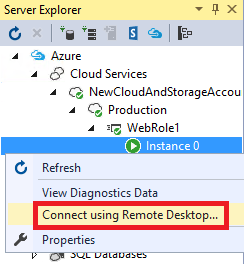

<properties 
pageTitle="Activer la connexion Bureau à distance pour un rôle dans les Services en nuage Azure" 
description="Comment configurer votre application de service cloud azure pour autoriser les connexions Bureau à distance" 
services="cloud-services" 
documentationCenter="" 
authors="sbtron" 
manager="timlt" 
editor=""/>
<tags 
ms.service="cloud-services" 
ms.workload="tbd" 
ms.tgt_pltfrm="na" 
ms.devlang="na" 
ms.topic="article" 
ms.date="02/17/2016" 
ms.author="saurabh"/>

# <a name="enable-remote-desktop-connection-for-a-role-in-azure-cloud-services"></a>Activer la connexion Bureau à distance pour un rôle dans les Services en nuage Azure

>[AZURE.SELECTOR]
- [Portail classique Azure](cloud-services-role-enable-remote-desktop.md)
- [PowerShell](cloud-services-role-enable-remote-desktop-powershell.md)
- [Visual Studio](../vs-azure-tools-remote-desktop-roles.md)


Bureau à distance vous permet d’accéder au bureau d’un rôle en cours d’exécution dans Azure. Vous pouvez utiliser une connexion Bureau à distance pour résoudre les problèmes et diagnostiquer les problèmes avec votre application en cours d’exécution. 

Vous pouvez activer une connexion Bureau à distance dans votre rôle pendant le développement en incluant les modules de bureau à distance dans la définition de votre service ou vous pouvez choisir d’activer Bureau à distance via l’Extension de bureau à distance. L’approche par défaut consiste à utiliser l’extension de bureau à distance que vous pouvez activer Bureau à distance même une fois que l’application est déployée sans avoir à redéployez votre application. 


## <a name="configure-remote-desktop-from-the-azure-classic-portal"></a>Configurer le Bureau à distance à partir du portail classique Azure
Le portail classique Azure utilise l’approche Extension Bureau à distance afin de l’activer Bureau à distance même une fois que l’application est déployée. Activer le Bureau à distance, modifiez le compte d’administrateur local utilisé pour se connecter aux machines virtuelles vous permet de la page **configuration** de votre service cloud, le certificat utilisé dans l’authentification et définie la date d’expiration. 


1. Cliquez sur **Services de Cloud**et cliquez sur le nom du service cloud, puis cliquez sur **configurer**.

2. Cliquez sur **à distance**.
    
    
    
    > [AZURE.WARNING] Toutes les instances de rôle seront redémarrés lorsque vous tout d’abord activez Bureau à distance et cliquez sur OK (coche). Pour éviter le redémarrage, le certificat utilisé pour chiffrer le mot de passe doit être installé sur le rôle. Pour éviter un redémarrage [télécharger un certificat pour le service cloud](cloud-services-how-to-create-deploy/#how-to-upload-a-certificate-for-a-cloud-service) , puis revenez à cette boîte de dialogue.
    

3. Dans **les rôles**, sélectionnez le rôle que vous souhaitez mettre à jour ou sélectionner **tout** pour tous les rôles.

4. Apportez les modifications suivantes :
    
    - Pour activer le Bureau à distance, activez la case à cocher **Activer le Bureau à distance** . Pour désactiver le Bureau à distance, désactivez la case à cocher.
    
    - Créer un compte à utiliser dans les connexions de bureau à distance vers les instances de rôle.
    
    - Mettre à jour le mot de passe du compte existant.
    
    - Sélectionnez un certificat de télécharger à utiliser pour l’authentification (charger le certificat à l’aide de **Télécharger** dans la page **certificats** ) ou créer un nouveau certificat. 
    
    - Modifiez la date d’expiration pour la configuration du Bureau à distance.

5. Lorsque vous avez terminé vos mises à jour de configuration, cliquez sur **OK** (coche).


## <a name="remote-into-role-instances"></a>Distance en instances de rôle
Une fois que le Bureau à distance est activé sur les rôles vous pouvez à distance dans une instance de rôle via divers outils.

Se connecter à une instance de rôle à partir du portail classique Azure :
    
  1.   Cliquez sur **Instances** pour ouvrir la page **Instances** .
  2.   Sélectionnez une instance de rôle qui a configuré de bureau à distance.
  3.   Cliquez sur **se connecter**, puis suivez les instructions pour ouvrir l’application de bureau. 
  4.   Cliquez sur **Ouvrir** , puis sur **se connecter** pour démarrer la connexion Bureau à distance. 


### <a name="use-visual-studio-to-remote-into-a-role-instance"></a>Utilisez Visual Studio pour distant dans une instance de rôle

Dans Visual Studio, Explorateur de serveurs :

1. Développer la **Azure\\Services Cloud\\[nom du service cloud]** nœud.
2. Développez **intermédiaire** ou **Production**.
3. Développez le rôle individuel.
4. Avec le bouton droit des instances de rôle et cliquez sur **se connecter à l’aide de bureau à distance...**, puis entrez le nom d’utilisateur et mot de passe. 




### <a name="use-powershell-to-get-the-rdp-file"></a>Utiliser PowerShell pour obtenir le fichier RDP
Vous pouvez utiliser l’applet de commande [Get-AzureRemoteDesktopFile](https://msdn.microsoft.com/library/azure/dn495261.aspx) pour extraire le fichier RDP. Vous pouvez ensuite utiliser le fichier RDP connexion Bureau à distance pour accéder au service cloud.

### <a name="programmatically-download-the-rdp-file-through-the-service-management-rest-api"></a>Par programme télécharger le fichier RDP via l’API REST de gestion de Service
Vous pouvez utiliser l’opération de reste de [Télécharger le fichier RDP](https://msdn.microsoft.com/library/jj157183.aspx) à télécharger le fichier RDP. 


## <a name="to-configure-remote-desktop-in-the-service-definition-file"></a>Pour configurer le Bureau à distance dans le fichier de définition de service

Cette méthode vous permet d’activer Bureau à distance pour l’application pendant le développement. Cette approche nécessite que les mots de passe chiffrés stocké dans votre configuration du service de fichier et des mises à jour à la configuration du Bureau à distance verser une confier de l’application. Si vous voulez éviter ces inconvénients, vous devez utiliser l’approche d’extension de bureau à distance en fonction décrite ci-dessus.  

Vous pouvez utiliser Visual Studio pour [activer une connexion Bureau à distance](../vs-azure-tools-remote-desktop-roles.md) à l’aide de l’approche de fichier de définition de service.  
Les étapes suivantes décrivent les modifications nécessaires aux fichiers de modèle du service pour activer le Bureau à distance. Visual Studio s’effectue automatiquement ces modifications lors de la publication.

### <a name="set-up-the-connection-in-the-service-model"></a>Configurer la connexion dans le modèle de service 
Utilisez l’élément **importation** pour importer le module **d’accès à distance** et le module **RemoteForwarder** dans le fichier [ServiceDefinition.csdef](cloud-services-model-and-package.md#csdef) .

Le fichier de définition de service doit être identique à l’exemple suivant sur la `<Imports>` élément ajouté.

```xml
<ServiceDefinition name="<name-of-cloud-service>" xmlns="http://schemas.microsoft.com/ServiceHosting/2008/10/ServiceDefinition" schemaVersion="2013-03.2.0">
    <WebRole name="WebRole1" vmsize="Small">
        <Sites>
            <Site name="Web">
                <Bindings>
                    <Binding name="Endpoint1" endpointName="Endpoint1" />
                </Bindings>
            </Site>
        </Sites>
        <Endpoints>
            <InputEndpoint name="Endpoint1" protocol="http" port="80" />
        </Endpoints>
        <Imports>
            <Import moduleName="Diagnostics" />
            <Import moduleName="RemoteAccess" />
            <Import moduleName="RemoteForwarder" />
        </Imports>
    </WebRole>
</ServiceDefinition>
```
Le fichier [ServiceConfiguration.cscfg](cloud-services-model-and-package.md#cscfg) doit être similaire à l’exemple suivant, notez la `<ConfigurationSettings>` et `<Certificates>` éléments. Le certificat spécifié doit être [téléchargé dans le service cloud](../cloud-services-how-to-create-deploy.md#how-to-upload-a-certificate-for-a-cloud-service).

```xml
<?xml version="1.0" encoding="utf-8"?>
<ServiceConfiguration serviceName="<name-of-cloud-service>" xmlns="http://schemas.microsoft.com/ServiceHosting/2008/10/ServiceConfiguration" osFamily="3" osVersion="*" schemaVersion="2013-03.2.0">
    <Role name="WebRole1">
        <Instances count="2" />
        <ConfigurationSettings>
            <Setting name="Microsoft.WindowsAzure.Plugins.RemoteAccess.Enabled" value="true" />
            <Setting name="Microsoft.WindowsAzure.Plugins.RemoteAccess.AccountUsername" value="[name-of-user-account]" />
            <Setting name="Microsoft.WindowsAzure.Plugins.RemoteAccess.AccountEncryptedPassword" value="[base-64-encrypted-user-password]" />
            <Setting name="Microsoft.WindowsAzure.Plugins.RemoteAccess.AccountExpiration" value="[certificate-expiration]" />
            <Setting name="Microsoft.WindowsAzure.Plugins.RemoteForwarder.Enabled" value="true" />
        </ConfigurationSettings>
        <Certificates>
            <Certificate name="Microsoft.WindowsAzure.Plugins.RemoteAccess.PasswordEncryption" thumbprint="[certificate-thumbprint]" thumbprintAlgorithm="sha1" />
        </Certificates>
    </Role>
</ServiceConfiguration>
```


## <a name="additional-resources"></a>Ressources supplémentaires

[Comment faire pour configurer les Services en nuage](cloud-services-how-to-configure.md)