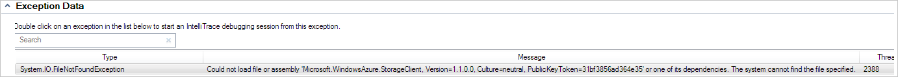

<properties
   pageTitle="Résoudre les problèmes de rôles qui ne parviennent pas à démarrer | Microsoft Azure"
   description="Voici quelques raisons courantes pourquoi un rôle Service Cloud peut ne pas démarrer. Solutions à ces problèmes sont également disponibles."
   services="cloud-services"
   documentationCenter=""
   authors="simonxjx"
   manager="felixwu"
   editor=""
   tags="top-support-issue"/>
<tags
   ms.service="cloud-services"
   ms.devlang="na"
   ms.topic="article"
   ms.tgt_pltfrm="na"
   ms.workload="tbd"
   ms.date="09/02/2016"
   ms.author="v-six" />

# <a name="troubleshoot-cloud-service-roles-that-fail-to-start"></a>Résolution des rôles de Service de nuage qui ne parviennent pas à démarrer

Voici quelques problèmes courants et solutions liés aux Services Cloud Azure rôles qui ne parviennent pas à démarrer.

[AZURE.INCLUDE [support-disclaimer](../../includes/support-disclaimer.md)]

## <a name="missing-dlls-or-dependencies"></a>DLL manquantes ou les dépendances

Rôles ne répond pas et rôles cycle entre **initialisation**, **occupé (e)**et les états **arrêt** peuvent être due à DLL manquants ou assemblys.

Problèmes de manque DLL ou assemblys peuvent être :

- Votre instance de rôle est parcourant **initialisation**, **occupé (e)**et des États **d’arrêt** .
- Votre instance de rôle a été déplacé vers **prêt** , mais si vous accédez à votre application web, la page n’apparaît pas.

Il existe plusieurs méthodes recommandées pour rechercher les ces problèmes.

## <a name="diagnose-missing-dll-issues-in-a-web-role"></a>Diagnostiquer les problèmes de mise en registre manquants dans un rôle web

Lorsque vous naviguez vers un site Web qui est déployé sur un site web de rôle et le navigateur affiche une erreur de serveur semblable à ce qui suit, il peut indiquer qu’il manque une DLL.


## <a name="diagnose-issues-by-turning-off-custom-errors"></a>Diagnostiquer les problèmes en désactivant les erreurs personnalisées

Obtenir des informations plus complètes d’erreur peuvent être affichées en configurant le fichier web.config pour le rôle web définir le mode d’erreur personnalisée sur Désactiver et redéployez le service.

Pour afficher les erreurs plus complètes sans l’aide du Bureau à distance :

1. Ouvrez la solution dans Microsoft Visual Studio.

2. Dans l' **Explorateur de solutions**, recherchez-le et ouvrez-le.

3. Dans le fichier web.config, recherchez la section system.web et ajoutez la ligne suivante :

    ```xml
    <customErrors mode="Off" />
    ```

4. Enregistrez le fichier.

5. Réorganiser et redéployez le service.

Une fois que le service est redéployé, vous verrez un message d’erreur avec le nom de l’ensemble ou la DLL manquant.

## <a name="diagnose-issues-by-viewing-the-error-remotely"></a>Diagnostiquer les problèmes en affichant l’erreur à distance

Vous pouvez utiliser Bureau à distance pour accéder au rôle et afficher des informations plus complètes sur les erreurs à distance. Utilisez les étapes suivantes pour afficher les erreurs à l’aide de bureau à distance :

1. Assurez-vous que SDK Azure 1.3 ou version ultérieure est installé.

2. Lors du déploiement de la solution à l’aide de Visual Studio, sélectionnez « Configurer connexions Bureau à distance... ». Pour plus d’informations sur la configuration de la connexion Bureau à distance, voir [Bureau à distance à l’aide des rôles Azure](../vs-azure-tools-remote-desktop-roles.md).

3. Dans le portail classique de Microsoft Azure, une fois que l’instance affiche l’état **prêt**, cliquez sur une des instances de rôle.

4. Cliquez sur l’icône de **se connecter** dans la zone **D’accès à distance** du ruban.

5. Se connecter à la machine virtuelle en utilisant les informations d’identification qui a été spécifiées lors de la configuration du Bureau à distance.

6. Ouvrez une fenêtre de commande.

7. Type de `IPconfig`.

8. Notez la valeur adresse IPV4.

9. Ouvrez Internet Explorer.

10. Tapez l’adresse et le nom de l’application web. Par exemple, `http://<IPV4 Address>/default.aspx`.

Naviguer vers le site Web retournera désormais des messages d’erreur plus explicites :

* Erreur du serveur dans l’Application '/'.

* Description : Une exception non gérée lors de l’exécution de la requête web actuelle. Veuillez consulter la trace de la pile pour plus d’informations sur l’erreur et où elle a été créée dans le code.

* Détails de l’exception : System.IO.FIleNotFoundException : Impossible de charger fichier ou assembly ' Microsoft.WindowsAzure.StorageClient, Version = 1.1.0.0, Culture = neutre, PublicKeyToken = 31bf856ad364e35' ou une de ses dépendances. Le système ne trouve pas le fichier spécifié.

Par exemple :


## <a name="diagnose-issues-by-using-the-compute-emulator"></a>Diagnostiquer les problèmes à l’aide de l’émulateur de calcul

Vous pouvez utiliser l’émulateur cluster Microsoft Azure pour diagnostiquer et résoudre les problèmes de dépendances et erreurs web.config manquants.

Pour optimiser les résultats à l’aide de cette méthode de diagnostic, vous devez utiliser un ordinateur ou un ordinateur virtuel qui contient une nouvelle installation de Windows. Pour mieux simuler l’environnement Azure, utilisez Windows Server 2008 R2 x64.

1. Installer la version autonome du [Kit de développement logiciel Azure](https://azure.microsoft.com/downloads/).

2. Sur l’ordinateur de développement, générez le projet de service cloud.

3. Dans l’Explorateur Windows, accédez au dossier bin\debug du projet de service cloud.

4. Copiez le fichier de dossier et .cscfg .csx à l’ordinateur que vous utilisez pour déboguer les problèmes.

5. Sur l’ordinateur EPURAGE, ouvrez une fenêtre d’invite de commande Azure SDK et tapez `csrun.exe /devstore:start`.

6. À l’invite de commandes, tapez `run csrun <path to .csx folder> <path to .cscfg file> /launchBrowser`.

7. Lorsque le rôle démarre, vous verrez des informations détaillées dans Internet Explorer. Vous pouvez également utiliser les outils de résolution des problèmes de Windows standards pour essayer de résoudre le problème.

## <a name="diagnose-issues-by-using-intellitrace"></a>Diagnostiquer les problèmes à l’aide de IntelliTrace

Pour le travail et les rôles web qui utilisent .NET Framework 4, vous pouvez utiliser [IntelliTrace](https://msdn.microsoft.com/library/dd264915.aspx), qui est disponible dans [Microsoft Visual Studio intégrale](https://www.visualstudio.com/products/visual-studio-ultimate-with-MSDN-vs).

Suivez ces étapes pour déployer le service avec IntelliTrace est activé :

1. Vérifiez que le Kit de développement Azure 1.3 ou version ultérieure est installé.

2. Déployer la solution à l’aide de Visual Studio. Au cours du déploiement, cochez la case **Activer IntelliTrace pour les rôles .NET 4** .

3. Une fois que l’instance démarre, ouvrez l' **Explorateur de serveurs**.

4. Développer la **Azure\\Services Cloud** nœud et recherchez le déploiement.

5. Développez le déploiement jusqu'à ce que vous voyiez instances de rôle. Un clic droit sur une des instances.

6. Sélectionnez **les fichiers journaux IntelliTrace affichage**. **Résumé IntelliTrace** s’ouvre.

7. Recherchez la section exceptions du résumé. S’il existe des exceptions, la section s’intitule **Données d’Exception**.

8. Développer les **Données d’Exception** et recherchez les erreurs **System.IO.FileNotFoundException** semblables à ce qui suit :



## <a name="address-missing-dlls-and-assemblies"></a>Adresse DLL et assemblys manquants

Pour répondre à DLL manquante et les erreurs d’assemblage, procédez comme suit :

1. Ouvrez la solution dans Visual Studio.

2. Dans l' **Explorateur de solutions**, ouvrez le dossier **références** .

3. Cliquez sur l’assembly identifié dans l’erreur.

4. Dans le volet **Propriétés** , recherchez la **propriété copie locale** et affectez la valeur **True**.

5. Redéployez le service cloud.

Une fois que vous avez vérifié que toutes les erreurs ont été résolus, vous pouvez déployer le service sans cochant la case à cocher **Activer IntelliTrace pour les rôles .NET 4** .

## <a name="next-steps"></a>Étapes suivantes

Afficher d’autres [articles de résolution des problèmes](https://azure.microsoft.com/documentation/articles/?tag=top-support-issue&product=cloud-services) pour les services en nuage.

Pour savoir comment résoudre les problèmes de rôle de service cloud à l’aide de données de diagnostic Azure PaaS ordinateur, voir [la série de Kevin Williamson blog](http://blogs.msdn.com/b/kwill/archive/2013/08/09/windows-azure-paas-compute-diagnostics-data.aspx).
