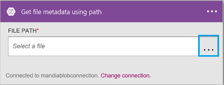

<properties
    pageTitle="Ajouter du stockage d’objets blob Azure connecteur dans vos applications logique | Microsoft Azure"
    description="Vue d’ensemble du stockage d’objets blob Azure connecteur avec des paramètres de l’API REST"
    services=""
    documentationCenter="" 
    authors="MandiOhlinger"
    manager="anneta"
    editor=""
    tags="connectors"/>

<tags
   ms.service="logic-apps"
   ms.devlang="na"
   ms.topic="article"
   ms.tgt_pltfrm="na"
   ms.workload="integration" 
   ms.date="10/18/2016"
   ms.author="mandia"/>

# Prise en main du connecteur de stockage blob Azure
Stockage d’objets Blob Azure est un service de stockage de grandes quantités de données non structurées. Effectuer différentes actions comme téléchargement, mettre à jour, obtenir et supprimer des objets BLOB dans le stockage blob Azure. 

Avec le stockage blob Azure, vous :

- Créer votre flux de travail en téléchargeant des nouveaux projets ou l’obtention de fichiers qui ont été mis à jour récemment.
- Utiliser les actions pour obtenir des métadonnées d’un fichier, supprimer un fichier et copier des fichiers. Par exemple, un outil de mise à jour dans un site web Azure (un déclencheur), puis mettez à jour un fichier dans le stockage blob (une action). 

Cette rubrique vous montre comment utiliser le lien de stockage blob dans une application logique et également répertorie les actions.

>[AZURE.NOTE] Cette version de l’article s’applique aux officielle applications logique (disponible). 

Pour en savoir plus sur les applications logique, voir [Quels sont les applications logique](../app-service-logic/app-service-logic-what-are-logic-apps.md) et [créer une application logique](../app-service-logic/app-service-logic-create-a-logic-app.md).

## Se connecter au stockage blob Azure

Avant que votre application logique peut accéder à n’importe quel service, vous créez tout d’abord une *connexion* au service. Une connexion assure la connectivité entre une application logique et un autre service. Par exemple, pour vous connecter à un compte de stockage, il vous tout d’abord de créer une *connexion*du stockage blob. Pour créer une connexion, entrez les informations d’identification que vous utilisez normalement pour accéder au service que vous vous connectez à. Ainsi, avec le stockage Azure, entrez les informations d’identification à votre compte de stockage pour créer la connexion. 

#### Créer la connexion

>[AZURE.INCLUDE [Create a connection to Azure blob storage](../../includes/connectors-create-api-azureblobstorage.md)]
 
## Utilisation d’un déclencheur

Ce connecteur n’a pas de déclencheurs. Utiliser d’autres déclencheurs pour démarrer l’application logique, par exemple un déclencheur périodicité, un déclencheur d’HTTP Webhook, déclencheurs disponibles avec les autres connecteurs et bien plus encore. [Créer une application logique](../app-service-logic/app-service-logic-create-a-logic-app.md) fournit un exemple.

## Utiliser une action
    
Une action est une opération effectuée par le flux de travail définie dans une application logique.

1. Sélectionnez le signe plus. Vous voyez plusieurs choix : **Ajouter une action**, **Ajouter une condition**ou l’une des options **supplémentaires** .

    

2. Cliquez sur **Ajouter une action**.

3. Dans la zone de texte, tapez « blob » pour obtenir une liste de toutes les actions disponibles.

     

4. Dans notre exemple, choisissez **AzureBlob - obtenir des métadonnées de fichier à l’aide du chemin d’accès**. Si une connexion existe déjà, puis sélectionnez le bouton **...** Bouton (Afficher sélecteur) pour sélectionner un fichier.

    

    Si vous êtes invité aux informations de connexion, puis entrez les détails pour créer la connexion. [Créer la connexion](connectors-create-api-azureblobstorage.md#create-the-connection) dans cette rubrique décrit ces propriétés. 

    > [AZURE.NOTE] Dans cet exemple, nous obtenir les métadonnées d’un fichier. Pour voir les métadonnées, ajoutez une autre action qui crée un nouveau fichier à l’aide d’un autre connecteur. Par exemple, ajoutez une action OneDrive qui crée un nouveau fichier « tester » basé sur les métadonnées. 

5. **Enregistrer** vos modifications (coin supérieur gauche de la barre d’outils). Votre application logique est enregistrée et peut être activée automatiquement.

> [AZURE.TIP] [Explorateur de stockage](http://storageexplorer.com/) est un excellent outil pour gérer plusieurs comptes de stockage.

## Détails techniques

## Actions du stockage Blob

|Action|Description|
|--- | ---|
|[Obtenir des métadonnées de fichier](connectors-create-api-azureblobstorage.md#get-file-metadata)|Cette opération Obtient les métadonnées de fichier à l’aide des id de fichier.|
|[Fichier de mise à jour](connectors-create-api-azureblobstorage.md#update-file)|Cette opération met à jour un fichier.|
|[Supprimer le fichier](connectors-create-api-azureblobstorage.md#delete-file)|Cette opération supprime un fichier.|
|[Obtenir les métadonnées de fichier à l’aide de chemin d’accès](connectors-create-api-azureblobstorage.md#get-file-metadata-using-path)|Cette opération Obtient les métadonnées de fichier en utilisant le chemin d’accès.|
|[Obtenir le contenu du fichier à l’aide du chemin d’accès](connectors-create-api-azureblobstorage.md#get-file-content-using-path)|Cette opération Obtient le contenu du fichier en utilisant le chemin d’accès.|
|[Obtenir le contenu d’un fichier](connectors-create-api-azureblobstorage.md#get-file-content)|Cette opération Obtient le contenu du fichier à l’aide des id.|
|[Créer le fichier](connectors-create-api-azureblobstorage.md#create-file)|Cette opération télécharge un fichier.|
|[Copier un fichier](connectors-create-api-azureblobstorage.md#copy-file)|Cette opération copie un fichier de stockage d’objets Blob Azure.|
|[Extraire archive au dossier](connectors-create-api-azureblobstorage.md#extract-archive-to-folder)|Cette opération extrait un fichier d’archive vers un dossier (exemple : .zip).|

### Détails de l’action

Dans cette section, voir les détails relatifs à chaque action, y compris les propriétés d’entrée obligatoire ou facultatives et aucun résultat correspondant associé au connecteur.

#### Obtenir des métadonnées de fichier
Cette opération Obtient les métadonnées de fichier à l’aide des id de fichier.  

|Nom de la propriété| Nom d’affichage|Description|
| ---|---|---|
|ID *|Fichier|Sélectionner un fichier|

Un astérisque (*) signifie que la propriété est requise.

##### Détails de sortie
BlobMetadata

| Nom de la propriété | Type de données |
|---|---|
|ID|chaîne|
|Nom|chaîne|
|Nom complet|chaîne|
|Chemin d’accès|chaîne|
|LastModified|chaîne|
|Taille|nombre entier|
|MediaType|chaîne|
|IsFolder|valeur booléenne|
|ETag|chaîne|
|FileLocator|chaîne|

#### Fichier de mise à jour
Cette opération met à jour un fichier.  

|Nom de la propriété| Nom d’affichage|Description|
| ---|---|---|
|ID *|Fichier|Sélectionner un fichier|
|corps *|Contenu du fichier|Contenu du fichier à mettre à jour|

Un astérisque (*) signifie que la propriété est requise.

##### Détails de sortie
BlobMetadata

| Nom de la propriété | Type de données |
|---|---|
|ID|chaîne|
|Nom|chaîne|
|Nom complet|chaîne|
|Chemin d’accès|chaîne|
|LastModified|chaîne|
|Taille|nombre entier|
|MediaType|chaîne|
|IsFolder|valeur booléenne|
|ETag|chaîne|
|FileLocator|chaîne|

#### Supprimer le fichier
Cette opération supprime un fichier.  

|Nom de la propriété| Nom d’affichage|Description|
| ---|---|---|
|ID *|Fichier|Sélectionner un fichier|

Un astérisque (*) signifie que la propriété est requise.

##### Détails de sortie
Aucun.

#### Obtenir les métadonnées de fichier à l’aide de chemin d’accès
Cette opération Obtient les métadonnées de fichier en utilisant le chemin d’accès.  

|Nom de la propriété| Nom d’affichage|Description|
| ---|---|---|
|chemin d’accès *|Chemin de fichier|Sélectionner un fichier|

Un astérisque (*) signifie que la propriété est requise.

##### Détails de sortie
BlobMetadata

| Nom de la propriété | Type de données |
|---|---|
|ID|chaîne|
|Nom|chaîne|
|Nom complet|chaîne|
|Chemin d’accès|chaîne|
|LastModified|chaîne|
|Taille|nombre entier|
|MediaType|chaîne|
|IsFolder|valeur booléenne|
|ETag|chaîne|
|FileLocator|chaîne|

#### Obtenir le contenu du fichier à l’aide du chemin d’accès
Cette opération Obtient le contenu du fichier en utilisant le chemin d’accès.  

|Nom de la propriété| Nom d’affichage|Description|
| ---|---|---|
|chemin d’accès *|Chemin de fichier|Sélectionner un fichier|

Un astérisque (*) signifie que la propriété est requise.

##### Détails de sortie
Aucun.

#### Obtenir le contenu d’un fichier
Cette opération Obtient le contenu du fichier à l’aide des id.  

|Nom de la propriété| Type de données|Description|
| ---|---|---|
|ID *|chaîne|Sélectionner un fichier|

Un astérisque (*) signifie que la propriété est requise.

##### Détails de sortie
Aucun.

#### Créer le fichier
Cette opération télécharge un fichier.  

|Nom de la propriété| Nom d’affichage|Description|
| ---|---|---|
|folderPath *|Chemin d’accès de dossier|Sélectionnez un dossier|
|nom *|Nom de fichier|Nom du fichier à télécharger|
|corps *|Contenu du fichier|Contenu du fichier à télécharger|

Un astérisque (*) signifie que la propriété est requise.

##### Détails de sortie
BlobMetadata

| Nom de la propriété | Type de données | 
|---|---|
|ID|chaîne|
|Nom|chaîne|
|Nom complet|chaîne|
|Chemin d’accès|chaîne|
|LastModified|chaîne|
|Taille|nombre entier|
|MediaType|chaîne|
|IsFolder|valeur booléenne|
|ETag|chaîne|
|FileLocator|chaîne|

#### Copier un fichier
Cette opération copie un fichier de stockage d’objets Blob Azure.  

|Nom de la propriété| Nom d’affichage|Description|
| ---|---|---|
|source *|Url de la source|Spécifiez l’URL d’accès au fichier source|
|destination *|Chemin d’accès du fichier de destination|Spécifiez le chemin du fichier de destination, y compris le nom de fichier cible|
|remplacer|Remplacer ?|Doit un fichier de destination existant être remplacé (vrai/faux) ?  |

Un astérisque (*) signifie que la propriété est requise.

##### Détails de sortie
BlobMetadata

| Nom de la propriété | Type de données |
|---|---|
|ID|chaîne|
|Nom|chaîne|
|Nom complet|chaîne|
|Chemin d’accès|chaîne|
|LastModified|chaîne|
|Taille|nombre entier|
|MediaType|chaîne|
|IsFolder|valeur booléenne|
|ETag|chaîne|
|FileLocator|chaîne|

#### Extraire archive au dossier
Cette opération extrait un fichier d’archive vers un dossier (exemple : .zip).  

|Nom de la propriété| Nom d’affichage|Description|
| ---|---|---|
|source *|Chemin de fichier d’archive source|Sélectionnez un fichier d’archive|
|destination *|Chemin d’accès du dossier de destination|Sélectionner le contenu à extraire|
|remplacer|Remplacer ?|Doit un fichier de destination existant être remplacé (vrai/faux) ?|

Un astérisque (*) signifie que la propriété est requise.

##### Détails de sortie
BlobMetadata

| Nom de la propriété | Type de données |
|---|---|
|ID|chaîne|
|Nom|chaîne|
|Nom complet|chaîne|
|Chemin d’accès|chaîne|
|LastModified|chaîne|
|Taille|nombre entier|
|MediaType|chaîne|
|IsFolder|valeur booléenne|
|ETag|chaîne|
|FileLocator|chaîne|

## Réponses HTTP

Lorsque vous appelez les différentes actions, vous pouvez obtenir certaines réponses. Le tableau suivant présente les réponses et leur description :  

|Nom|Description|
|---|---|
|200|Bien|
|202|Accepté|
|400|Demande incorrecte|
|401|Non autorisé|
|403|Interdit|
|404|Introuvable|
|500|Erreur interne du serveur. Erreur inconnue|
|par défaut|Échoué de l’opération.|

## Étapes suivantes

[Créer une application logique](../app-service-logic/app-service-logic-create-a-logic-app.md). Découvrir les autres connecteurs disponibles dans les applications logique auprès de notre [liste API](apis-list.md).

