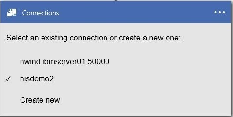
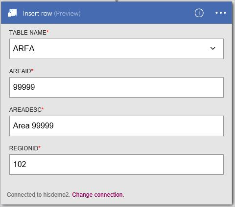
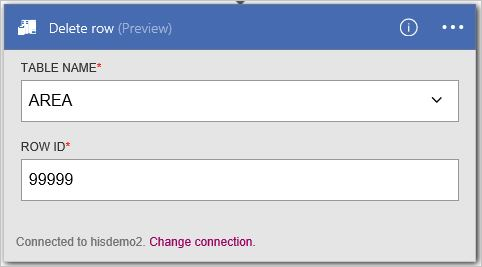

<properties
    pageTitle="Ajouter le lien DB2 dans vos applications logique | Microsoft Azure"
    description="Vue d’ensemble du connecteur DB2 avec des paramètres de l’API REST"
    services=""
    documentationCenter="" 
    authors="gplarsen"
    manager="erikre"
    editor=""
    tags="connectors"/>

<tags
   ms.service="logic-apps"
   ms.devlang="na"
   ms.topic="article"
   ms.tgt_pltfrm="na"
   ms.workload="integration" 
   ms.date="09/26/2016"
   ms.author="plarsen"/>

# Prise en main du connecteur DB2
Connecteur Microsoft pour DB2 connecte applications logique aux ressources stockées dans une base de données IBM DB2. Ce connecteur inclut un client Microsoft pour communiquer avec les serveurs DB2 à distance sur un réseau TCP/IP. Cela inclut les bases de données cloud, tel que dashDB IBM Bluemix ou IBM DB2 pour Windows en cours d’exécution en matière de virtualisation Azure et des bases de données à l’aide de la passerelle de données locale local. Voir la [prise en charge de la liste](connectors-create-api-db2.md#supported-db2-platforms-and-versions) des plates-formes IBM DB2 et des versions (dans cette rubrique).

>[AZURE.NOTE] Cette version de l’article s’applique aux officielle applications logique (disponible). 

Le connecteur DB2 prend en charge les opérations de base de données suivantes :

- Tables de base de données de liste
- Lire une seule ligne à l’aide de la sélection
- Lire toutes les lignes à l’aide de la sélection
- Ajouter une ligne à l’aide d’insertion
- Modifier une seule ligne à l’aide de la mise à jour
- Supprimer une seule ligne à l’aide de supprimer

Cette rubrique vous montre comment utiliser le lien dans une application logique à des opérations de base de données de processus.

Pour en savoir plus sur les applications logique, voir [créer une application logique](../app-service-logic/app-service-logic-create-a-logic-app.md).

## Actions disponibles
Le connecteur DB2 prend en charge les actions d’application logique suivants :

- GetTables
- GetRow
- GetRows
- InsertRow
- UpdateRow
- DeleteRow

## Liste des tables
Créer une application logique pour toutes les opérations se compose de plusieurs étapes effectuées par le biais du portail Microsoft Azure.

Dans l’application logique, vous pouvez ajouter une action à répertorier les tables dans une base de données DB2. L’action indique le connecteur à traiter une instruction de schéma DB2, tel que `CALL SYSIBM.SQLTABLES`.

### Créer une application de logique
1.  Dans la zone **Azure démarrer carte**, sélectionnez **+** (signe plus), **Web + Mobile**, puis **Application logique**.
2.  Entrez le **nom**, tel que `Db2getTables`, **abonnement**, le **groupe de ressources**, **emplacement**et le **Plan de Service d’application**. Sélectionnez **Ajouter au tableau de bord**, puis **créer**.

### Ajouter un déclencheur et une action
1.  Dans le **Concepteur d’applications logique**, sélectionnez **LogicApp vide** dans la liste de **modèles** .
2.  Dans la liste de **déclencheurs** , sélectionnez **périodicité**. 
3.  Dans le déclencheur **périodicité** , sélectionnez **Modifier**, sélectionnez **fréquence** liste déroulante pour sélectionner le **jour**et définissez l' **intervalle** à tapez **7**.  
4.  Activez la case **+ nouvelle étape** , puis sur **Ajouter une action**.
5.  Dans la liste **d’actions** , tapez `db2` dans la **recherche pour plus d’actions** de la zone d’édition, puis sélectionnez **DB2 - obtenir des tables (Preview)**.

      

6.  Dans le volet de configuration **DB2 - obtenir des tables** , sélectionnez la **case à cocher** pour activer la **connexion via une passerelle de données locale**. Remarquez que les paramètres du cloud en local.
    - Tapez la valeur de **serveur**, sous forme de numéro de port deux-points adresse ou un alias. Par exemple, tapez `ibmserver01:50000`.
    - Tapez la valeur de **base de données**. Par exemple, tapez `nwind`.
    - Sélectionner une valeur pour **l’authentification**. Par exemple, sélectionnez de **base**.
    - Tapez la valeur de **nom d’utilisateur**. Par exemple, tapez `db2admin`.
    - Tapez la valeur de **mot de passe**. Par exemple, tapez `Password1`.
    - Sélectionner une valeur pour la **passerelle**. Par exemple, sélectionnez **datagateway01**.
7. Sélectionnez **créer**, puis **Enregistrer**. 

    

8.  Dans la carte **Db2getTables** , dans la liste **tous les s’exécute** sous **Résumé**, sélectionnez l’élément premiers dans la liste (exécuter plus récent).
9.  Dans la carte **logique exécuter l’application** , sélectionnez **Détails de l’exécution**. Dans la liste des **actions** , sélectionnez **Get_tables**. Voir la valeur pour l' **état**, qui doit être **terminé**. Sélectionnez le **lien d’entrées** pour afficher les entrées. Sélectionnez la **sortie lien**et d’afficher les sorties ; qui doit inclure une liste de tables.

    

## Créer les connexions
Ce connecteur prend en charge les connexions de bases de données hébergées en local et dans le cloud à l’aide des propriétés de connexion suivantes. 

Propriété | Description
--- | ---
serveur | Obligatoire. Accepte une valeur de chaîne qui représente une adresse TCP/IP ou alias, au format IPv4 ou IPv6, suivi (séparateur : deux-points) par un numéro de port TCP/IP. 
base de données | Obligatoire. Accepte une valeur de chaîne qui représente un nom de base de données relationnelle (RDBNAM) de DRDA. DB2 pour z/OS accepte une chaîne de 16 octets (base de données est appelée un IBM DB2 pour emplacement z/OS). DB2 pour i5/OS accepte une chaîne de 18 octets (base de données est appelé un IBM DB2 pour i relationnel base de données). DB2 pour LUW accepte une chaîne de 8 octets.
authentification | Facultatif. Accepte une valeur d’élément de liste, Basic ou Windows (kerberos). 
nom d’utilisateur | Obligatoire. Accepte une valeur de chaîne. DB2 pour z/OS accepte une chaîne de 8 octets. DB2 pour i accepte une chaîne de caractères codés sur 10. DB2 pour Linux ou UNIX accepte une chaîne de 8 octets. DB2 pour Windows accepte une chaîne de 30 octets.
mot de passe | Obligatoire. Accepte une valeur de chaîne.
passerelle | Obligatoire. Accepte une valeur d’élément de liste, qui représente la passerelle de données locale définie aux applications logique au sein du groupe de stockage.  

## Créer la locale connexion passerelle
Ce connecteur peut accéder à une base de données locale DB2 à l’aide de la passerelle locale. Afficher les rubriques de passerelle pour plus d’informations. 

1. Dans le volet de configuration de **passerelles** , activez la **case à cocher** pour activer la **connexion via une passerelle**. Remarquez que les paramètres du cloud en local.
2. Tapez la valeur de **serveur**, sous forme de numéro de port deux-points adresse ou un alias. Par exemple, tapez `ibmserver01:50000`.
3. Tapez la valeur de **base de données**. Par exemple, tapez `nwind`.
4. Sélectionner une valeur pour **l’authentification**. Par exemple, sélectionnez de **base**.
5. Tapez la valeur de **nom d’utilisateur**. Par exemple, tapez `db2admin`.
6. Tapez la valeur de **mot de passe**. Par exemple, tapez `Password1`.
7. Sélectionner une valeur pour la **passerelle**. Par exemple, sélectionnez **datagateway01**.
8. Sélectionnez **créer** pour continuer. 

    

## Créer la connexion au cloud
Ce connecteur peut accéder à une base de données cloud DB2. 

1. Dans le volet de configuration de **passerelles** , laissez la **case à cocher** désactivée (pour) **se connecter via une passerelle**. 
2. Tapez la valeur de **nom de la connexion**. Par exemple, tapez `hisdemo2`.
3. Tapez la valeur pour **le nom de serveur DB2**, sous forme de numéro de port deux-points adresse ou un alias. Par exemple, tapez `hisdemo2.cloudapp.net:50000`.
3. Tapez la valeur de **nom de base de données DB2**. Par exemple, tapez `nwind`.
4. Tapez la valeur de **nom d’utilisateur**. Par exemple, tapez `db2admin`.
5. Tapez la valeur de **mot de passe**. Par exemple, tapez `Password1`.
6. Sélectionnez **créer** pour continuer. 

    

## Extraire toutes les lignes à l’aide de la sélection
Vous pouvez définir une action d’application logique pour récupérer toutes les lignes d’une table DB2. Cela indique le connecteur à traiter une instruction SELECT DB2, tel que `SELECT * FROM AREA`.

### Créer une application de logique
1.  Dans la zone **Azure démarrer carte**, sélectionnez **+** (signe plus), **Web + Mobile**, puis **Application logique**.
2.  Entrez le **nom**, tel que `Db2getRows`, **abonnement**, le **groupe de ressources**, **emplacement**et le **Plan de Service d’application**. Sélectionnez **Ajouter au tableau de bord**, puis **créer**.

### Ajouter un déclencheur et une action
1.  Dans le **Concepteur d’applications logique**, sélectionnez **LogicApp vide** dans la liste de **modèles** .
2.  Dans la liste de **déclencheurs** , sélectionnez **périodicité**. 
3.  Dans le déclencheur **périodicité** , sélectionnez **Modifier**, sélectionnez la **fréquence de** liste déroulante pour sélectionner le **jour**, puis **intervalle** taper **7**. 
4.  Activez la case **+ nouvelle étape** , puis sur **Ajouter une action**.
5.  Dans la liste **d’actions** , tapez `db2` dans la **recherche pour plus d’actions** de la zone d’édition et sélectionnez **DB2 - obtenir des lignes (Preview)**.
6. Dans l’action **obtenir lignes (Preview)** , sélectionnez **Modifier la connexion**.
7. Dans le volet de configuration de **connexions** , sélectionnez **Créer nouveau**. 

    
  
8. Dans le volet de configuration de **passerelles** , laissez la **case à cocher** désactivée (pour) **se connecter via une passerelle**.
    - Tapez la valeur de **nom de la connexion**. Par exemple, tapez `HISDEMO2`.
    - Tapez la valeur pour **le nom de serveur DB2**, sous forme de numéro de port deux-points adresse ou un alias. Par exemple, tapez `HISDEMO2.cloudapp.net:50000`.
    - Tapez la valeur de **nom de base de données DB2**. Par exemple, tapez `NWIND`.
    - Tapez la valeur de **nom d’utilisateur**. Par exemple, tapez `db2admin`.
    - Tapez la valeur de **mot de passe**. Par exemple, tapez `Password1`.
9. Sélectionnez **créer** pour continuer.

    

10. Dans la liste **nom de la Table** , sélectionnez **flèche vers le bas**, puis **zone**.
11. Si vous le souhaitez, sélectionnez **Afficher les options avancées** pour spécifier les options de requête.
12. Cliquez sur **Enregistrer**. 

    

13. Dans la carte **Db2getRows** , dans la liste **tous les s’exécute** sous **Résumé**, sélectionnez l’élément premiers dans la liste (exécuter plus récent).
14. Dans la carte **logique exécuter l’application** , sélectionnez **Détails de l’exécution**. Dans la liste des **actions** , sélectionnez **Get_rows**. Voir la valeur pour l' **état**, qui doit être **terminé**. Sélectionnez le **lien d’entrées** pour afficher les entrées. Sélectionnez la **sortie lien**et d’afficher les sorties ; qui doit inclure une liste de lignes.

    

## Ajouter une ligne à l’aide d’insertion
Vous pouvez définir une action d’application logique pour ajouter une ligne dans une table DB2. Cette action indique le connecteur à traiter une instruction INSERT DB2, tel que `INSERT INTO AREA (AREAID, AREADESC, REGIONID) VALUES ('99999', 'Area 99999', 102)`.

### Créer une application de logique
1.  Dans la zone **Azure démarrer carte**, sélectionnez **+** (signe plus), **Web + Mobile**, puis **Application logique**.
2.  Entrez le **nom**, tel que `Db2insertRow`, **abonnement**, le **groupe de ressources**, **emplacement**et le **Plan de Service d’application**. Sélectionnez **Ajouter au tableau de bord**, puis **créer**.

### Ajouter un déclencheur et une action
1.  Dans le **Concepteur d’applications logique**, sélectionnez **LogicApp vide** dans la liste de **modèles** .
2.  Dans la liste de **déclencheurs** , sélectionnez **périodicité**. 
3.  Dans le déclencheur **périodicité** , sélectionnez **Modifier**, sélectionnez la **fréquence de** liste déroulante pour sélectionner le **jour**, puis **intervalle** taper **7**. 
4.  Activez la case **+ nouvelle étape** , puis sur **Ajouter une action**.
5.  Dans la liste **d’actions** , tapez **db2** dans la zone d’édition **Recherchez plus d’actions** , puis sélectionnez **DB2 - insérer une ligne (Preview)**.
6. Dans l’action **obtenir lignes (Preview)** , sélectionnez **Modifier la connexion**. 
7. Dans le volet de configuration de **connexions** , sélectionnez une connexion. Par exemple, sélectionnez **hisdemo2**.

    

8. Dans la liste **nom de la Table** , sélectionnez **flèche vers le bas**, puis **zone**.
9. Entrez des valeurs pour toutes les colonnes (voir l’astérisque rouge). Par exemple, tapez `99999` pour **AREAID**, tapez `Area 99999`et le type `102` pour **REGIONID**. 
10. Cliquez sur **Enregistrer**.

    
 
11. Dans la carte **Db2insertRow** , dans la liste **tous les s’exécute** sous **Résumé**, sélectionnez l’élément premiers dans la liste (exécuter plus récent).
12. Dans la carte **logique exécuter l’application** , sélectionnez **Détails de l’exécution**. Dans la liste des **actions** , sélectionnez **Get_rows**. Voir la valeur pour l' **état**, qui doit être **terminé**. Sélectionnez le **lien d’entrées** pour afficher les entrées. Sélectionnez la **sortie lien**et d’afficher les sorties ; qui doit inclure la nouvelle ligne.

    

## Récupérer une seule ligne à l’aide de la sélection
Vous pouvez définir une action d’application logique pour récupérer une seule ligne dans une table DB2. Cette action indique le connecteur à traiter une instruction DB2 sélectionnez où, tel que `SELECT FROM AREA WHERE AREAID = '99999'`.

### Créer une application de logique
1.  Dans la zone **Azure démarrer carte**, sélectionnez **+** (signe plus), **Web + Mobile**, puis **Application logique**.
2.  Entrez le **nom** (par exemple, «**Db2getRow**»), **abonnement**, **groupe de ressources**, **emplacement**et **Plan de Service d’application**. Sélectionnez **Ajouter au tableau de bord**, puis **créer**.

### Ajouter un déclencheur et une action
1.  Dans le **Concepteur d’applications logique**, sélectionnez **LogicApp vide** dans la liste de **modèles** . 
2.  Dans la liste de **déclencheurs** , sélectionnez **périodicité**. 
3.  Dans le déclencheur **périodicité** , sélectionnez **Modifier**, sélectionnez la **fréquence de** liste déroulante pour sélectionner le **jour**, puis **intervalle** taper **7**. 
4.  Activez la case **+ nouvelle étape** , puis sur **Ajouter une action**.
5.  Dans la liste **d’actions** , tapez **db2** dans la zone d’édition **Recherchez plus d’actions** , puis sélectionnez **DB2 - obtenir des lignes (Preview)**.
6. Dans l’action **obtenir lignes (Preview)** , sélectionnez **Modifier la connexion**. 
7. Dans le volet de configurations **connexions** , sélectionnez une connexion existante. Par exemple, sélectionnez **hisdemo2**.

    

8. Dans la liste **nom de la Table** , sélectionnez **flèche vers le bas**, puis **zone**.
9. Entrez des valeurs pour toutes les colonnes (voir l’astérisque rouge). Par exemple, tapez `99999` pour **AREAID**. 
10. Si vous le souhaitez, sélectionnez **Afficher les options avancées** pour spécifier les options de requête.
11. Cliquez sur **Enregistrer**. 

    

12. Dans la carte **Db2getRow** , dans la liste **tous les s’exécute** sous **Résumé**, sélectionnez l’élément premiers dans la liste (exécuter plus récent).
13. Dans la carte **logique exécuter l’application** , sélectionnez **Détails de l’exécution**. Dans la liste des **actions** , sélectionnez **Get_rows**. Voir la valeur pour l' **état**, qui doit être **terminé**. Sélectionnez le **lien d’entrées** pour afficher les entrées. Sélectionnez la **sortie lien**et d’afficher les sorties ; qui doit inclure ligne.

    

## Modifier une seule ligne à l’aide de la mise à jour
Vous pouvez définir une action d’application logique pour modifier une seule ligne dans une table DB2. Cette action indique le connecteur à traiter une instruction UPDATE DB2, tel que `UPDATE AREA SET AREAID = '99999', AREADESC = 'Area 99999', REGIONID = 102)`.

### Créer une application de logique
1.  Dans la zone **Azure démarrer carte**, sélectionnez **+** (signe plus), **Web + Mobile**, puis **Application logique**.
2.  Entrez le **nom**, tel que `Db2updateRow`, **abonnement**, le **groupe de ressources**, **emplacement**et le **Plan de Service d’application**. Sélectionnez **Ajouter au tableau de bord**, puis **créer**.

### Ajouter un déclencheur et une action
1.  Dans le **Concepteur d’applications logique**, sélectionnez **LogicApp vide** dans la liste de **modèles** .
2.  Dans la liste de **déclencheurs** , sélectionnez **périodicité**. 
3.  Dans le déclencheur **périodicité** , sélectionnez **Modifier**, sélectionnez la **fréquence de** liste déroulante pour sélectionner le **jour**, puis **intervalle** taper **7**. 
4.  Activez la case **+ nouvelle étape** , puis sur **Ajouter une action**.
5.  Dans la liste **d’actions** , tapez **db2** dans la zone d’édition **Recherchez plus d’actions** , puis sélectionnez **DB2 - ligne mise à jour (Preview)**.
6. Dans l’action **obtenir lignes (Preview)** , sélectionnez **Modifier la connexion**. 
7. Dans le volet de configurations **connexions** , sélectionnez pour sélectionner une connexion existante. Par exemple, sélectionnez **hisdemo2**.

    

8. Dans la liste **nom de la Table** , sélectionnez **flèche vers le bas**, puis **zone**.
9. Entrez des valeurs pour toutes les colonnes (voir l’astérisque rouge). Par exemple, tapez `99999` pour **AREAID**, tapez `Updated 99999`et le type `102` pour **REGIONID**. 
10. Cliquez sur **Enregistrer**. 

    

11. Dans la carte **Db2updateRow** , dans la liste **tous les s’exécute** sous **Résumé**, sélectionnez l’élément premiers dans la liste (exécuter plus récent).
12. Dans la carte **logique exécuter l’application** , sélectionnez **Détails de l’exécution**. Dans la liste des **actions** , sélectionnez **Get_rows**. Voir la valeur pour l' **état**, qui doit être **terminé**. Sélectionnez le **lien d’entrées** pour afficher les entrées. Sélectionnez la **sortie lien**et d’afficher les sorties ; qui doit inclure la nouvelle ligne.

    

## Supprimer une seule ligne à l’aide de supprimer
Vous pouvez définir une action d’application logique pour supprimer une ligne dans une table DB2. Cette action indique le connecteur à traiter une instruction DELETE DB2, tel que `DELETE FROM AREA WHERE AREAID = '99999'`.

### Créer une application de logique
1.  Dans la zone **Azure démarrer carte**, sélectionnez **+** (signe plus), **Web + Mobile**, puis **Application logique**.
2.  Entrez le **nom**, tel que `Db2deleteRow`, **abonnement**, le **groupe de ressources**, **emplacement**et le **Plan de Service d’application**. Sélectionnez **Ajouter au tableau de bord**, puis **créer**.

### Ajouter un déclencheur et une action
1.  Dans le **Concepteur d’applications logique**, sélectionnez **LogicApp vide** dans la liste de **modèles** . 
2.  Dans la liste de **déclencheurs** , sélectionnez **périodicité**. 
3.  Dans le déclencheur **périodicité** , sélectionnez **Modifier**, sélectionnez la **fréquence de** liste déroulante pour sélectionner le **jour**, puis **intervalle** taper **7**. 
4.  Activez la case **+ nouvelle étape** , puis sur **Ajouter une action**.
5.  Dans la liste **d’actions** , sélectionnez **db2** dans la zone d’édition **Recherchez plus d’actions** , puis **DB2 - supprimer la ligne (Preview)**.
6. Dans l’action **obtenir lignes (Preview)** , sélectionnez **Modifier la connexion**. 
7. Dans le volet de configurations **connexions** , sélectionnez une connexion existante. Par exemple, sélectionnez **hisdemo2**.

    

8. Dans la liste **nom de la Table** , sélectionnez **flèche vers le bas**, puis **zone**.
9. Entrez des valeurs pour toutes les colonnes (voir l’astérisque rouge). Par exemple, tapez `99999` pour **AREAID**. 
10. Cliquez sur **Enregistrer**. 

    

11. Dans la carte **Db2deleteRow** , dans la liste **tous les s’exécute** sous **Résumé**, sélectionnez l’élément premiers dans la liste (exécuter plus récent).
12. Dans la carte **logique exécuter l’application** , sélectionnez **Détails de l’exécution**. Dans la liste des **actions** , sélectionnez **Get_rows**. Voir la valeur pour l' **état**, qui doit être **terminé**. Sélectionnez le **lien d’entrées** pour afficher les entrées. Sélectionnez la **sortie lien**et d’afficher les sorties ; qui doit inclure la ligne supprimée.

    

## Détails techniques

## Actions
Une action est une opération effectuée par le flux de travail définie dans une application logique. Le connecteur de base de données DB2 inclut les actions suivantes. 

|Action|Description|
|--- | ---|
|[GetRow](connectors-create-api-db2.md#get-row)|Extrait une seule ligne d’une table DB2|
|[GetRows](connectors-create-api-db2.md#get-rows)|Extrait des lignes d’une table DB2|
|[InsertRow](connectors-create-api-db2.md#insert-row)|Insère une nouvelle ligne dans une table DB2|
|[DeleteRow](connectors-create-api-db2.md#delete-row)|Supprime une ligne d’une table DB2|
|[GetTables](connectors-create-api-db2.md#get-tables)|Extrait les tables d’une base de données DB2|
|[UpdateRow](connectors-create-api-db2.md#update-row)|Met à jour une ligne existante dans une table DB2|

### Détails de l’action

Dans cette section, voir les détails relatifs à chaque action, y compris les propriétés d’entrée obligatoire ou facultatives et aucun résultat correspondant associé au connecteur.

#### Obtenir la ligne 
Extrait une seule ligne d’une table DB2.  

| Nom de la propriété| Nom d’affichage |Description|
| ---|---|---|
|table * | Nom de la table |Nom de table DB2|
|ID * | Id de ligne |Identificateur unique de la ligne à extraire|

Un astérisque (*) signifie que la propriété est requise.

##### Détails de sortie
Élément

| Nom de la propriété | Type de données |
|---|---|
|ItemInternalId|chaîne|

#### Obtenir des lignes 
Extrait des lignes d’une table DB2.  

|Nom de la propriété| Nom d’affichage|Description|
| ---|---|---|
|table *|Nom de la table|Nom de table DB2|
|$skip|Nombre d’ignorer|Nombre d’entrées pour ignorer (par défaut = 0)|
|$top|Nombre maximal d’obtenir|Nombre maximal d’entrées pour récupérer (par défaut = 256)|
|$filter|Requête de filtre|Une requête de filtre ODATA pour limiter le nombre d’entrées.|
|$orderby|Tri par|Une requête orderBy ODATA permettant de spécifier l’ordre des entrées|

Un astérisque (*) signifie que la propriété est requise.

##### Détails de sortie
Liste

| Nom de la propriété | Type de données |
|---|---|
|valeur|tableau|

#### Insérer une ligne 
Insère une nouvelle ligne dans une table DB2.  

|Nom de la propriété| Nom d’affichage|Description|
| ---|---|---|
|table *|Nom de la table|Nom de table DB2|
|élément *|Ligne|Ligne à insérer dans la table spécifiée dans DB2|

Un astérisque (*) signifie que la propriété est requise.

##### Détails de sortie
Élément

| Nom de la propriété | Type de données |
|---|---|
|ItemInternalId|chaîne|

#### Supprimer la ligne 
Supprime une ligne d’une table DB2.  

|Nom de la propriété| Nom d’affichage|Description|
| ---|---|---|
|table *|Nom de la table|Nom de table DB2|
|ID *|Id de ligne|Identificateur unique de la ligne à supprimer|

Un astérisque (*) signifie que la propriété est requise.

##### Détails de sortie
Aucun.

#### Obtenir des tables 
Extrait les tables d’une base de données DB2.  

Il n’existe pas de paramètres pour cet appel. 

##### Détails de sortie 
TablesList

| Nom de la propriété | Type de données |
|---|---|
|valeur|tableau|

#### Mettre à jour de ligne 
Met à jour une ligne existante dans une table DB2.  

|Nom de la propriété| Nom d’affichage|Description|
| ---|---|---|
|table *|Nom de la table|Nom de table DB2|
|ID *|Id de ligne|Identificateur unique de la ligne mise à jour|
|élément *|Ligne|Ligne avec les valeurs mises à jour|

Un astérisque (*) signifie que la propriété est requise.

##### Détails de sortie  
Élément

| Nom de la propriété | Type de données |
|---|---|
|ItemInternalId|chaîne|

### Réponses HTTP

Lorsque vous appelez les différentes actions, vous pouvez obtenir certaines réponses. Le tableau suivant présente les réponses et leur description :  

|Nom|Description|
|---|---|
|200|Bien|
|202|Accepté|
|400|Demande incorrecte|
|401|Non autorisé|
|403|Interdit|
|404|Introuvable|
|500|Erreur interne du serveur. Erreur inconnue|
|par défaut|Échoué de l’opération.|

## DB2 plateformes prises en charge et les versions
Ce connecteur prend en charge les plates-formes IBM DB2 suivantes et versions, ainsi que les produits compatibles IBM DB2 (par exemple, IBM Bluemix dashDB) qui prennent en charge distribué relationnelles de base de données Architecture (DRDA) SQL Access Manager (SQLAM) version 10 et 11 :

- IBM DB2 pour z/OS 11.1
- IBM DB2 pour z/OS 10.1
- IBM DB2 pour i 7.3
- IBM DB2 pour i 7.2
- IBM DB2 pour i 7.1
- IBM DB2 pour LUW 11
- IBM DB2 pour LUW 10.5

## Étapes suivantes

[Créer une application logique](../app-service-logic/app-service-logic-create-a-logic-app.md). Découvrir les autres connecteurs disponibles dans les applications logique auprès de notre [liste API](apis-list.md).

