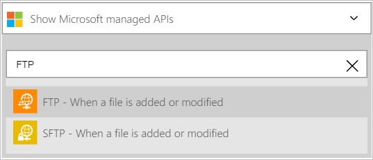
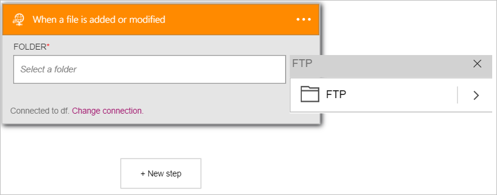
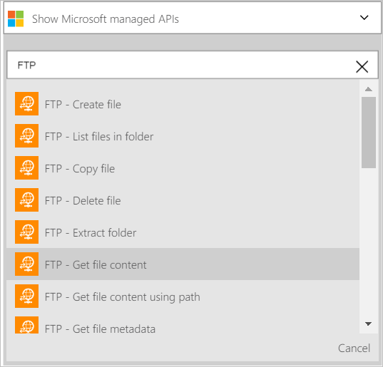

<properties
pageTitle="Découvrez comment utiliser le connecteur FTP dans les applications logique | Microsoft Azure"
description="Créez des applications de logique avec le service d’application Azure. Se connecter au serveur FTP pour gérer vos fichiers. Vous pouvez effectuer diverses actions telles que téléchargement, mettre à jour, obtenir et supprimer des fichiers dans le serveur FTP."
services="logic-apps"   
documentationCenter=".net,nodejs,java"  
authors="msftman"   
manager="erikre"    
editor=""
tags="connectors" />

<tags
ms.service="logic-apps"
ms.devlang="multiple"
ms.topic="article"
ms.tgt_pltfrm="na"
ms.workload="integration"
ms.date="07/22/2016"
ms.author="deonhe"/>

# Prise en main du connecteur FTP

Utiliser le connecteur FTP pour analyser, gérer et créer des fichiers sur un serveur FTP. 

Pour utiliser [un connecteur quelconque](./apis-list.md), vous devez tout d’abord créer une application logique. Vous pouvez commencer par [créer une application logique maintenant](../app-service-logic/app-service-logic-create-a-logic-app.md).

## Se connecter à FTP

Avant que votre application logique peut accéder à n’importe quel service, vous devez tout d’abord créer une *connexion* au service. Une [connexion](./connectors-overview.md) assure la connectivité entre une application logique et un autre service.  

### Créer une connexion à FTP

>[AZURE.INCLUDE [Steps to create a connection to FTP](../../includes/connectors-create-api-ftp.md)]

## Utilisez un déclencheur FTP

Un déclencheur est un événement qui peut être utilisé pour démarrer le flux de travail définie dans une application logique. [En savoir plus sur les déclencheurs](../app-service-logic/app-service-logic-what-are-logic-apps.md#logic-app-concepts).  

>[AZURE.IMPORTANT]Le connecteur FTP nécessite un serveur FTP qui n’est accessible à partir d’Internet et est configuré pour fonctionner avec le mode passif. En outre, le lien FTP n’est **pas compatible avec implicite FTPS (FTP sur SSL)**. Le connecteur FTP prend uniquement en charge explicite FTPS (FTP sur SSL).  

Dans cet exemple, je vous montrent comment utiliser le déclencheur **FTP - lorsqu’un fichier est ajouté ou modifié** pour démarrer un flux de travail de l’application logique lorsqu’un fichier est ajouté à ou modifiés sur un serveur FTP. Dans un exemple d’entreprise, vous pouvez utiliser ce déclencheur pour surveiller un dossier FTP pour les nouveaux fichiers représentant des commandes des clients.  Vous pouvez utiliser ensuite une action de connecteur FTP comme **obtenir le contenu du fichier** d’obtenir le contenu de la commande pour un traitement approfondi et le stockage dans votre base de données de commandes.

1. Entrez *ftp* dans la zone de recherche dans le Concepteur d’applications logique, puis sélectionnez le déclencheur **FTP - lorsqu’un fichier est ajouté ou modifié**   
  
Ouvre le contrôle **lorsqu’un fichier est ajouté ou modifié**  
  
- Sélectionnez le bouton **...** situé sur le côté droit du contrôle. Cette action ouvre le contrôle de sélecteur de dossier  
  
- Sélectionnez le **>** (flèche droite) et recherchez le dossier que vous souhaitez surveiller les fichiers modifiés ou nouveaux. Sélectionnez le dossier et notez que le dossier est désormais affiché dans le contrôle de **dossier** .  
   

À ce stade, votre application logique a été configurée avec un déclencheur qui va commencer une exécution des autres déclencheurs et actions dans le flux de travail lorsqu’un fichier est modifié ou créé dans le dossier FTP spécifique. 

>[AZURE.NOTE]Pour une application logique à être opérationnel, elle doit contenir au moins un déclencheur et une action. Suivez les étapes décrites dans la section suivante pour ajouter une action.  

## Utiliser une action FTP

Une action est une opération effectuée par le flux de travail définie dans une application logique. [En savoir plus sur les actions](../app-service-logic/app-service-logic-what-are-logic-apps.md#logic-app-concepts).  

Maintenant que vous avez ajouté un déclencheur, procédez comme suit pour ajouter une action qu’obtiendront le contenu du fichier nouveau ou modifié trouvé par le déclencheur.    

1. Sélectionnez **+ nouvelle étape** pour ajouter l’action à obtenir le contenu du fichier sur le serveur FTP  
- Sélectionnez le lien **Ajouter une action** .  
  
- Entrez *FTP* pour rechercher toutes les actions associées à FTP.
- Sélectionnez l’action à effectuer lorsqu’un fichier créé ou modifié se trouve dans le dossier FTP **FTP - obtenir le contenu d’un fichier** .      
  
Le contrôle **d’obtenir le contenu du fichier** s’ouvre. **Remarque**: vous devrez autoriser votre application logique pour accéder à votre compte de serveur FTP si vous n'avez pas fait précédemment.  
   
- Sélectionnez le contrôle de **fichier** (l’espace blanc située en dessous de **fichier***). Dans ce cas, vous pouvez utiliser des différentes propriétés à partir du fichier nouvellement créé ou modifié introuvable sur le serveur FTP.  
- Sélectionnez l’option de **contenu du fichier** .  
   
-  Le contrôle est mis à jour, indiquant que l’action **FTP - obtenir le contenu du fichier** obtiendront le *contenu du fichier* du fichier nouvellement créé ou modifié sur le serveur FTP.      
     
- Enregistrez votre travail, puis ajouter un fichier dans le dossier FTP pour tester votre flux de travail.    

À ce stade, l’application logique a été configurée avec un déclencheur pour surveiller un dossier sur un serveur FTP et démarrer le flux de travail lorsqu’il détecte un nouveau fichier ou ouvrez un fichier modifié sur le serveur FTP. 

L’application logique a également été configurée avec une action d’obtenir le contenu du fichier nouvellement créé ou modifié.

Vous pouvez désormais ajouter une autre action telles que l’action de [SQL Server - insérer une ligne](./connectors-create-api-sqlazure.md#insert-row) pour insérer le contenu du fichier nouvellement créé ou modifié dans une table de base de données SQL.  

## Détails techniques

Voici les informations concernant les déclencheurs, actions et les réponses qui prend en charge cette connexion :

## Déclencheurs FTP

FTP comporte l’ou les déclencheurs suivant :  

|Déclencheur | Description|
|--- | ---|
|[Lorsqu’un fichier est ajouté ou modifié](connectors-create-api-ftp.md#when-a-file-is-added-or-modified)|Cette opération déclenche un flux lorsqu’un fichier est ajouté ou modifié dans un dossier.|

## Actions FTP

FTP comporte les actions suivantes :

|Action|Description|
|--- | ---|
|[Obtenir des métadonnées de fichier](connectors-create-api-ftp.md#get-file-metadata)|Cette opération Obtient les métadonnées pour un fichier.|
|[Fichier de mise à jour](connectors-create-api-ftp.md#update-file)|Cette opération met à jour un fichier.|
|[Supprimer le fichier](connectors-create-api-ftp.md#delete-file)|Cette opération supprime un fichier.|
|[Obtenir les métadonnées de fichier à l’aide de chemin d’accès](connectors-create-api-ftp.md#get-file-metadata-using-path)|Cette opération Obtient les métadonnées d’un fichier en utilisant le chemin d’accès.|
|[Obtenir le contenu du fichier à l’aide du chemin d’accès](connectors-create-api-ftp.md#get-file-content-using-path)|Cette opération Obtient le contenu d’un fichier en utilisant le chemin d’accès.|
|[Obtenir le contenu d’un fichier](connectors-create-api-ftp.md#get-file-content)|Cette opération Obtient le contenu d’un fichier.|
|[Créer le fichier](connectors-create-api-ftp.md#create-file)|Cette opération crée un fichier.|
|[Copier un fichier](connectors-create-api-ftp.md#copy-file)|Cette opération copie un fichier à un serveur FTP.|
|[Liste des fichiers dans le dossier](connectors-create-api-ftp.md#list-files-in-folder)|Cette opération Obtient la liste des fichiers et sous-dossiers dans un dossier.|
|[Liste des fichiers dans le dossier racine](connectors-create-api-ftp.md#list-files-in-root-folder)|Cette opération Obtient la liste des fichiers et sous-dossiers dans le dossier racine.|
|[Extraire le dossier](connectors-create-api-ftp.md#extract-folder)|Cette opération extrait un fichier d’archive vers un dossier (exemple : .zip).|
### Détails de l’action

Voici les détails des actions et déclencheurs pour ce connecteur, ainsi que leurs réponses :

### Obtenir des métadonnées de fichier
Cette opération Obtient les métadonnées pour un fichier. 

|Nom de la propriété| Nom d’affichage|Description|
| ---|---|---|
|ID *|Fichier|Sélectionner un fichier|

Un * indique qu’une propriété est requise

#### Détails de sortie

BlobMetadata

| Nom de la propriété | Type de données |
|---|---|---|
|ID|chaîne|
|Nom|chaîne|
|Nom complet|chaîne|
|Chemin d’accès|chaîne|
|LastModified|chaîne|
|Taille|nombre entier|
|MediaType|chaîne|
|IsFolder|valeur booléenne|
|ETag|chaîne|
|FileLocator|chaîne|

### Fichier de mise à jour
Cette opération met à jour un fichier. 

|Nom de la propriété| Nom d’affichage|Description|
| ---|---|---|
|ID *|Fichier|Sélectionner un fichier|
|corps *|Contenu du fichier|Contenu du fichier|

Un * indique qu’une propriété est requise

#### Détails de sortie

BlobMetadata

| Nom de la propriété | Type de données |
|---|---|---|
|ID|chaîne|
|Nom|chaîne|
|Nom complet|chaîne|
|Chemin d’accès|chaîne|
|LastModified|chaîne|
|Taille|nombre entier|
|MediaType|chaîne|
|IsFolder|valeur booléenne|
|ETag|chaîne|
|FileLocator|chaîne|

### Supprimer le fichier
Cette opération supprime un fichier. 

|Nom de la propriété| Nom d’affichage|Description|
| ---|---|---|
|ID *|Fichier|Sélectionner un fichier|

Un * indique qu’une propriété est requise

### Obtenir les métadonnées de fichier à l’aide de chemin d’accès
Cette opération Obtient les métadonnées d’un fichier en utilisant le chemin d’accès. 

|Nom de la propriété| Nom d’affichage|Description|
| ---|---|---|
|chemin d’accès *|Chemin de fichier|Sélectionner un fichier|

Un * indique qu’une propriété est requise

#### Détails de sortie

BlobMetadata

| Nom de la propriété | Type de données |
|---|---|---|
|ID|chaîne|
|Nom|chaîne|
|Nom complet|chaîne|
|Chemin d’accès|chaîne|
|LastModified|chaîne|
|Taille|nombre entier|
|MediaType|chaîne|
|IsFolder|valeur booléenne|
|ETag|chaîne|
|FileLocator|chaîne|

### Obtenir le contenu du fichier à l’aide du chemin d’accès
Cette opération Obtient le contenu d’un fichier en utilisant le chemin d’accès. 

|Nom de la propriété| Nom d’affichage|Description|
| ---|---|---|
|chemin d’accès *|Chemin de fichier|Sélectionner un fichier|

Un * indique qu’une propriété est requise

### Obtenir le contenu d’un fichier
Cette opération Obtient le contenu d’un fichier. 

|Nom de la propriété| Nom d’affichage|Description|
| ---|---|---|
|ID *|Fichier|Sélectionner un fichier|

Un * indique qu’une propriété est requise

### Créer le fichier
Cette opération crée un fichier. 

|Nom de la propriété| Nom d’affichage|Description|
| ---|---|---|
|folderPath *|Chemin d’accès de dossier|Sélectionnez un dossier|
|nom *|Nom de fichier|Nom du fichier|
|corps *|Contenu du fichier|Contenu du fichier|

Un * indique qu’une propriété est requise

#### Détails de sortie

BlobMetadata

| Nom de la propriété | Type de données |
|---|---|---|
|ID|chaîne|
|Nom|chaîne|
|Nom complet|chaîne|
|Chemin d’accès|chaîne|
|LastModified|chaîne|
|Taille|nombre entier|
|MediaType|chaîne|
|IsFolder|valeur booléenne|
|ETag|chaîne|
|FileLocator|chaîne|

### Copier un fichier
Cette opération copie un fichier à un serveur FTP. 

|Nom de la propriété| Nom d’affichage|Description|
| ---|---|---|
|source *|Url de la source|URL pour le fichier source|
|destination *|Chemin d’accès du fichier de destination|Chemin de fichier de destination, y compris le nom de fichier cible|
|remplacer|Remplacer ?|Remplace le fichier de destination si la valeur « true »|

Un * indique qu’une propriété est requise

#### Détails de sortie

BlobMetadata

| Nom de la propriété | Type de données |
|---|---|---|
|ID|chaîne|
|Nom|chaîne|
|Nom complet|chaîne|
|Chemin d’accès|chaîne|
|LastModified|chaîne|
|Taille|nombre entier|
|MediaType|chaîne|
|IsFolder|valeur booléenne|
|ETag|chaîne|
|FileLocator|chaîne|

### Lorsqu’un fichier est ajouté ou modifié
Cette opération déclenche un flux lorsqu’un fichier est ajouté ou modifié dans un dossier. 

|Nom de la propriété| Nom d’affichage|Description|
| ---|---|---|
|Codedossier *|Dossier|Sélectionnez un dossier|

Un * indique qu’une propriété est requise

### Liste des fichiers dans le dossier
Cette opération Obtient la liste des fichiers et sous-dossiers dans un dossier. 

|Nom de la propriété| Nom d’affichage|Description|
| ---|---|---|
|ID *|Dossier|Sélectionnez un dossier|

Un * indique qu’une propriété est requise

#### Détails de sortie

BlobMetadata

| Nom de la propriété | Type de données |
|---|---|---|
|ID|chaîne|
|Nom|chaîne|
|Nom complet|chaîne|
|Chemin d’accès|chaîne|
|LastModified|chaîne|
|Taille|nombre entier|
|MediaType|chaîne|
|IsFolder|valeur booléenne|
|ETag|chaîne|
|FileLocator|chaîne|

### Liste des fichiers dans le dossier racine
Cette opération Obtient la liste des fichiers et sous-dossiers dans le dossier racine. 

Aucun paramètre pour cet appel

#### Détails de sortie

BlobMetadata

| Nom de la propriété | Type de données |
|---|---|---|
|ID|chaîne|
|Nom|chaîne|
|Nom complet|chaîne|
|Chemin d’accès|chaîne|
|LastModified|chaîne|
|Taille|nombre entier|
|MediaType|chaîne|
|IsFolder|valeur booléenne|
|ETag|chaîne|
|FileLocator|chaîne|

### Extraire le dossier
Cette opération extrait un fichier d’archive vers un dossier (exemple : .zip). 

|Nom de la propriété| Nom d’affichage|Description|
| ---|---|---|
|source *|Chemin de fichier d’archive source|Chemin d’accès pour le fichier d’archive|
|destination *|Chemin d’accès du dossier de destination|Chemin d’accès au dossier de destination|
|remplacer|Remplacer ?|Remplace les fichiers de destination si la valeur « true »|

Un * indique qu’une propriété est requise

#### Détails de sortie

BlobMetadata

| Nom de la propriété | Type de données |
|---|---|---|
|ID|chaîne|
|Nom|chaîne|
|Nom complet|chaîne|
|Chemin d’accès|chaîne|
|LastModified|chaîne|
|Taille|nombre entier|
|MediaType|chaîne|
|IsFolder|valeur booléenne|
|ETag|chaîne|
|FileLocator|chaîne|

## Réponses HTTP

Actions et déclencheurs ci-dessus peuvent renvoyer une ou plusieurs des codes d’état HTTP suivants : 

|Nom|Description|
|---|---|
|200|Bien|
|202|Accepté|
|400|Demande incorrecte|
|401|Non autorisé|
|403|Interdit|
|404|Introuvable|
|500|Erreur interne du serveur. Erreur inconnue s’est produite.|
|par défaut|Échoué de l’opération.|

## Étapes suivantes
[Créer une application de logique](../app-service-logic/app-service-logic-create-a-logic-app.md)