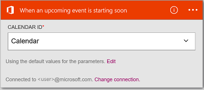
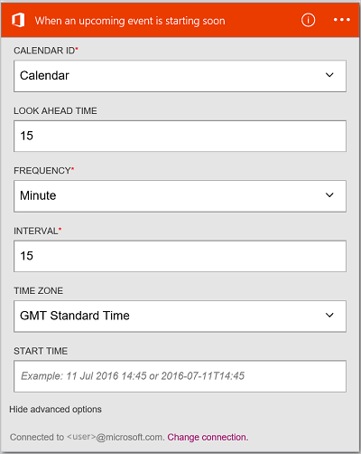
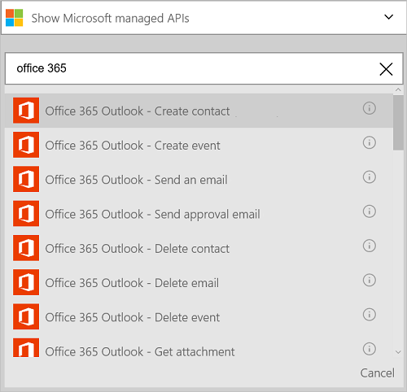

<properties
    pageTitle="Ajouter le lien Office 365 Outlook dans vos applications logique | Microsoft Azure"
    description="Créez des applications de logique avec le connecteur Office 365 pour activer l’interaction avec Office 365. Par exemple : création, modification et mise à jour des éléments de calendrier et contacts."
    services=""    
    documentationCenter=""     
    authors="MandiOhlinger"    
    manager="anneta"    
    editor="" 
    tags="connectors" />

<tags
ms.service="logic-apps"
ms.devlang="na"
ms.topic="article"
ms.tgt_pltfrm="na"
ms.workload="integration"
ms.date="10/18/2016"
ms.author="mandia"/>

# Prise en main Office 365 Outlook connector 

Office 365 Outlook connector permet l’interaction avec Outlook dans Office 365. Utilisez ce lien pour créer, modifier, mettre à jour les contacts et les éléments de calendrier et également obtenir, envoyer et répondre à des messages.

Avec Office 365 Outlook, vous :

- Créer votre flux de travail utilisant les fonctionnalités de messagerie et votre calendrier dans Office 365. 
- Utiliser des déclencheurs pour démarrer votre flux de travail lorsqu’il y a un message électronique, lorsqu’un élément de calendrier est mis à jour et bien plus encore.
- Utiliser les actions à envoyer un message électronique, créez un nouvel événement de calendrier et bien plus encore. Par exemple, lorsqu’il y a un nouvel objet dans Salesforce (un déclencheur), envoyer un message électronique à votre Office 365 Outlook (une action). 

Cette rubrique vous montre comment utiliser Office 365 Outlook connector dans une application logique et répertorie également les déclencheurs et les actions.

>[AZURE.NOTE] Cette version de l’article s’applique aux officielle applications logique (disponible).

Pour en savoir plus sur les applications logique, voir [Quels sont les applications logique](../app-service-logic/app-service-logic-what-are-logic-apps.md) et [créer une application logique](../app-service-logic/app-service-logic-create-a-logic-app.md).

## Se connecter à Office 365

Avant que votre application logique peut accéder à n’importe quel service, vous créez tout d’abord une *connexion* au service. Une connexion assure la connectivité entre une application logique et un autre service. Par exemple, pour vous connecter à Office 365 Outlook, vous devez tout d’abord une *connexion*de Office 365. Pour créer une connexion, entrez les informations d’identification que vous utilisez normalement pour accéder au service que vous voulez vous connecter. Ainsi, avec Office 365 Outlook, entrez les informations d’identification à votre compte Office 365 pour créer la connexion.

## Créer la connexion

>[AZURE.INCLUDE [Steps to create a connection to Office 365](../../includes/connectors-create-api-office365-outlook.md)]

## Utilisation d’un déclencheur

Un déclencheur est un événement qui peut être utilisé pour démarrer le flux de travail définie dans une application logique. Déclencheurs « teste » le service à un intervalle et la fréquence à laquelle vous voulez. [En savoir plus sur les déclencheurs](../app-service-logic/app-service-logic-what-are-logic-apps.md#logic-app-concepts).

1. Dans l’application logique, tapez « office 365 » pour obtenir une liste de déclencheurs :  

    

2. Sélectionnez **Office 365 Outlook - lors du démarrage d’un événement à venir est disponible**. Si une connexion existe déjà, puis sélectionnez un calendrier dans la liste déroulante.

    

    Si vous êtes invité à se connecter, puis entrez le signe dans Détails pour créer la connexion. [Créer la connexion](connectors-create-api-office365-outlook.md#create-the-connection) dans cette rubrique répertorie les étapes. 

    > [AZURE.NOTE] Dans cet exemple, l’application logique s’exécute lorsqu’un événement de calendrier est mis à jour. Pour afficher les résultats de ce déclencheur, ajoutez une autre action qui vous envoie un message texte. Par exemple, ajoutez l’action Twilio *Envoyer le message* que textes vous au démarrage de l’événement de calendrier en seulement 15 minutes. 

3. Sélectionnez le bouton **Modifier** et définissez les valeurs **fréquence** et **intervalle** . Par exemple, si vous souhaitez que le déclencheur d’interrogation toutes les 15 minutes, puis définissez la **fréquence** sur **minutes**et définir un **intervalle de** **15**. 

    

4. **Enregistrer** vos modifications (coin supérieur gauche de la barre d’outils). Votre application logique est enregistrée et peut être activée automatiquement.

## Utiliser une action

Une action est une opération effectuée par le flux de travail définie dans une application logique. [En savoir plus sur les actions](../app-service-logic/app-service-logic-what-are-logic-apps.md#logic-app-concepts).

1. Sélectionnez le signe plus. Vous voyez plusieurs choix : **Ajouter une action**, **Ajouter une condition**ou l’une des options **supplémentaires** .

    

2. Cliquez sur **Ajouter une action**.

3. Dans la zone de texte, tapez « office 365 » pour obtenir une liste de toutes les actions disponibles.

     

4. Dans notre exemple, choisissez **Office 365 Outlook - créer un contact**. Si une connexion existe déjà, puis choisissez l' **ID du dossier**, **prénom**et autres propriétés :  

    

    Si vous êtes invité aux informations de connexion, puis entrez les détails pour créer la connexion. [Créer la connexion](connectors-create-api-office365-outlook.md#create-the-connection) dans cette rubrique décrit ces propriétés. 

    > [AZURE.NOTE] Dans cet exemple, nous créons un nouveau contact dans Office 365 Outlook. Vous pouvez utiliser la sortie à partir d’un autre déclencheur pour créer le contact. Par exemple, ajoutez le déclencheur SalesForce *lorsqu’un objet est créé* . Ajoutez ensuite l’action Office 365 Outlook *créer un contact* qui utilise les champs SalesForce pour créer le nouveau contact dans Office 365. 

5. **Enregistrer** vos modifications (coin supérieur gauche de la barre d’outils). Votre application logique est enregistrée et peut être activée automatiquement.

## Détails techniques

Voici les informations concernant les déclencheurs, actions et les réponses qui prend en charge cette connexion :

## Déclencheurs d’Office 365

|Déclencheur | Description|
|--- | ---|
|[Lorsqu’un événement à venir démarre plus rapidement](connectors-create-api-office365-outlook.md#when-an-upcoming-event-is-starting-soon)|Cette opération déclenche un flux lors du démarrage d’un événement de calendrier à venir.|
|[Arrivée d’un nouveau message électronique](connectors-create-api-office365-outlook.md#when-a-new-email-arrives)|Cette opération déclenche un flux lors de l’arrivée d’un nouveau message électronique|
|[Lors de la création d’un nouvel événement](connectors-create-api-office365-outlook.md#when-a-new-event-is-created)|Cette opération déclenche un flux de création d’un événement dans un calendrier.|
|[Lorsqu’un événement est modifié](connectors-create-api-office365-outlook.md#when-an-event-is-modified)|Cette opération déclenche un flux lorsqu’un événement est modifié dans un calendrier.|

## Actions d’Office 365

|Action|Description|
|--- | ---|
|[Obtenir des messages électroniques](connectors-create-api-office365-outlook.md#get-emails)|Cette opération Obtient des messages électroniques à partir d’un dossier.|
|[Envoyer un message électronique](connectors-create-api-office365-outlook.md#send-an-email)|Cette opération envoie un message électronique.|
|[Supprimer les messages envoyés](connectors-create-api-office365-outlook.md#delete-email)|Cette opération supprime un message électronique par code.|
|[Marquer comme lu](connectors-create-api-office365-outlook.md#mark-as-read)|Cette opération marque un message électronique comme lus.|
|[Répondre à des messages](connectors-create-api-office365-outlook.md#reply-to-email)|Cette opération des réponses à un message électronique.|
|[Obtenir une pièce jointe](connectors-create-api-office365-outlook.md#get-attachment)|Cette opération obtient pièce jointe par id.|
|[Envoyer un message électronique avec les options](connectors-create-api-office365-outlook.md#send-email-with-options)|Cette opération envoie un message électronique avec plusieurs options et attend le destinataire doit répondre avec une des options.|
|[Envoyer des messages électroniques d’approbation](connectors-create-api-office365-outlook.md#send-approval-email)|Cette opération envoie un message électronique approbation et attend une réponse du destinataire.|
|[Obtenir des calendriers](connectors-create-api-office365-outlook.md#get-calendars)|Cette opération répertorie les calendriers disponibles.|
|[Obtenir des événements](connectors-create-api-office365-outlook.md#get-events)|Cette opération Obtient des événements à partir d’un calendrier.|
|[Créer un événement](connectors-create-api-office365-outlook.md#create-event)|Cette opération crée un nouvel événement dans un calendrier.|
|[Obtenir l’événement](connectors-create-api-office365-outlook.md#get-event)|Cette opération Obtient un événement spécifique d’un calendrier.|
|[Supprimer l’événement](connectors-create-api-office365-outlook.md#delete-event)|Cette opération supprime un événement dans un calendrier.|
|[Mettre à jour d’événement](connectors-create-api-office365-outlook.md#update-event)|Cette opération met à jour un événement dans un calendrier.|
|[Obtenir les dossiers de contacts](connectors-create-api-office365-outlook.md#get-contact-folders)|Cette opération répertorie les dossiers de contacts disponible.|
|[Récupérer des contacts](connectors-create-api-office365-outlook.md#get-contacts)|Cette opération Obtient des contacts à partir d’un dossier de contacts.|
|[Créer un contact](connectors-create-api-office365-outlook.md#create-contact)|Cette opération crée un nouveau contact dans un dossier de contacts.|
|[Obtenir de contact](connectors-create-api-office365-outlook.md#get-contact)|Cette opération Obtient un contact spécifique à partir d’un dossier de contacts.|
|[Supprimer le contact](connectors-create-api-office365-outlook.md#delete-contact)|Cette opération supprime un contact à partir d’un dossier de contacts.|
|[Mettre à jour de contact](connectors-create-api-office365-outlook.md#update-contact)|Cette opération met à jour un contact dans un dossier de contacts.|

### Détails de déclencheur et une Action

Dans cette section, voir les détails relatifs à chaque déclencheur et une action, y compris les propriétés d’entrée obligatoire ou facultatives et aucun résultat correspondant associé au connecteur.

#### Lorsqu’un événement à venir démarre plus rapidement
Cette opération déclenche un flux lors du démarrage d’un événement de calendrier à venir. 

|Nom de la propriété| Nom d’affichage|Description|
| ---|---|---|
|table *|Id de calendrier|Identificateur unique du calendrier|
|lookAheadTimeInMinutes|Temps de cache apparence|Temps (en minutes) pour rechercher en avance des événements à venir|

Un astérisque (*) signifie que la propriété est requise.

##### Détails de sortie
CalendarItemsList : La liste des éléments de calendrier

| Nom de la propriété | Type de données | Description |
|---|---|---|
|valeur|tableau|Liste des éléments de calendrier|

#### Obtenir des messages électroniques
Cette opération Obtient des messages électroniques à partir d’un dossier. 

|Nom de la propriété| Nom d’affichage|Description|
| ---|---|---|
|folderPath|Chemin d’accès de dossier|Chemin d’accès du dossier pour récupérer des messages électroniques (par défaut : « Boîte de réception »)|
|Retour au début|Retour au début|Nombre de messages électroniques pour récupérer (par défaut : 10)|
|fetchOnlyUnread|Récupérer uniquement les Messages non lus|Récupérer uniquement les messages non lus ?|
|includeAttachments|Inclure les pièces jointes|Si la valeur trues, pièces jointes est également récupérée ainsi que le message électronique|
|searchQuery|Requête de recherche|Requête de recherche pour filtrer les messages électroniques|
|Ignorer|Ignorer|Nombre de messages électroniques permet d’ignorer (par défaut : 0)|
|skipToken|Jeton d’ignorer|Passez jeton à récupérer une nouvelle page|

Un astérisque (*) signifie que la propriété est requise.

##### Détails de sortie
ReceiveMessage : Recevoir de Message électronique

| Nom de la propriété | Type de données | Description |
|---|---|---|
|De|chaîne|De|
|À|chaîne|À|
|Objet|chaîne|Objet|
|Corps|chaîne|Corps|
|Importance|chaîne|Importance|
|HasAttachment|valeur booléenne|Avec pièce jointe|
|ID|chaîne|Id de message|
|Estlu|valeur booléenne|Est lu|
|DateTimeReceived|chaîne|Date heure de réception|
|Pièces jointes|tableau|Pièces jointes|
|Cc|chaîne|Spécifier les adresses de messagerie séparées par des points-virgules commesomeone@contoso.com|
|Cci|chaîne|Spécifier les adresses de messagerie séparées par des points-virgules commesomeone@contoso.com|
|IsHtml|valeur booléenne|Est au format Html|

#### Envoyer un message électronique
Cette opération envoie un message électronique. 

|Nom de la propriété| Nom d’affichage|Description|
| ---|---|---|
|emailMessage *|Messagerie|Messagerie|

Un astérisque (*) signifie que la propriété est requise.

##### Détails de sortie
Aucun.

#### Supprimer les messages envoyés
Cette opération supprime un message électronique par code. 

|Nom de la propriété| Nom d’affichage|Description|
| ---|---|---|
|messageId *|Id de message|ID de la messagerie à supprimer|

Un astérisque (*) signifie que la propriété est requise.

##### Détails de sortie
Aucun.

#### Marquer comme lu
Cette opération marque un message électronique comme lus. 

|Nom de la propriété| Nom d’affichage|Description|
| ---|---|---|
|messageId *|Id de message|ID de la messagerie à marquer comme lu|

Un astérisque (*) signifie que la propriété est requise.

##### Détails de sortie
Aucun.

#### Répondre à des messages
Cette opération des réponses à un message électronique. 

|Nom de la propriété| Nom d’affichage|Description|
| ---|---|---|
|messageId *|Id de message|ID de la messagerie pour répondre à|
|commentaire *|Commentaire|Commentaire de réponse|
|replyAll|Répondre à tous|Répondre à tous les destinataires|

Un astérisque (*) signifie que la propriété est requise.

##### Détails de sortie
Aucun.

#### Obtenir une pièce jointe
Cette opération obtient pièce jointe par id. 

|Nom de la propriété| Nom d’affichage|Description|
| ---|---|---|
|messageId *|Id de message|ID de la messagerie|
|attachmentId *|Id de pièce jointe|ID de la pièce jointe à télécharger|

Un astérisque (*) signifie que la propriété est requise.

##### Détails de sortie
Aucun.

#### Arrivée d’un nouveau message électronique
Cette opération déclenche un flux lors de l’arrivée d’un nouveau message électronique.

|Nom de la propriété| Nom d’affichage|Description|
| ---|---|---|
|folderPath|Chemin d’accès de dossier|Dossier de messagerie à récupérer (par défaut : boîte de réception)|
|À|À|Adresses de messagerie destinataire|
|De|De|À partir d’adresse|
|importance|Importance|Importance du message (haute, normale, basse) (par défaut : Normal)|
|fetchOnlyWithAttachment|Possède des pièces jointes|Récupérer uniquement les messages électroniques comportant une pièce jointe|
|includeAttachments|Inclure les pièces jointes|Inclure les pièces jointes|
|subjectFilter|Objet filtre|Chaîne à rechercher dans l’objet|

Un astérisque (*) signifie que la propriété est requise.

##### Détails de sortie
TriggerBatchResponse [ReceiveMessage]

| Nom de la propriété | Type de données |
|---|---|
|valeur|tableau|

#### Envoyer un message électronique avec les options
Cette opération envoie un message électronique avec plusieurs options et attend le destinataire doit répondre avec une des options. 

|Nom de la propriété| Nom d’affichage|Description|
| ---|---|---|
|optionsEmailSubscription *|Demande d’abonnement pour la messagerie électronique options|Demande d’abonnement pour la messagerie électronique options|

Un astérisque (*) signifie que la propriété est requise.

##### Détails de sortie
SubscriptionResponse : Modèle pour approbation abonnement au courrier électronique

| Nom de la propriété | Type de données | Description |
|---|---|---|
|ID|chaîne|ID de l’abonnement|
|ressource|chaîne|Ressources de la demande d’abonnement|
|notificationType|chaîne|Type de notification|
|notificationUrl|chaîne|Url de notification|

#### Envoyer des messages électroniques d’approbation
Cette opération envoie un message électronique approbation et attend une réponse du destinataire. 

|Nom de la propriété| Nom d’affichage|Description|
| ---|---|---|
|approvalEmailSubscription *|Demande d’abonnement pour la messagerie électronique d’approbation|Demande d’abonnement pour la messagerie électronique d’approbation|

Un astérisque (*) signifie que la propriété est requise.

##### Détails de sortie
SubscriptionResponse : Modèle pour approbation abonnement au courrier électronique

| Nom de la propriété | Type de données | Description |
|---|---|---|
|ID|chaîne|ID de l’abonnement|
|ressource|chaîne|Ressources de la demande d’abonnement|
|notificationType|chaîne|Type de notification|
|notificationUrl|chaîne|Url de notification|

#### Obtenir des calendriers
Cette opération répertorie les calendriers disponibles. 

Il n’existe pas de paramètres pour cet appel.

##### Détails de sortie
TablesList

| Nom de la propriété | Type de données |
|---|---|
|valeur|tableau|

#### Obtenir des événements
Cette opération Obtient des événements à partir d’un calendrier. 

|Nom de la propriété| Nom d’affichage|Description|
| ---|---|---|
|table *|Id de calendrier|Sélectionnez un calendrier|
|$filter|Requête de filtre|Une requête de filtre ODATA pour restreindre les entrées retournées|
|$orderby|Tri par|Une requête orderBy ODATA permettant de spécifier l’ordre des entrées|
|$skip|Nombre d’ignorer|Nombre d’entrées pour ignorer (par défaut = 0)|
|$top|Nombre maximal d’obtenir|Nombre maximal d’entrées pour récupérer (par défaut = 256)|

Un astérisque (*) signifie que la propriété est requise.

##### Détails de sortie
CalendarEventList : La liste des éléments de calendrier

| Nom de la propriété | Type de données | Description |
|---|---|---|
|valeur|tableau|Liste des éléments de calendrier|

#### Créer un événement
Cette opération crée un nouvel événement dans un calendrier. 

|Nom de la propriété| Nom d’affichage|Description|
| ---|---|---|
|table *|Id de calendrier|Sélectionnez un calendrier|
|élément *|Élément|Créer l’événement|

Un astérisque (*) signifie que la propriété est requise.

##### Détails de sortie
CalendarEvent : Classe de modèle calendrier spécifique événement connecteur.

| Nom de la propriété | Type de données | Description |
|---|---|---|
|ID|chaîne|Identificateur unique de l’événement.|
|Participants|tableau|Liste des participants de l’événement.|
|Corps|non défini|Le corps du message associé à l’événement.|
|BodyPreview|chaîne|L’aperçu du message associé à l’événement.|
|Catégories|tableau|Les catégories associées à l’événement.|
|ChangeKey|chaîne|Identifie la version de l’objet event. Chaque fois que l’événement est modifiée, ChangeKey change également.|
|DateTimeCreated|chaîne|La date et l’heure auxquelles l’événement a été créé.|
|DateTimeLastModified|chaîne|La date et l’heure auxquelles la dernière modification de l’événement.|
|Fin|chaîne|L’heure de fin de l’événement.|
|EndTimeZone|chaîne|Spécifie le fuseau horaire de la réunion heure de fin. Cette valeur doit être telle que définie dans Windows (exemple : « Pacifique »).|
|HasAttachments|valeur booléenne|Valeur true si l’événement possède des pièces jointes.|
|Importance|chaîne|L’importance de l’événement : faible, Normal ou élevé.|
|IsAllDay|valeur booléenne|Valeur true si l’événement dure toute la journée.|
|IsCancelled|valeur booléenne|Valeur true si l’événement a été annulée.|
|IsOrganizer|valeur booléenne|Valeur true si l’expéditeur du message est également l’organisateur.|
|Emplacement|non défini|L’emplacement de l’événement.|
|Bibliothèque multimédia|non défini|L’organisateur de l’événement.|
|Périodicité|non défini|La périodicité de l’événement.|
|Rappel|nombre entier|Durée en minutes avant le début de l’événement pour rappeler.|
|ResponseRequested|valeur booléenne|Valeur true si l’expéditeur souhaite recevoir une réponse lors de l’événement est accepté ou refusé.|
|ResponseStatus|non défini|Indique le type de réponse envoyé en réponse à un message d’événement.|
|SeriesMasterId|chaîne|Identificateur unique pour le type d’événement masque de série.|
|ShowAs s’est vue|chaîne|Indique que vos informations de disponibilité.|
|Démarrer|chaîne|L’heure de début de l’événement.|
|StartTimeZone|chaîne|Spécifie l’heure heure de début de la zone de la réunion. Cette valeur doit être telle que définie dans Windows (exemple : « Pacifique »).|
|Objet|chaîne|Objet d’un événement.|
|Type|chaîne|Le type d’événement : Instance unique, une Occurrence, Exception ou masque de série.|
|Lien Web|chaîne|L’aperçu du message associé à l’événement.|

#### Obtenir l’événement
Cette opération Obtient un événement spécifique d’un calendrier. 

|Nom de la propriété| Nom d’affichage|Description|
| ---|---|---|
|table *|Id de calendrier|Sélectionnez un calendrier|
|ID *|Id d’élément|Sélectionnez un événement|

Un astérisque (*) signifie que la propriété est requise.

##### Détails de sortie
CalendarEvent : Classe de modèle calendrier spécifique événement connecteur.

| Nom de la propriété | Type de données | Description |
|---|---|---|
|ID|chaîne|Identificateur unique de l’événement.|
|Participants|tableau|Liste des participants de l’événement.|
|Corps|non défini|Le corps du message associé à l’événement.|
|BodyPreview|chaîne|L’aperçu du message associé à l’événement.|
|Catégories|tableau|Les catégories associées à l’événement.|
|ChangeKey|chaîne|Identifie la version de l’objet event. Chaque fois que l’événement est modifiée, ChangeKey change également.|
|DateTimeCreated|chaîne|La date et l’heure auxquelles l’événement a été créé.|
|DateTimeLastModified|chaîne|La date et l’heure auxquelles la dernière modification de l’événement.|
|Fin|chaîne|L’heure de fin de l’événement.|
|EndTimeZone|chaîne|Spécifie le fuseau horaire de la réunion heure de fin. Cette valeur doit être telle que définie dans Windows (exemple : « Pacifique »).|
|HasAttachments|valeur booléenne|Valeur true si l’événement possède des pièces jointes.|
|Importance|chaîne|L’importance de l’événement : faible, Normal ou élevé.|
|IsAllDay|valeur booléenne|Valeur true si l’événement dure toute la journée.|
|IsCancelled|valeur booléenne|Valeur true si l’événement a été annulée.|
|IsOrganizer|valeur booléenne|Valeur true si l’expéditeur du message est également l’organisateur.|
|Emplacement|non défini|L’emplacement de l’événement.|
|Bibliothèque multimédia|non défini|L’organisateur de l’événement.|
|Périodicité|non défini|La périodicité de l’événement.|
|Rappel|nombre entier|Durée en minutes avant le début de l’événement pour rappeler.|
|ResponseRequested|valeur booléenne|Valeur true si l’expéditeur souhaite recevoir une réponse lors de l’événement est accepté ou refusé.|
|ResponseStatus|non défini|Indique le type de réponse envoyé en réponse à un message d’événement.|
|SeriesMasterId|chaîne|Identificateur unique pour le type d’événement masque de série.|
|ShowAs s’est vue|chaîne|Indique que vos informations de disponibilité.|
|Démarrer|chaîne|L’heure de début de l’événement.|
|StartTimeZone|chaîne|Spécifie l’heure heure de début de la zone de la réunion. Cette valeur doit être telle que définie dans Windows (exemple : « Pacifique »).|
|Objet|chaîne|Objet d’un événement.|
|Type|chaîne|Le type d’événement : Instance unique, une Occurrence, Exception ou masque de série.|
|Lien Web|chaîne|L’aperçu du message associé à l’événement.|

#### Supprimer l’événement
Cette opération supprime un événement dans un calendrier. 

|Nom de la propriété| Nom d’affichage|Description|
| ---|---|---|
|table *|Id de calendrier|Sélectionnez un calendrier|
|ID *|ID|Sélectionnez un événement|

Un astérisque (*) signifie que la propriété est requise.

##### Détails de sortie
Aucun.

#### Mettre à jour d’événement
Cette opération met à jour un événement dans un calendrier. 

|Nom de la propriété| Nom d’affichage|Description|
| ---|---|---|
|table *|Id de calendrier|Sélectionnez un calendrier|
|ID *|ID|Sélectionnez un événement|
|élément *|Élément|Événement pour mettre à jour|

Un astérisque (*) signifie que la propriété est requise.

##### Détails de sortie
CalendarEvent : Classe de modèle calendrier spécifique événement connecteur.

| Nom de la propriété | Type de données | Description |
|---|---|---|
|ID|chaîne|Identificateur unique de l’événement.|
|Participants|tableau|Liste des participants de l’événement.|
|Corps|non défini|Le corps du message associé à l’événement.|
|BodyPreview|chaîne|L’aperçu du message associé à l’événement.|
|Catégories|tableau|Les catégories associées à l’événement.|
|ChangeKey|chaîne|Identifie la version de l’objet event. Chaque fois que l’événement est modifiée, ChangeKey change également.|
|DateTimeCreated|chaîne|La date et l’heure auxquelles l’événement a été créé.|
|DateTimeLastModified|chaîne|La date et l’heure auxquelles la dernière modification de l’événement.|
|Fin|chaîne|L’heure de fin de l’événement.|
|EndTimeZone|chaîne|Spécifie le fuseau horaire de la réunion heure de fin. Cette valeur doit être telle que définie dans Windows (exemple : « Pacifique »).|
|HasAttachments|valeur booléenne|Valeur true si l’événement possède des pièces jointes.|
|Importance|chaîne|L’importance de l’événement : faible, Normal ou élevé.|
|IsAllDay|valeur booléenne|Valeur true si l’événement dure toute la journée.|
|IsCancelled|valeur booléenne|Valeur true si l’événement a été annulée.|
|IsOrganizer|valeur booléenne|Valeur true si l’expéditeur du message est également l’organisateur.|
|Emplacement|non défini|L’emplacement de l’événement.|
|Bibliothèque multimédia|non défini|L’organisateur de l’événement.|
|Périodicité|non défini|La périodicité de l’événement.|
|Rappel|nombre entier|Durée en minutes avant le début de l’événement pour rappeler.|
|ResponseRequested|valeur booléenne|Valeur true si l’expéditeur souhaite recevoir une réponse lors de l’événement est accepté ou refusé.|
|ResponseStatus|non défini|Indique le type de réponse envoyé en réponse à un message d’événement.|
|SeriesMasterId|chaîne|Identificateur unique pour le type d’événement masque de série.|
|ShowAs s’est vue|chaîne|Indique que vos informations de disponibilité.|
|Démarrer|chaîne|L’heure de début de l’événement.|
|StartTimeZone|chaîne|Spécifie l’heure heure de début de la zone de la réunion. Cette valeur doit être telle que définie dans Windows (exemple : « Pacifique »).|
|Objet|chaîne|Objet d’un événement.|
|Type|chaîne|Le type d’événement : Instance unique, une Occurrence, Exception ou masque de série.|
|Lien Web|chaîne|L’aperçu du message associé à l’événement.|

#### Lors de la création d’un nouvel événement
Cette opération déclenche un flux de création d’un événement dans un calendrier. 

|Nom de la propriété| Nom d’affichage|Description|
| ---|---|---|
|table *|Id de calendrier|Sélectionnez un calendrier|
|$filter|Requête de filtre|Une requête de filtre ODATA pour restreindre les entrées retournées|
|$orderby|Tri par|Une requête orderBy ODATA permettant de spécifier l’ordre des entrées|
|$skip|Nombre d’ignorer|Nombre d’entrées pour ignorer (par défaut = 0)|
|$top|Nombre maximal d’obtenir|Nombre maximal d’entrées pour récupérer (par défaut = 256)|

Un astérisque (*) signifie que la propriété est requise.

##### Détails de sortie
CalendarItemsList : La liste des éléments de calendrier

| Nom de la propriété | Type de données | Description |
|---|---|---|
|valeur|tableau|Liste des éléments de calendrier|

#### Lorsqu’un événement est modifié
Cette opération déclenche un flux lorsqu’un événement est modifié dans un calendrier. 

|Nom de la propriété| Nom d’affichage|Description|
| ---|---|---|
|table *|Id de calendrier|Sélectionnez un calendrier|
|$filter|Requête de filtre|Une requête de filtre ODATA pour restreindre les entrées retournées|
|$orderby|Tri par|Une requête orderBy ODATA permettant de spécifier l’ordre des entrées|
|$skip|Nombre d’ignorer|Nombre d’entrées pour ignorer (par défaut = 0)|
|$top|Nombre maximal d’obtenir|Nombre maximal d’entrées pour récupérer (par défaut = 256)|

Un astérisque (*) signifie que la propriété est requise.

##### Détails de sortie
CalendarItemsList : La liste des éléments de calendrier

| Nom de la propriété | Type de données | Description |
|---|---|---|
|valeur|tableau|Liste des éléments de calendrier|

#### Obtenir les dossiers de contacts
Cette opération répertorie les dossiers de contacts disponible. 

Il n’existe pas de paramètres pour cet appel.

##### Détails de sortie
TablesList

| Nom de la propriété | Type de données |
|---|---|
|valeur|tableau|

#### Récupérer des contacts
Cette opération Obtient des contacts à partir d’un dossier de contacts. 

|Nom de la propriété| Nom d’affichage|Description|
| ---|---|---|
|table *|Id de dossier|Identificateur unique du dossier contacts pour récupérer|
|$filter|Requête de filtre|Une requête de filtre ODATA pour restreindre les entrées retournées|
|$orderby|Tri par|Une requête orderBy ODATA permettant de spécifier l’ordre des entrées|
|$skip|Nombre d’ignorer|Nombre d’entrées pour ignorer (par défaut = 0)|
|$top|Nombre maximal d’obtenir|Nombre maximal d’entrées pour récupérer (par défaut = 256)|

Un astérisque (*) signifie que la propriété est requise.

##### Détails de sortie
ContactList : La liste des contacts

| Nom de la propriété | Type de données | Description |
|---|---|---|
|valeur|tableau|Liste des contacts|

#### Créer un contact
Cette opération crée un nouveau contact dans un dossier de contacts. 

|Nom de la propriété| Nom d’affichage|Description|
| ---|---|---|
|table *|Id de dossier|Sélectionnez un dossier de contacts|
|élément *|Élément|Contact à créer|

Un astérisque (*) signifie que la propriété est requise.

##### Détails de sortie
Contact : Contact

| Nom de la propriété | Type de données | Description |
|---|---|---|
|ID|chaîne|Identificateur unique du contact.|
|ParentFolderId|chaîne|L’ID du dossier parent du contact|
|Anniversaire|chaîne|Anniversaire du contact.|
|Classer sous|chaîne|Le nom du contact est classé sous.|
|Nom complet|chaîne|Nom complet du contact.|
|Prénom|chaîne|Le nom du contact donné.|
|Initiales|chaîne|Les initiales du contact.|
|MiddleName|chaîne|Deuxième prénom du contact.|
|Surnom|chaîne|Le surnom du contact.|
|Nom de famille|chaîne|Nom du contact.|
|Titre|chaîne|Le titre du contact.|
|Génération|chaîne|Génération du contact.|
|EmailAddresses|tableau|Adresses de messagerie du contact.|
|ImAddresses|tableau|Instantané (MI) adresses de messagerie le contact est.|
|JobTitle|chaîne|Fonction du contact.|
|Nom_entreprise|chaîne|Le nom de la société du contact.|
|Département|chaîne|Le département du contact.|
|OfficeLocation|chaîne|L’emplacement du bureau du contact.|
|Professionnelle|chaîne|Professionnelle du contact.|
|BusinessHomePage|chaîne|La page d’accueil entreprise du contact.|
|AssistantName|chaîne|Le nom de l’assistant du contact.|
|Gestionnaire|chaîne|Le nom du responsable du contact.|
|HomePhones|tableau|Numéros de téléphone personnel du contact.|
|BusinessPhones|tableau|Numéros de téléphone du contact professionnel|
|MobilePhone1|chaîne|Numéro de téléphone mobile du contact.|
|Adresseperso|non défini|L’adresse du contact personnel.|
|Adressepro|non défini|L’adresse du contact professionnel.|
|OtherAddress|non défini|Autres adresses du contact.|
|YomiCompanyName|chaîne|Le nom de société japonais phonétique du contact.|
|YomiGivenName|chaîne|Le phonétique japonais prénom (prénom) du contact.|
|YomiSurname|chaîne|Nom de famille les japonais phonétiques (nom) du contact|
|Catégories|tableau|Les catégories associés au contact.|
|ChangeKey|chaîne|Identifie la version de l’objet d’événement|
|DateTimeCreated|chaîne|L’heure de la création du contact.|
|DateTimeLastModified|chaîne|L’heure de que modification du contact.|

#### Obtenir de contact
Cette opération Obtient un contact spécifique à partir d’un dossier de contacts. 

|Nom de la propriété| Nom d’affichage|Description|
| ---|---|---|
|table *|Id de dossier|Sélectionnez un dossier de contacts|
|ID *|Id d’élément|Identificateur unique d’un contact pour récupérer|

Un astérisque (*) signifie que la propriété est requise.

##### Détails de sortie
Contact : Contact

| Nom de la propriété | Type de données | Description |
|---|---|---|
|ID|chaîne|Identificateur unique du contact.|
|ParentFolderId|chaîne|L’ID du dossier parent du contact|
|Anniversaire|chaîne|Anniversaire du contact.|
|Classer sous|chaîne|Le nom du contact est classé sous.|
|Nom complet|chaîne|Nom complet du contact.|
|Prénom|chaîne|Le nom du contact donné.|
|Initiales|chaîne|Les initiales du contact.|
|MiddleName|chaîne|Deuxième prénom du contact.|
|Surnom|chaîne|Le surnom du contact.|
|Nom de famille|chaîne|Nom du contact.|
|Titre|chaîne|Le titre du contact.|
|Génération|chaîne|Génération du contact.|
|EmailAddresses|tableau|Adresses de messagerie du contact.|
|ImAddresses|tableau|Instantané (MI) adresses de messagerie le contact est.|
|JobTitle|chaîne|Fonction du contact.|
|Nom_entreprise|chaîne|Le nom de la société du contact.|
|Département|chaîne|Le département du contact.|
|OfficeLocation|chaîne|L’emplacement du bureau du contact.|
|Professionnelle|chaîne|Professionnelle du contact.|
|BusinessHomePage|chaîne|La page d’accueil entreprise du contact.|
|AssistantName|chaîne|Le nom de l’assistant du contact.|
|Gestionnaire|chaîne|Le nom du responsable du contact.|
|HomePhones|tableau|Numéros de téléphone personnel du contact.|
|BusinessPhones|tableau|Numéros de téléphone du contact professionnel|
|MobilePhone1|chaîne|Numéro de téléphone mobile du contact.|
|Adresseperso|non défini|L’adresse du contact personnel.|
|Adressepro|non défini|L’adresse du contact professionnel.|
|OtherAddress|non défini|Autres adresses du contact.|
|YomiCompanyName|chaîne|Le nom de société japonais phonétique du contact.|
|YomiGivenName|chaîne|Le phonétique japonais prénom (prénom) du contact.|
|YomiSurname|chaîne|Nom de famille les japonais phonétiques (nom) du contact|
|Catégories|tableau|Les catégories associés au contact.|
|ChangeKey|chaîne|Identifie la version de l’objet d’événement|
|DateTimeCreated|chaîne|L’heure de la création du contact.|
|DateTimeLastModified|chaîne|L’heure de que modification du contact.|

#### Supprimer le contact
Cette opération supprime un contact à partir d’un dossier de contacts. 

|Nom de la propriété| Nom d’affichage|Description|
| ---|---|---|
|table *|Id de dossier|Sélectionnez un dossier de contacts|
|ID *|ID|Identificateur unique du contact à supprimer|

Un astérisque (*) signifie que la propriété est requise.

##### Détails de sortie
Aucun.

#### Mettre à jour de contact
Cette opération met à jour un contact dans un dossier de contacts. 

|Nom de la propriété| Nom d’affichage|Description|
| ---|---|---|
|table *|Id de dossier|Sélectionnez un dossier de contacts|
|ID *|ID|Identificateur unique du contact pour mettre à jour|
|élément *|Élément|Élément de contact pour mettre à jour|

Un astérisque (*) signifie que la propriété est requise.

##### Détails de sortie
Contact : Contact

| Nom de la propriété | Type de données | Description |
|---|---|---|
|ID|chaîne|Identificateur unique du contact.|
|ParentFolderId|chaîne|L’ID du dossier parent du contact|
|Anniversaire|chaîne|Anniversaire du contact.|
|Classer sous|chaîne|Le nom du contact est classé sous.|
|Nom complet|chaîne|Nom complet du contact.|
|Prénom|chaîne|Le nom du contact donné.|
|Initiales|chaîne|Les initiales du contact.|
|MiddleName|chaîne|Deuxième prénom du contact.|
|Surnom|chaîne|Le surnom du contact.|
|Nom de famille|chaîne|Nom du contact.|
|Titre|chaîne|Le titre du contact.|
|Génération|chaîne|Génération du contact.|
|EmailAddresses|tableau|Adresses de messagerie du contact.|
|ImAddresses|tableau|Instantané (MI) adresses de messagerie le contact est.|
|JobTitle|chaîne|Fonction du contact.|
|Nom_entreprise|chaîne|Le nom de la société du contact.|
|Département|chaîne|Le département du contact.|
|OfficeLocation|chaîne|L’emplacement du bureau du contact.|
|Professionnelle|chaîne|Professionnelle du contact.|
|BusinessHomePage|chaîne|La page d’accueil entreprise du contact.|
|AssistantName|chaîne|Le nom de l’assistant du contact.|
|Gestionnaire|chaîne|Le nom du responsable du contact.|
|HomePhones|tableau|Numéros de téléphone personnel du contact.|
|BusinessPhones|tableau|Numéros de téléphone du contact professionnel|
|MobilePhone1|chaîne|Numéro de téléphone mobile du contact.|
|Adresseperso|non défini|L’adresse du contact personnel.|
|Adressepro|non défini|L’adresse du contact professionnel.|
|OtherAddress|non défini|Autres adresses du contact.|
|YomiCompanyName|chaîne|Le nom de société japonais phonétique du contact.|
|YomiGivenName|chaîne|Le phonétique japonais prénom (prénom) du contact.|
|YomiSurname|chaîne|Nom de famille les japonais phonétiques (nom) du contact|
|Catégories|tableau|Les catégories associés au contact.|
|ChangeKey|chaîne|Identifie la version de l’objet d’événement|
|DateTimeCreated|chaîne|L’heure de la création du contact.|
|DateTimeLastModified|chaîne|L’heure de que modification du contact.|

## Réponses HTTP

Actions et déclencheurs ci-dessus peuvent renvoyer une ou plusieurs des codes d’état HTTP suivants : 

|Nom|Description|
|---|---|
|200|Bien|
|202|Accepté|
|400|Demande incorrecte|
|401|Non autorisé|
|403|Interdit|
|404|Introuvable|
|500|Erreur interne du serveur. Erreur inconnue|
|par défaut|Échoué de l’opération.|

## Étapes suivantes

[Créer une application logique](../app-service-logic/app-service-logic-create-a-logic-app.md). Découvrir les autres connecteurs disponibles dans les applications logique auprès de notre [liste API](apis-list.md).