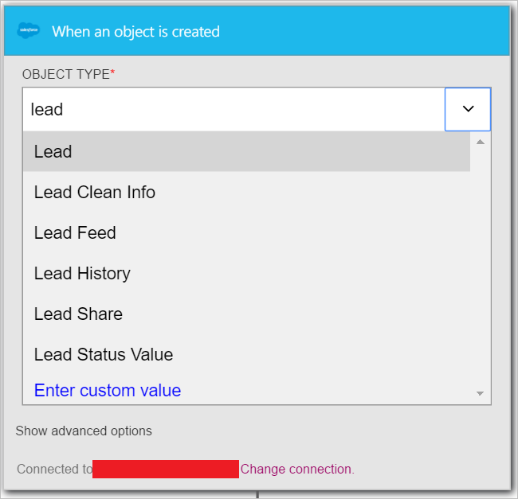

<properties
pageTitle="SMTP | Microsoft Azure"
description="Créez des applications de logique avec le service d’application Azure. Se connecter à SMTP pour envoyer des messages électroniques."
services="logic-apps"   
documentationCenter=".net,nodejs,java"  
authors="msftman"   
manager="erikre"    
editor=""
tags="connectors" />

<tags
ms.service="app-service-logic"
ms.devlang="multiple"
ms.topic="article"
ms.tgt_pltfrm="na"
ms.workload="integration"
ms.date="07/15/2016"
ms.author="deonhe"/>

# Prise en main du connecteur SMTP

Se connecter à SMTP pour envoyer des messages électroniques.

Pour utiliser [un connecteur quelconque](./apis-list.md), vous devez tout d’abord créer une application logique. Vous pouvez commencer par [créer une application logique maintenant](../app-service-logic/app-service-logic-create-a-logic-app.md).

## Se connecter au service SMTP

Avant que votre application logique peut accéder à n’importe quel service, vous devez tout d’abord créer une *connexion* au service. Une [connexion](./connectors-overview.md) assure la connectivité entre une application logique et un autre service. Par exemple, pour vous connecter au service SMTP, vous devez tout d’abord une *connexion*de SMTP. Pour créer une connexion, vous devrez fournir les informations d’identification que vous utilisez normalement pour accéder au service que vous voulez vous connecter. Par conséquent, dans l’exemple SMTP, vous devez les informations d’identification pour votre nom de connexion, adresse du serveur SMTP et informations de connexion utilisateur afin de créer la connexion au service SMTP. [Pour plus d’informations sur les connexions]()  

### Créer une connexion à SMTP

>[AZURE.INCLUDE [Steps to create a connection to SMTP](../../includes/connectors-create-api-smtp.md)]

## Utilisez un déclencheur SMTP

Un déclencheur est un événement qui peut être utilisé pour démarrer le flux de travail définie dans une application logique. [En savoir plus sur les déclencheurs](../app-service-logic/app-service-logic-what-are-logic-apps.md#logic-app-concepts).

Dans cet exemple, car SMTP n’a pas d’un déclencheur de sa propre, nous utiliserons le déclencheur **Salesforce - lorsqu’un objet est créé** . Pour activer ce déclencheur lorsqu’un nouvel objet est créé dans Salesforce. Dans notre exemple, nous allons configurez-la tel que chaque fois qu’un prospect est créé dans force de vente, une action *Envoyer un message électronique* se produit via le connecteur SMTP avec une notification du nouveau prospect en cours de création.

1. Entrez *salesforce* dans la zone de recherche dans le Concepteur d’applications logique, puis cliquez sur le déclencheur **Salesforce - lorsqu’un objet est créé** .  
   

2. Le contrôle **lors de la création d’un objet** est affiché.
   

3. Sélectionnez le **Type d’objet** , puis sélectionnez *prospect* dans la liste d’objets. Dans cette étape vous indiquez que vous créez un déclencheur qui vous avertit votre application logique quand un prospect est créé dans Salesforce.  
   

4. Le déclencheur a été créé.  
   

## Utiliser une action SMTP

Une action est une opération effectuée par le flux de travail définie dans une application logique. [En savoir plus sur les actions](../app-service-logic/app-service-logic-what-are-logic-apps.md#logic-app-concepts).

Maintenant que le déclencheur a été ajouté, procédez comme suit pour ajouter une action SMTP qui se produisent lorsqu’un prospect est créé dans Salesforce.

1. Sélectionnez **+ nouvelle étape** pour ajouter l’action que vous voulez prendre lorsqu’un prospect est créé.  
   

2. Sélectionnez **Ajouter une action**. Ce bouton ouvre la zone de recherche qui permet de rechercher d’une action que vous voulez prendre.  
   

3. Entrez *smtp* pour rechercher des actions associées SMTP.  

4. Sélectionnez **SMTP - envoyer un courrier électronique** en tant que l’action à effectuer lorsque le nouveau prospect est créé. Le bloc de contrôle d’action s’ouvre. Vous devrez établir votre connexion smtp dans le concepteur bloc si vous n'avez pas fait précédemment.  
     

5. Entrez vos informations de messagerie de votre choix dans le bloc de **SMTP - envoyer un E-mail** .  
   

6. Enregistrez votre travail afin d’activer votre flux de travail.  

## Détails techniques

Voici les informations concernant les déclencheurs, actions et les réponses qui prend en charge cette connexion :

## Déclencheurs SMTP

SMTP a pas de déclencheurs. 

## Actions SMTP

SMTP comporte l’opération suivante :

|Action|Description|
|--- | ---|
|[Envoyer des messages électroniques](connectors-create-api-smtp.md#send-email)|Cette opération envoie un message électronique à un ou plusieurs destinataires.|

### Détails de l’action

Voici les détails de l’action de ce connecteur, ainsi que ses réponses :

### Envoyer des messages électroniques
Cette opération envoie un message électronique à un ou plusieurs destinataires. 

|Nom de la propriété| Nom d’affichage|Description|
| ---|---|---|
|À|À|Spécifier les adresses de messagerie séparées par des points-virgules commerecipient1@domain.com;recipient2@domain.com|
|CC|cc|Spécifier les adresses de messagerie séparées par des points-virgules commerecipient1@domain.com;recipient2@domain.com|
|Objet|Objet|Objet de messagerie|
|Corps|Corps|Corps du message électronique|
|De|De|Adresse de messagerie de l’expéditeur commesender@domain.com|
|IsHtml|Est au format Html|Envoyez le message électronique au format HTML (vrai/faux)|
|Cci|Cci|Spécifier les adresses de messagerie séparées par des points-virgules commerecipient1@domain.com;recipient2@domain.com|
|Importance|Importance|Importance du message (haute, normale ou faible)|
|ContentData|Données de contenu de pièces jointes|Données de contenu (en base 64 codé pour les flux et sous-concerne chaîne)|
|ContentType|Type de contenu de pièces jointes|Type de contenu|
|ContentTransferEncoding|Codage de transfert du contenu des pièces jointes|Transférer le codage du contenu (en base 64 ou aucune)|
|Nom de fichier|Nom de fichier des pièces jointes|Nom de fichier|
|ContentId|ID de contenu de pièces jointes|Id de contenu|

Un * indique qu’une propriété est requise

## Réponses HTTP

Actions et déclencheurs ci-dessus peuvent renvoyer une ou plusieurs des codes d’état HTTP suivants : 

|Nom|Description|
|---|---|
|200|Bien|
|202|Accepté|
|400|Demande incorrecte|
|401|Non autorisé|
|403|Interdit|
|404|Introuvable|
|500|Erreur interne du serveur. Erreur inconnue s’est produite.|
|par défaut|Échoué de l’opération.|

## Étapes suivantes
[Créer une application de logique](../app-service-logic/app-service-logic-create-a-logic-app.md)