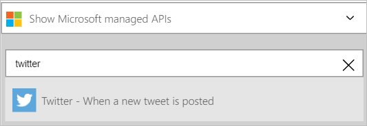
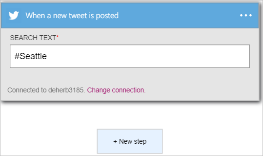
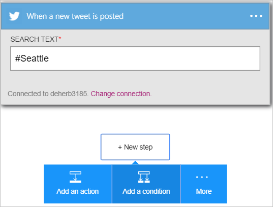
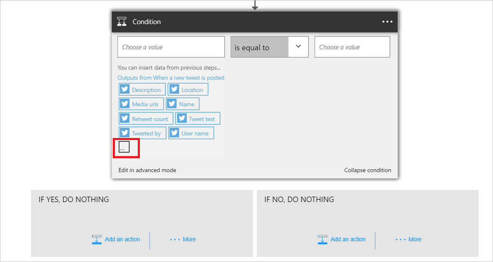
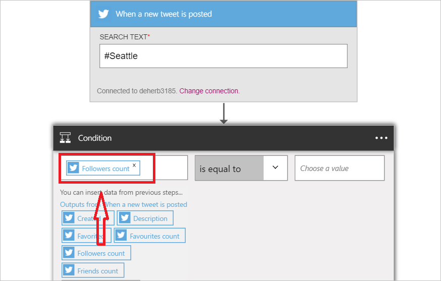
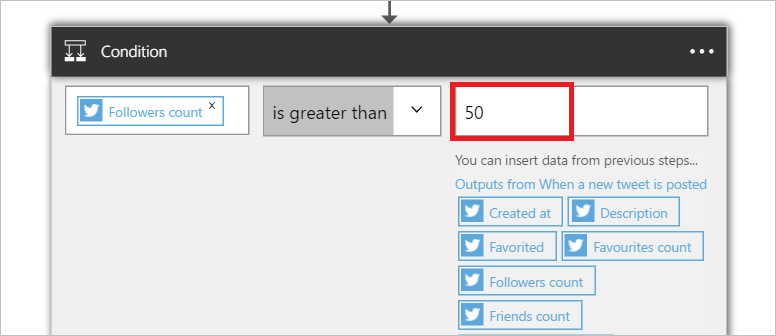
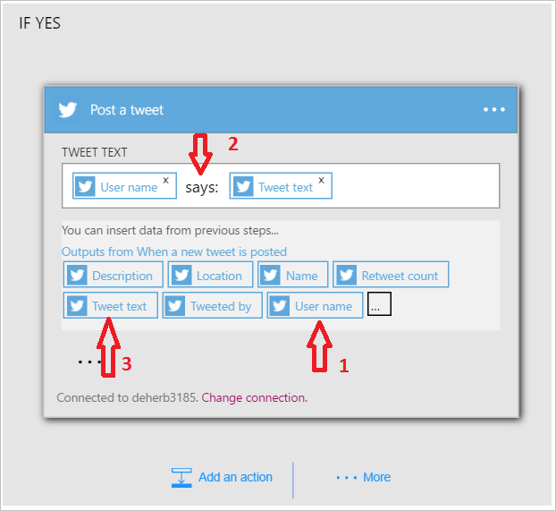

<properties
    pageTitle="Découvrez comment utiliser le connecteur Twitter dans les applications logique | Microsoft Azure"
    description="Vue d’ensemble du connecteur Twitter avec des paramètres de l’API REST"
    services=""
    documentationCenter="" 
    authors="msftman"
    manager="erikre"
    editor=""
    tags="connectors"/>

<tags
   ms.service="multiple"
   ms.devlang="na"
   ms.topic="article"
   ms.tgt_pltfrm="na"
   ms.workload="na" 
   ms.date="07/18/2016"
   ms.author="deonhe"/>

# Prise en main du connecteur Twitter

Avec le connecteur Twitter, vous pouvez :

- Valider tweet et obtenir tweets
- Suivent, des amis et des chronologies access
- Effectuez l’une des autres actions et déclencheurs décrites ci-dessous  

Pour utiliser [un connecteur quelconque](./apis-list.md), vous devez tout d’abord créer une application logique. Vous pouvez commencer par [créer une application logique maintenant](../app-service-logic/app-service-logic-create-a-logic-app.md).  

## Se connecter à Twitter

Avant que votre application logique peut accéder à n’importe quel service, vous devez tout d’abord créer une *connexion* au service. Une [connexion](./connectors-overview.md) assure la connectivité entre une application logique et un autre service.  

### Créer une connexion à Twitter

>[AZURE.INCLUDE [Steps to create a connection to Twitter](../../includes/connectors-create-api-twitter.md)]

## Utilisez un déclencheur Twitter

Un déclencheur est un événement qui peut être utilisé pour démarrer le flux de travail définie dans une application logique. [En savoir plus sur les déclencheurs](../app-service-logic/app-service-logic-what-are-logic-apps.md#logic-app-concepts).

Dans cet exemple, je vous montrent comment utiliser le déclencheur **lors de la validation un tweet nouveau** pour rechercher #Seattle et, si #Seattle est trouvé, mettre à jour un fichier dans Dropbox avec le texte à partir de celui-ci. Dans un exemple d’entreprise, vous faire rechercher le nom de votre société et mettre à jour une base de données SQL avec le texte à partir de la tweet.

1. Entrez *twitter* dans la zone de recherche dans le Concepteur d’applications logique, puis sélectionnez le déclencheur **Twitter - lors de la validation un tweet nouveau**   
  
- Entrez *#Seattle* dans le contrôle de **Texte de recherche**  
 

À ce stade, votre application logique a été configurée avec un déclencheur qui va commencer une exécution des autres déclencheurs et actions dans le flux de travail. 

>[AZURE.NOTE]Pour une application logique à être opérationnel, elle doit contenir au moins un déclencheur et une action. Suivez les étapes décrites dans la section suivante pour ajouter une action.  

## Ajouter une condition
Étant donné que nous intéresse uniquement tweet auprès des utilisateurs avec plus de 50 utilisateurs, une condition qui confirme le nombre de suivent doit d’abord être ajoutée à l’application logique.  

1. Sélectionnez **+ nouvelle étape** pour ajouter l’action que vous voulez prendre lorsque #Seattle se trouve dans un tweet nouveau  
  
- Sélectionnez le lien **Ajouter une condition** .  
   
Cette action ouvre le contrôle de **Condition** dans lesquels vous pouvez vérifier les conditions telles *est égal à*, *est inférieure à*, *est supérieure à*, *contient*, etc..  
   
- Sélectionnez le contrôle de **Choisir une valeur** .  
Dans ce contrôle, vous pouvez sélectionner une ou plusieurs des propriétés dans toutes les actions précédentes ou déclencheurs comme la valeur dont la condition sera évaluée sur true ou false.
   
- Sélectionnez le bouton **...** pour développer la liste des propriétés pour que vous puissiez voir toutes les propriétés disponibles.        
   
- Sélectionnez la propriété **count suivent** .    
   
- Avez-vous remarqué la propriété count suivent figure à présent dans le contrôle de valeur.    
   
- Dans la liste opérateurs, sélectionnez **est supérieur à** .    
   
- Tapez 50 comme opérande pour l’opérateur *est supérieur à* .  
La condition est ajoutée. Enregistrez votre travail à l’aide de **l’Enregistrer** le lien dans le menu ci-dessus.    
   

## Utiliser une action Twitter

Une action est une opération effectuée par le flux de travail définie dans une application logique. [En savoir plus sur les actions](../app-service-logic/app-service-logic-what-are-logic-apps.md#logic-app-concepts).  

Maintenant que vous avez ajouté un déclencheur, procédez comme suit pour ajouter une action qui sera publiée un tweet nouveau avec le contenu des tweets trouvés par le déclencheur. Dans le cadre de cette étape par étape tweet uniquement aux utilisateurs avec plus de 50 suivent est validées.  

Dans l’étape suivante, vous allez ajouter une action Twitter qui sera publiée un tweet à l’aide de certaines des propriétés de chaque tweet qui a été publié par un utilisateur qui comporte plus de 50 suivent.  

1. Sélectionnez **Ajouter une action**. Cette action ouvre le contrôle de recherche dans laquelle vous pouvez rechercher des autres actions et déclencheurs.  
   
- Entrez *twitter* dans la zone de recherche, puis sélectionnez l’action **Twitter - publier un tweet** . Cette action ouvre le contrôle de **publier un tweet** dans laquelle vous entrerez tous les détails pour le tweet en cours de validation.      
   
- Sélectionnez le contrôle de **texte Tweet** . Toutes les sorties à partir d’actions précédentes et déclencheurs dans l’application logique sont désormais visibles. Vous pouvez sélectionner une de ces et les utiliser dans le cadre du texte de la nouvelle tweet tweet.     
   
- Sélectionnez le **nom d’utilisateur**   
- Entrez *indique :* dans le contrôle de texte tweet. Procédez comme suit juste après le nom d’utilisateur.  
- Sélectionnez *texte Tweet*.       
   
- Enregistrez votre travail et envoyer un tweet incluant le hashtag #Seattle pour activer votre flux de travail.  

## Détails techniques

Voici les informations concernant les déclencheurs, actions et les réponses qui prend en charge cette connexion :

## Déclencheurs Twitter

Le connecteur Twitter comporte l’ou les déclencheurs suivant :  

|Déclencheur | Description|
|--- | ---|
|[Lorsqu’un tweet nouveau est publié](connectors-create-api-twitter.md#when-a-new-tweet-is-posted)|Cette opération déclenche un flux lors de la validation un tweet nouveau qui correspond à une requête de recherche donné.|

## Actions Twitter

Le connecteur Twitter comporte les actions suivantes :

|Action|Description|
|--- | ---|
|[Obtenir utilisateur chronologie](connectors-create-api-twitter.md#get-user-timeline)|Cette opération Obtient une liste de la plus récente tweet publié par un utilisateur donné.|
|[Obtenir famille chronologie](connectors-create-api-twitter.md#get-home-timeline)|Cette opération Obtient les plus récentes tweet et ré-tweets publiés par mon suivent et moi.|
|[Recherche tweets](connectors-create-api-twitter.md#search-tweets)|Cette opération Obtient une liste de tweets pertinents correspondant à la requête de recherche.|
|[Obtenir suivent](connectors-create-api-twitter.md#get-followers)|Cette opération Obtient la liste des utilisateurs qui suivent un utilisateur donné.|
|[Obtenir mon suivent](connectors-create-api-twitter.md#get-my-followers)|Cette opération Obtient la liste des utilisateurs qui vous suivent me.|
|[Obtenir suivant](connectors-create-api-twitter.md#get-following)|L’opération Obtient la liste des personnes à l’utilisateur donné suit.|
|[Obtenez mon suivante](connectors-create-api-twitter.md#get-my-following)|Cette opération Obtient la liste des utilisateurs que je suis.|
|[Obtenir l’utilisateur](connectors-create-api-twitter.md#get-user)|Cette opération Obtient les détails de profil pour un utilisateur donné, tels que le nom d’utilisateur, description, adeptes Nb et autres éléments.|
|[Publier un tweet](connectors-create-api-twitter.md#post-a-tweet)|Cette opération publie un tweet nouveau.|
## Détails de l’action

Voici les détails des actions et déclencheurs pour ce connecteur, ainsi que leurs réponses :

### Obtenir utilisateur chronologie
Cette opération Obtient une liste de la plus récente tweet publié par un utilisateur donné. 

|Nom de la propriété| Nom d’affichage|Description|
| ---|---|---|
|nom d’utilisateur *|Nom d’utilisateur|Poignée de Twitter pour l’utilisateur|
|maxResults|Nombre maximal de résultats|Nombre maximal de tweets pour renvoyer|

Un * indique qu’une propriété est requise

#### Détails de sortie

TweetModel : Représentation d’objet Tweet

| Nom de la propriété | Type de données | Description |
|---|---|---|
|TweetText|chaîne|Contenu de texte de la tweet|
|TweetId|chaîne|ID de la tweet|
|Créédans|chaîne|Heure à laquelle la tweet a été publié|
|RetweetCount|nombre entier|Nombre total de ré-tweets pour la tweet|
|TweetedBy|chaîne|Nom de l’utilisateur qui a publié le tweet|
|MediaUrls|tableau|URL de l’élément multimédia publié en même temps que la tweet|
|TweetLanguageCode|chaîne|Code de langue de la tweet|
|TweetInReplyToUserId|chaîne|Id d’utilisateur de l’auteur de la tweet qui tweet actuel est une réponse à|
|Favorited|valeur booléenne|Indique si la tweet est marqué comme favorited ou non|
|UserMentions|tableau|Liste des utilisateurs mentionnées dans le tweet|
|OriginalTweet|non défini|Tweet d’origine à partir de laquelle la tweet actuelle est ré-tweetée|
|UserDetails|non défini|Détails de l’utilisateur qui Tweeter|

### Obtenir famille chronologie
Cette opération Obtient les plus récentes tweet et ré-tweets publiés par mon suivent et moi. 

|Nom de la propriété| Nom d’affichage|Description|
| ---|---|---|
|maxResults|Nombre maximal de résultats|Nombre maximal de tweets pour renvoyer|

Un * indique qu’une propriété est requise

#### Détails de sortie

TweetModel : Représentation d’objet Tweet

| Nom de la propriété | Type de données | Description |
|---|---|---|
|TweetText|chaîne|Contenu de texte de la tweet|
|TweetId|chaîne|ID de la tweet|
|Créédans|chaîne|Heure à laquelle la tweet a été publié|
|RetweetCount|nombre entier|Nombre total de ré-tweets pour la tweet|
|TweetedBy|chaîne|Nom de l’utilisateur qui a publié le tweet|
|MediaUrls|tableau|URL de l’élément multimédia publié en même temps que la tweet|
|TweetLanguageCode|chaîne|Code de langue de la tweet|
|TweetInReplyToUserId|chaîne|Id d’utilisateur de l’auteur de la tweet qui tweet actuel est une réponse à|
|Favorited|valeur booléenne|Indique si la tweet est marqué comme favorited ou non|
|UserMentions|tableau|Liste des utilisateurs mentionnées dans le tweet|
|OriginalTweet|non défini|Tweet d’origine à partir de laquelle la tweet actuelle est ré-tweetée|
|UserDetails|non défini|Détails de l’utilisateur qui Tweeter|

### Recherche tweets
Cette opération Obtient une liste de tweets pertinents correspondant à la requête de recherche. 

|Nom de la propriété| Nom d’affichage|Description|
| ---|---|---|
|searchQuery *|Texte de recherche|Rechercher des termes comme « bon heure », #haiku, appréciez télévision OR|
|maxResults|Nombre maximal de résultats|Nombre maximal de tweets pour renvoyer|

Un * indique qu’une propriété est requise

#### Détails de sortie

TweetModel : Représentation d’objet Tweet

| Nom de la propriété | Type de données | Description |
|---|---|---|
|TweetText|chaîne|Contenu de texte de la tweet|
|TweetId|chaîne|ID de la tweet|
|Créédans|chaîne|Heure à laquelle la tweet a été publié|
|RetweetCount|nombre entier|Nombre total de ré-tweets pour la tweet|
|TweetedBy|chaîne|Nom de l’utilisateur qui a publié le tweet|
|MediaUrls|tableau|URL de l’élément multimédia publié en même temps que la tweet|
|TweetLanguageCode|chaîne|Code de langue de la tweet|
|TweetInReplyToUserId|chaîne|Id d’utilisateur de l’auteur de la tweet qui tweet actuel est une réponse à|
|Favorited|valeur booléenne|Indique si la tweet est marqué comme favorited ou non|
|UserMentions|tableau|Liste des utilisateurs mentionnées dans le tweet|
|OriginalTweet|non défini|Tweet d’origine à partir de laquelle la tweet actuelle est ré-tweetée|
|UserDetails|non défini|Détails de l’utilisateur qui Tweeter|

### Obtenir suivent
Cette opération Obtient la liste des utilisateurs qui suivent un utilisateur donné. 

|Nom de la propriété| Nom d’affichage|Description|
| ---|---|---|
|nom d’utilisateur *|Nom d’utilisateur|Poignée de Twitter pour l’utilisateur|
|maxResults|Nombre maximal de résultats|Nombre maximal d’utilisateurs à renvoyer|

Un * indique qu’une propriété est requise

#### Détails de sortie

UserDetailsModel : Détails de l’utilisateur Twitter

| Nom de la propriété | Type de données | Description |
|---|---|---|
|Nom complet|chaîne|Nom de l’utilisateur|
|Emplacement|chaîne|Emplacement de l’utilisateur|
|ID|nombre entier|Id Twitter de l’utilisateur|
|Nom d’utilisateur|chaîne|Nom de l’écran de l’utilisateur|
|FollowersCount|nombre entier|Nombre de suivent|
|Description|chaîne|Description de l’utilisateur|
|StatusesCount|nombre entier|Nombre d’utilisateurs dans l’état|
|FriendsCount|nombre entier|Nombre de vos amis|
|FavouritesCount|nombre entier|Nombre de tweets que l’utilisateur a favorited|
|ProfileImageUrl|chaîne|URL de l’image de profil|

### Obtenir mon suivent
Cette opération Obtient la liste des utilisateurs qui vous suivent me. 

|Nom de la propriété| Nom d’affichage|Description|
| ---|---|---|
|maxResults|Nombre maximal de résultats|Nombre maximal d’utilisateurs à obtenir|

Un * indique qu’une propriété est requise

#### Détails de sortie

UserDetailsModel : Détails de l’utilisateur Twitter

| Nom de la propriété | Type de données | Description |
|---|---|---|
|Nom complet|chaîne|Nom de l’utilisateur|
|Emplacement|chaîne|Emplacement de l’utilisateur|
|ID|nombre entier|Id Twitter de l’utilisateur|
|Nom d’utilisateur|chaîne|Nom de l’écran de l’utilisateur|
|FollowersCount|nombre entier|Nombre de suivent|
|Description|chaîne|Description de l’utilisateur|
|StatusesCount|nombre entier|Nombre d’utilisateurs dans l’état|
|FriendsCount|nombre entier|Nombre de vos amis|
|FavouritesCount|nombre entier|Nombre de tweets que l’utilisateur a favorited|
|ProfileImageUrl|chaîne|URL de l’image de profil|

### Obtenir suivant
L’opération Obtient la liste des personnes à l’utilisateur donné suit. 

|Nom de la propriété| Nom d’affichage|Description|
| ---|---|---|
|nom d’utilisateur *|Nom d’utilisateur|Poignée de Twitter pour l’utilisateur|
|maxResults|Nombre maximal de résultats|Nombre maximal d’utilisateurs à renvoyer|

Un * indique qu’une propriété est requise

#### Détails de sortie

UserDetailsModel : Détails de l’utilisateur Twitter

| Nom de la propriété | Type de données | Description |
|---|---|---|
|Nom complet|chaîne|Nom de l’utilisateur|
|Emplacement|chaîne|Emplacement de l’utilisateur|
|ID|nombre entier|Id Twitter de l’utilisateur|
|Nom d’utilisateur|chaîne|Nom de l’écran de l’utilisateur|
|FollowersCount|nombre entier|Nombre de suivent|
|Description|chaîne|Description de l’utilisateur|
|StatusesCount|nombre entier|Nombre d’utilisateurs dans l’état|
|FriendsCount|nombre entier|Nombre de vos amis|
|FavouritesCount|nombre entier|Nombre de tweets que l’utilisateur a favorited|
|ProfileImageUrl|chaîne|URL de l’image de profil|

### Obtenez mon suivante
Cette opération Obtient la liste des utilisateurs que je suis. 

|Nom de la propriété| Nom d’affichage|Description|
| ---|---|---|
|maxResults|Nombre maximal de résultats|Nombre maximal d’utilisateurs à renvoyer|

Un * indique qu’une propriété est requise

#### Détails de sortie

UserDetailsModel : Détails de l’utilisateur Twitter

| Nom de la propriété | Type de données | Description |
|---|---|---|
|Nom complet|chaîne|Nom de l’utilisateur|
|Emplacement|chaîne|Emplacement de l’utilisateur|
|ID|nombre entier|Id Twitter de l’utilisateur|
|Nom d’utilisateur|chaîne|Nom de l’écran de l’utilisateur|
|FollowersCount|nombre entier|Nombre de suivent|
|Description|chaîne|Description de l’utilisateur|
|StatusesCount|nombre entier|Nombre d’utilisateurs dans l’état|
|FriendsCount|nombre entier|Nombre de vos amis|
|FavouritesCount|nombre entier|Nombre de tweets que l’utilisateur a favorited|
|ProfileImageUrl|chaîne|URL de l’image de profil|

### Obtenir l’utilisateur
Cette opération Obtient les détails de profil pour un utilisateur donné, tels que le nom d’utilisateur, description, adeptes Nb et autres éléments. 

|Nom de la propriété| Nom d’affichage|Description|
| ---|---|---|
|nom d’utilisateur *|Nom d’utilisateur|Poignée de Twitter pour l’utilisateur|

Un * indique qu’une propriété est requise

#### Détails de sortie

UserDetailsModel : Détails de l’utilisateur Twitter

| Nom de la propriété | Type de données | Description |
|---|---|---|
|Nom complet|chaîne|Nom de l’utilisateur|
|Emplacement|chaîne|Emplacement de l’utilisateur|
|ID|nombre entier|Id Twitter de l’utilisateur|
|Nom d’utilisateur|chaîne|Nom de l’écran de l’utilisateur|
|FollowersCount|nombre entier|Nombre de suivent|
|Description|chaîne|Description de l’utilisateur|
|StatusesCount|nombre entier|Nombre d’utilisateurs dans l’état|
|FriendsCount|nombre entier|Nombre de vos amis|
|FavouritesCount|nombre entier|Nombre de tweets que l’utilisateur a favorited|
|ProfileImageUrl|chaîne|URL de l’image de profil|

### Publier un tweet
Cette opération publie un tweet nouveau. 

|Nom de la propriété| Nom d’affichage|Description|
| ---|---|---|
|tweetText|Texte tweet|Texte à être publié|
|corps|Éléments multimédias|Média doit être publié|

Un * indique qu’une propriété est requise

#### Détails de sortie

TweetResponseModel : Modèle représentant Tweet publié

| Nom de la propriété | Type de données | Description |
|---|---|---|
|TweetId|chaîne|ID de la tweet récupéré|

### Lorsqu’un tweet nouveau est publié
Cette opération déclenche un flux lors de la validation un tweet nouveau qui correspond à une requête de recherche donné. 

|Nom de la propriété| Nom d’affichage|Description|
| ---|---|---|
|searchQuery *|Texte de recherche|Rechercher des termes comme « bon heure », #haiku, appréciez télévision OR|

Un * indique qu’une propriété est requise

#### Détails de sortie

TriggerBatchResponse [TweetModel]

| Nom de la propriété | Type de données |
|---|---|
|valeur|tableau|

## Réponses HTTP

Actions et déclencheurs ci-dessus peuvent renvoyer une ou plusieurs des codes d’état HTTP suivants : 

|Nom|Description|
|---|---|
|200|Bien|
|202|Accepté|
|400|Demande incorrecte|
|401|Non autorisé|
|403|Interdit|
|404|Introuvable|
|500|Erreur interne du serveur. Erreur inconnue s’est produite.|
|par défaut|Échoué de l’opération.|

## Étapes suivantes
[Créer une application de logique](../app-service-logic/app-service-logic-create-a-logic-app.md)