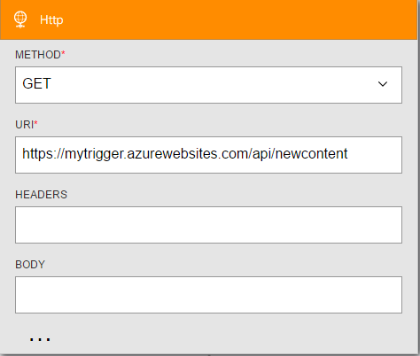
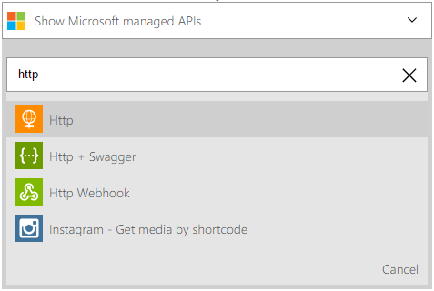

<properties
    pageTitle="Ajouter l’action HTTP dans les applications logique | Microsoft Azure"
    description="Vue d’ensemble de l’action HTTP avec les propriétés"
    services=""
    documentationCenter=""
    authors="jeffhollan"
    manager="erikre"
    editor=""
    tags="connectors"/>

<tags
   ms.service="logic-apps"
   ms.devlang="na"
   ms.topic="article"
   ms.tgt_pltfrm="na"
   ms.workload="na"
   ms.date="07/15/2016"
   ms.author="jehollan"/>

# <a name="get-started-with-the-http-action"></a>Prise en main l’action HTTP

Avec l’action HTTP, vous pouvez étendre les flux de travail pour votre organisation et communiquer à un point de terminaison sur HTTP.

Vous pouvez :

- Créer une logique de flux de travail application active (déclencheur) lorsqu’un site Web que vous gérez est indisponible.
- Communiquer à un point de terminaison sur HTTP pour étendre votre flux de travail à d’autres services.

Pour commencer à utiliser l’action HTTP dans une application logique, voir [créer une application logique](../app-service-logic/app-service-logic-create-a-logic-app.md).

## <a name="use-the-http-trigger"></a>Utiliser le déclencheur HTTP

Un déclencheur est un événement qui peut être utilisé pour démarrer le flux de travail qui est défini dans une application logique. [En savoir plus sur les déclencheurs](connectors-overview.md).

Voici un exemple de séquence de la configuration du déclencheur HTTP dans le Concepteur d’application logique.

1. Ajouter le déclencheur HTTP dans votre application logique.
2. Renseignez les paramètres pour le point de terminaison HTTP que vous voulez interroger.
3. Modifier l’intervalle de périodicité sur la fréquence à laquelle il doit interroger.
4. L’application logique se déclenche maintenant dont le contenu est renvoyé pendant les vérifications.



### <a name="how-the-http-trigger-works"></a>Comment fonctionne le déclencheur HTTP

Le déclencheur HTTP effectue un appel à un point de terminaison HTTP sur un intervalle périodique. Par défaut, toutes les réponses HTTP code inférieur à 300 résultats dans une application logique exécuter. Vous pouvez ajouter une condition dans le mode code qui permettra d’évaluer après l’appel HTTP pour déterminer si l’application logique doit se déclenche. Voici un exemple d’un déclencheur HTTP déclenchant si le code d’état retourné est supérieur ou égal à `400`.

```javascript
"Http":
{
    "conditions": [
        {
            "expression": "@greaterOrEquals(triggerOutputs()['statusCode'], 400)"
        }
    ],
    "inputs": {
        "method": "GET",
        "uri": "https://blogs.msdn.microsoft.com/logicapps/",
        "headers": {
            "accept-language": "en"
        }
    },
    "recurrence": {
        "frequency": "Second",
        "interval": 15
    },
    "type": "Http"
}
```

En savoir plus sur les paramètres de déclencheur HTTP sont disponibles sur [MSDN](https://msdn.microsoft.com/library/azure/mt643939.aspx#HTTP-trigger).

## <a name="use-the-http-action"></a>Utiliser l’action HTTP

Une action est une opération qui est effectuée par le flux de travail qui est défini dans une application logique. [En savoir plus sur les actions](connectors-overview.md).

1. Sélectionnez le bouton **Nouvelle étape** .
2. Cliquez sur **Ajouter une action**.
3. Dans la zone de recherche action, tapez **http** pour répertorier l’action HTTP.

    

4. Ajouter tous les paramètres requis pour l’appel HTTP.

    

5. Cliquez sur le coin supérieur gauche de la barre d’outils pour enregistrer. Votre application logique sera à la fois enregistrer et publier (activer).

## <a name="http-trigger"></a>Déclencheur HTTP

Voici les détails du déclencheur qui prend en charge ce connecteur. Le connecteur HTTP comporte un déclencheur.

|Déclencheur|Description|
|---|---|
|HTTP|Crée un appel HTTP et renvoie le contenu de la réponse.|

## <a name="http-action"></a>Action HTTP

Voici les détails de l’action qui prend en charge ce connecteur. Le connecteur HTTP a une action possible.

|Action|Description|
|---|---|
|HTTP|Crée un appel HTTP et renvoie le contenu de la réponse.|

## <a name="http-details"></a>Détails sur HTTP

Les tableaux suivants décrivent les champs d’entrée obligatoires et facultatifs pour l’action et les détails de sortie correspondants qui sont associés à l’aide de l’action.


#### <a name="http-request"></a>Demande HTTP
Voici les champs d’entrée pour l’action, qui effectue une requête sortante HTTP.
A * signifie qu’il s’agit d’un champ obligatoire.

|Nom d’affichage|Nom de la propriété|Description|
|---|---|---|
|Méthode *|méthode|Le verbe HTTP à utiliser|
|URI *|URI|URI de la requête HTTP|
|En-têtes|en-têtes|Un objet JSON d’en-têtes HTTP à inclure|
|Corps|corps|Le corps de la requête HTTP|
|Authentification|authentification|Détails dans la section [authentification](#authentication)|
<br>

#### <a name="output-details"></a>Détails de sortie

Vous trouverez ci-dessous des informations de sortie pour la réponse HTTP.

|Nom de la propriété|Type de données|Description|
|---|---|---|
|En-têtes|objet|En-têtes de réponse|
|Corps|objet|Objet de réponse|
|Code d’état|ent|Code d’état HTTP|

## <a name="authentication"></a>Authentification

La fonctionnalité logique applications de Service d’application Azure vous permet d’utiliser différents types d’authentification par rapport aux points de terminaison HTTP. Vous pouvez utiliser ce type d’authentification avec les connecteurs **HTTP**, **[HTTP + Swagger](./connectors-native-http-swagger.md)**et **[HTTP Webhook](./connectors-native-webhook.md)** . Les types d’authentification suivants peuvent être configurés :

* [Authentification de base](#basic-authentication)
* [Authentification par certificat client](#client-certificate-authentication)
* [Authentification Active Directory (AD Azure) OAuth Azure](#azure-active-directory-oauth-authentication)

#### <a name="basic-authentication"></a>Authentification de base

L’objet suivant de l’authentification est nécessaire pour l’authentification de base.
A * signifie qu’il s’agit d’un champ obligatoire.

|Nom de la propriété|Type de données|Description|
|---|---|---|
|Type *|type|Type d’authentification (doit être `Basic` pour l’authentification de base)|
|Nom d’utilisateur *|nom d’utilisateur|Nom d’utilisateur pour l’authentification|
|Mot de passe *|mot de passe|Mot de passe pour l’authentification|

>[AZURE.TIP] Si vous souhaitez utiliser un mot de passe qui ne sont pas accessibles à partir de la définition, utilisez une `securestring` paramètre et la `@parameters()` [fonction de définition de flux de travail](http://aka.ms/logicappdocs).

Si vous devez créer un objet comme suit dans le champ authentification :

```javascript
{
    "type": "Basic",
    "username": "user",
    "password": "test"
}
```

#### <a name="client-certificate-authentication"></a>Authentification par certificat client

L’objet suivant de l’authentification est nécessaire pour l’authentification par certificat client. A * signifie qu’il s’agit d’un champ obligatoire.

|Nom de la propriété|Type de données|Description|
|---|---|---|
|Type *|type|Le type d’authentification (doit être `ClientCertificate` pour les certificats SSL client)|
|PFX *|PFX|Le contenu du fichier personnel informations d’échange codé en base 64|
|Mot de passe *|mot de passe|Le mot de passe pour accéder au fichier PFX|

>[AZURE.TIP] Vous pouvez utiliser un `securestring` paramètre et la `@parameters()` [fonction de définition de flux de travail](http://aka.ms/logicappdocs) à utiliser un paramètre qui n’est pas lisible dans la définition après avoir enregistré l’application logique.

Par exemple :

```javascript
{
    "type": "ClientCertificate",
    "pfx": "aGVsbG8g...d29ybGQ=",
    "password": "@parameters('myPassword')"
}
```

#### <a name="azure-ad-oauth-authentication"></a>Authentification AD OAuth Azure

L’objet suivant de l’authentification est nécessaire pour l’authentification Azure AD OAuth. A * signifie qu’il s’agit d’un champ obligatoire.

|Nom de la propriété|Type de données|Description|
|---|---|---|
|Type *|type|Le type d’authentification (doit être `ActiveDirectoryOAuth` pour Azure AD OAuth)|
|Client *|client|L’identificateur de client pour le client Azure AD|
|Audience *|audience|La valeur`https://management.core.windows.net/`|
|Client ID *|identifiant du client|L’identificateur de client de l’application Azure AD|
|Code secret *|code secret|Le code secret du client qui demande le jeton|

>[AZURE.TIP] Vous pouvez utiliser un `securestring` paramètre et la `@parameters()` [fonction de définition de flux de travail](http://aka.ms/logicappdocs) à utiliser un paramètre qui n’est pas lisible dans la définition après l’avoir enregistré.

Par exemple :

```javascript
{
    "type": "ActiveDirectoryOAuth",
    "tenant": "72f988bf-86f1-41af-91ab-2d7cd011db47",
    "audience": "https://management.core.windows.net/",
    "clientId": "34750e0b-72d1-4e4f-bbbe-664f6d04d411",
    "secret": "hcqgkYc9ebgNLA5c+GDg7xl9ZJMD88TmTJiJBgZ8dFo="
}
```

## <a name="next-steps"></a>Étapes suivantes

À présent, essayez la plateforme et [créer une application logique](../app-service-logic/app-service-logic-create-a-logic-app.md). Vous pouvez Explorer d’autres connecteurs disponibles dans les applications logique en consultant notre [liste API](apis-list.md).
