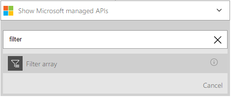

<properties
    pageTitle="Ajouter l’action de requête dans les applications logique | Microsoft Azure"
    description="Vue d’ensemble de l’action de requête pour effectuer les opérations comme tableau de filtres."
    services=""
    documentationCenter=""
    authors="jeffhollan"
    manager="erikre"
    editor=""
    tags="connectors"/>

<tags
   ms.service="logic-apps"
   ms.devlang="na"
   ms.topic="article"
   ms.tgt_pltfrm="na"
   ms.workload="na"
   ms.date="07/20/2016"
   ms.author="jehollan"/>

# Prise en main l’action de requête

À l’aide de l’action de requête, vous pouvez travailler avec des lots et des tableaux pour l’accomplissement de flux de travail pour :

- Créer une tâche pour tous les enregistrements avec une priorité élevée à partir d’une base de données.
- Enregistrer toutes les pièces jointes PDF pour les messages électroniques dans un blob Azure.

Pour commencer à utiliser l’action de requête dans une application logique, voir [créer une application logique](../app-service-logic/app-service-logic-create-a-logic-app.md).

## Utiliser l’action de requête

Une action est une opération qui est effectuée par le flux de travail qui est défini dans une application logique. [En savoir plus sur les actions](connectors-overview.md).  

L’action de requête a actuellement une seule opération, appelée le tableau filtre, qui est exposé dans le concepteur. Cela vous permet d’interroger une matrice et renvoie un jeu de résultats filtrés.

Voici comment vous pouvez l’ajouter dans une application logique :

1. Sélectionnez le bouton **Nouvelle étape** .
2. Cliquez sur **Ajouter une action**.
3. Dans la zone de recherche action, tapez **filtre** pour l’action du **tableau de filtres** de la liste.

    

4. Sélectionner un groupe à filtrer. (La capture d’écran suivante montre la matrice de résultats de la recherche Twitter.)
5. Créer une condition doit être évaluée pour chaque élément. (La capture d’écran suivante filtres tweets d’utilisateurs qui ont plus de 100 adeptes.)

    

    L’action génère un nouveau tableau qui contient uniquement les résultats répondant aux exigences de filtre.
6. Cliquez sur le coin supérieur gauche de la barre d’outils pour enregistrer et votre application logique sera à la fois enregistrer et publier (activer).

## Requête action

Voici les détails de l’action qui prend en charge ce connecteur. Le connecteur possède une action possible.

|Action|Description|
|---|---|
|Tableau de filtre|Évalue une condition pour chaque élément dans une matrice et renvoie le résultat|

## Détails de l’action

L’action de requête est fourni avec une action possible. Les tableaux suivants décrivent les champs d’entrée obligatoires et facultatifs pour l’action et les détails de sortie correspondants qui sont associés à l’aide de l’action.

### Tableau de filtre
Voici les champs d’entrée pour l’action, qui effectue une requête sortante HTTP.
A * signifie qu’il s’agit d’un champ obligatoire.

|Nom d’affichage|Nom de la propriété|Description|
|---|---|---|
|À partir de *|De|Le tableau pour filtrer|
|Condition *|où|La condition doit être évaluée pour chaque élément|
 

### Détails de sortie

Vous trouverez ci-dessous des informations de sortie pour la réponse HTTP.

|Nom de la propriété|Type de données|Description|
|---|---|---|
|Tableau filtré|tableau|Un tableau qui contient un objet pour chaque résultat filtrée|

## Étapes suivantes

À présent, essayez la plateforme et [créer une application logique](../app-service-logic/app-service-logic-create-a-logic-app.md). Vous pouvez Explorer d’autres connecteurs disponibles dans les applications logique en consultant notre [liste API](apis-list.md).
