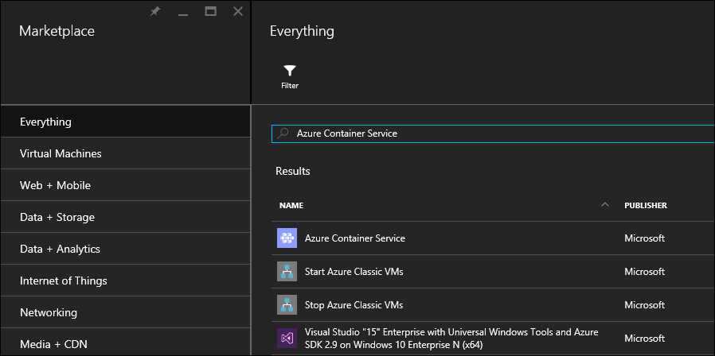
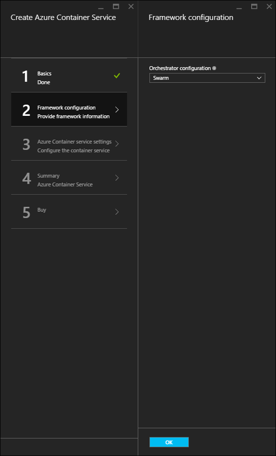

<properties
   pageTitle="Déployer un cluster de Service de conteneur Azure | Microsoft Azure"
   description="Déployer un cluster Azure conteneur Service à l’aide du portail Azure, l’infrastructure du langage commun Azure ou PowerShell."
   services="container-service"
   documentationCenter=""
   authors="rgardler"
   manager="timlt"
   editor=""
   tags="acs, azure-container-service"
   keywords="Docker, conteneurs, Micro-services, Mesos, Azure"/>

<tags
   ms.service="container-service"
   ms.devlang="na"
   ms.topic="get-started-article"
   ms.tgt_pltfrm="na"
   ms.workload="na"
   ms.date="09/13/2016"
   ms.author="rogardle"/>

# <a name="deploy-an-azure-container-service-cluster"></a>Déployer un cluster de Service de conteneur Azure

Service de conteneur Azure fournit un déploiement rapide du conteneur open source populaires cluster et orchestration des solutions. À l’aide de Service de conteneur Azure, vous pouvez déployer DC/système d’exploitation et clusters Docker par essaim avec les modèles de gestionnaire de ressources Azure ou le portail Azure. Vous déployez ces groupes à l’aide de jeux d’échelle Azure Machine virtuelle, et les groupes tirer parti des offres de réseau et de stockage Azure. Pour accéder à Azure conteneur Service, vous avez besoin d’un abonnement Azure. Si vous n’en avez pas, puis vous pouvez vous inscrire à une [version d’évaluation gratuite](http://azure.microsoft.com/pricing/free-trial/?WT.mc_id=AA4C1C935).

Ce document vous guide de déploiement d’un cluster Azure conteneur Service à l’aide du [portail Azure](#creating-a-service-using-the-azure-portal), l' [interface de ligne Azure (commande)](#creating-a-service-using-the-azure-cli)et le [module Azure PowerShell](#creating-a-service-using-powershell).  

## <a name="create-a-service-by-using-the-azure-portal"></a>Créer un service à l’aide du portail Azure

Connectez-vous au portail Azure, sélectionnez **Nouveau**et recherchez le marché Azure **Azure conteneur de Service**.

  <br />

Sélectionnez **Azure conteneur Service**, puis cliquez sur **créer**.

  <br />

Entrez les informations suivantes :

- **Nom d’utilisateur**: il s’agit du nom d’utilisateur qui sera utilisé pour un compte sur chacune des machines virtuelles et jeux d’échelle machine virtuelle du cluster Azure conteneur Service.
- **Abonnement**: sélectionnez un abonnement Azure.
- **Groupe de ressources**: sélectionnez un groupe de ressources existant ou créez-en un.
- **Emplacement**: sélectionnez une région Azure pour le déploiement d’Azure conteneur Service.
- **Clé publique SSH**: ajouter la clé publique qui est utilisée pour l’authentification par rapport aux machines virtuelles Azure conteneur Service. Il est très important que cette touche ne contienne aucun saut de ligne, et qu’il inclut le préfixe 'ssh-rsa' et la 'username@domain' suffixe. Il doit ressembler à ce qui suit : **AAAAB3Nz ssh rsa... <> …... UcyupgH azureuser@linuxvm **. Pour des instructions sur la création de clés SSH (Secure Shell), voir les articles [Linux]( https://azure.microsoft.com/documentation/articles/virtual-machines-linux-ssh-from-linux/) et [Windows]( https://azure.microsoft.com/documentation/articles/virtual-machines-linux-ssh-from-windows/) .

Cliquez sur **OK** lorsque vous êtes prêt à commencer.

  <br />

Sélectionnez un type d’Orchestration. Les options sont :

- **Contrôleur de domaine/système d’exploitation**: déploie un cluster DC/système d’exploitation.
- **Par essaim**: déploie un cluster Docker par essaim.

Cliquez sur **OK** lorsque vous êtes prêt à commencer.

  <br />

Entrez les informations suivantes :

- **Compter le nombre de maître**: le nombre de formes de base dans le cluster.
- **Compteur de l’agent**: pour Docker par essaim, il s’agit du nombre initial d’agents dans l’ensemble d’échelle de l’agent. Pour DC/système d’exploitation, il s’agit le nombre initial d’agents dans un jeu d’échelle privé. En outre, un ensemble d’échelle public est créé, qui contient un nombre prédéterminé d’agents. Le nombre d’agents de ce jeu échelle public est déterminé par les maîtres combien ont été créés dans le cluster--un agent public pour un seul masque et deux agents publics pour les trois ou cinq maître.
- **Taille de la machine virtuelle agent**: la taille des machines virtuelles agent.
- **Préfixe DNS**: un nom unique du monde qui sera utilisé pour préfixer les éléments clés des noms de domaine complet pour le service.

Cliquez sur **OK** lorsque vous êtes prêt à commencer.

  <br />

Fin de la validation du service, cliquez sur **OK** .

  <br />

Cliquez sur **créer** pour démarrer le processus de déploiement.

  <br />

Si vous avez choisi épingler le déploiement au portail Azure, vous pouvez voir l’état du déploiement.

  <br />

Une fois le déploiement terminé, le cluster Azure conteneur Service est prête à être utilisée.

## <a name="create-a-service-by-using-the-azure-cli"></a>Créer un service à l’aide de l’infrastructure du langage commun Azure

Pour créer une instance d’Azure conteneur Service à l’aide de la ligne de commande, vous avez besoin d’un abonnement Azure. Si vous n’en avez pas, puis vous pouvez vous inscrire à une [version d’évaluation gratuite](http://azure.microsoft.com/pricing/free-trial/?WT.mc_id=AA4C1C935). Vous devez également avoir [installé](../xplat-cli-install.md) et [configuré](../xplat-cli-connect.md) le Azure infrastructure du langage commun.

Pour déployer un cluster de Docker par essaim ou DC/système d’exploitation, sélectionnez un des modèles suivants dans GitHub. Notez que ces deux modèles sont identiques, à l’exception de la sélection d’orchestrator par défaut.

* [Modèle DC/système d’exploitation](https://github.com/Azure/azure-quickstart-templates/tree/master/101-acs-dcos)
* [Modèle essaim](https://github.com/Azure/azure-quickstart-templates/tree/master/101-acs-swarm)

Ensuite, assurez-vous que l’infrastructure du langage commun Azure a été connecté à un abonnement Azure. Vous pouvez le faire à l’aide de la commande suivante :

```bash
azure account show
```
Si un compte Azure n’est pas retourné, utilisez la commande suivante pour vous connecter l’infrastructure du langage commun à Azure.

```bash
azure login -u user@domain.com
```

Ensuite, configurez les outils Azure infrastructure du langage commun pour utiliser le Gestionnaire de ressources Azure.

```bash
azure config mode arm
```

Créer un groupe de ressources Azure et un cluster de Service de conteneur avec la commande suivante, où :

- **RESOURCE_GROUP** est le nom du groupe de ressources que vous souhaitez utiliser pour ce service.
- **Emplacement** est la région Azure où le groupe de ressources et le Service de conteneur Azure déploiement seront créés.
- **TEMPLATE_URI** est l’emplacement du fichier de déploiement. Notez que cela doit être le fichier brut, non un pointeur vers le GitHub UI. Pour trouver cette URL, sélectionnez le fichier azuredeploy.json dans GitHub, puis cliquez sur le bouton **premières** .

> [AZURE.NOTE] Lorsque vous exécutez cette commande, le shell vous invitera aux valeurs de paramètre de déploiement.

```bash
azure group create -n RESOURCE_GROUP DEPLOYMENT_NAME -l LOCATION --template-uri TEMPLATE_URI
```

### <a name="provide-template-parameters"></a>Fournir des paramètres de modèle

Cette version de la commande requiert vous permet de définir les paramètres de façon interactive. Si vous voulez fournir des paramètres, par exemple une chaîne JSON, vous pouvez le faire à l’aide de la `-p` basculer. Par exemple :

 ```bash
azure group deployment create RESOURCE_GROUP DEPLOYMENT_NAME --template-uri TEMPLATE_URI -p '{ "param1": "value1" … }'
```

Par ailleurs, vous pouvez fournir un fichier au format JSON paramètres à l’aide de la `-e` basculer :

```bash
azure group deployment create RESOURCE_GROUP DEPLOYMENT_NAME --template-uri TEMPLATE_URI -e PATH/FILE.JSON
```

Pour afficher un exemple de fichier de paramètres nommé `azuredeploy.parameters.json`, recherchez-le avec les modèles de Service de conteneur Azure dans GitHub.

## <a name="create-a-service-by-using-powershell"></a>Créer un service à l’aide de PowerShell

Vous pouvez également déployer un cluster Azure conteneur Service avec PowerShell. Ce document est basé sur la version 1.0 du [module Azure PowerShell](https://azure.microsoft.com/blog/azps-1-0/).

Pour déployer un cluster de Docker par essaim ou DC/système d’exploitation, sélectionnez un des modèles suivants. Notez que ces deux modèles sont identiques, à l’exception de la sélection d’orchestrator par défaut.

* [Modèle DC/système d’exploitation](https://github.com/Azure/azure-quickstart-templates/tree/master/101-acs-dcos)
* [Modèle essaim](https://github.com/Azure/azure-quickstart-templates/tree/master/101-acs-swarm)

Avant de créer un cluster dans votre abonnement Azure, vérifiez que votre session PowerShell a été connectée au Azure. Vous pouvez faire avec les `Get-AzureRMSubscription` commande :

```powershell
Get-AzureRmSubscription
```

Si vous devez vous connecter à Azure, utilisez la `Login-AzureRMAccount` commande :

```powershell
Login-AzureRmAccount
```

Si vous déployez à un nouveau groupe de ressources, vous devez tout d’abord créer le groupe de ressources. Pour créer un nouveau groupe de ressources, utilisez la `New-AzureRmResourceGroup` de commande, puis spécifiez une zone de nom et la destination de groupe ressource :

```powershell
New-AzureRmResourceGroup -Name GROUP_NAME -Location REGION
```

Après avoir créé un groupe de ressources, vous pouvez créer votre cluster avec la commande suivante. L’URI du modèle souhaité sera spécifiée pour la `-TemplateUri` paramètre. Lorsque vous exécutez cette commande, PowerShell vous invitera aux valeurs de paramètre de déploiement.

```powershell
New-AzureRmResourceGroupDeployment -Name DEPLOYMENT_NAME -ResourceGroupName RESOURCE_GROUP_NAME -TemplateUri TEMPLATE_URI
```

### <a name="provide-template-parameters"></a>Fournir des paramètres de modèle

Si vous avez l’habitude de PowerShell, vous savez que vous pouvez passer en revue les paramètres disponibles pour une applet de commande en tapant un signe moins (-) et en appuyant sur la touche TAB. Cette fonctionnalité même fonctionne également avec les paramètres que vous définissez dans votre modèle. Dès que vous tapez le nom du modèle, l’applet de commande extrait le modèle, analyse les paramètres et l’ajoute dynamiquement les paramètres de modèle à la commande. Cela facilite spécifier les valeurs de paramètre de modèle. Et, si vous oubliez une valeur de paramètre requis, PowerShell vous invitant à la valeur.

Voici la commande complète, avec des paramètres inclus. Vous pouvez fournir vos propres valeurs pour les noms des ressources.

```powershell
New-AzureRmResourceGroupDeployment -ResourceGroupName RESOURCE_GROUP_NAME-TemplateURI TEMPLATE_URI -adminuser value1 -adminpassword value2 ....
```

## <a name="next-steps"></a>Étapes suivantes

À présent que vous avez un cluster fonctionne, consultez ces documents pour la connexion et gestion des détails :

- [Se connecter à un cluster de Service de conteneur Azure](container-service-connect.md)
- [Travailler avec le Service de conteneur Azure et DC/système d’exploitation](container-service-mesos-marathon-rest.md)
- [Travailler avec le Service de conteneur Azure et Docker essaim](container-service-docker-swarm.md)
