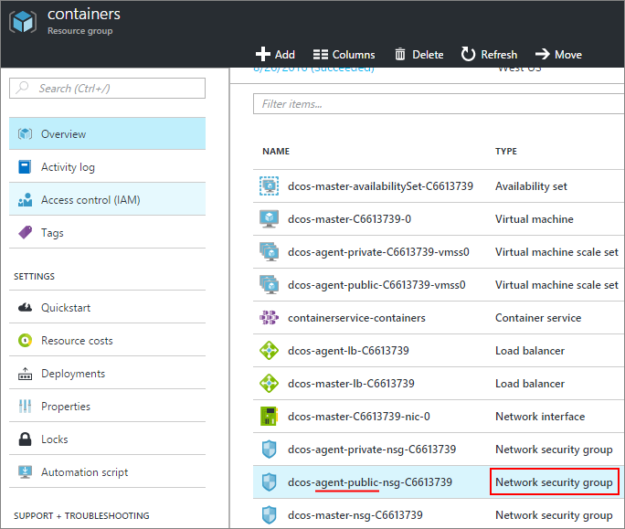
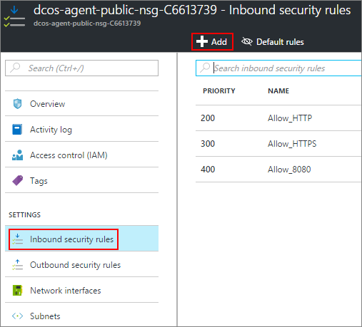

<properties
   pageTitle="Activer l’accès Public à une application ACS | Microsoft Azure"
   description="Comment activer l’accès public auprès d’un Service de conteneur Azure."
   services="container-service"
   documentationCenter=""
   authors="Thraka"
   manager="timlt"
   editor=""
   tags="acs, azure-container-service"
   keywords="Docker, conteneurs, Micro-services, Mesos, Azure"/>

<tags
   ms.service="container-service"
   ms.devlang="na"
   ms.topic="article"
   ms.tgt_pltfrm="na"
   ms.workload="na"
   ms.date="08/26/2016"
   ms.author="timlt"/>

# Activer l’accès public à une application de Service de conteneur Azure

N’importe quel conteneur DC/OS dans le ACS [pool agent public](container-service-mesos-marathon-ui.md#deploy-a-docker-formatted-container) est automatiquement exposée à internet. Par défaut, les ports **80**, **443**, **8080** sont ouverts et n’importe quel conteneur (public) à l’écoute de ces derniers sont accessibles. Cet article vous explique comment ouvrir davantage de ports pour vos applications dans Azure conteneur de Service.

## Ouvrir un port (portail) 

Tout d’abord, nous avons besoin ouvrir le port que nous voulons.

1. Connectez-vous au portail.
2. Recherchez le groupe de ressources que vous avez déployée le Service conteneur Azure.
3. Sélectionnez l’équilibrage de charge de l’agent (qui est un nom semblable à **XXXX-agent-kg-XXXX**).

    

4. Cliquez sur **teste** , puis sur **Ajouter**.

    

5. Remplissez le formulaire sonde et cliquez sur **OK**.

  	| Champ | Description |
  	| ----- | ----------- |
  	| Nom  | Un nom descriptif de la sonde. |
  	| Port  | Le port du conteneur pour tester. |
  	| Chemin d’accès  | (Quand en mode HTTP) Le chemin d’accès de site Web relative à détecter. HTTPS ne pas pris en charge. |
  	| Intervalle | Le délai entre sonde tente, en secondes. |
  	| Seuil incorrecte | Nombre de sonde consécutive tentatives avant d’aborder le conteneur mauvais état. | 
    

6. Retour en les propriétés de l’équilibrage de charge de l’agent, cliquez sur **charger les règles d’équilibrage de charge** , puis sur **Ajouter**.

    

7. Remplissez le formulaire d’équilibrage de charge, puis cliquez sur **OK**.

  	| Champ | Description |
  	| ----- | ----------- |
  	| Nom  | Un nom descriptif de l’équilibrage de charge. |
  	| Port  | Le port entrant public. |
  	| Port principal | Le port interne public du conteneur pour acheminer le trafic vers. |
  	| Pool de serveur principal | Les conteneurs de ce pool sera la cible pour cet équilibrage de charge. |
  	| Sonde | La sonde utilisée pour déterminer si une cible dans la **version serveur pool** est correcte. |
  	| Persistance d’une session | Détermine la façon dont le trafic à partir d’un client doit être géré pendant la durée de la session.  **Aucun**: les requêtes successives émanant du même client peuvent être gérés par n’importe quel conteneur. **IP du client**: demandes consécutives à partir de la même adresse IP client sont gérés par le même conteneur. **IP du client et le protocole**: demandes consécutives à partir de la même combinaison IP et le protocole client sont gérés par le même conteneur. |
  	| Délai d’inactivité | TCP (uniquement) En quelques minutes, la durée de conservation un client TCP/HTTP ouvrir sans compter sur *conservation* des messages. |

## Ajouter une règle de sécurité (portail)

Ensuite, nous devons ajouter une règle de sécurité qui achemine le trafic à partir de notre port ouvert à travers le pare-feu.

1. Connectez-vous au portail.
2. Recherchez le groupe de ressources que vous avez déployée le Service conteneur Azure.
3. Sélectionnez le groupe de sécurité de réseau agent **public** (qui est un nom semblable à **XXXX-agent-public-nsg-XXXX**).

    

4. Sélectionnez **sécurité règles de trafic entrant** , puis sur **Ajouter**.

    

5. Remplissez la règle de pare-feu pour autoriser le port de votre public et cliquez sur **OK**.

  	| Champ | Description |
  	| ----- | ----------- |
  	| Nom  | Un nom descriptif de la règle de pare-feu. |
  	| Priorité | Rang de priorité pour la règle. Le numéro est élevé la priorité est faible. |
  	| Source | Restreindre la plage d’adresses IP entrante pour être autorisé ou refusé par cette règle. Permet de **n’importe quel** pour ne pas spécifier une restriction. |
  	| Service | Sélectionnez un ensemble de services prédéfinis à que cette règle de sécurité s’applique. Dans le cas contraire utiliser **personnalisé** pour créer votre propre. |
  	| Protocole | Limiter le trafic basé sur **TCP** ou **UDP**. Permet de **n’importe quel** pour ne pas spécifier une restriction. |
  	| Plage de ports | Lorsque le **Service** est **personnalisé**, spécifie la plage de ports affecte cette règle. Vous pouvez utiliser un seul port, par exemple **80**, ou une plage comme **1024-1500**. |
  	| Action | Autoriser ou refuser le trafic répondant aux critères. |

## Étapes suivantes

Découvrez la différence entre [agents DC/OS publiques et privées](container-service-dcos-agents.md).

En savoir plus sur la [gestion de vos conteneurs DC/système d’exploitation](container-service-mesos-marathon-ui.md).