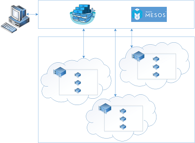

<properties
   pageTitle="Présentation de Service conteneur Azure | Microsoft Azure"
   description="Azure conteneur Service permet de simplifier la création, la configuration et la gestion d’un cluster de machines virtuelles sont préconfigurés pour exécuter des applications."
   services="container-service"
   documentationCenter=""
   authors="rgardler"
   manager="timlt"
   editor=""
   tags="acs, azure-container-service"
   keywords="Docker, conteneurs, Micro-services, Mesos, Azure"/>

<tags
   ms.service="container-service"
   ms.devlang="na"
   ms.topic="article"
   ms.tgt_pltfrm="na"
   ms.workload="na"
   ms.date="09/13/2016"
   ms.author="rogardle"/>

# Présentation de Service de conteneur Azure

Service de conteneur Azure facilite vous permettant de créer, configurer et gérer un cluster de machines virtuelles sont préconfigurés pour exécuter des applications. Il utilise une configuration optimisée des outils de planification et orchestration open source populaires. Cela vous permet d’utiliser vos compétences existantes ou appuyer sur un corps de grande taille ou croissant d’expertise communautaire, à déployer et gérer les applications basées sur conteneur sur Microsoft Azure.

Service de conteneur Azure s’appuie sur le format de conteneur Docker pour vous assurer que votre conteneurs d’application sont entièrement portables. Il prend également en charge le choix de Marathon et DC/système d’exploitation ou Docker par essaim afin que vous pouvez mettre à l’échelle ces applications conteneurs, et même des dizaines de milliers.

À l’aide de Service de conteneur Azure, vous pouvez tirer parti des fonctionnalités à l’échelle de l’entreprise d’Azure, tout en conservant la portabilité des applications, y compris la portabilité au niveau des couches d’orchestration.

À l’aide du Service de conteneur Azure
-----------------------------

Notre objectif avec Azure conteneur Service consiste à fournir un conteneur environnement d’hébergement à l’aide des outils open source et technologies d’assistance fréquemment consultés nos clients aujourd'hui. À cet effet, nous exposer les points de terminaison API standards pour votre orchestrator choisie (DC/OS ou Docker par essaim). À l’aide de ces points de terminaison, vous pouvez utiliser n’importe quel logiciel est en mesure de communiquer avec ces points de terminaison. Par exemple, dans le cas le point de terminaison Docker par essaim, vous pouvez choisir d’utiliser l’interface de ligne de Docker (commande). Pour DC/système d’exploitation, vous pouvez choisir d’utiliser la DCOS CLI.

Création d’un cluster Docker à l’aide du Service de conteneur Azure
-------------------------------------------------------

Pour commencer à utiliser le Service de conteneur Azure, vous déployez un cluster Azure conteneur Service via le portail (Rechercher « Azure conteneur Service »), en utilisant un modèle de gestionnaire de ressources Azure ([Docker par essaim](https://github.com/Azure/azure-quickstart-templates/tree/master/101-acs-swarm) ou [DC/système d’exploitation](https://github.com/Azure/azure-quickstart-templates/tree/master/101-acs-dcos)) ou avec l' [infrastructure du langage commun](/documentation/articles/xplat-cli-install/). Les modèles de démarrage rapide fourni peuvent être modifiés pour inclure configuration Azure avancée ou supplémentaire. Pour plus d’informations sur le déploiement d’un cluster de Service de conteneur Azure, voir [déployer un cluster Azure conteneur de Service](container-service-deployment.md).

Déploiement d’une application
------------------------

Service de conteneur Azure fournit un choix de Docker par essaim ou DC/système d’exploitation pour orchestration. Façon dont vous déployez votre application dépend de votre choix orchestrator.

### À l’aide de DC/système d’exploitation

Contrôleur de domaine/système d’exploitation est un système d’exploitation distribué basé sur le noyau de systèmes distribués Mesos Apache. Apache Mesos est hébergé à l’Apache Software Foundation et dresse la liste de la [plus grands noms dans informatique](http://mesos.apache.org/documentation/latest/powered-by-mesos/) en tant que les utilisateurs et les collaborateurs.

Contrôleur de domaine/système d’exploitation et Apache Mesos incluent un ensemble de fonctionnalités percutants :

-   Prouvées

-   Tolérance répliquées maître et les esclaves à l’aide de Apache soigneur

-   Prise en charge des conteneurs mis en forme Docker

-   Native isolement entre les tâches avec des conteneurs Linux

-   Multiresource planification (mémoire, processeur, disque et ports)

-   APIs C++ pour développer de nouvelles applications en parallèle, Python et Java

-   Une interface utilisateur web pour l’affichage État cluster

Par défaut, DC/système d’exploitation en cours d’exécution sur Azure conteneur Service inclut la plateforme orchestration Marathon pour la planification de charges de travail. Toutefois, est inclus dans le déploiement DC/système d’exploitation de ACS mésosphère parmi les services qui peuvent être ajoutés à votre service, notamment explosion, Hadoop, Cassandra et bien plus encore.

#### À l’aide de Marathon

Marathon est un système de contrôle des services dans cgroups--ou, dans le cas d’Azure conteneur Service, au format Docker conteneurs et initialisation cluster à l’échelle. Marathon fournit une interface utilisateur web à partir de laquelle vous pouvez déployer vos applications. Pour y accéder à l’URL qui ressemble à `http://DNS_PREFIX.REGION.cloudapp.azure.com` où DNS\_préfixe et régionaux sont définis au moment du déploiement. Bien entendu, vous pouvez également fournir votre propre nom de DNS. Pour plus d’informations sur l’exécution d’un conteneur à l’aide de l’interface utilisateur du web Marathon, voir [Gestion des conteneurs via l’interface utilisateur web](container-service-mesos-marathon-ui.md).

Vous pouvez également utiliser l’API REST pour communiquer avec Marathon. Il existe un certain nombre de bibliothèques de client qui sont disponibles pour chaque outil. Ils comprennent une variété de langues--et, bien entendu, vous pouvez utiliser le protocole HTTP dans n’importe quelle langue. En outre, de nombreux outils DevOps populaires prennent en charge Marathon. Souplesse maximale pour votre équipe lorsque vous travaillez avec un cluster de Service de conteneur Azure. Pour plus d’informations sur l’exécution d’un conteneur à l’aide de l’API REST Marathon, voir [Gestion des conteneurs avec l’API REST](container-service-mesos-marathon-rest.md).

### À l’aide de Docker essaim

Docker essaim fournit un cluster native pour Docker. Car Docker par essaim remplit l’API Docker standard, n’importe quel outil déjà communique avec un processus Docker pouvez utiliser essaim à l’échelle en toute transparence pour plusieurs hôtes Azure conteneur de service.

Outils pris en charge pour la gestion des conteneurs sur un cluster essaim incluent, mais ne sont pas limités à, ce qui suit :

-   Dokku

-   Docker infrastructure du langage commun et Docker composer

-   Krane

-   Jenkins

Vidéos
------

Prise en main Azure conteneur Service (101) :  

> [AZURE.VIDEO azure-container-service-101]

Création d’Applications au moyen du Service conteneur Azure (Build 2016)

> [AZURE.VIDEO build-2016-building-applications-using-the-azure-container-service]
