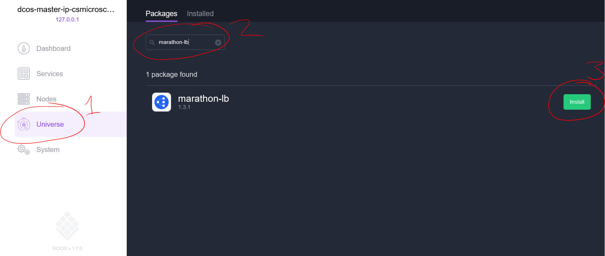

<properties
   pageTitle="Charger des conteneurs solde dans un cluster de Service de conteneur Azure | Microsoft Azure"
   description="Équilibrer les charges sur plusieurs conteneurs dans un cluster de Service de conteneur Azure."
   services="container-service"
   documentationCenter=""
   authors="rgardler"
   manager="timlt"
   editor=""
   tags="acs, azure-container-service"
   keywords="Conteneurs, Micro-services, DC/système d’exploitation, Azure"/>

<tags
   ms.service="container-service"
   ms.devlang="na"
   ms.topic="get-started-article"
   ms.tgt_pltfrm="na"
   ms.workload="na"
   ms.date="07/11/2016"
   ms.author="rogardle"/>

# <a name="load-balance-containers-in-an-azure-container-service-cluster"></a>Charger conteneurs solde dans un cluster de Service de conteneur Azure

Dans cet article, nous allons découvrir comment créer un programme d’équilibrage de charge interne dans un un contrôleur de domaine/système d’exploitation gérées Azure conteneur Service à l’aide de Marathon kg. Cela vous permettra à l’échelle horizontalement vos applications. Il permet également de tirer parti de l’agent publique et privée clusters en plaçant vos programmes d’équilibrage de charge sur le cluster public et les conteneurs de l’application sur le cluster privé.

## <a name="prerequisites"></a>Conditions préalables

[Déployer une instance de Service de conteneur Azure](container-service-deployment.md) avec type orchestrator DC/système d’exploitation et [Vérifiez que votre client peut se connecter à votre cluster](container-service-connect.md). 

## <a name="load-balancing"></a>Équilibrage de charge

Il existe deux couches d’équilibrage de charge dans le cluster conteneur Service que vous allez générer : 

  1. Équilibrage de charge Azure fournit les points d’entrée publique (ceux que les utilisateurs finaux atteindrez). Ceci est fournie automatiquement par Azure conteneur Service et est configuré pour exposer les ports 80, 443 et 8080 par défaut.
  2. L’équilibrage de charge Marathon (marathon kg) achemine des demandes entrantes vers les instances du conteneur que les demandes de service. Étant donné que nous évoluent conteneurs fournissant notre service web, marathon kg s’adapte dynamiquement. Ce programme d’équilibrage de charge n’est pas fourni par défaut dans votre Service de conteneur, mais il est très facile à installer.

## <a name="marathon-load-balancer"></a>Équilibrage de charge marathon

Équilibrage de charge marathon reconfigure dynamiquement elle-même en se basant sur les conteneurs que vous avez déployé. Il est également résistant à la perte d’un conteneur ou un agent - si cela se produit, Apache Mesos va redémarrer simplement le conteneur ailleurs et marathon kg s’adapte.

Pour installer l’équilibrage de charge Marathon vous pouvez utiliser soit le contrôleur de domaine/système d’exploitation web interface utilisateur ou la ligne de commande.

### <a name="install-marathon-lb-using-dcos-web-ui"></a>Installer Marathon kg à l’aide de l’interface utilisateur du Web DC/système d’exploitation

  1. Cliquez sur « Univers »
  2. Recherchez « Marathon kg »
  3. Cliquez sur « Installer »



### <a name="install-marathon-lb-using-the-dcos-cli"></a>Installer à l’aide de l’infrastructure du langage commun DC/OS Marathon kg

Après l’installation de l’infrastructure du langage commun DC/système d’exploitation et de s’assurer que vous pouvez vous connecter à votre cluster, exécutez la commande suivante à partir de votre ordinateur client :

```bash
dcos package install marathon-lb
```

Cette commande installe automatiquement l’équilibrage de charge sur le cluster agents publics.

## <a name="deploy-a-load-balanced-web-application"></a>Déployer une charge équilibrée Application Web

Maintenant que nous avons le package marathon kg, nous pouvons déployer un conteneur d’application que nous souhaitons équilibrage de charge. Dans cet exemple, nous allez déployer un serveur web simple à l’aide de la configuration suivante :

```json
{
  "id": "web",
  "container": {
    "type": "DOCKER",
    "docker": {
      "image": "yeasy/simple-web",
      "network": "BRIDGE",
      "portMappings": [
        { "hostPort": 0, "containerPort": 80, "servicePort": 10000 }
      ],
      "forcePullImage":true
    }
  },
  "instances": 3,
  "cpus": 0.1,
  "mem": 65,
  "healthChecks": [{
      "protocol": "HTTP",
      "path": "/",
      "portIndex": 0,
      "timeoutSeconds": 10,
      "gracePeriodSeconds": 10,
      "intervalSeconds": 2,
      "maxConsecutiveFailures": 10
  }],
  "labels":{
    "HAPROXY_GROUP":"external",
    "HAPROXY_0_VHOST":"YOUR FQDN",
    "HAPROXY_0_MODE":"http"
  }
}

```

  * Définir la valeur de `HAProxy_0_VHOST` le nom de domaine complet de l’équilibrage de charge de vos agents. Il s’agit de l’écran `<acsName>agents.<region>.cloudapp.azure.com`. Par exemple, si vous créez un cluster de Service de conteneur avec nom `myacs` dans la région `West US`, le nom de domaine complet serait `myacsagents.westus.cloudapp.azure.com`. Vous pouvez également trouver cette en recherchant l’équilibrage de charge « agents » dans le nom lorsque vous recherchez via les ressources dans le groupe de ressources que vous avez créé pour le Service de conteneur dans le [portail Azure](https://portal.azure.com).
  * Définir la servicePort à un port > = 10 000. Cela identifie le service est en cours d’exécution dans ce conteneur--marathon kg utilise pour identifier les services qu’il doit équilibrer.
  * Définir la `HAPROXY_GROUP` étiquette « externe ».
  * Définir `hostPort` 0. Cela signifie que Marathon va allouer arbitraire un port disponible.
  * Définir `instances` pour le nombre d’instances que vous voulez créer. Vous pouvez toujours évoluer ces monter et descendre plus tard.

Il est important de noing par défaut que marathon déployez pour le cluster privé, cela signifie que le déploiement ci-dessus ne seront accessible via votre équilibrage de charge, qui est généralement le comportement que nous souhaité.

### <a name="deploy-using-the-dcos-web-ui"></a>Déployer à l’aide de l’interface utilisateur Web DC/système d’exploitation

  1. Visitez la page Marathon à http://localhost/marathon (après avoir configuré votre [tunnel SSH](container-service-connect.md) et cliquez sur`Create Appliction`
  2. Dans la `New Application` dialogue, cliquez sur `JSON Mode` dans le coin supérieur droit
  3. Collez le JSON ci-dessus dans l’éditeur
  4. Cliquez sur`Create Appliction`

### <a name="deploy-using-the-dcos-cli"></a>Déployer à l’aide de l’infrastructure du langage commun DC/système d’exploitation

Pour déployer cette application avec l’infrastructure du langage commun DC/OS copiez simplement le JSON ci-dessus dans un fichier nommé `hello-web.json`et exécuter :

```bash
dcos marathon app add hello-web.json
```

## <a name="azure-load-balancer"></a>Équilibrage de charge Azure

Par défaut, équilibrage de charge Azure expose les ports 80, 8080 et 443. Si vous utilisez une de ces trois ports (comme nous le faire dans l’exemple ci-dessus), puis ne rien que faire. Vous devriez pouvoir d’accès au nom de domaine complet de votre équilibrage de charge de l’agent--et chaque fois que vous actualisez, vous allez toucher un de vos serveurs trois web de manière cyclique. Toutefois, si vous utilisez un autre port, vous devez ajouter une règle alternées et une sonde sur l’équilibrage de charge pour le port que vous avez utilisé. Vous pouvez le faire à partir de l' [Infrastructure du langage commun Azure](../xplat-cli-azure-resource-manager.md), avec les commandes `azure network lb rule create` et `azure network lb probe create`. Vous pouvez également le faire à l’aide du portail Azure.


## <a name="additional-scenarios"></a>Scénarios supplémentaires

Vous pouvez avoir un scénario où vous utilisez des domaines différents pour exposer les différents services. Par exemple :

mydomain1.com -> LB:80 Azure -> marathon-lb:10001 -> mycontainer1:33292  
mydomain2.com -> LB:80 Azure -> marathon-lb:10002 -> mycontainer2:22321

Pour ce faire, consultez [hôtes virtuels](https://mesosphere.com/blog/2015/12/04/dcos-marathon-lb/), qui permettent d’associer des domaines à chemins d’accès kg marathon spécifique.

Par ailleurs, vous pouvez exposer les différents ports et les remappe vers le bon service derrière marathon kg. Par exemple :

Azure lb:80 -> marathon-lb:10001 -> mycontainer:233423  
Azure lb:8080 -> marathon-lb:1002 -> mycontainer2:33432


## <a name="next-steps"></a>Étapes suivantes

Consultez la documentation DC/système d’exploitation pour activé plus [marathon kg](https://dcos.io/docs/1.7/usage/service-discovery/marathon-lb/).
