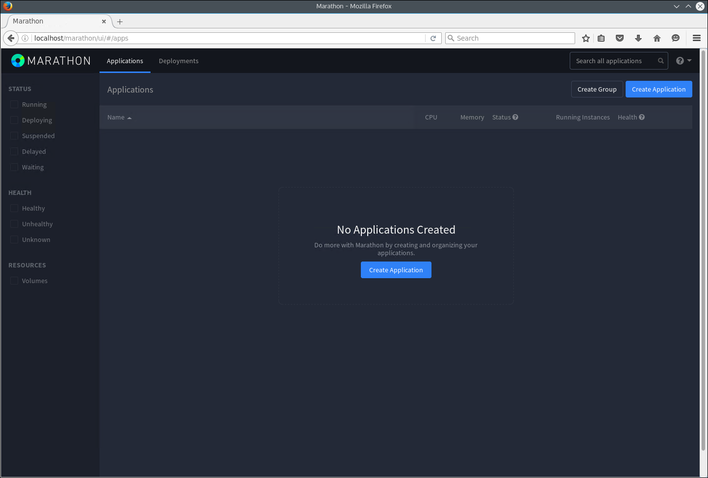
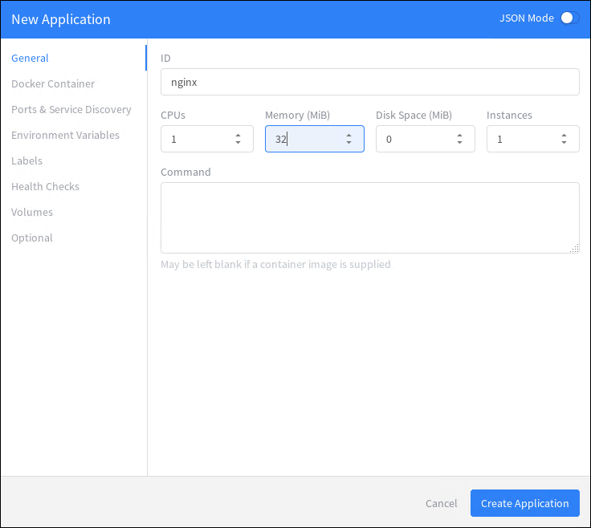
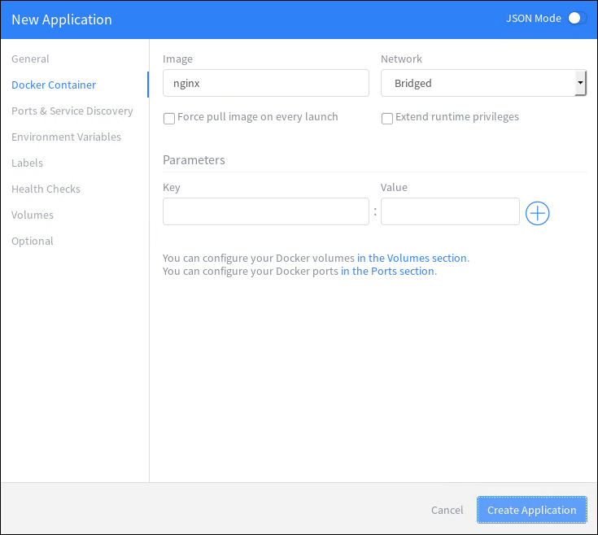
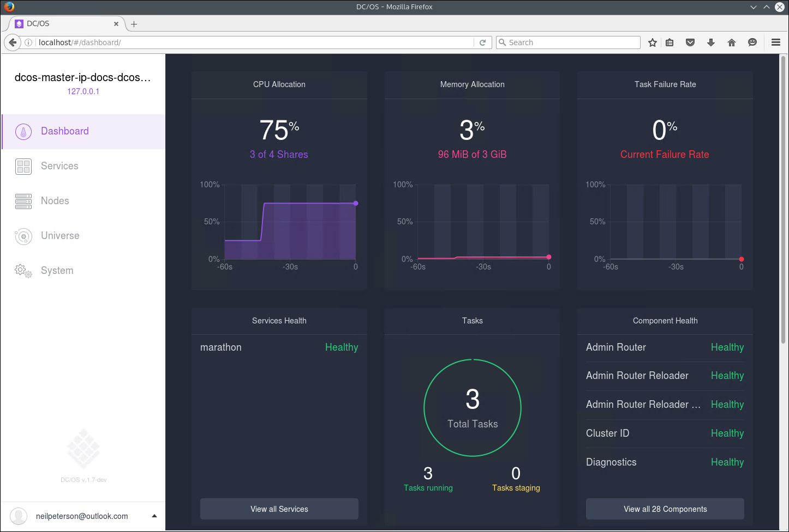

<properties
   pageTitle="Gestion des conteneurs conteneur Service Azure via l’interface utilisateur web | Microsoft Azure"
   description="Déployer des conteneurs auprès d’un service de cluster Azure conteneur Service à l’aide de l’interface utilisateur du web Marathon."
   services="container-service"
   documentationCenter=""
   authors="neilpeterson"
   manager="timlt"
   editor=""
   tags="acs, azure-container-service"
   keywords="Docker, conteneurs, Micro-services, Mesos, Azure"/>

<tags
   ms.service="container-service"
   ms.devlang="na"
   ms.topic="get-started-article"
   ms.tgt_pltfrm="na"
   ms.workload="na"
   ms.date="09/19/2016"
   ms.author="timlt"/>

# <a name="container-management-through-the-web-ui"></a>Gestion des conteneurs via l’interface utilisateur web

Contrôleur de domaine/système d’exploitation fournit un environnement de déploiement et de mise à l’échelle de charges de travail groupés, tout en s’extrayant du matériel sous-jacent. En haut DC/système d’exploitation, il est une infrastructure qui gère la planification et de l’exécution de charges de travail de calcul.

Structures sont nombreuses charges de travail courantes, ce document décrit comment vous pouvez créer et mettre à l’échelle déploiements conteneur avec Marathon. Avant de suivre ces exemples, vous avez besoin d’un cluster DC/système d’exploitation qui n’est configuré dans Azure conteneur de Service. Vous devez également disposer d’une connectivité à distance à ce cluster. Pour plus d’informations sur ces éléments, voir les articles suivants :

- [Déployer un cluster de Service de conteneur Azure](container-service-deployment.md)
- [Se connecter à un cluster de Service de conteneur Azure](container-service-connect.md)

## <a name="explore-the-dcos-ui"></a>Explorer l’interface utilisateur DC/OS

Avec un tunnel SSH (Secure Shell) établi, accédez à http://localhost/. Cette du chargement de l’interface utilisateur du web DC/système d’exploitation et affiche des informations sur le cluster, telles que les ressources utilisées, agents actifs et les services en cours d’exécution.


## <a name="explore-the-marathon-ui"></a>Explorer la Marathon l’interface utilisateur

Pour afficher l’interface utilisateur Marathon, accédez à http://localhost/Marathon. À partir de cet écran, vous pouvez démarrer un nouveau conteneur ou une autre application sur le cluster Azure conteneur Service contrôleur de domaine/système d’exploitation. Vous pouvez également voir informations sur l’exécution des conteneurs et des applications.  



## <a name="deploy-a-docker-formatted-container"></a>Déployer un conteneur mis en forme Docker

Pour déployer un nouveau conteneur à l’aide de Marathon, cliquez sur le bouton **Créer une Application** et entrez les informations suivantes dans le formulaire :

Champ           | Valeur
----------------|-----------
ID              | nginx
Image           | nginx
Réseau         | Partie d’un pont
Port hôte       | 80
Protocole        | TCP






Si vous voulez mapper de manière statique le port conteneur à un port de l’agent, vous devez utiliser le Mode JSON. Pour ce faire, passer l’Assistant Nouvelle Application au **Mode JSON** en utilisant le bouton bascule. Entrez les données suivantes sous le `portMappings` section de la définition d’application. Cet exemple lie le port 80 du conteneur vers le port 80 de l’agent DC/OS. Vous pouvez basculer cet Assistant déconnecter JSON Mode après avoir apporté cette modification.

```none
"hostPort": 80,
```


Le cluster DC/système d’exploitation est déployé avec jeu d’agents publiques et privées. Pour le cluster doivent pouvoir accéder à des applications à partir d’Internet, vous devez déployer les applications sur un agent public. Pour ce faire, cliquez sur l’onglet **facultatif** de l’Assistant Nouvelle Application et entrez **slave_public** pour les **Rôles des ressources accepté**.


Dans la page principale Marathon, vous pouvez voir l’état du déploiement pour le conteneur.


Lorsque vous revenez à l’interface utilisateur (http://localhost/) de la web DC/système d’exploitation, vous verrez qu’une tâche (dans ce cas, un conteneur mis en forme Docker) s’exécute sur le cluster DC/système d’exploitation.


Vous pouvez également afficher le nœud qui la tâche est en cours d’exécution.


## <a name="scale-your-containers"></a>Mettre à l’échelle vos conteneurs

Vous pouvez utiliser l’interface utilisateur Marathon à l’échelle le nombre d’instances d’un conteneur. Pour ce faire, accédez à la page **Marathon** , sélectionnez le conteneur dans lequel vous voulez mettre à l’échelle, puis cliquez sur le bouton **d’échelle** . Dans la boîte de dialogue **Application d’échelle** , entrez le nombre d’instances de conteneur souhaitée, puis sélectionnez **Échelle Application**.


Une fois l’opération d’échelle terminée, vous verrez plusieurs instances de la même tâche réparties agents DC/OS.




## <a name="next-steps"></a>Étapes suivantes

- [Utiliser des DC/système d’exploitation et de l’API Marathon](container-service-mesos-marathon-rest.md)

Approfondie sur le Service de conteneur Azure avec Mesos

> [AZURE. Azurecon-2015-deep-dive-on-the-azure-container-service-with-mesos vidéo]]
