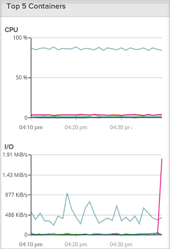
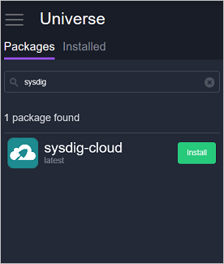

<properties
   pageTitle="Surveiller un cluster Azure conteneur Service avec Sysdig | Microsoft Azure"
   description="Surveiller un cluster Azure conteneur Service avec Sysdig."
   services="container-service"
   documentationCenter=""
   authors="rbitia"
   manager="timlt"
   editor=""
   tags="acs, azure-container-service"
   keywords="Conteneurs, DC/système d’exploitation, Azure"/>

<tags
   ms.service="container-service"
   ms.devlang="na"
   ms.topic="get-started-article"
   ms.tgt_pltfrm="na"
   ms.workload="na"
   ms.date="08/08/2016"
   ms.author="t-ribhat"/>

# Surveiller un cluster Azure conteneur Service avec Sysdig

Dans cet article, nous déployez agents Sysdig tous les nœuds de l’agent de votre cluster Azure conteneur Service. Vous avez besoin d’un compte avec Sysdig pour cette configuration. 

## Conditions préalables 

[Déployer](container-service-deployment.md) et [vous connecter](container-service-connect.md) un cluster configuré par Azure conteneur de Service. Explorer la [Marathon interface utilisateur](container-service-mesos-marathon-ui.md). Accédez à [http://app.sysdigcloud.com](http://app.sysdigcloud.com) pour configurer un compte de cloud Sysdig. 

## Sysdig

Sysdig est un service de surveillance qui vous permet de surveiller les conteneurs dans votre cluster. Sysdig est connue pour vous aider à résoudre les problèmes, mais il comporte également votre base audits de surveillance pour processeur, mise en réseau, la mémoire et e/s. Sysdig facilite la voir quels conteneurs travaillent essentiellement ou les plus difficiles à l’aide de la plus de mémoire et de l’UC. Cet affichage est dans la section « Vue d’ensemble », qui se trouve actuellement dans la version bêta. 

 

## Configurer un déploiement Sysdig avec Marathon

Ces étapes vous montrent comment configurer et déployer des applications Sysdig à votre cluster avec Marathon. 

Accéder à votre interface utilisateur DC/OS via [http://localhost : 80 /](http://localhost:80/) une fois dans l’interface utilisateur DC/OS atteindre le « univers », ce qui se trouve dans le bas à gauche, puis rechercher « Sysdig ».

Pour terminer la configuration vous devez maintenant un compte de cloud Sysdig ou d’un compte d’évaluation gratuit. Une fois que vous êtes connecté au site Web cloud Sysdig, cliquez sur votre nom d’utilisateur et dans la page, vous devez voir votre « touche d’accès ». 

 

Ensuite, entrez votre clé d’accès dans la configuration Sysdig au sein de l’univers DC/système d’exploitation. 

Définir maintenant les instances 10000000 donc chaque fois qu’un nouveau nœud est ajouté au cluster Sysdig seront automatiquement déployer un agent sur ce nouveau nœud. Il s’agit d’une solution intermédiaire pour vous assurer que tous les nouveaux agents au sein du cluster déployez Sysdig. 

Une fois que vous avez installé le package, accédez à la Sysdig UI et vous pourrez Explorer les mesures d’utilisation différents pour les conteneurs dans votre cluster. 