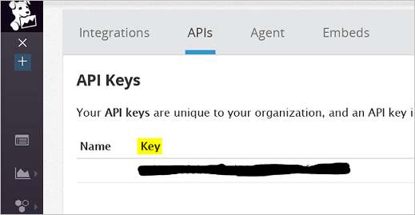

<properties
   pageTitle="Surveiller un cluster Azure conteneur Service avec Datadog | Microsoft Azure"
   description="Surveiller un cluster Azure conteneur Service avec Datadog. Utiliser l’interface utilisateur du web DC/système d’exploitation pour déployer les agents Datadog à votre cluster."
   services="container-service"
   documentationCenter=""
   authors="rbitia"
   manager="timlt"
   editor=""
   tags="acs, azure-container-service"
   keywords="Conteneurs, DC/système d’exploitation, Docker essaim, Azure"/>

<tags
   ms.service="container-service"
   ms.devlang="na"
   ms.topic="article"
   ms.tgt_pltfrm="na"
   ms.workload="infrastructure"   
   ms.date="07/28/2016"
   ms.author="t-ribhat"/>

# Surveiller un cluster Azure conteneur Service avec Datadog

Dans cet article nous déployez agents Datadog tous les nœuds de l’agent de votre cluster Azure conteneur Service. Vous avez besoin d’un compte avec Datadog pour cette configuration. 

## Conditions préalables 

[Déployer](container-service-deployment.md) et [vous connecter](container-service-connect.md) un cluster configuré par Azure conteneur de Service. Explorer la [Marathon interface utilisateur](container-service-mesos-marathon-ui.md). Accédez à [http://datadoghq.com](http://datadoghq.com) pour configurer un compte Datadog. 

## Datadog 

Datadog est un service de surveillance qui regroupe les données d’analyse à partir de vos conteneurs dans votre cluster Azure conteneur Service. Datadog contient un tableau de bord de l’intégration Docker où vous pouvez consulter les audits spécifiques au sein de votre conteneurs. Métriques obtenues vos conteneurs sont organisées en charge du processeur, mémoire, réseau et e/s. Datadog fractionne métriques en conteneurs et des images. Exemple de quoi ressemble l’interface utilisateur pour l’utilisation du processeur est inférieur à.

## Configurer un déploiement Datadog avec Marathon

Ces étapes vous montrent comment configurer et déployer des applications Datadog à votre cluster avec Marathon. 

Accéder à votre interface utilisateur DC/OS via [http://localhost : 80 /](http://localhost:80/). Une fois dans l’interface utilisateur DC/OS recherchez « Univers » qui se trouve dans le bas à gauche et recherchez « Datadog », puis cliquez sur « Installer ».

Maintenant pour terminer la configuration vous avez besoin d’un compte Datadog ou un compte d’évaluation gratuit. Une fois que vous êtes connecté à l’apparence du site Web Datadog vers la gauche et accédez à intégrations -> puis l’API. 

Ensuite, entrez votre clé de l’API dans la configuration Datadog au sein de l’univers DC/système d’exploitation. 

 

Dans la configuration ci-dessus instances sont définies sur 10000000, chaque fois qu’un nouveau nœud est ajouté au cluster Datadog allez déployer automatiquement un agent vers ce nœud. Il s’agit d’une solution intermédiaire. Une fois que vous avez installé le package, vous devez retourner sur le site Web Datadog et recherchez « Tableaux de bord ». À partir de là, vous verrez personnalisée et l’intégration des tableaux de bord. Le tableau de bord de l’intégration Docker auront toutes les mesures de conteneur que vous avez besoin pour votre cluster surveillance des mots clés. 
