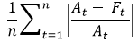
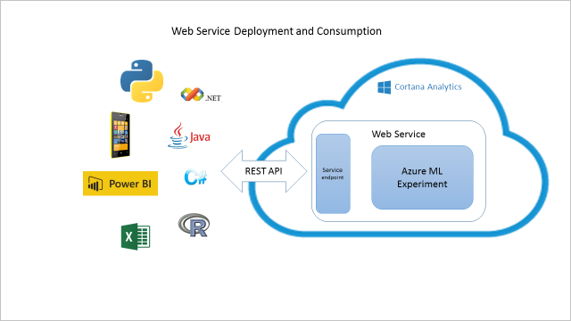
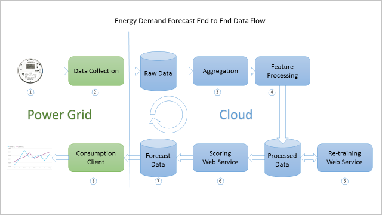

<properties
    pageTitle="Cortana Intelligence Solution modèle manuel pour réaliser des prévisions à la demande d’énergétique | Microsoft Azure"
    description="Un modèle de Solution avec Microsoft Cortana Intelligence qui vous permet de réaliser des prévisions à la demande pour une société utilitaire énergétique."
    services="cortana-analytics"
    documentationCenter=""
    authors="ilanr9"
    manager="ilanr9"
    editor="yijichen"/>

<tags
    ms.service="cortana-analytics"
    ms.workload="data-services"
    ms.tgt_pltfrm="na"
    ms.devlang="na"
    ms.topic="article"
    ms.date="01/24/2016"
    ms.author="ilanr9;yijichen;garye"/>

# Cortana Intelligence Solution modèle manuel pour réaliser des prévisions à la demande d’énergétique  

## Synthèse  

Dans ces dernières années, Internet des objets (IoT), des sources de remplacement énergétique et données volumineuses ont fusionnées de manière à créer des opportunités grandes pour le domaine utilitaire et énergétique. En même temps, l’utilitaire et le secteur énergétique entière avons consommation mise à plat avec les consommateurs exigent les meilleures façons de contrôler son utilisation des énergétique. Par conséquent, l’utilitaire et sociétés grille actives sont absolument besoin pour innovation et renouveler eux-mêmes. En outre, grilles power et utilitaire de nombreux deviennent obsolètes et très coûteuses à mettre à jour et gérer. Au cours de l’année dernière, l’équipe a travaillé sur un certain nombre d’engagements au sein du domaine énergétique. Au cours de ces engagements, nous avons rencontré nombreux cas dans laquelle l’utilitaires ou éditeurs de logiciels (éditeurs de logiciels) ont été recherchez dans la prévision de la demande énergétique futures. Ces prévisions jouent un rôle important dans leurs activités actuelles et futures et sont au cœur pour différents cas d’utilisation. Ils incluent prévision de chargement power court et long terme, cotation, l’équilibrage de charge, l’optimisation de grille etc.. Big data et méthodes avancées Analytique (AA) comme Machine apprentissage (ML) sont les déterminants de production prévisions précises et fiables.  

Dans ce manuel, nous rassembler l’entreprise et analytiques instructions nécessaires pour un développement réussi et déploiement de la demande énergétique prévision solution. Ces instructions proposées peuvent aider à utilitaires, les données scientifiques et les ingénieurs de données lors de l’établissement solutions entièrement operationalized, sur le nuage, prévision de la demande. Pour les entreprises débutants leur big data et voyage analytique avancées, une telle solution peut représenter la valeur de départ initiale dans leur stratégie de grille actives à long terme.

>[AZURE.TIP] Pour télécharger un diagramme qui fournit une vue d’ensemble architecturale de ce modèle, voir [architecture de modèle de Solution Intelligence Cortana pour réaliser des prévisions à la demande d’énergétique](cortana-analytics-architecture-demand-forecasting-energy.md).  

## Vue d’ensemble  

Ce document traite de l’entreprise, les données et les aspects techniques de l’utilisation de Cortana Intelligence et en particulier Azure Machine apprentissage (agréés) pour la mise en œuvre et le déploiement des Solutions de réaliser des prévisions énergétique. Le document se compose de trois parties principales :  

1. Présentation de l’entreprise  
2. Présentation de données  
3. Mise en œuvre technique

Le composant **Compréhension commerciale** présente l’aspect professionnel il est nécessaire de comprendre et de prendre en compte avant de prendre une décision d’investissement. Il explique comment qualifier le problème de l’entreprise à portée de main pour vous assurer que prédictive analytique et apprentissage automatique sont bien efficaces et applicable. Le document plus explique les notions de base d’apprentissage automatique et la manière dont il est utilisé pour résoudre les problèmes de prévision énergétique. Il présente les conditions préalables et les critères d’inclusion d’un cas d’utilisation. Quelques exemples cas d’utilisation et étude de cas scénarios sont également disponibles.

Les données sont le composant principal pour n’importe quel ordinateur solution d’apprentissage. Le composant **Comprendre des données** de ce document traite certains aspects importants de données. Il présente le type de données sont nécessaire pour réaliser des prévisions énergétique, exigences de qualité des données et les sources de données sont généralement situés. Nous expliquent également comment les données brutes sont utilisées pour préparer les fonctionnalités de données en réalité conduire à la partie de modélisation.

La troisième partie du document traite de l’aspect **d’Implémentation technique** d’une solution. Fonctionnalité ingénierie et modélisation sont au cœur du processus scientifique données et sont donc examinées en détail. Il recouvre le concept de services web, qui sont un véhicule importantes pour le déploiement de cloud des solutions prédictive analytique. Nous avons également créer un plan une architecture classique d’une solution operationalized de bout en bout.

En outre, le document comprend des informations de référence, vous pouvez utiliser pour mieux comprendre le fonctionnement de la technologie et de domaine.

Il est important de noter que nous ne comptez pas expliquer dans ce document le processus scientifique des données plus approfondie, ses aspects techniques et mathématiques. Ces informations sont accessibles dans la [documentation de Azure ML](http://azure.microsoft.com/services/machine-learning/) et [blogs](http://blogs.microsoft.com/blog/tag/azure-machine-learning/).

### Public cible   
Le public cible de ce document est entreprise et techniciens qui souhaiteraient de prendre connaissance et compréhension d’apprentissage automatique sur la base des solutions et comment ils sont utilisées en particulier dans le domaine de prévision énergétique.

Scientifiques de données peuvent également tirer parti de ce document afin de mieux comprendre du processus de haut niveau que les lecteurs du déploiement d’un énergétique solution de prévision. Dans ce contexte il peut également être utilisé pour établir un planning de référence bonne et point de départ pour plus d’informations détaillées et avancé matériel.

### Tendances du secteur  
Dans ces dernières années, IoT, des sources de remplacement énergétique et données volumineuses ont fusionnées de manière à créer des opportunités vastes dans l’espace réservé utilitaire et énergétique. En même temps, l’utilitaire et les secteurs entier énergétique avons consommation mise à plat avec les consommateurs exigent les meilleures façons de contrôler son utilisation des énergétique.

De nombreux utilitaire et sociétés énergétique actives ont été novatrices la [grille active](https://en.wikipedia.org/wiki/Smart_grid) en déployant un certain nombre de cas qui le rendent utiliser des données générées par la grille. Exemples d’utilisation de nombreux concernent les caractéristiques de production électricité intrinsèque à : ne peut pas être accumulé ni stockée effectuées en tant que stock. Par conséquent, ce qui est produit est nécessaire. Utilitaires qui souhaitent devenir plus efficace doivent établir une prévision simplement la consommation électrique, car vous obtiendrez ainsi capacité plus importante à **l’offre et la demande**, afin d’éviter que gaspillage énergétique, **réduire d’émission de gaz serre**et coût du contrôle.

Lorsque vous parlez de coûts, il existe un autre aspect important, qui est le prix. Nouvelles possibilités aux échanges power entre utilitaires ont été à devoir de **prévision future de la demande et les prix futur d’électricité**. Cela peut aider sociétés déterminer leurs volumes de production.

Lorsque nous utilisons le mot « intelligent », nous font référence à une grille qui peut en savoir plus et effectuer des prévisions. Il peut anticiper les changements saisonniers consommation, ainsi que **prévoir les situations de surcharge temporaire et ajuster automatiquement pour qu’elle**. Par le contrôle à distance de consommation (à l’aide de ces règles actives), les situations de surcharge localisés peuvent être résolues. **Par tout d’abord prédire et d’agir**, la grille devient plus intelligemment au fil du temps.

Pour le reste de ce document à un ensemble spécifique de cas d’utilisation couvrant les prévisions futur, nous allons nous concentrer à court terme et à la demande énergétique à long terme. Nous ont travaillé dans ces domaines pendant quelques mois et maîtriser certaines connaissances et les compétences qui permet de générer des résultats de qualité du secteur. Autres utilisations seront traitées ainsi que dans le document dans un futur proche.

## Présentation de l’entreprise

### Objectifs d’entreprise
L’objectif **Démo énergétique** est pour montrer un analytique prédictive standard et l’apprentissage solution qui peut être déployée dans un cadre très peu de temps de l’ordinateur. Notre objectif en cours est plus précisément, sur l’activation des solutions de prévision à la demande énergétique afin que sa valeur entreprise peut être rapidement réalisé et exploitée lors de la. Les informations contenues dans ce manuel peuvent aider le client accomplir les objectifs suivants :
-   Solution basée sur l’heure, abrégé à la valeur d’apprentissage automatique
-   Possibilité de développer un pilote utiliser la casse à d’autres exemples d’utilisation ou à une étendue plus large en fonction de leurs besoins de l’entreprise
-   Rapidement connaissance des produits Cortana Intelligence Suite

Avec ces objectifs à l’esprit, ce manuel vise à exécution de l’entreprise et des connaissances techniques qui vous aideront à atteindre ces objectifs.

### Chargement de Power et réaliser des prévisions à la demande
Dans le secteur énergétique, vous pouvez rencontrer plusieurs façons dans la demande réaliser des prévisions peuvent aider à résoudre des problèmes critiques. En fait, vous réalisez des prévisions à la demande peuvent être considéré comme la base de nombreux cas d’utilisation core du secteur. En règle générale, nous prenons en compte deux types de prévisions de la demande énergétique : à court terme et à long terme. Chacun d'entre eux peut servent un objectif différent et d’utiliser une approche différente. La différence entre les deux principale est l’horizon de prévision, ce qui signifie que l’intervalle de temps dans l’avenir pour laquelle nous serait prévisions.

#### Court terme charge réaliser des prévisions
Dans le cadre de la demande énergétique, court terme charger réaliser des prévisions (STLF) est définie comme la charge agrégée est prévue dans le futur proche des différentes parties de la grille (ou la grille dans son ensemble). Dans ce contexte, à court terme est défini pour être période dans la plage d’une heure à 24 heures. Dans certains cas, un horizon de 48 heures est également possible. Par conséquent, STLF est très courant à un cas d’utilisation opérationnelles de la grille. Voici quelques exemples de STLF par l’effort des exemples d’utilisation :
-   Équilibrage de charge offre et la demande
-   Prise en charge commerciaux alimentation
-   Fabrication de marché (prix de power paramètre)
-   Optimiser le fonctionnement grille
-   [Réponse à la demande](https://en.wikipedia.org/wiki/Demand_response)
-   Nombre maximal de prévision de la demande
-   Gestion de la demande
-   Équilibrage de charge et prévention de surcharge
-   À long terme charge réaliser des prévisions
-   Détection des anomalies et de défaillance
-   Réduction/le nivellement pointe 

Modèle de STLF sont principalement basé sur le passé near (dernier jour ou semaine) relatives à la consommation et l’utilisation prévue température comme un predictor importantes. Obtention de température avec une précision de prévision pour l’heure suivante et vers le haut à 24 heures devient moins compliqué jours maintenant. Ces modèles sont moins sensibles saisonniers motifs ou des tendances de consommation à long terme.

Solutions SLTF sont également susceptibles de générer un volume élevé d’appels de prévision (demandes de service) dans la mesure où ils sont appelées toutes les heures et dans certains cas, même avec fréquence plus élevée. Il est également très courant de voir implantation où chaque sous-centrale individuel ou transformer est représenté par un modèle autonome et par conséquent le volume de requêtes de prévision sont encore plus.

#### À long terme charge réaliser des prévisions
L’objectif de Long terme charge réaliser des prévisions (LTLF) est de prévision à la demande power avec une période allant de la semaine 1 à plusieurs mois (et dans certains cas, pour un nombre d’années). La plage de horizon est principalement applicable pour la planification et investissement exemples d’utilisation.

Pour des scénarios à long terme, il est important que les données de haute qualité qui couvre une période de plusieurs années (minimum 3 ans). Ces modèles généralement extrait les motifs de saisonnalité à partir des données historiques et utilisez predicators externes telles en tant que modèles météorologiques et climatiques.

Il est important de clarifier que plus la prévision horizon est, peut-être moins précise la prévision. Il est donc important générer un intervalle de confiance ainsi que les prévisions réelle qui permet à l’homme au facteur la variation possible dans leur processus de planification.

Étant donné que le scénario de consommation pour LTLF est principalement planification, nous pouvons nous attendre quantité inférieures volumes de prévision (par rapport à STLF). Nous s’affichent généralement ces prévisions incorporées dans les outils de visualisation tels qu’Excel ou PowerBI et être appelés manuellement par l’utilisateur.

### Court terme par rapport à Long terme prédiction
Le tableau suivant compare STLF et LTLF en ce qui concerne les attributs les plus importantes :

|Attribut|Chargement à court terme de prévision|À long terme prévision de chargement|
|---|---|---|
|PREVISION Horizon|À partir de 1 heure à 48 heures|Comprise entre 1 et 6 mois ou plus|
|Précision des données|Toutes les heures|Toutes les heures ou tous les jours|
|Scénarios d’utilisation classiques|<ul><li>Équilibrage de la demande/approvisionnement</li><li>Sélectionnez heure réaliser des prévisions</li><li>Réponse à la demande</li></ul>|<ul><li>Planification à long terme</li><li>Planification des éléments de grille</li><li>Planification des ressources</li></ul>|
|Indicateurs classiques|<ul><li>Jour ou semaine</li><li>Heure du jour</li><li>Température horaire</li></ul>|<ul><li>Mois de l’année</li><li>Jour du mois</li><li>Température à long terme et climat</li></ul>|
|Plage de données historiques|Deux ou trois années de données|5 à 10 années de données|
|Précision classique|MAPE * inférieure ou égale à 5 %|MAPE * inférieure ou égale à 25 %|
|Fréquence de prévision|Produits toutes les heures ou toutes les 24 heures|Produit une fois que mensuelles, trimestrielles ou annuel|
\*[MAPE](https://en.wikipedia.org/wiki/Mean_absolute_percentage_error) – erreur de pourcentage moyenne moyenne

Comme le montre ce tableau, il est très important de faire la distinction entre court et à long terme vous réalisez des prévisions scénarios que ces représentent différents besoins professionnels et peuvent avoir différente déploiement et consommation.

### Exemple d’utilisation exemple 1 : eSmart systèmes – optimisation de surcharge
Un rôle important d’une [grille active](https://en.wikipedia.org/wiki/Smart_grid) consiste à dynamiquement constamment optimiser et ajuster pour les modèles de consommation variable. Consommation électrique peut être affectée par les modifications apportées à court terme principalement causés par les variations de température (*par exemple*, plus de puissance est utilisé pour air condition ou chauffage). En même temps, la consommation électrique est également affectée par les tendances à long terme. Il peut s’agir saisonnalité effets, jours fériés nationaux, croissance consommation à long terme et même économiques facteurs tels qu’index consommateur prix oil mises et GDP.

Dans ce cas d’utilisation, [eSmart](http://www.esmartsystems.com/) souhaite déployer une solution sur le nuage qui permet de prédire la tendance d’une situation de surcharge sur n’importe quel sous-centrale donné de la grille. En particulier, eSmart souhaite identifier sous-stations qui sont susceptibles de surcharge dans l’heure suivante, pour une action immédiate pourrait être prise pour éviter ou résoudre ce problème.

Une précision et en exécutant rapidement prédiction nécessite l’implémentation de trois modèles prédictives :
-   Modèle de magasin de termes long qui permet de réaliser des prévisions de consommation électrique dans chaque sous-centrale au cours suivant de plusieurs semaines ou mois
-   Modèle à court terme qui permet de prédiction de situation de surcharge sur une sous-station donnée au cours de l’heure suivante
-   Modèle de température qui fournit la prévision de la température future sur plusieurs scénarios

L’objectif du modèle à long terme consiste à classer les sous-stations par leur tendance surcharger (compte tenu de leur capacité de transmission power) au cours de la semaine ou mois suivant. Cela permet la création d’une courte liste des sous-stations serait servir d’entrée pour la prévision à court terme. Comme un predictor importantes pour le modèle à long terme température, il est nécessaire pour produire prévisions multi-scénario température en permanence et les flux comme entrée dans le modèle à long terme. La prévision à court terme est ensuite appelée pour prévoir le sous-centrale est susceptible de surcharge sur l’heure suivante.

Les modèles à court terme et à long terme déployés individuellement par chaque sous-centrale. Par conséquent, l’exécution de ces modèles pratique nécessite orchestration complète. Pour obtenir une précision prédiction supérieure à court terme, un modèle plus granulaire dédié pour chaque heure du jour. Tous ces modèles sont exécutées chaque heure et de fin de l’exécution de quelques minutes pour laisser suffisamment de temps répondre et prendre des actions préventives si nécessaire. Cette collection de modèles est mises à jour en reconversion périodique à l’aide de données les plus récentes.

Plus d’informations sur ce cas d’utilisation sont accessibles [ici](https://customers.microsoft.com/Pages/CustomerStory.aspx?recid=18945).

#### Utiliser des critères de Qualification casse – conditions préalables
La puissance principale du Cortana Intelligence est dans sa capacité à déployer et mettre à l’échelle machine centré sur les formations puissante. Il est conçu pour la prise en charge des milliers de prévisions sont exécutés simultanément. Il peut s’adapter automatiquement afin de répondre à un modèle de consommation variable. Il est donc le focus d’une solution sur précision et les performances de calcul. Par exemple, une société est intéressée produire à la demande énergétique avec une précision de prévision pour l’heure et pour chaque heure du jour. En revanche, nous intéresse moins répondre à la question de la raison pour laquelle la demande est prédites à telle qu’elle est (le modèle lui-même se charge de cette).

Par conséquent, il est important de savoir que pas tous les exemples d’utilisation et les problèmes d’entreprise peuvent être résolus efficacement à l’aide d’apprentissage automatique.

Cortana Intelligence et apprentissage automatique peuvent être très efficaces pour résoudre un problème d’entreprise donnée lorsque les conditions suivantes sont réunies :
-   Problème de l’entreprise en main est **prédictive** par nature. Un exemple de cas d’utilisation prédictive est une société qui aimerais prédire charge power sur une sous-station donnée au cours de l’heure suivante. En revanche, analyser et classement des pilotes de la demande historique serait **descriptif** nature et par conséquent moins applicables.
-   Il existe un effacer **chemin d’accès de l’action** à prendre une fois que la prévision est disponible. Par exemple, prévoir une surcharge sur une sous-station pendant l’heure suivante peut déclencher une action proactive de réduction de charge associé à ce sous-centrale et afin d’éviter que potentiellement une surcharge.
-   Le cas d’utilisation représente un tels que le **type de type de problème** résolu qui, lorsqu’il peut prévenir à la résolution d’autres similaires exemples d’utilisation.
-   Le client peut définir des **objectifs quantitatifs et qualitatifs** pour montrer une mise en œuvre solution réussie. Par exemple, un objectif quantitatif pour la prévision de la demande énergétique serait le seuil de précision requise (*par exemple*, jusqu'à 5 % erreur est autorisé) ou lorsque prédiction sous-centrale surcharger puis la précision (taux de positifs trues) et rappel (étendue de positifs trues) doit être au-dessus d’un seuil donné. Ces objectifs doivent être dérivés d’objectifs d’entreprise du client.
-   Il existe un effacer **scénarios d’intégration** avec workflow d’entreprise de la société. Par exemple, la prévision de charge sous-centrale peut être intégrée dans le centre de contrôle de grille pour autoriser les activités de prévention de surcharge.
-   Le client a Êtes-vous prêt à utiliser **des données avec une qualité suffisante** pour prendre en charge le cas d’utilisation (voir plus dans la section suivante, **La qualité des données**, de ce manuel).
-   Architecture de données orientées cloud ou **sur le nuage machine d’apprentissage**, y compris Azure ML et autres composants Cortana Intelligence Suite s’appuie sur le client.
-   Le client est prêt à établir **un flux de données de bout en bout** qu’installations la remise de données dans le nuage de manière continue et est disposés à **effectuent** la solution.
-   Le client est prêt à **dédier des ressources** qui sera être activement lors de l’implémentation pilote initiale afin que les connaissances et la propriété de la solution peuvent être transférés au client en cas de réussite.
-   La ressource client doit être un **qualifiées données professionnelles**, préférence scientifique données.

Qualification d’un cas d’utilisation selon les critères ci-dessus peut considérablement améliorer les taux de réussite d’un cas d’utilisation et établir une bonne beachhead pour l’implémentation de cas d’une utilisation ultérieure.

### Solutions basées sur le nuage
Cortana Intelligence Suite sur Azure est un environnement intégré qui se trouve dans le cloud. Le déploiement d’une solution analytique avancés dans un environnement cloud conserve des avantages considérables pour les entreprises et à la fois peuvent signifie grand changement pour les entreprises qui toujours utiliseront les solutions informatiques locales. Dans le secteur énergétique, il existe une tendance effacer de la migration progressive des opérations dans le cloud. Cette tendance va de pair ainsi que le développement de la grille smart comme décrit ci-dessus, **Interviennent**dans le secteur. Comme ce manuel est axé sur une solution dans le domaine énergétique sur le nuage, il est important d’expliquer les avantages et autres considérations de déploiement d’une solution sur le nuage.

Le principal avantage d’une solution sur le nuage est peut-être le coût. En tant que solution utilise des composants déployé cloud, aucun coût initial ou coûts composant Val (coût des produits vendus) associés. Cela signifie qu’il est inutile d’investir dans le matériel, des logiciels et maintenance informatique, et il est donc réduction significative du risque d’entreprise.

Un autre avantage important est la structure des coûts paiement à l’utilisation des solutions basées sur le cloud. Serveurs basés sur le cloud pour informatique ou le stockage peuvent être déployées et mise à l’échelle sur une base juste en tant que nécessaire. Il s’agit de l’intérêt de l’efficacité de coût d’une solution sur le nuage.

Enfin, il est inutile d’avoir à investir dans maintenance informatique ou de développement de l’infrastructure futurs que tout cela fait partie de l’offre sur le nuage. Jusque là, Cortana Intelligence Suite inclut le meilleur dans les services de type et sa feuille de route conserve voyez-vous. Nouvelles fonctionnalités, des composants et fonctionnalités sont constamment introduites et évoluent.

Société qui commence juste sa transition dans le nuage, nous recommandons vivement de prendre une approche progressive en mettant en œuvre une feuille de route cloud migration. Nous estimons que pour les utilitaires et sociétés dans le domaine énergétique, les cas d’utilisation décrits dans ce manuel représentent une excellente opportunité pour le piloter solutions analytique prédictive dans le cloud.

#### Considérations relatives à la Justification casse professionnelles
Dans de nombreux cas, le client peut être intéressé effectue une justification pour un cas d’utilisation donnée dans lequel une solution sur le nuage et l’apprentissage automatique sont des composants importants. Contrairement à une solution sur site, dans le cas d’une solution sur le nuage, le composant du coût initial est minime et la plupart des éléments de coût est associée à l’utilisation réelle. Lorsqu’il s’agit de déploiement d’un énergétique solution sur Cortana Intelligence Suite de prévision, plusieurs services peuvent être intégrés avec une structure de coût commune unique. Par exemple, les bases de données (*par exemple*, SQL Azure) peuvent être utilisés pour stocker les données brutes et, pour les prévisions réelles Azure ML est utilisé pour héberger les services de prévisions. Dans cet exemple, la structure des coûts peut inclure stockage et composants transactions.

En revanche, une doit avoir une idée de la valeur de l’entreprise d’utilisation d’une demande d’énergétique réaliser des prévisions (terme courte ou longue). En fait, il est important de réaliser la priorité de chaque opération de prévision. Par exemple, précisément établissement de prévisions en charge pour les prochaines 24 heures peut empêcher surproduction ou empêcher surcharges sur la grille et cela peut être chiffré en termes d’économies au quotidien.

Une formule de base pour le calcul de l’avantage financier de la demande de prévision solution serait : 

Dans la mesure où Cortana Intelligence Suite fournit un modèle de tarification paiement, il est inutile d’entraîner un composant de coût fixe pour cette formule. Cette formule peut être calculée sur une base quotidienne, mensuel ou annuel.

En cours Cortana Intelligence Suite et Azure ML tarifs offres sont disponibles [ici](http://azure.microsoft.com/pricing/details/machine-learning/).

### Processus de développement de solutions
Le cycle de développement d’une demande d’énergétique réaliser des prévisions solution implique généralement 4 phases, ce qui nous Vérifiez l’utilisation de technologies d’assistance sur le nuage et services au sein de la Suite Intelligence Cortana.

Ceci est illustré dans le diagramme suivant :

Le paragraphe suivant décrit ce processus en 4 étapes :

1.  **Collecte de données** – n’importe quelle solution avancées analytique en fonction dépend des données (voir **Présentation de données**). Plus précisément, lorsqu’il s’agit analytique prédictive et les prévisions, nous reposent sur flux continu et dynamique de données. Dans le cas de prévision de la demande énergétique, ces données peuvent provenir directement à partir de mètres actives, ou être agrégées déjà dans une base de données local. Nous utilisons également d’autres sources de données telles que météorologique et température externes. Ce flux de données en cours devant être orchestré, planifié et stocké. [Données Azure usine](http://azure.microsoft.com/services/data-factory/) (Bac) est notre principal pour effectuer cette tâche.
2.  **Modélisation** – pour énergétique précis et fiable prévoit, une doit développer (train) et gérer un modèle de rédaction que rend utilisent les données historiques et extrait les modèles significatifs et prédictives dans les données. La zone de Machine apprentissage (ML) a été croissant avec des algorithmes plus avancées régulièrement développés. Azure ML Studio offre une expérience utilisateur rédaction qui vous aide à utiliser les algorithmes ML plus avancées au sein d’un flux de travail achevé. Ce flux de travail illustrée dans un diagramme de flux intuitif et inclut la préparation des données, l’extraction des fonctionnalité, modélisation et évaluation de modèle. L’utilisateur peut faire intervenir des centaines de différents modèles qui sont inclus dans cet environnement. À la fin de cette phase scientifique données ont un modèle de travail est entièrement évaluée et prêt pour le déploiement.

    Le diagramme suivant est une illustration d’un flux de travail par défaut :

    

3.  **Déploiement** – avec un modèle de travail en main, l’étape suivante consiste déploiement. Ici, le modèle est converti en un service web qui propose une API RESTful qui peut être appelé simultanément sur Internet à partir de plusieurs clients de consommation. ML Azure offre un moyen simple de déploiement d’un modèle directement à partir d’Azure ML Studio d’un simple clic de bouton. Le processus de déploiement entière se passe-t-il les paramètres avancés. Cette solution peut s’adapter automatiquement afin de répondre à la consommation requise.

4.  **Consommation** – dans cette phase, nous rendre utilisent le modèle de prévision pour produire des prédictions. La consommation peut être piloté à partir d’une application utilisateur (*par exemple*, tableau de bord) ou directement à partir d’un système opérationnel, notamment à la demande/approvisionnement équilibrage de charge système ou une solution d’optimisation de la grille. Exemples d’utilisation de plusieurs peuvent être pilotés à partir d’un seul modèle.

## Présentation de données
Après avoir détaillé les considérations entreprise (voir **Présentation de l’entreprise**) d’une demande d’énergétique solution de prévision, nous sommes maintenant prêts à discuter la partie de données. N’importe quelle solution analytique prédictive s’appuie sur des données fiables. Pour réaliser des prévisions énergétique à la demande, nous s’appuient sur les données historiques consommation avec différents niveaux de précision. Ces données historiques sont utilisées comme matière première. Il est soumises à une analyse approfondie dans lequel la scientifique données identifie (également appelées fonctionnalités) des indicateurs qui peuvent être placés dans un modèle qui générera éventuellement les prévisions requises.

Dans le reste de cette section, nous avons décrit les différentes étapes et comprendre les données et comment mettez-le dans une forme utilisable.

### Le Cycle de développement de modèle
Fabrication pertinent réaliser des prévisions modèles requiert une attention préparation et planification. Répartir le processus de modélisation en plusieurs étapes et concentration sur une seule étape à la fois peuvent améliorer considérablement le résultat de l’ensemble du processus.

Le diagramme suivant illustre comment le processus de modélisation peut être divisé en plusieurs étapes :

Comme le montre que le cycle se compose de six étapes :
-   Formulation de problème
-   Réception de données et des données
-   Préparation des données et ingénierie de fonctionnalité
-   Modélisation
-   Évaluation de modèle
-   Développement

Dans le reste de cette section, nous décrira les étapes individuels et les éléments à prendre en considération à chaque étape.

### Formulation de problème
Nous pouvons envisager la formulation problème comme l’étape la plus importante doit prendre avant l’implémentation de n’importe quelle solution prédictive analytique. Ici nous transforme problème de l’entreprise et décomposer à des éléments spécifiques qui peuvent être résolus en utilisant des données et de modélisation techniques. Il est recommandé d’élaborer le problème comme un ensemble de nous aimerions pour répondre à des questions. Voici quelques questions possibles pouvant être appliquées dans le cadre de la prévision de la demande énergétique :
-   Qu’est la charge attendue sur une sous-station individuelle dans l’heure ou le jour suivant ?
-   À quelle heure du jour ma grille recevront la demande maximale ?
-   Quelle est la probabilité ma grille pour soutenir la charge pointe attendu ?
-   Combien power doit générer la centrale lors de chaque heure du jour ?

FORMULATION ces questions vous permet de nous concentrer sur l’obtention de données droite et implémentation d’une solution est entièrement alignée sur le problème de l’entreprise à portée de main. En outre, nous pouvons définir des audits clés que nous permettent d’évaluer les performances du modèle. Par exemple, la précision la prévision convient et quelle est la plage d’erreur qui serait acceptable par l’entreprise ?

### Sources de données
La grille active moderne collecte des données à partir des composants et des composants de la grille. Ces données représentent les différents aspects de l’opération et l’utilisation de la grille d’alimentation. Dans le cadre de la prévision de la demande énergétique, nous allons limitation de la discussion sur les sources de données qui reflètent la consommation réel à la demande. Une importante source de consommation sont actives mètres. Utilitaires du monde déployez rapidement mètres actives pour leurs clients. Mètres actives enregistrement la consommation électrique réel et constamment relaient ces données revenir à la société. Données sont collectées et envoyées à un intervalle fixe, allant de 5 minutes sur 1 heure. Mètres actives plus avancées peuvent être programmés à distance pour contrôler et équilibrer la consommation réelle au sein d’un ménage. Données actives compteur sont relativement fiables et inclut un cachet d’heure. Qui la rendent un élément important pour la prévision de la demande. Données compteur peuvent être agrégées (somme des) à différents niveaux au sein de la topologie de grille : transformer, sous-centrale, la région, *etc.*. Nous pouvons puis sélectionnez le niveau d’agrégation requis pour créer un modèle de prévision pour lui. Par exemple, si la société utilitaire souhaite prévision charge future sur chacun de ses sous-stations grille puis données toutes les règles peuvent être agrégées pour chaque sous-centrale individuel et utilisées comme entrée pour le modèle de prévision. Nous appelons mètres smart comme source de données interne.

Une prévision de la demande énergétique fiable est également reposent sur d’autres sources de données externes. Un facteur important qui affecte la consommation électrique est la météo, ou plus précisément la température. Les données historiques affiche corrélation entre la température extérieure et consommation électrique. Au cours des jours summer accès rapide, vérifiez consommateurs utiliser de leur conditionnement d’air et au cours de la puissance d’hiver sur chauffage. Une source fiable de températures historiques à l’emplacement de la grille est donc clé. En outre, nous utilisons également des prévisions précises de température comme PRÉDICTEUR de consommation électrique.

D’autres sources de données externes peuvent également aider dans la création de modèles de prévision énergétique à la demande. Il peut s’agir à long terme variations climatiques, index économiques (*par exemple*, GDP) et autres personnes. Dans ce document nous n’inclut pas ces autres sources de données.

### Structure de données
Après avoir identifié les sources de données nécessaires, nous aimerions pour vous assurer que les données brutes qui ont été collectées comportent les fonctionnalités de données appropriés. Pour créer un modèle de prévision à la demande fiable, nous devez vous assurer que les données collectées incluent les éléments de données qui peuvent vous aider à prévoir la demande future. Voici certains critères de base concernant la structure de données (schéma) des données brutes.

Les données brutes se comprennent de lignes et de colonnes. Chaque mesure est représenté par une seule ligne de données. Chaque ligne de données inclut plusieurs colonnes (également appelées fonctionnalités ou les champs).

1.  **Horodatage** – le champ horodatage représente le temps effectif lorsque la mesure a été enregistrée. Il doit être conformes avec l’un des formats de date/heure courantes. Parties de date et heure doivent être inclus. Dans la plupart des cas, il est inutile pour le moment pour être enregistrées jusqu'à ce que le deuxième niveau de précision. Il est important de spécifier le fuseau horaire dans lequel les données sont enregistrées.
2.  **Compteur de ID** - ce champ identifie la jauge ou l’appareil de mesure. Il est une variable par catégorie et peut être une combinaison de chiffres et de caractères.
3.  **Valeur de consommation** ; il s’agit de la consommation réelle à une date/heure donnée. La consommation peut être mesurée en kWh (kilowatt-hour) ou n’importe quel autre préféré intensité d’utilisation. Il est important de noter que l’unité de mesure doit rester cohérente sur toutes les mesures dans les données. Dans certains cas, la consommation peut être fournie supérieures à 3 phases power. Dans ce cas, nous devront collecte toutes les phases de consommation indépendante.
4.  **Température** – la température est généralement collectées à partir d’une source indépendante. Toutefois, il doit être compatible avec les données de consommation. Il doit inclure un horodatage comme décrit ci-dessus qui permettra à synchroniser avec les données de consommation réelle. La valeur de la température peut être exprimée en degrés Celsius ou Fahrenheit mais doit rester cohérente sur toutes les mesures.
5.  **Emplacement :** Le champ emplacement est généralement associé à l’emplacement dans lequel les données de température a été recueillies. Elle peut être représentée sous forme de nombre code postal ou Excel latitude/longitude (/ longitude).

Le tableau suivant répertorie des exemples un bonne consommation et température du format de données :

|**Date**|**Heure**|**ID compteur**|**Phase 1**|**Phase 2**|**Phase 3**|
|--------|--------|------------|-----------|-----------|-----------|
|7/1/2015|10:00:00|ABC1234     |7.0        |2.1        |5.3        |
|7/1/2015|10:00:01|ABC1234     |7.1        |2.2        |4.3        |
|7/1/2015|10:00:02|ABC1234     |6.0        |2.1        |4.0        |

|**Date**|**Heure**|**Emplacement**|**Température**|
|--------|--------|-------------|---------------|
|7/1/2015|10:00:00|11242        |24,4           |
|7/1/2015|10:00:01|11242        |24,4           |
|7/1/2015|10:00:02|11242        |24,5           |

Comme indiqué ci-dessus, cet exemple inclut 3 différentes valeurs pour la consommation associé à 3 phases power. Notez également que les champs date et heure sont séparées, cependant ils peuvent également être combinées en une seule colonne. Dans ce cas, la colonne emplacement est représentée dans un format de code postal à 5 chiffres et la température dans un format degré Celsius.

### Format des données
Cortana Intelligence Suite peut prendre en charge les formats de données les plus courants, tels que CSV, TSV, JSON, *etc.*. Il est important que le format de données reste cohérent pendant le cycle de vie du projet.

### Réception de données
Étant donné que la prévision de la demande énergétique est en permanence et fréquence prévue, nous devons veiller à ce que les données brutes sont transmis au moyen d’un processus d’acquisition fiable des données. Le processus d’acquisition doit garantir que les données brutes soient disponibles pour le processus de prévision au moment opportun. Que signifie que la fréquence de réception de données doit être supérieure à la fréquence de prévision.

Par exemple : Si notre demande solution de prévision générera des prévisions à 8:00 AM sur une base quotidienne, il faut s’assurer que toutes les données qui ont été collectées durant les dernières 24 heures a été entièrement ingérées jusqu'à ce que ce point et doit même incluent la dernière heure de données.

Pour ce faire, Cortana Intelligence Suite propose différentes façons pour répondre à un processus d’acquisition fiable des données. Cela davantage nous aborderons dans la section **déploiement** de ce document.

### Qualité des données
La source de données brutes est nécessaire pour effectuer la prévision de la demande fiable et précise doit répondent à certains critères de qualité de base de données. Bien que les méthodes statistiques avancées peuvent être utilisées pour compense certains problèmes de qualité de données possible, nous devons toujours pour vous assurer que nous apportions qui traversent un seuil de qualité de base de données quand traiter les nouvelles données. Voici quelques considérations relatives à la qualité des données brutes pour :
-   **Valeur manquante** – fait référence à la situation lors de la collecte pas mesure spécifique. La condition de base est que le taux de valeur manquante ne doit pas être supérieur à 10 % pour une période donnée. En cas de modification qu’une seule valeur il manque doit être indiquée à l’aide d’une valeur prédéfinie (par exemple : « 9999 ») et non « 0 » qui pourrait être une mesure valide.
-   **Précision de mesure** – la valeur réelle de consommation ou la température doivent être enregistrés avec précision. Mesures inexactes produira inexactes prévisions. En règle générale, l’erreur de mesure doit être inférieure à 1 % par rapport à la valeur true.
-   **Temps de mesure** – il est nécessaire que l’horodatage réelle des données collectées seront écarter pas plus de 10 secondes par rapport à l’heure réelle de la mesure proprement dite.
-   **Synchronisation** – lorsque plusieurs sources de données sont utilisés (*par exemple*, la consommation et température) nous devons faire en sorte que sont sans synchronisation de l’heure problèmes entre elles. Cela signifie que la différence entre l’horodatage collecté les deux sources de données indépendantes ne doit pas dépasser plus de 10 secondes.
-   **Latence** - comme décrit ci-dessus, dans **Réception de données**, nous varient selon un processus de réception et de flux de données fiable. Pour contrôler qui nous devons veiller à ce que nous contrôler la latence des données. Cela est spécifié en tant que la différence de temps entre le moment où la mesure réel et l’heure à laquelle il a été chargé dans le stockage de Cortana Intelligence Suite et est prête à être utilisée. Pour charger à court terme réaliser des prévisions la latence totale ne doivent pas être supérieur à 30 minutes. Pour charger le long terme réaliser des prévisions la latence totale ne doivent pas être supérieur à 1 jour.

### Préparation des données et ingénierie de fonctionnalité
Une fois les données brutes a été ingéré (voir la **Réception de données**) et a été enregistrées en toute sécurité, elle est prête à être traitée. La phase de préparation de données est fondamentalement prises les données brutes et conversion (transformation, la mise en forme) dans un formulaire pour la phase de modélisation. Qui peut inclure les opérations simples, notamment à l’aide de la colonne de données brutes étant en sa valeur mesurée réelle valeurs standardisés, plus complexes opérations, telles que le [décalage de temps](https://en.wikipedia.org/wiki/Lag_operator)et d’autres personnes. Les colonnes de données nouvellement créé sont appelés des fonctionnalités de données et le processus de génération ces est appelé ingénierie de fonctionnalité. À la fin de cette procédure, nous devons un nouvel ensemble de données qui a été dérivé les données brutes et peut être utilisé pour une modélisation. En outre, la phase de préparation de données doit prendre en charge les valeurs manquantes (voir la **Qualité des données**) et compense les. Dans certains cas, nous devons aurait également normaliser les données pour vous assurer que toutes les valeurs sont représentées dans la même échelle.

Dans cette section, que nous indiquons les fonctionnalités de données courantes qui sont inclus dans l’énergétique à la demande les modèles de prévision.

**Temps écoulé fonctionnalités :** Ces fonctionnalités sont dérivées à partir des données date/horodatage. Ils sont extraites et convertis en fonctions par catégorie telles que :
-   Heure du jour – il s’agit de l’heure du jour qui prend des valeurs comprises entre 0 et 23
-   Jour de semaine – cela représente le jour de la semaine et prend les valeurs comprises entre 1 (dimanche) et 7 (samedi)
-   Jour du mois – cette représente la date réelle et peut prendre des valeurs comprises entre 1 et 31
-   Mois de l’année – cela représente le mois et prend les valeurs comprises entre 1 (janvier) et 12 (décembre)
-   Week-end – il s’agit d’une fonctionnalité valeur binaire qui prend les valeurs de 0 pour les jours de la semaine ou 1 pour week-end
-   Jour férié - il s’agit d’une fonctionnalité valeur binaire qui prend les valeurs de 0 pour un jour normal ou 1 pour un jour férié
-   Conditions de Fourier – les termes de Fourier sont poids qui sont dérivées de l’horodatage et servent à capturer la saisonnalité (cycles) dans les données. Étant donné que nous pouvons avoir plusieurs saisons dans nos données nous devons plusieurs termes Fourier. Par exemple, les valeurs à la demande peut-être annuels, hebdomadaires et quotidiennes saisons/cycles qui entraînera 3 termes Fourier.

**Fonctionnalités de mesure indépendant :** Les fonctionnalités indépendantes incluent tous les éléments de données qui nous aimerions à utiliser comme des indicateurs dans notre modèle. Ici, nous exclure la fonctionnalité dépendante qui nous devront prévoir.
-   Fonctionnalité de décalage – il s’agit des temps décalé vers les valeurs de la demande réelle. Par exemple, les fonctionnalités de décalage 1 contiendra la valeur à la demande dans l’heure précédente (à supposer que les données horaires) par rapport à l’horodatage actuel. De même, nous pouvons ajouter décalage 2, un décalage 3, *etc.*. La combinaison réelle de fonctionnalités de décalage qui sont utilisés sont déterminées pendant la phase de modélisation par l’interprétation des résultats de modèle.
-   À long terme des tendances : cette fonctionnalité représente la croissance linéaire dans la demande entre ans.

**Fonctionnalité dépendante :** La fonctionnalité dépendante est la colonne de données qui nous aimerions notre modèle pour prévoir. Avec [machine contrôlé d’apprentissage](https://en.wikipedia.org/wiki/Supervised_learning), nous devons tout d’abord former le modèle en utilisant les fonctionnalités dépendantes (qui est également désignée en tant qu’étiquettes). Cela permet au modèle découvrir les modèles dans les données associées à la fonctionnalité dépendante. Dans la prévision de la demande énergétique nous souhaitons généralement prédire la demande réelle et par conséquent nous serait l’utiliser comme la fonctionnalité dépendante.

**Gestion des valeurs manquantes :** Pendant la phase de préparation des données, il faut déterminer la meilleure stratégie pour gérer les valeurs manquantes. Principalement cela en utilisant les statistiques différentes [méthodes d’imputation de données](https://en.wikipedia.org/wiki/Imputation_(statistics)). Dans le cas de prévision de la demande énergétique, nous imputer généralement les valeurs manquantes à l’aide de moyenne mobile de points de données disponibles précédents.

**Normalisation des données :** Normalisation des données est un autre type de transformation qui est utilisé pour importer toutes les données numériques tels que de la prévision de la demande dans une échelle similaire. Cela permet en général d’améliorer la précision du modèle et la précision. Feriez généralement cela nous en divisant la valeur réelle par la plage de données.
Cela mettra à l’échelle la valeur d’origine vers le bas dans une plage plus petite, généralement entre -1 et 1.

## Modélisation
La phase de modélisation est le lieu de la conversion des données dans un modèle. Dans la base de ce processus il sont avancées algorithmes analyser les données historiques (données formation), extraire des motifs et créer un modèle. Ce modèle peut servir ultérieurement à prévoir sur les nouvelles données qui n’a pas été utilisées pour créer le modèle.

Une fois que nous disposons d’un modèle fiable de travail nous pouvons puis l’utiliser pour évaluer les nouvelles données structurées afin d’inclure les fonctionnalités requises (X). Le processus de notation fera utilisent le modèle persistant (objet à partir de la phase de formation) et prévoir la variable cible qui est désignée par Ŷ.

### À la demande de réaliser des prévisions Techniques de modélisation
À la demande de réaliser des prévisions garantie dans le cas d’utilisation des données historiques classé par heure. Nous généralement font référence aux données qui inclut la dimension de temps en tant que [série chronologique](https://en.wikipedia.org/wiki/Time_series). L’objectif dans la modélisation série consiste à trouver du temps tendances connexes, saisonnalité, automatique-corrélation (corrélation au fil du temps) et formuler ceux dans un modèle.

Ces dernières années algorithmes avancés ont été développés pour s’adapter à temps série chronologique et pour améliorer l’exactitude de prévision. Nous aborderons brièvement quelques d'entre eux ici.

> [AZURE.NOTE] Cette section n’est pas destinée à être utilisé comme une machine d’apprentissage et de la vue d’ensemble de prévision, mais plutôt comme un court sondage des techniques couramment utilisés pour réaliser des prévisions à la demande de modélisation. Pour plus d’informations et scolaires sur heure série chronologique, nous vous recommandons vivement la documentation en ligne [prévision : principes et pratiques](https://www.otexts.org/book/fpp).

#### [**MA (moyenne)**](https://www.otexts.org/fpp/6/2)
Moyenne mobile fait partie des premières techniques d’analyse qui a été utilisé pour réaliser des prévisions temps série et il est toujours parmi les plus fréquemment utilisées techniques à partir d’aujourd'hui. Il est également la base de la plus avancées techniques de prévision. Avec la moyenne mobile nous sommes réaliser des prévisions du point de données suivant en faisant la moyenne sur les points plus récents K, où K indique l’ordre de la moyenne mobile.

La technique de moyenne mobile a pour effet de lissage la prévision et par conséquent peut ne pas gérer volatilité bien volumineux dans les données.

#### [**ETS (lissage exponentiel)**](https://www.otexts.org/fpp/7/5)
Lissage exponentiel (ETS) est une famille de différentes méthodes qui utilisent la moyenne pondérée des points de données récents afin de prédire le point de données suivant. L’idée consiste à affecter poids est supérieur à valeurs les plus récentes et réduire progressivement ce poids pour les valeurs mesurées plus anciens. Il existe plusieurs méthodes différentes avec cette famille, certaines d'entre elles incluent gestion des saisonnalité dans les données comme [Méthode saisonnier hivers dépourvus Holt](https://www.otexts.org/fpp/7/5).

Certaines de ces méthodes aussi prendre en compte la saisonnalité des données.

#### [**ARIMA (régression automatique intégrés de moyenne mobile)**](https://www.otexts.org/fpp/8)
Automatique régression intégrée déplacement moyenne (ARIMA) est une autre famille de méthodes qui est généralement utilisée pour la série chronologique de réaliser des prévisions. Il combine pratiquement automatique régression méthodes avec la moyenne mobile. Méthodes d’automatique régression utilisent les modèles de régression en prenant des valeurs de la série heure précédente afin de calculer le point de date suivant. Méthodes ARIMA également appliquent des méthodes de comparaison qui incluent le calcul de la différence entre les points de données et à l’aide de celles au lieu de la valeur mesurée d’origine. Enfin, ARIMA utilise également les techniques de moyennes mobiles décrits ci-dessus. La combinaison de toutes ces méthodes de diverses façons est que construit la famille de méthodes ARIMA.

ETS et ARIMA sont largement utilisés aujourd'hui pour réaliser des prévisions énergétique à la demande et de nombreux autres problèmes de prévisions. Dans de nombreux cas, elles sont combinées afin de fournir des résultats précis.

**Régression Multiple général** Modèles de régression peuvent l’approche de modélisation plus importante dans le domaine des statistiques et d’apprentissage automatique. Dans le contexte de la série chronologique nous utilisons régression pour prévoir les valeurs futures (*par exemple*, de la demande). De régression nous effectuez une combinaison linéaire des indicateurs et découvrez les pondérations (également appelées coefficients) de ces indicateurs pendant le processus de formation. L’objectif consiste à générer une ligne de régression prévoir notre valeur prévue. Méthodes de régression conviennent lorsque la variable cible est numérique et par conséquent s’intègre temps série chronologique. Il est un large éventail de méthodes de régression, y compris des modèles de régression très simple tel que de [Régression linéaire](https://en.wikipedia.org/wiki/Linear_regression) et plus avancées longues telles que des arbres de décision, [Forêts aléatoire](https://en.wikipedia.org/wiki/Random_forest), [Réseaux neuronaux](https://en.wikipedia.org/wiki/Artificial_neural_network)et arborescences de décision augmentée.

Création de la demande énergétique réaliser des prévisions comme un problème de régression nous offre une grande flexibilité en sélectionnant nos fonctions de données qui peuvent être combinées dans les données de série de temps réel à la demande et les facteurs externes tels que la température. Plus d’informations sur les fonctions sélectionnées sont décrits dans la fonctionnalité ingénierie section (voir **Préparation des données et ingénierie fonctionnalité**) de ce manuel.

À partir de notre expérience avec mise en œuvre et déploiement de pilote de prévisions énergétique à la demande, nous avons rencontré que les modèles de régression avancées disponibles dans Azure ML tendent à produire les meilleurs résultats et nous faire leur utilisation.

## Évaluation de modèle
Évaluation du modèle a un rôle essentiel dans le **Cycle de développement de modèle**. À ce stade, nous regardez dans validation du modèle et ses performances avec les données réelles. Lors de l’étape de modélisation nous utilisons une partie des données disponibles pour le modèle de formation. Pendant la phase d’évaluation, nous prenons le reste des données pour tester le modèle. Pratiquement, cela signifie que nous apportions alimentation les données du nouveau modèle qui a été restructurées et contient les mêmes fonctionnalités que le jeu de données de formation. Toutefois, au cours du processus de validation, nous utilisons le modèle à prévoir la variable cible plutôt que de fournir la variable cible disponibles. Nous appelons souvent ce processus en tant que modèle de score. Nous serait puis utiliser les valeurs cibles true et comparez-les avec celles prévues. L’objectif consiste à mesurer et réduire l’erreur de prévision, ce qui signifie que la différence entre les prévisions et la valeur true. Représentant la mesure erreur est crucial étant donné que nous souhaitons ajuster le modèle et vérifier si l’erreur réellement diminue. Modifier le modèle peut être traité en modifiant les paramètres de modèle qui contrôlent le processus d’apprentissage, ou en ajoutant ou en supprimant des fonctionnalités de données (appelées [paramètres ranger](https://channel9.msdn.com/Blogs/Windows-Azure/Data-Science-Series-Building-an-Optimal-Model-With-Parameter-Sweep)). Pratiquement, cela signifie que nous pouvons devez répéter l’ingénierie fonctionnalité, modélisation et modéliser phases évaluation plusieurs fois jusqu'à ce que nous ne pouvons réduire l’erreur au niveau requis.

Il est important d’accentuation que l’erreur de prévision sera jamais zéro n’est jamais un modèle qui peut prédire parfaitement chaque résultat. Cependant, il existe une certaine envergure d’erreur qui peut être accepté par l’entreprise. Pendant le processus de validation, nous aimerions pour vous assurer que notre erreur un modèle de prévision est au niveau ou supérieures à celles de niveau de la tolérance. Il est donc important définir le niveau de l’erreur autorisée au début du cycle de la phase de **Formulation de problème** .

### Techniques d’évaluation classiques
Il existe différentes façons dans quel prédiction erreur pouvant être mesurée et chiffrer. Dans cette section, nous allons étudier la discussion sur des séries temporelles et spécifiques pour la prévision de la demande énergétique techniques d’évaluation.

#### [**MAPE**](https://en.wikipedia.org/wiki/Mean_absolute_percentage_error)
MAPE acronyme signifie absolue erreur de pourcentage. Avec MAPE nous allons calculer la différence entre chaque prévues point et la valeur réelle de ce point. Nous quantifiez puis l’erreur par point par le calcul de la part de la différence par rapport à la valeur réelle. À la dernière étape nous moyenne de ces valeurs. La formule mathématique utilisée pour MAPE est la suivante :

*où unt est la valeur réelle, F,t est la valeur prévue et n est la prévision horizon.*

## Déploiement
Une fois que nous avons dédiée vers le bas de la phase de modélisation et les performances de modèle que vous êtes prêt à passer à la phase de déploiement de validation. Dans ce contexte, le déploiement signifie activer le client de consommer le modèle en exécutant des prédictions réelles dessus échelle dans son ensemble. Le concept de déploiement est crucial dans Azure ML dans la mesure où notre objectif principal consiste à appeler constamment des prédictions Contrairement à obtenir uniquement l’aperçu à partir des données. La phase de déploiement est la partie où nous activer le modèle à être utilisé à grande échelle.

Dans le cadre de la prévision de la demande énergétique, notre objectif consiste à appeler prévisions continues et périodiques, tout en garantissant que les données actualisées seront disponibles pour le modèle et que les données prévisionnelles sont envoyées au client beaucoup.

### Déploiement des Services Web
Le bloc de construction déployer principal dans Azure ML est le service web. Il s’agit de manière efficace pour permettre la consommation d’un modèle de prévision dans le cloud. Le service Web intègre le modèle et il n’est plus visible avec un [RESTful](http://www.restapitutorial.com/) API (Application Programming Interface). L’API peut être utilisée dans le cadre d’un code de client, comme illustré dans l’illustration ci-dessous.

Comme vous pouvez le voir, le service web est déployé dans le nuage Cortana Intelligence Suite et peut être appelé par son point de terminaison API REST exposée. Autre type de clients dans différents domaines peut appeler le service via l’API Web simultanément. Le service web peut également évoluer pour prendre en charge des milliers d’appels simultanées.

### Une Architecture de Solution classique
Lorsque vous déployez une demande énergétique solution de prévision, nous sommes intéressés par déploiement d’une solution de bout en bout qui va au-delà du service web de prévision et facilite le flux de données entier. Dans le temps que nous appeler une nouvelle prévision, nous nécessaires pour vous assurer que le modèle est chargé avec les fonctionnalités de données à jour. Qui implique que les données brutes récemment collectées sont constamment ingérées, traitées et transformées en la fonctionnalité requise définie sur laquelle le modèle a été créé. En même temps, nous aimerions rendre les données prévisionnelles disponible pour la fin par d’autres programmes clients. Un exemple données cycle de flux (ou un pipeline de données) est illustré dans l’illustration ci-dessous :

Voici les étapes qui se produisent dans le cadre du cycle de prévision à la demande énergétique :
1.  Millions de mètres données déployés constamment génèrent des données de consommation électrique en temps réel.
2.  Ces données sont collectées et téléchargé dans un référentiel de cloud (*par exemple*, Blob Azure).
3.  Avant d’être traité, les données brutes sont agrégées à un niveau régional ou un sous-station telle que définie par l’entreprise.
4.  Le traitement de fonctionnalité (voir **Préparation des données et la fonctionnalité de traitement**), a lieu et génère le requis pour modèle de données de formation ou notation – les données du jeu fonctionnalité sont stockées dans une base de données (*par exemple*, SQL Azure).
5.  Le service ré-formation est appelé nouveau former le modèle de prévision – cette version mise à jour du modèle est conservée afin qu’il peut être utilisé par le service web score.
6.  Le service web score est appelé sur un planning qui correspond à la fréquence de prévision requise.
7.  Les données prévisionnelles sont stockées dans une base de données accessible par le client de consommation de fin.
8.  Le client de consommation extrait les prévisions, s’applique dans la grille et consomme selon le cas d’utilisation requis.

Il est important de noter que ce cycle entière est entièrement automatisé et s’exécute sur une planification. L’orchestration entière de ce cycle de données peut être effectuée à l’aide d’outils tels que [Azure Data Factory](http://azure.microsoft.com/services/data-factory/).

### Architecture de déploiement de bout en bout
Afin de pratiquement déployez une solution de prévision de la demande énergétique sur Cortana Intelligence, nous avons besoin de vous assurer que les composants requis sont établies et configurés correctement.

Le diagramme suivant illustre une architecture de Cortana Intelligence basé classique qui mettent en œuvre et orchestre le cycle de flux de données qui est décrit ci-dessus :

Pour plus d’informations sur chacun des composants et de l’ensemble de l’architecture, veuillez consulter le modèle de Solution énergétique.
