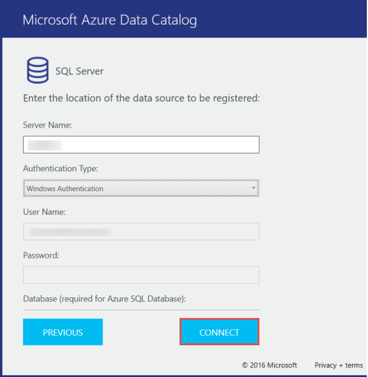
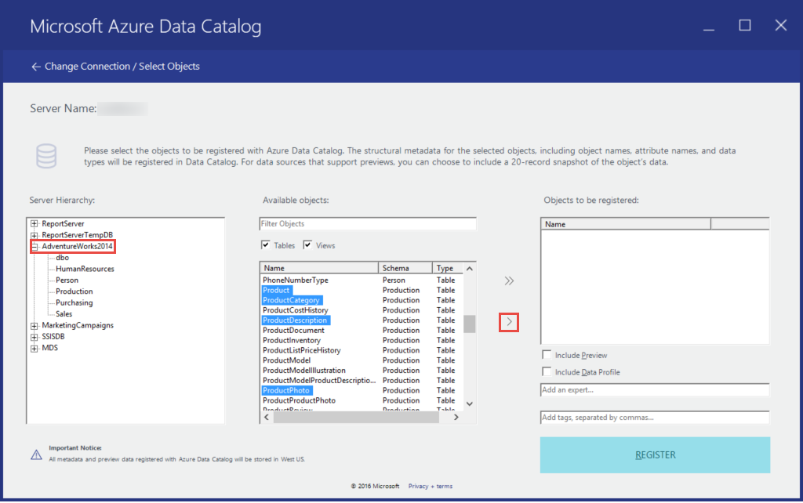
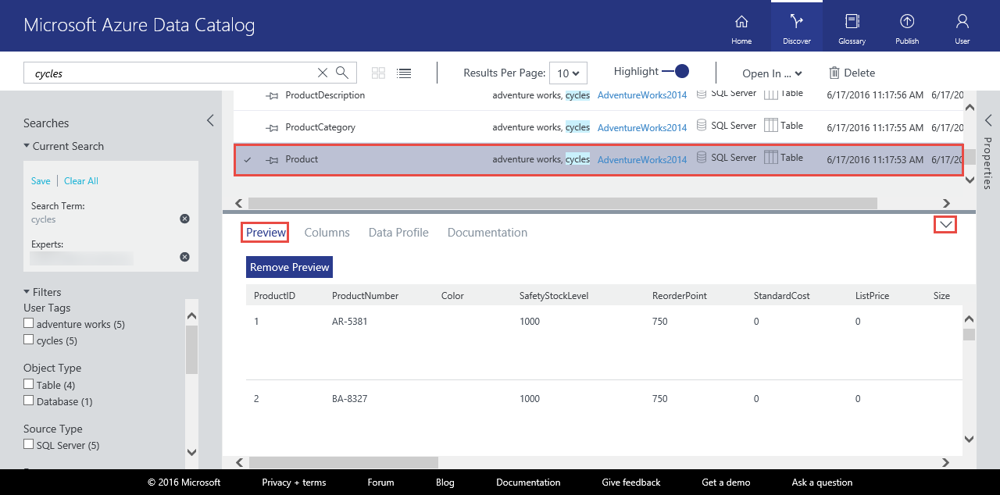
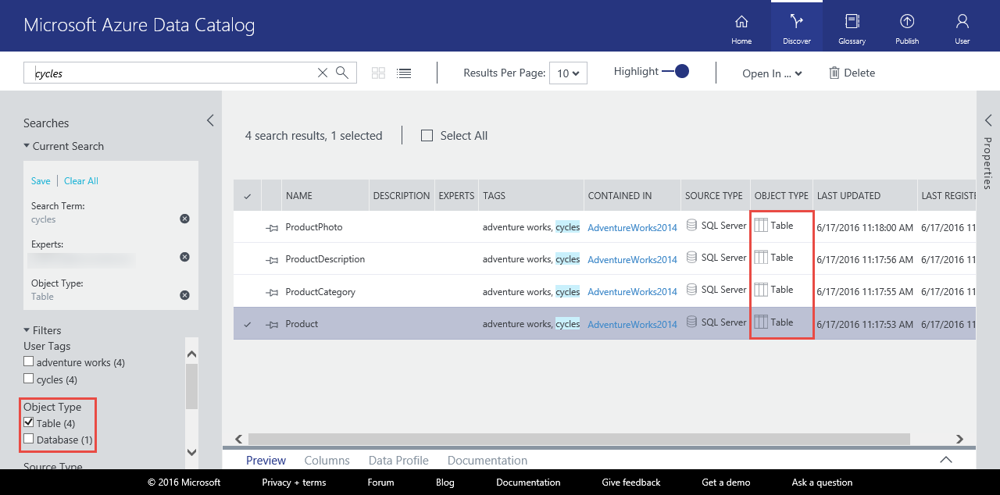
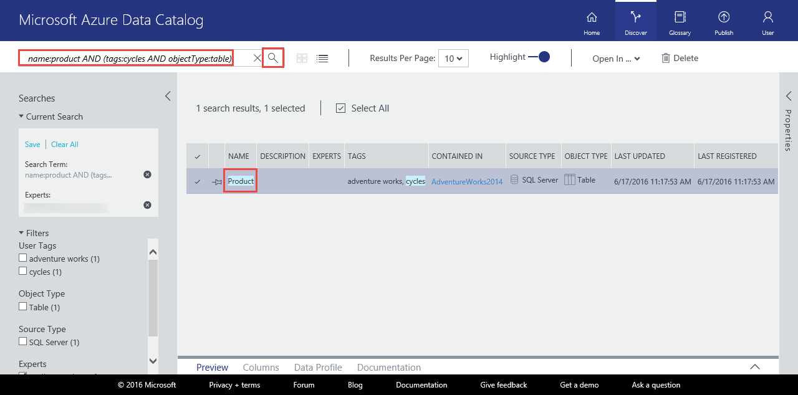
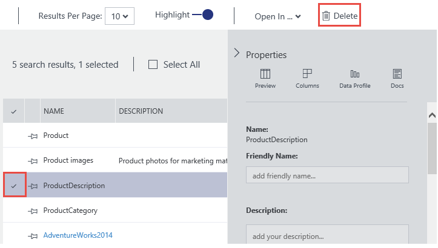

<properties
    pageTitle="Prise en main catalogue de données | Microsoft Azure"
    description="Didacticiel de bout en bout pour présenter les scénarios et les fonctionnalités de catalogue de données Azure."
    documentationCenter=""
    services="data-catalog"
    authors="steelanddata"
    manager="jhubbard"
    editor=""
    tags=""/>
<tags
    ms.service="data-catalog"
    ms.devlang="NA"
    ms.topic="get-started-article"
    ms.tgt_pltfrm="NA"
    ms.workload="data-catalog"
    ms.date="09/20/2016"
    ms.author="spelluru"/>

# Prise en main catalogue de données Azure
Catalogue de données Azure est un service cloud entièrement géré qui sert à un système d’inscription et système de détection pour les ressources de données d’entreprise. Pour une vue d’ensemble détaillée, voir [Nouveautés de catalogue de données Azure](data-catalog-what-is-data-catalog.md).

Ce didacticiel vous permet de commencer à utiliser le catalogue de données Azure. Effectuez les procédures suivantes dans ce didacticiel :

| Procédure | Description |
| :--- | :---------- |
| [Catalogue de données mise en service](#provision-data-catalog) | Dans cette procédure, vous mise en service ou configurez le catalogue de données Azure. Vous effectuez cette étape uniquement si le catalogue n’a pas été défini avant. Vous pouvez avoir qu’un seul catalogue de données par organisation (domaine Microsoft Azure Active Directory) même s’il existe plusieurs abonnements associés à votre compte Azure. |
| [Enregistrer les données de l’entreprise](#register-data-assets) | Dans cette procédure, vous enregistrez des éléments de données à partir de la base de données exemple AdventureWorks2014 avec le catalogue de données. L’enregistrement est le processus d’extraction de métadonnées structurelles clées tels que des noms, des types et emplacements à partir de la source de données et la copie que les métadonnées dans le catalogue. La source de données et de vos données demeurent où ils sont, mais les métadonnées sont utilisées par le catalogue afin de les retrouver plus facilement identifiable et compréhensible. |
| [Découvrir les ressources de données](#discover-data-assets) | Dans cette procédure, vous utilisez le portail du catalogue de données Azure pour découvrir les ressources de données qui a été enregistrés dans l’étape précédente. Après avoir une source de données a été enregistrée avec le catalogue de données Azure, ses métadonnées sont indexer par le service de sorte que les utilisateurs peuvent rechercher facilement les données que dont elles ont besoin. |
| [Annoter des ressources de données](#annotate-data-assets) | Dans cette procédure, fournissent annotations (informations telles que les descriptions, des balises, documentation ou experts) pour les ressources de données. Ces informations complètent les métadonnées extraite à partir de la source de données et pour rendre la source de données plus compréhensible à d’autres personnes. |
| [Se connecter à des ressources de données](#connect-to-data-assets) | Dans cette procédure, vous ouvrez des éléments de données dans les outils clients intégré (par exemple, Excel et SQL Server Data Tools) et un outil non intégrée (SQL Server Management Studio). |
| [Gérer les ressources de données](#manage-data-assets) | Dans cette procédure, vous définissez la sécurité à vos données. Catalogue de données ne pas permet aux utilisateurs l’accès aux données elles-mêmes. Le propriétaire de la source de données contrôle l’accès aux données.    Catalogue de données, vous pouvez découvrir les sources de données et afficher les **métadonnées** associées aux sources enregistrés dans le catalogue. Il peut arriver, cependant, où les sources de données doivent être visibles uniquement à des utilisateurs spécifiques ou aux membres des groupes spécifiques. Pour ces scénarios, vous pouvez utiliser le catalogue de données pour prendre possession d’éléments de données enregistré dans le catalogue et contrôler la visibilité des actifs que vous êtes propriétaire. |
| [Supprimer des éléments de données](#remove-data-assets) | Dans cette procédure, vous allez apprendre à supprimer des éléments de données à partir du catalogue de données. |  

## Conditions préalables pour les didacticiels

### Abonnement Azure
Pour configurer le catalogue de données Azure, vous devez être le propriétaire ou copropriétaire d’un abonnement Azure.

Abonnements Azure vous aident à organiser l’accès à des ressources du service cloud tel que catalogue de données Azure. Ils également vous permettent de contrôler l’utilisation des ressources est signalée, facturé et payé pour. Chaque abonnement peut avoir une configuration différente de facturation et de paiement, vous pouvez faire différents abonnements et les différentes offres par département, project, office régionaux et ainsi de suite. Chaque service cloud appartient à un abonnement, et vous devez disposer d’un abonnement avant de configurer le catalogue de données Azure. Pour plus d’informations, voir [Gérer les comptes, les abonnements et les rôles d’administrateur](../active-directory/active-directory-how-subscriptions-associated-directory.md).

Si vous n’avez un abonnement, vous pouvez créer un compte d’évaluation gratuit en quelques minutes. Pour plus d’informations, voir [Version d’évaluation gratuite](https://azure.microsoft.com/pricing/free-trial/) .

### Azure Active Directory
Pour configurer le catalogue de données Azure, vous devez être connecté avec un compte d’utilisateur Azure Active Directory (AD Azure). Vous devez être le propriétaire ou copropriétaire d’un abonnement Azure.  

Azure Active Directory offre un moyen facile pour votre entreprise à gérer l’accès, à la fois dans le cloud et en local et identité. Vous pouvez utiliser un seul compte scolaire ou se connecter à n’importe quelle application web cloud ou en local. Catalogue de données Azure utilise Azure AD pour authentifier se connecter. Pour plus d’informations, consultez [Nouveautés Azure Active Directory](../active-directory/active-directory-whatis.md).

### Configuration de la stratégie Azure Active Directory

Vous pouvez rencontrer une situation où vous pouvez vous connecter au portail catalogue de données Azure, mais lorsque vous essayez de vous connecter à l’outil de l’enregistrement de source de données, un message d’erreur qui vous empêche de se connecter. Cette erreur peut se produire lorsque vous êtes sur le réseau d’entreprise ou lorsque vous vous connectez à partir de l’extérieur du réseau d’entreprise.

L’outil d’inscription utilise *l’authentification par formulaire* pour valider l’utilisateur se-ins contre Azure Active Directory. Pour la connexion réussie, un administrateur Azure Active Directory doit activer l’authentification par formulaire dans la *stratégie d’authentification global*.

Avec la stratégie d’authentification globale, vous pouvez activer l’authentification séparément pour intranet et les connexions extranet, comme le montre l’image suivante. Erreurs de connexion peuvent se produire si l’authentification par formulaire n’est pas activée pour le réseau à partir de laquelle vous vous connectez.

 

Pour plus d’informations, voir [configuration les stratégies d’authentification](https://technet.microsoft.com/library/dn486781.aspx).

## Catalogue de données mise en service
Vous pouvez prévoir qu’un seul catalogue de données par organisation (domaine Azure Active Directory). Par conséquent, si le propriétaire ou un abonnement Azure copropriétaire appartenant à ce domaine Azure Active Directory a déjà créé un catalogue, vous ne pourrez pas à recréer un catalogue même si vous avez plusieurs abonnements Azure. Pour tester si un catalogue de données a été créé par un utilisateur dans votre domaine Azure Active Directory, accédez à la [page d’accueil de catalogue de données Azure](http://azuredatacatalog.com) et vérifiez si vous voyez le catalogue. Si un catalogue a déjà été créé pour vous, ignorez la procédure suivante et accédez à la section suivante.    

1. Accédez à la [page de service de catalogue de données](https://azure.microsoft.com/services/data-catalog) , puis cliquez sur **mise en route**.

    
2. Connectez-vous à l’aide d’un compte d’utilisateur qui est le propriétaire ou copropriétaire d’un abonnement Azure. Vous consultez la page suivante après la connexion.

    
3. Spécifiez un **nom** pour le catalogue de données, l' **abonnement** que vous voulez utiliser et l' **emplacement** pour le catalogue.
4. Développez **tarification** et sélectionnez un catalogue de données Azure **edition** (libre ou Standard).
    
5. Développez **Utilisateurs catalogue** , puis cliquez sur **Ajouter** pour ajouter des utilisateurs pour le catalogue de données. Vous sont automatiquement ajoutés à ce groupe.
    
6. Développez **Les administrateurs de catalogue** , puis cliquez sur **Ajouter** pour ajouter des administrateurs supplémentaires pour le catalogue de données. Vous sont automatiquement ajoutés à ce groupe.
    
7. Cliquez sur **Créer un catalogue** pour créer le catalogue de données pour votre organisation. Vous consultez la page d’accueil pour le catalogue de données après sa création.
        

### Trouver un catalogue de données dans le portail Azure
1. Sous un onglet distinct dans un navigateur web ou dans une fenêtre de navigateur web distinctes, accédez au [portail Azure](https://portal.azure.com) et connectez-vous à l’aide du compte que vous avez utilisé pour créer le catalogue de données à l’étape précédente.
2. Sélectionnez **Parcourir** , puis sur **Catalogue de données**.

     vous voyez le catalogue de données que vous avez créé.

    
4.  Cliquez sur le catalogue que vous avez créé. Vous voyez la carte de **Catalogue de données** dans le portail.

    
5. Vous pouvez afficher les propriétés du catalogue de données et les mettre à jour. Par exemple, cliquez sur **couche de tarification** et modifier l’édition.

    

### Base de données exemple Adventure Works
Dans ce didacticiel, vous vous inscrivez ressources de données (tables) à partir de la base de données exemple AdventureWorks2014 pour le moteur de base de données SQL Server, mais vous pouvez utiliser n’importe quelle source de données pris en charge si vous préférez utiliser des données qui signifient pertinent pour votre rôle et familiers. Pour une liste des sources de données prises en charge, voir [sources de données prises en charge](data-catalog-dsr.md).

### Installer la base de données Adventure Works 2014 OLTP
La base de données Adventure Works prend en charge les scénarios de traitement des transactions en ligne standards pour un fabricant de vélos fictif (Adventure Works Cycles), qui inclut des produits, ventes et d’achats. Dans ce didacticiel, vous enregistrez les informations sur les produits dans le catalogue de données Azure.

Pour installer la base de données exemple Adventure Works :

1. Téléchargez [Adventure Works 2014 plein de base de données Backup.zip](https://msftdbprodsamples.codeplex.com/downloads/get/880661) sur CodePlex.
2. Pour restaurer la base de données sur votre ordinateur, suivez les instructions dans la zone [restaurer une sauvegarde de base de données à l’aide de SQL Server Management Studio](http://msdn.microsoft.com/library/ms177429.aspx), ou en procédant comme suit :
    1. Ouvrez SQL Server Management Studio et connectez-vous au moteur de base de données SQL Server.
    2. Droit des **bases de données** , puis cliquez sur **Restaurer la base de données**.
    3. Sous **Restaurer la base de données**, cliquez sur le **périphérique** de **Source** et cliquez sur **Parcourir**.
    4. Sous **Sélectionnez périphériques de sauvegarde**, cliquez sur **Ajouter**.
    5. Accédez au dossier où vous disposez du fichier **AdventureWorks2014.bak** , sélectionnez le fichier et cliquez sur **OK** pour fermer la boîte de dialogue **Localiser le fichier de sauvegarde** .
    6. Cliquez sur **OK** pour fermer la boîte de dialogue **Sélectionner les périphériques de sauvegarde** .    
    7. Cliquez sur **OK** pour fermer la boîte de dialogue **Restaurer la base de données** .

Vous pouvez maintenant enregistrer les données de l’entreprise à partir de la base de données exemple Adventure Works à l’aide de catalogue de données Azure.

## Enregistrer les données de l’entreprise

Dans cet exercice, l’outil d’inscription vous permet d’enregistrer les données de l’entreprise à partir de la base de données Adventure Works avec le catalogue. L’enregistrement est le processus d’extraction de métadonnées structurelles clées tels que des noms, des types et emplacements à partir de la source de données et les biens qu’il contient et la copie que les métadonnées dans le catalogue. La source de données et de vos données demeurent où ils sont, mais les métadonnées sont utilisées par le catalogue afin de les retrouver plus facilement identifiable et compréhensible.

### Enregistrer une source de données

1.  Accédez à la [page d’accueil de catalogue de données Azure](https://azuredatacatalog.com) , puis cliquez sur **Publier**.

    

2.  Cliquez sur **Lancer l’Application** à télécharger, installer et exécuter l’outil d’inscription sur votre ordinateur.

    

3. Dans la page **Bienvenue** , cliquez sur **se connecter** et entrez vos informations d’identification.    

    

4. Dans la page du **Catalogue de données Microsoft Azure** , cliquez sur **suivant**et **SQL Server** .

    

5.  Entrez les propriétés de connexion SQL Server pour **AdventureWorks2014** (voir l’exemple suivant) et cliquez sur **se connecter**.

    

6.  Enregistrer les métadonnées de vos ressources les données. Dans cet exemple, vous enregistrez les objets de **Production/produit** à partir de l’espace de noms de Production AdventureWorks :

    1. Dans l’arborescence de la **Hiérarchie du serveur** , développez **AdventureWorks2014** et cliquez sur **Production**.
    2. Sélectionnez le **produit**, **ProductCategory**, **ProductDescription**et **ProductPhoto** à l’aide de Ctrl + clic.
    3. Cliquez sur la **flèche sélectionnée de déplacer** (**>**). Cette action insère tous les objets sélectionnés dans la liste **d’objets à enregistrer** .

        
    4. Sélectionnez **inclure un aperçu** pour inclure un aperçu instantané des données. L’instantané inclut jusqu'à 20 enregistrements de chaque table, et il est copié dans le catalogue.
    5. Sélectionnez **Profil de données inclure** pour inclure un instantané des statistiques d’objet pour le profil de données (par exemple : valeurs minimales et maximales moyennes d’une colonne, nombre de lignes).
    6. Dans le champ **Ajouter des mots clés** , indiquez **adventure works, cycles**. Cette action permet d’ajouter des balises de recherche pour ces éléments de données. Balises constituent un excellent moyen pour aider les utilisateurs à rechercher une source de données enregistré.
    7. Spécifiez le nom d’un **expert** dans ces données (facultatives).

        

    8. Cliquez sur **Enregistrer**. Catalogue de données Azure enregistre vos objets sélectionnés. Dans cet exercice, les objets sélectionnés à partir d’Adventure Works sont enregistrés. L’outil d’inscription extrait les métadonnées de l’élément de données et copie ces données dans le service de catalogue de données Azure. Les données sont conservées dans lequel il réside actuellement, et il reste sous le contrôle des administrateurs et les stratégies du système actuel.

        

    9. Pour afficher vos objets de source de données enregistré, cliquez sur **Afficher le portail**. Dans le portail de catalogue de données Azure, vérifiez que vous voyez les quatre tables et la base de données dans l’affichage de la grille.

        

Dans cet exercice, vous inscrit objets provenant de la base de données exemple Adventure Works afin qu’elles peuvent être facilement découvertes par les utilisateurs au sein de votre organisation. Dans l’exercice suivant, vous allez apprendre à découvrir les ressources de données enregistré.

## Découvrir les ressources de données
Découverte de catalogue de données Azure utilise deux mécanismes principaux : recherche et de filtrage.

Recherche est conçue pour être puissantes et intuitives. Par défaut, les termes de recherche sont comparés à n’importe quelle propriété dans le catalogue, y compris les annotations fourni par l’utilisateur.

Filtrage est conçu pour compléter la recherche. Vous pouvez sélectionner caractéristiques spécifiques, tels que des experts, type de source de données, type d’objet et balises pour afficher les données correspondantes de l’entreprise et à limiter les résultats de recherche pour la correspondance des biens.

En utilisant une combinaison de recherche et le filtrage, vous pouvez rapidement accéder les sources de données qui ont été enregistrés avec le catalogue de données Azure pour découvrir les biens de données que vous avez besoin.

Dans cet exercice, vous utilisez le portail du catalogue de données Azure pour découvrir les ressources de données que vous avez enregistré dans l’exercice précédent. Pour plus d’informations sur la syntaxe de recherche, voir [référence de syntaxe de la recherche de catalogue de données](https://msdn.microsoft.com/library/azure/mt267594.aspx) .

Voici quelques exemples pour la découverte des ressources de données dans le catalogue.  

### Découvrir les ressources de données avec la recherche de base
Recherche de base vous permet de rechercher un catalogue à l’aide d’un ou plusieurs termes de recherche. Les résultats sont les éléments qui répondent sur n’importe quelle propriété avec un ou plusieurs des conditions spécifiées.

1. Cliquez sur **accueil** dans le portail du catalogue de données Azure. Si vous avez fermé le navigateur web, accédez à la [page d’accueil de catalogue de données Azure](https://www.azuredatacatalog.com).
2. Dans la zone de recherche, entrez `cycles` et appuyez sur **entrée**.

    
3. Vérifiez que vous voyez les quatre tables et la base de données (AdventureWorks2014) dans les résultats. Vous pouvez basculer entre **la vue de grille** et **affichage de liste** en cliquant sur la barre d’outils boutons comme le montre l’image suivante. Notez que le mot clé de recherche est mis en surbrillance dans les résultats de recherche, car l’option **mettre en surbrillance** est **activée**. Vous pouvez également spécifier le nombre de **résultats par page** dans les résultats de recherche.

    

    Le panneau de configuration de **recherche** se trouve sur la gauche et le volet de **Propriétés** se trouve à droite. Dans le volet **recherche** , vous pouvez modifier les critères de recherche et filtrer les résultats. Le volet de **Propriétés** affiche les propriétés d’un objet sélectionné dans la grille ou la liste.

4. Cliquez sur **le produit** dans les résultats de recherche. Cliquez sur **Aperçu**, des **colonnes**, des **Données profil**et des onglets de **Documentation** , ou cliquez sur la flèche pour développer le volet inférieur.  

    

    Sous l’onglet **Aperçu** , vous consultez un aperçu des données dans la table **Product** .  
5. Cliquez sur l’onglet **colonnes** pour trouver des informations sur les colonnes (par exemple, **nom** et **type de données**) dans l’élément de données.
6. Cliquez sur l’onglet **Profil de données** pour afficher le profil de données (par exemple : nombre de lignes, la taille des données ou valeur minimale contenue dans une colonne) dans l’élément de données.
7. Filtrer les résultats à l’aide de **filtres** sur la gauche. Par exemple, cliquez sur **tableau** **Type d’objet**et afficher uniquement les quatre tables, pas la base de données.

    

### Découvrir les ressources de données avec la propriété étendue
Propriété étendue vous permet de découvrir les données de l’entreprise où le terme de recherche est mis en correspondance avec la propriété spécifiée.

1. Effacer le filtre de **tableau** sous **Type d’objet** dans les **filtres**.  
2. Dans la zone de recherche, entrez `tags:cycles` et appuyez sur **entrée**. Voir [référence de syntaxe de la recherche de catalogue de données](https://msdn.microsoft.com/library/azure/mt267594.aspx) pour toutes les propriétés que vous pouvez utiliser pour rechercher le catalogue de données.
3. Vérifiez que vous voyez les quatre tables et la base de données (AdventureWorks2014) dans les résultats.  

    

### Enregistrer la recherche
1. Dans le volet de **recherche** dans la section de **Recherche en cours** , entrez un nom pour la recherche, puis cliquez sur **Enregistrer**.

    
2. Vérifiez que la recherche enregistrée s’affiche sous **Recherches enregistrées**.

    
3. Sélectionnez une des actions que vous pouvez appliquer à la recherche enregistrée (**Renommer**, **Supprimer**, recherche **Enregistrer en tant que valeur par défaut** ).

    

### Opérateurs booléens
Vous pouvez étendre ou affiner votre recherche avec les opérateurs booléens.

1. Dans la zone de recherche, entrez `tags:cycles AND objectType:table`, puis appuyez sur **entrée**.
2. Vérifiez que vous voyez apparaître que les tables (pas la base de données) dans les résultats.  

    

### Regroupement entre parenthèses
En effectuant un regroupement entre parenthèses, vous pouvez regrouper les parties de la requête pour isoler logiquement, en particulier ainsi que les opérateurs booléens.

1. Dans la zone de recherche, entrez `name:product AND (tags:cycles AND objectType:table)` et appuyez sur **entrée**.
2. Vérifiez que vous voyez uniquement la table **Product** dans les résultats de recherche.

       

### Opérateurs de comparaison
Avec les opérateurs de comparaison, vous pouvez utiliser les comparaisons autre que l’égalité pour les propriétés qui ont des types de données numériques et de date.

1. Dans la zone de recherche, entrez `lastRegisteredTime:>"06/09/2016"`.
2. Effacer le filtre de **tableau** sous **Type d’objet**.
3. Appuyez sur **entrée**.
4. Vérifiez que vous voyez les tables **produit**, **ProductCategory**, **ProductDescription**et **ProductPhoto** et la base de données AdventureWorks2014 que vous avez enregistré dans les résultats de la recherche.

    

Pour plus d’informations sur la découverte des ressources de données et de [référence de syntaxe de la recherche de catalogue de données](https://msdn.microsoft.com/library/azure/mt267594.aspx) pour la syntaxe de recherche, voir [Comment faire pour découvrir les ressources de données](data-catalog-how-to-discover.md) .

## Annoter des ressources de données
Dans cet exercice, vous utilisez le portail du catalogue de données Azure pour annoter (ajouter des informations telles que les descriptions, des balises ou des experts) que vous avez précédemment enregistré dans le catalogue de données de l’entreprise. Les annotations complément et améliorent les métadonnées structurelles extraite de la source de données lors de l’enregistrement et facilite les biens de données à découvrir et à comprendre.

Dans cet exercice, vous annotez un élément de données unique (ProductPhoto). Vous ajoutez un nom convivial et une description de la ressource de données ProductPhoto.  

1.  Accédez à la [page d’accueil de catalogue de données Azure](https://www.azuredatacatalog.com) et recherche sur `tags:cycles` pour rechercher les éléments de données que vous avez enregistré.  
2. Cliquez sur **ProductPhoto** dans les résultats de recherche.  
3. Entrer des **images de produit** pour **Nom convivial** et les **photos de produit pour les documents marketing** pour la **Description**.

    

    La **Description** d’autres personnes vous permet de découvrir et comprendre pourquoi et comment l’utilisation de la ressource de données sélectionnées. Vous pouvez également ajouter des balises supplémentaires et afficher les colonnes. À présent, vous pouvez essayer de recherche et de filtrage pour découvrir les ressources de données en utilisant les métadonnées descriptive que vous avez ajouté au catalogue.

Vous pouvez également effectuer les opérations suivantes dans cette page :

- Ajouter des experts pour l’élément de données. Cliquez sur **Ajouter** dans la zone **Experts** .
- Ajouter des balises au niveau du jeu de données. Cliquez sur **Ajouter** dans la zone **balises** . Un indicateur peut être une balise utilisateur ou un glossaire. Le Standard Edition de catalogue de données comprend un glossaire entreprise qui permet aux administrateurs de catalogue de définir une classification affaires central. Utilisateurs catalogue peuvent annoter puis des éléments de données avec les termes du glossaire. Pour plus d’informations, voir [comment configurer la glossaire Business pour le marquage régis](data-catalog-how-to-business-glossary.md)
- Ajouter des balises au niveau de la colonne. Cliquez sur **Ajouter** sous les **balises** de la colonne que vous souhaitez annoter.
- Ajouter une description au niveau de la colonne. Entrez la **Description** d’une colonne. Vous pouvez également afficher les métadonnées de description extraites de la source de données.
- Ajoutez des informations de **demande d’accès** qui indique aux utilisateurs comment demander l’accès à l’élément de données.

    

- Cliquez sur l’onglet **Documentation** et fournir une documentation pour l’élément de données. Sur la documentation de catalogue de données Azure, vous pouvez utiliser votre catalogue de données sous forme d’un référentiel de contenu pour créer une narration complète de vos données.

    

Vous pouvez également ajouter une annotation à plusieurs éléments de données. Par exemple, vous pouvez sélectionner tous les éléments de données que vous avez enregistré et spécifier un expert pour eux.

Catalogue de données Azure prend en charge une approche approvisionnement démarque des autres annotations. Tout utilisateur de catalogue de données peut ajouter balises (utilisateur ou glossaire), description et autres métadonnées, afin que tout utilisateur possédant un point de vue sur un élément de données et son utilisation peut avoir ce point de vue capturée et disponible à d’autres utilisateurs.

Découvrez [comment annoter des ressources de données](data-catalog-how-to-annotate.md) pour des informations détaillées sur annoter des ressources de données.

## Se connecter à des ressources de données
Dans cet exercice, vous ouvrez les éléments de données dans un outil client intégré (Excel) et un outil non intégrée (SQL Server Management Studio) à l’aide des informations de connexion.

> [AZURE.NOTE] Il est important de se rappeler que catalogue de données Azure ne vous permettent d’accéder à la source de données réelles — simplement facilement vous permettant de découvrir et de le comprendre. Lorsque vous vous connectez à une source de données, l’application cliente que vous choisissez utilise vos informations d’identification Windows ou vous demande des informations d’identification si nécessaire. Si vous n'avez pas déjà été accordé l’accès à la source de données, vous devez bénéficier d’un accès avant de vous connecter.

### Se connecter à une ressource de données à partir d’Excel

1. Sélectionnez **produit** à partir des résultats de recherche. Cliquez sur **Ouvrir dans** la barre d’outils, puis cliquez sur **Excel**.

    
2. Cliquez sur **Ouvrir** dans la fenêtre contextuelle de téléchargement. Cette expérience peut-être varier selon le navigateur.

    
3. Dans la fenêtre de **Notification de sécurité Microsoft Excel** , cliquez sur **Activer**.

    
4. Conserver les valeurs par défaut dans la boîte de dialogue **Importer des données** et cliquez sur **OK**.

    
5. Afficher la source de données dans Excel.

    

Dans cet exercice, vous connecté actifs données détectés à l’aide de catalogue de données Azure. Le portail de catalogue de données Azure, vous pouvez vous connecter directement à l’aide des intégrés dans le menu **Ouvrir dans** les applications clientes. Vous pouvez également vous connecter avec n’importe quelle application que vous choisissez en utilisant les informations d’emplacement de connexion incluses dans les métadonnées de biens. Par exemple, vous pouvez utiliser SQL Server Management Studio pour vous connecter à la base de données AdventureWorks2014 pour accéder aux données dans les biens de données enregistrées dans ce didacticiel.

1. Ouvrez **SQL Server Management Studio**.
2. Dans la boîte de dialogue **se connecter au serveur** , entrez le nom du serveur à partir du volet de **Propriétés** dans le portail du catalogue de données Azure.
3. Utiliser l’authentification appropriée et les informations d’identification pour accéder à la ressource de données. Si vous n’avez pas accès, utilisez les informations dans le champ **Demande d’accès** pour qu’il.

    

Cliquez sur **Afficher les chaînes de connexion** pour afficher et copier des chaînes de connexion ADF.NET, ODBC et OLEDB dans le Presse-papiers à utiliser dans votre application.

## Gérer les ressources de données
Dans cette étape, vous allez apprendre à configurer la sécurité de vos ressources de données. Catalogue de données ne pas permet aux utilisateurs l’accès aux données elles-mêmes. Le propriétaire de la source de données contrôle l’accès aux données.

Vous pouvez utiliser le catalogue de données pour découvrir les sources de données et afficher les métadonnées relatives aux sources d’enregistré dans le catalogue. Il peut arriver, cependant, où il est possible que les sources de données doivent être uniquement visibles à des utilisateurs spécifiques ou aux membres des groupes spécifiques. Pour ces scénarios, vous pouvez utiliser le catalogue de données pour prendre possession d’éléments de données enregistré dans le catalogue et au contrôle puis la visibilité des actifs vous appartient.

> [AZURE.NOTE] Les fonctionnalités de gestion décrites dans cet exercice sont disponibles uniquement dans le Standard Edition de Azure catalogue de données, et non dans l’édition gratuite.
Dans le catalogue de données Azure, vous pouvez prendre possession d’éléments de données, ajouter les propriétaires de co-création pour les ressources de données et définir la visibilité des données.

### Prendre possession d’éléments de données et restreindre la visibilité

1. Accédez à la [page d’accueil de catalogue de données Azure](https://www.azuredatacatalog.com). Dans la zone de texte **Rechercher** , entrez `tags:cycles` et appuyez sur **entrée**.
2. Cliquez sur un élément dans la liste des résultats, puis cliquez sur **Prendre possession** dans la barre d’outils.
3. Dans la section **gestion** du panneau **Propriétés** , cliquez sur **Prendre possession**.

    
4. Pour restreindre la visibilité, cliquez sur **propriétaires et ces utilisateurs** dans la section **visibilité** et cliquez sur **Ajouter**. Entrez les adresses de messagerie dans la zone de texte, puis appuyez sur **entrée**.

    

## Supprimer des éléments de données

Dans cet exercice, vous utilisez le portail du catalogue de données Azure pour supprimer l’aperçu des données à partir des données de l’entreprise et supprimer des éléments de données à partir du catalogue.

Dans le catalogue de données Azure, vous pouvez supprimer un bien individuel ou supprimer plusieurs éléments.

1. Accédez à la [page d’accueil de catalogue de données Azure](https://www.azuredatacatalog.com).
2. Dans la zone de texte **Rechercher** , entrez `tags:cycles` et appuyez sur **entrée**.
3. Sélectionnez un élément dans la liste des résultats et cliquez sur **Supprimer** dans la barre d’outils comme le montre l’image suivante :

    

    Si vous utilisez l’affichage de liste, la case à cocher est à gauche de l’élément comme le montre l’image suivante :

    

    Vous pouvez également sélectionner plusieurs éléments de données et supprimez-les comme le montre l’image suivante :

    

> [AZURE.NOTE] Le comportement par défaut du catalogue consiste à autoriser tous les utilisateurs pour inscrire une source de données et autoriser tous les utilisateurs de supprimer n’importe quel élément de données qui a été enregistré. Les fonctionnalités de gestion incluses dans le Standard Edition de Azure catalogue de données fournissent des options supplémentaires pour prendre possession du bien restriction qui peut découvrir les ressources, et restreindre qui peut supprimer des éléments.

## Résumé

Dans ce didacticiel, vous exploré principales fonctionnalités de catalogue de données Azure, y compris inscription, annotées, expériences et la gestion des ressources de données d’entreprise. Maintenant que vous avez terminé le didacticiel, il est temps de mise en route. Vous pouvez commencer aujourd'hui en enregistrant votre équipe et s’appuient sur les sources de données et en invitant des collègues à utiliser le catalogue.

## Références

- [Comment enregistrer les données de l’entreprise](data-catalog-how-to-register.md)
- [Comment faire pour découvrir les ressources de données](data-catalog-how-to-discover.md)
- [Comment annoter des ressources de données](data-catalog-how-to-annotate.md)
- [Comment documenter les ressources de données](data-catalog-how-to-documentation.md)
- [Comment se connecter à des ressources de données](data-catalog-how-to-connect.md)
- [Comment gérer les ressources de données](data-catalog-how-to-manage.md)
