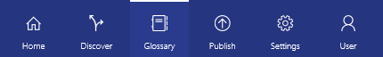

<properties
    pageTitle="Comment configurer la glossaire Business pour régis marquage | Microsoft Azure"
    description="Article de la mise en surbrillance le glossaire d’entreprise dans le catalogue de données Azure pour définir et utiliser un vocabulaire commun pour les entreprises pour ajouter une balise enregistré ressources de données."
    services="data-catalog"
    documentationCenter=""
    authors="steelanddata"
    manager="NA"
    editor=""
    tags=""/>
<tags
    ms.service="data-catalog"
    ms.devlang="NA"
    ms.topic="article"
    ms.tgt_pltfrm="NA"
    ms.workload="data-catalog"
    ms.date="09/21/2016"
    ms.author="maroche"/>

# Comment configurer le glossaire d’entreprise pour le marquage régis

## Introduction

Catalogue de données Azure fournit les fonctionnalités pour la découverte de source de données, qui permet aux utilisateurs de facilement découvrir et comprendre les sources de données que dont elles ont besoin pour effectuer une analyse et prendre des décisions. Ces fonctionnalités de découverte avoir un impact considérable lorsque les utilisateurs peuvent trouver et comprendre large gamme de sources de données disponibles.

Une fonctionnalité de catalogue de données afin de promouvoir une meilleure compréhension de données biens marquage. Marquage permet aux utilisateurs d’associer des mots clés à une ressource ou une colonne, qui à son tour facilite à découvrir du bien via la recherche, et permet aux utilisateurs de comprendre plus facilement le contexte et l’intention de l’actif.

Toutefois, marquage peut parfois poser des problèmes de son propre. Quelques exemples des problèmes de synchronisation qui peuvent être introduites par marquage sont :

1.  Utilisateurs à l’aide des abréviations sur certains éléments et texte développé sur d’autres personnes lors de la liaison réseau. Cette incohérence empêche la découverte des actifs alors que l’objectif a été baliser les biens avec la même balise.
2.  Balises qui une signification différente dans des contextes différents. Par exemple, une balise appelée « Chiffre d’affaires » sur un jeu de données client peut signifie chiffre d’affaires par le client, mais la même balise dans un jeu de données de vente trimestriel signifie chiffre d’affaires trimestriel pour la société.  

Pour aider à résoudre des problèmes similaires, catalogue de données inclut un glossaire d’entreprise.

Le glossaire entreprise de catalogue de données permet aux organisations de termes d’activité clés document ainsi que leurs définitions pour créer un vocabulaire commun pour les entreprises. Cette gouvernance permet la cohérence de l’utilisation des données dans toute l’organisation. Une fois que les termes définis dans le glossaire d’entreprise, ils peuvent être affectées à des ressources de données dans le catalogue, à l’aide de la même approche balisage, permettant ainsi _régis marquage_.

> [AZURE.NOTE] Les fonctionnalités décrites dans cet article sont disponibles uniquement dans le Standard Edition de Azure catalogue de données. L’édition gratuite ne propose pas de fonctionnalités de marquage régis ou un glossaire d’entreprise.

## Privilèges et disponibilité glossaire

*Glossaire de l’entreprise est disponible dans le Standard Edition de Azure catalogue de données. L’édition de catalogue de données gratuit n’inclut pas un glossaire.*

Glossaire de l’entreprise est accessible via l’option « Glossaire » dans le menu de navigation du portail de catalogue de données.  

Les administrateurs de catalogue de données et les membres du rôle administrateur glossaire peuvent créer, modifier et supprimer des termes de glossaire dans le glossaire d’entreprise. Tous les utilisateurs de catalogue de données pour visualiser les définitions de termes et peuvent ajouter des balises actifs avec glossaire.

## Glossaire création

Les administrateurs de catalogue de données et glossaire peut créer nouveau glossaire en cliquant sur le nouveau terme « bouton Créer glossaire avec les champs suivants :

* Une définition Professionnel pour le terme
* Une description qui capture destination ou règles d’entreprise pour la biens ou de colonne
* Une liste des parties prenantes connaissant le plus sur le terme
* Le terme parent, qui définit la hiérarchie dans laquelle le terme est organisé

## Hiérarchies de magasin de termes de glossaire

Le glossaire d’entreprise de catalogue de données permet de décrire votre vocabulaire entreprise sous la forme d’une hiérarchie de termes. Cela permet aux organisations de créer une classification des termes qui représente mieux leur taxonomie d’entreprise.

Le nom d’un terme doit être unique à un niveau de hiérarchie donné - noms en double ne sont pas autorisés. Il n’existe aucune limite au nombre de niveaux dans une hiérarchie, mais une hiérarchie est souvent plus faciles à comprendre lorsqu’il y a trois niveaux ou moins.

L’utilisation des hiérarchies dans le glossaire entreprise est facultative. Quitter le parent terme champ vide pour glossaire créera une liste à deux dimensions (non hiérarchiques) des termes dans le glossaire.  

## Marquage actifs avec glossaire

Une fois que glossaire ont été définis dans le catalogue, l’expérience de marquage actifs est optimisé pour rechercher le glossaire que l’utilisateur tape leur balise. Le portail du catalogue de données affiche une liste de correspondance glossaire pour l’utilisateur à sélectionner à partir de. Si l’utilisateur sélectionne un terme dans la liste, qu'il est ajouté à l’élément comme étant une balise (également appelé balise glossaire). L’utilisateur peut également choisir de créer une nouvelle balise en tapant un terme qui se trouve pas dans le glossaire (également appelé balise utilisateur).

> [AZURE.NOTE] Les balises utilisateur sont le seul type de balise pris en charge dans l’édition de catalogue de données gratuit.

### Comportement de pointage balises
Dans le portail du catalogue de données, les deux types de balises sont visuellement distinctes, avec les comportements hover différents. Lorsque l’utilisateur est placé sur une balise utilisateur qu’ils peuvent voir le texte de balise et l’ou les utilisateurs qui ont ajouté la balise. Lorsque l’utilisateur est placé sur une balise glossaire, ils voient également la définition de la durée glossaire et un lien pour ouvrir le glossaire business pour afficher la définition complète du terme.

### Filtres de recherche des indicateurs
Balises glossaire et balises utilisateur peuvent être recherchés et peuvent être appliquées en tant que filtres dans une recherche.

## Résumé
Le glossaire d’entreprise dans le catalogue de données Azure et le marquage régis il permet, autoriser les ressources de données être identifié, gérées et découvert de manière cohérente. Le glossaire entreprise pouvez promouvoir apprentissage du vocabulaire entreprise parmi les utilisateurs d’une organisation et prend en charge les métadonnées significatives à capturer, émission parc et présentation d’un jeu d’enfant.

## Voir aussi

- [Documentation présentée sous d’API REST de glossaire d’activité](https://msdn.microsoft.com/library/mt708855.aspx)
