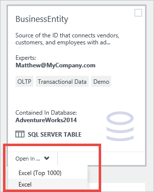
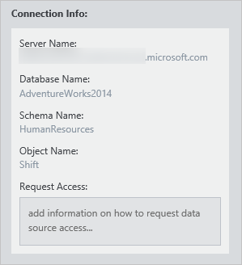

<properties
   pageTitle="Comment se connecter aux sources de données | Microsoft Azure"
   description="Article de la mise en surbrillance de la connexion aux sources de données rencontrés avec le catalogue de données Azure."
   services="data-catalog"
   documentationCenter=""
   authors="steelanddata"
   manager="NA"
   editor=""
   tags=""/>
<tags
   ms.service="data-catalog"
   ms.devlang="NA"
   ms.topic="article"
   ms.tgt_pltfrm="NA"
   ms.workload="data-catalog"
   ms.date="09/15/2016"
   ms.author="maroche"/>

# Comment se connecter aux sources de données

## Introduction
**Catalogue de données Microsoft Azure** est un service cloud entièrement géré qui sert à un système d’inscription et système de recherche pour les sources de données d’entreprise. En d’autres termes, le **Catalogue de données Azure** consiste à aider les utilisateurs à découvrir, comprendre et utiliser des sources de données et aider les entreprises pour obtenir plus de valeur à partir de leurs données existantes. Un aspect clé de ce scénario utilise les données – une fois un utilisateur découvre une source de données et comprend son objectif, l’étape suivante consiste à vous connecter à la source de données pour placer ses données à utiliser.

## Emplacements de source de données
Lors de l’enregistrement source de données, **Catalogue de données Azure** reçoit les métadonnées relatives à la source de données. Ces métadonnées incluent les détails de l’emplacement de la source de données. Les détails de l’emplacement peut varier de source de données à la source de données, mais il contient toujours les informations nécessaires pour vous connecter. Par exemple, l’emplacement d’une table SQL Server inclut le nom du serveur, nom de base de données, nom de schéma et nom de la table, tandis que l’emplacement d’un rapport SQL Server Reporting Services inclut le nom du serveur et le chemin d’accès au rapport. Autres types de source de données ont des emplacements qui reflètent la structure et les fonctionnalités du système source.

## Outils clients intégrée
Pour vous connecter à une source de données le plus simple consiste à utiliser le « ouvert dans. … » menu dans le portail du **Catalogue de données Azure** . Ce menu affiche une liste des options de connexion à l’élément de données sélectionnées.
Lorsque vous utilisez l’affichage en mosaïque par défaut, ce menu est disponible sur chaque la vignette.

 

Lorsque vous utilisez l’affichage de liste, le menu est disponible dans la barre de recherche en haut de la fenêtre du portail.

 

## Applications clientes prises en charge
Lorsque vous utilisez le « ouvert dans. … » menu de sources de données dans le portail de catalogue de données Azure, l’application cliente correct doit être installé sur l’ordinateur client.

| Ouvrir dans l’application | Extension de fichier / protocole | Versions des applications pris en charge |
| --- | --- | --- |
| Excel | .odc | Excel 2010 ou version ultérieure |
| Excel (haut 1000) | .odc | Excel 2010 ou version ultérieure |
| Power Query | .xlsx | Excel 2016 ou Excel 2010 ou Excel 2013 avec Power Query pour Excel installé
| Power BI Desktop | .pbix | Power BI Desktop juillet 2016 ou version ultérieure |
| Outils de données SQL Server | vsweb : / / | Mise à jour de Visual Studio 2013 4 ou version ultérieure, avec les outils SQL Server installé |
| Gestionnaire de rapports | http:// | Voir [Configuration requise de navigateur pour SQL Server Reporting Services](https://technet.microsoft.com/en-us/library/ms156511.aspx) |

## Vos données, vos outils
Les options disponibles dans le menu dépend le type de données actif actuellement sélectionné. Bien entendu, pas tous les outils possibles sont incluses dans le « ouvert dans... » menu, mais il est toujours facile de se connecter à la source de données à l’aide de n’importe quel outil client. Lorsqu’un élément de données est sélectionné dans le portail du **Catalogue de données Azure** , l’emplacement complet s’affiche dans le volet de propriétés.

 

Les informations de connexion seront différent du type de source de données au type de source de données, mais les informations contenues dans le portail vous donne toutes les informations que nécessaires pour vous connecter à la source de données dans n’importe quel outil client. Les utilisateurs peuvent copier les détails de connexion pour les sources de données qu’ils ont découvert à l’aide du **Catalogue de données Azure**, ce qui leur permet de travailler avec les données dans son outil de choix.

## Autorisations de source de connexion et de données
Bien que **Catalogue de données Azure** apporte des sources de données détectable, accès aux données lui-même reste sous le contrôle des données source propriétaire ou administrateur. Découverte de source de données dans le **Catalogue de données Azure** n’affichera pas un utilisateur toutes les autorisations pour accéder à la source de données.

Pour faciliter pour les utilisateurs à découvrir une source de données, mais n’êtes pas autorisé à accéder à ses données, les utilisateurs peuvent fournir des informations dans la propriété de demande d’accès lors de l’annotation une source de données. Les informations fournies ici, notamment des liens vers le processus ou d’un point de contact pour l’accès de source de données – sont présentées en parallèle avec les informations d’emplacement des données source dans le portail.

 

##Résumé
Enregistrement d’une source de données avec le **Catalogue de données Azure** rend ces données détectable en copiant métadonnées structurelles et descriptive à partir de la source de données dans le service de catalogue. Une fois une source de données a été enregistrée et découverte, les utilisateurs peuvent se connecter à la source de données à partir du portail de **Catalogue de données Azure** « ouvert dans.... » » menu ou à l’aide de leurs outils de données de choix.

## Voir aussi
- [Prise en main catalogue de données Azure](data-catalog-get-started.md) didacticiel pour plus d’informations détaillées sur la connexion aux sources de données.
