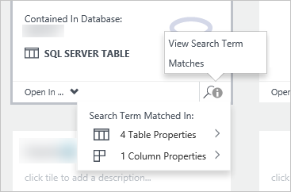

<properties
   pageTitle="Comment faire pour découvrir les sources de données | Microsoft Azure"
   description="Article de la mise en surbrillance de la façon de découvrir les ressources de données enregistré avec le catalogue de données Azure, y compris la recherche et le filtrage et à l’aide de l’accès mise en surbrillance des fonctionnalités du portail du catalogue de données Azure."
   services="data-catalog"
   documentationCenter=""
   authors="steelanddata"
   manager="NA"
   editor=""
   tags=""/>
<tags
   ms.service="data-catalog"
   ms.devlang="NA"
   ms.topic="article"
   ms.tgt_pltfrm="NA"
   ms.workload="data-catalog"
   ms.date="10/04/2016"
   ms.author="maroche"/>

# Comment faire pour découvrir les sources de données

## Introduction
**Catalogue de données Microsoft Azure** est un service cloud entièrement géré qui sert à un système d’inscription et système de recherche pour les sources de données d’entreprise. En d’autres termes, le **Catalogue de données Azure** consiste à aider les utilisateurs à découvrir, comprendre et utiliser des sources de données et aider les entreprises pour obtenir plus de valeur à partir de leurs données existantes. Une fois une source de données a été enregistrée avec le **Catalogue de données Azure**, ses métadonnées sont indexer par le service, de sorte que les utilisateurs peuvent facilement rechercher pour découvrir les données que dont elles ont besoin.

## Recherche et le filtrage

Découverte de **Catalogue de données Azure** utilise deux mécanismes principaux : recherche et de filtrage.

Recherche est conçue pour être intuitive et puissantes – par défaut, les termes de recherche sont comparés à n’importe quelle propriété dans le catalogue, y compris les annotations fourni par l’utilisateur.

Filtrage est conçu pour compléter la recherche. Les utilisateurs peuvent sélectionner caractéristiques spécifiques, tels que des experts, type de source de données, type d’objet et indicateurs, pour afficher uniquement les ressources de données correspondant et à limiter les résultats de recherche pour la correspondance des biens ainsi que.

En utilisant une combinaison de recherche et le filtrage, les utilisateurs peuvent naviguer rapidement les sources de données qui ont été enregistrés avec le **Catalogue de données Azure** pour découvrir les sources de données que dont elles ont besoin.

## Syntaxe de la recherche

Bien que la recherche en texte libre par défaut est simple et intuitive, les utilisateurs peuvent également utiliser syntaxe de recherche de **Catalogue de données Azure**du pour mieux contrôler les résultats de recherche. Recherche dans le **Catalogue de données Azure** prend en charge les techniques suivantes :

| Technique                 | Utilisation                                                                                                                                     | Exemple                                                   |
|---------------------------|-----------------------------------------------------------------------------------------------------------------------------------------|-----------------------------------------------------------|
| Recherche de base              | Recherche de base à l’aide d’un ou plusieurs termes de recherche. Les résultats sont les éléments qui répondent sur n’importe quelle propriété avec un ou plusieurs des conditions spécifiées. | données de vente                                                |
| Propriété étendue          | Retourner uniquement les sources de données où le terme de recherche est mis en correspondance avec la propriété spécifiée                                                   | nom : Finances                                              |
| Opérateurs booléens         | Étendre ou affiner une recherche à l’aide d’opérations booléennes                                                                                     | Finances n’est pas d’entreprise                                     |
| Regroupement avec la parenthèse | Utilisez les parenthèses pour composants de groupe de la requête pour isoler logiquement, notamment en association avec les opérateurs booléens              | nom : finance AND (balises : T1 ou balises : T2) |
| Opérateurs de comparaison      | Utiliser des comparaisons autre que l’égalité des propriétés qui ont des types de données numériques et de date                                                | modifiedTime > « 11/05/2014 »                                 |

Pour plus d’informations sur la recherche dans le **Catalogue de données Azure** , voir [https://msdn.microsoft.com/library/azure/mt267594.aspx](https://msdn.microsoft.com/library/azure/mt267594.aspx).

## Appuyez sur la mise en surbrillance
Lorsque vous affichez les résultats de recherche, les propriétés affichées qui correspondent aux termes de recherche spécifiés – tels que le nom de la ressource, la description et balises – seront mise en surbrillance pour faciliter identifier les raisons pour lesquelles une ressource donnée a été retournée par une recherche donnée.

> [AZURE.NOTE] Les utilisateurs peuvent transformer positionnement mise en surbrillance désactiver si vous le souhaitez, en utilisant le commutateur « Mise en surbrillance » dans le portail du **Catalogue de données Azure** .

Lorsque vous affichez les résultats de recherche, il toujours peut-être pas évident raison pour laquelle une ressource de données est incluse, même avec mise en surbrillance activé. Étant donné que toutes les propriétés sont recherchées par défaut, un élément de données peut être retourné en raison d’une correspondance sur une propriété au niveau des colonnes. Et, car plusieurs utilisateurs peuvent annoter des ressources de données enregistré avec leurs propres balises et les descriptions, pas toutes les métadonnées peuvent être affiché dans la liste des résultats de recherche.

Affichage en mosaïque dans la valeur par défaut, chaque vignette affiché dans les résultats de recherche inclura une icône « terme de recherche vue correspond à », qui permet à l’utilisateur pour afficher rapidement le nombre de correspondances et leur emplacement et pour accéder à ces emplacements si vous le souhaitez.

 

## Résumé
Enregistrement d’une source de données avec le **Catalogue de données Azure** simplifie cette source de données découvrir et comprendre, en copiant métadonnées structurelles et descriptive à partir de la source de données dans le service de catalogue. Une fois qu’une source de données a été enregistrée, les utilisateurs puissent découvrir à l’aide de filtrage et de recherche à partir du portail de **Catalogue de données Azure** .

## Voir aussi
- [Prise en main catalogue de données Azure](data-catalog-get-started.md) didacticiel pour plus d’informations détaillées sur la façon de découvrir les sources de données.
