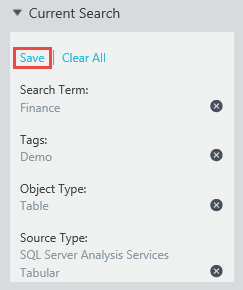

<properties
   pageTitle="Comment enregistrer des recherches et l’épingler des ressources de données | Microsoft Azure"
   description="Article de la mise en surbrillance des fonctionnalités dans le catalogue de données Azure pour l’enregistrement des sources de données et de vos données pour une utilisation ultérieure."
   services="data-catalog"
   documentationCenter=""
   authors="steelanddata"
   manager="NA"
   editor=""
   tags=""/>
<tags
   ms.service="data-catalog"
   ms.devlang="NA"
   ms.topic="article"
   ms.tgt_pltfrm="NA"
   ms.workload="data-catalog"
   ms.date="10/10/2016"
   ms.author="maroche"/>

# Comment enregistrer des recherches et l’épingler des ressources de données

## Introduction

Catalogue de données Microsoft Azure fournit les fonctionnalités pour la découverte de source de données. Les utilisateurs peuvent rapidement rechercher et filtrer le catalogue pour localiser des sources de données et à comprendre son objectif initial, ce qui facilite rechercher les données appropriées pour la tâche à portée de main.

Mais qu’en est-il lorsque les utilisateurs doivent régulièrement travailler avec les mêmes données ? Qu’en est-il lorsque les utilisateurs partager régulièrement leurs connaissances sur les mêmes sources de données dans le catalogue ? Dans ce cas, avoir à émettre à plusieurs reprises les mêmes recherches peut s’avérer inefficace : il s’agit de l’emplacement dans lequel la recherche enregistrée et épinglées données biens peuvent vous aider.

## Recherches enregistrées

Une recherche enregistrée dans le catalogue de données Azure est une définition de recherche par utilisateur réutilisable. Une fois qu’un utilisateur a défini une recherche, y compris les termes de recherche, des balises et des autres filtres, il peut l’enregistrer pour une utilisation ultérieure. La définition de la recherche enregistrée peut ensuite être exécutée de nouveau à une date ultérieure, pour renvoyer les éléments de données qui correspondent à ses critères de recherche.

### Création d’une recherche enregistrée

Pour créer une recherche enregistrée, d’abord entrer les critères de recherche à réutiliser. Cliquez ensuite sur le lien « Enregistrer » dans la zone de recherche « en cours » dans le portail du catalogue de données Azure.

 

Lorsque vous y êtes invité, entrez un nom pour la recherche enregistrée. Sélectionnez un nom significatif et descriptif la vie de données qui sera retourné par la recherche.

 

### Gestion des recherches enregistrées

Une fois qu’un utilisateur a enregistré une ou plusieurs recherches, une option « Recherches enregistrées » s’affichent dans le portail du catalogue de données Azure sous la zone de recherche « en cours ». Lorsqu’elle est développée, la liste complète des recherches enregistre s’affichera.

 

Sélection d’une recherche enregistrée dans la liste entraîne la recherche à exécuter.

Sélectionnez le menu déroulant constituent un ensemble d’options de gestion :

 

En sélectionnant « Renommer » invitera l’utilisateur à entrer un nouveau nom pour la recherche enregistrée. La définition de recherche n’est pas remplacée.

Sélectionnez « Supprimer » invitera l’utilisateur confirmation et supprime ensuite la recherche enregistrée à partir de la liste de l’utilisateur.

Sélection de « Enregistrer en tant que valeur par défaut » marque la choisie recherche enregistrée sous forme de la recherche par défaut pour l’utilisateur. Si l’utilisateur effectue une recherche « vide » à partir de la page d’accueil de catalogue de données Azure, recherche par défaut de l’utilisateur sera exécuté. En outre, la recherche marquée comme valeur par défaut s’affiche en haut de la liste de recherche enregistrée.

### Recherches enregistrées d’organisation

Tous les utilisateurs peuvent enregistrer les recherches pour leur usage. Administrateurs de catalogue de données peuvent également enregistrer les recherches pour tous les utilisateurs au sein de l’organisation. Lorsque vous enregistrez une recherche, les administrateurs sont présentés avec une option permettant de partager la recherche enregistrée au sein de la société. Si cette option est sélectionnée, la recherche enregistrée sera incluse dans la liste des recherches disponibles pour tous les utilisateurs.

 

## Ressources de données épinglé

Recherches enregistrées autoriser les utilisateurs à enregistrer et réutiliser les définitions de recherche ; les ressources de données renvoyées par la recherche peuvent changer au fil du temps en tant que le contenu de la modification du catalogue. L’épinglage d’éléments de données permet aux utilisateurs d’identifier explicitement les ressources de données spécifiques pour les retrouver facilement accès sans avoir besoin d’utiliser une recherche.

L’épinglage d’un élément de données est simple : les utilisateurs peuvent cliquer simplement l’icône « épingler » de l’actif de données pour l’ajouter à leur liste des programmes affichés. Cette icône apparaît dans le coin de la vignette de biens dans l’affichage en mosaïque et dans la colonne la plus à gauche dans la liste dans le portail du catalogue de données Azure.

Désépingler un bien est également très simple : utilisateurs cliquez simplement sur l’icône « épingler » à nouveau pour activer ou désactiver le paramètre pour l’élément sélectionné.

## « Mes ressources »
La page d’accueil du portail de catalogue de données Azure comprend une section « Mes biens » qui affiche les éléments utiles à l’utilisateur actuel. Cette section inclut les deux éléments épinglés et recherches enregistrées.

## Résumé
Catalogue de données Azure fournit les fonctionnalités qui facilitent aux utilisateurs de découvrir les sources de données que dont elles ont besoin, afin qu’ils peuvent passer moins de temps vous recherchez des données et plus de temps avec lui. Les recherches enregistrées et épinglées données générer des biens sur ces fonctionnalités clés afin que les utilisateurs peuvent facilement identifier les sources de données à laquelle elles sont prises en charge à plusieurs reprises.
