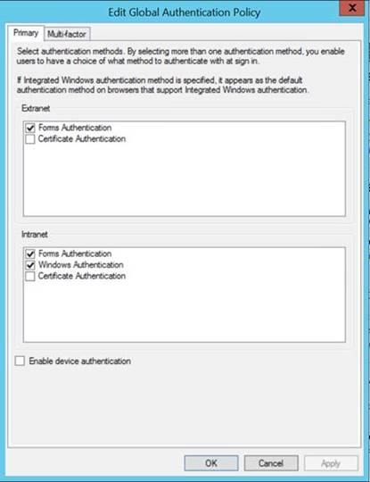

<properties
   pageTitle="Conditions préalables catalogue de données Azure | Microsoft Azure"
   description="Azure catalogue de données conditions préalables - ce que vous devez commencer à utiliser le catalogue de données Azure."
   services="data-catalog"
   documentationCenter=""
   authors="steelanddata"
   manager="NA"
   editor=""
   tags=""/>
<tags
   ms.service="data-catalog"
   ms.devlang="NA"
   ms.topic="article"
   ms.tgt_pltfrm="NA"
   ms.workload="data-catalog"
   ms.date="09/21/2016"
   ms.author="maroche"/>

# Conditions préalables catalogue de données Azure

## Que dois-je prise en main catalogue de données Azure ?

Il existe plusieurs choses que vous devez prendre en charge avant que vous pouvez configurer **Catalogue de données Azure**. Ne vous inquiétez pas, ils ne prennent pas de temps !

## Abonnement Azure
Pour configurer le catalogue de données Azure, vous devez être le propriétaire ou copropriétaire d’un abonnement Azure.

Abonnements Azure vous aident à organiser l’accès à des ressources du service cloud tel que catalogue de données Azure. Ils également vous permettent de contrôler l’utilisation des ressources est signalée, facturé et payé pour. Chaque abonnement peut avoir une configuration différente de facturation et de paiement, vous pouvez faire différents abonnements et les différentes offres par département, project, office régionaux et ainsi de suite. Chaque service cloud appartient à un abonnement, et vous devez disposer d’un abonnement avant de configurer le catalogue de données Azure. Pour plus d’informations, voir [Gérer les comptes, les abonnements et les rôles d’administrateur](../active-directory/active-directory-assign-admin-roles.md).

## Azure Active Directory
Pour configurer le catalogue de données Azure, vous devez être connecté en utilisant un compte d’utilisateur Azure Active Directory.

Azure Active Directory (AD Azure) offre un moyen facile pour votre entreprise à gérer l’accès, à la fois dans le cloud et en local et identité. Les utilisateurs peuvent utiliser un seul compte scolaire ou pour l’authentification unique dans n’importe quel cloud et application web locaux. Catalogue de données Azure utilise Azure AD pour authentifier authentification. Pour plus d’informations, consultez [Nouveautés Azure Active Directory](../active-directory/active-directory-whatis.md).

> [AZURE.NOTE] Le [portail Azure](http://portal.azure.com/) permet aux utilisateurs de se connecter à l’aide d’un Account Microsoft ou un travail Azure Active Directory compte professionnel ou scolaire. Pour configurer le catalogue de données Azure à l’aide du portail Azure ou à l’aide du [portail de catalogue de données](http://www.azuredatacatalog.com) , vous devez être connecté en utilisant un compte Azure Active Directory, pas un compte personnel.

## Configuration de la stratégie Active Directory

Dans certains cas, les utilisateurs peuvent rencontrer une situation où se connecter au portail catalogue de données Azure, mais quand ils essaient d’ouvrir une session sur l’outil d’enregistrement de source de données qu’ils rencontrent un message d’erreur qui empêche l’ouverture de session. Ce problème peut se produire uniquement lorsque l’utilisateur se trouve sur le réseau d’entreprise, ou peut se produire uniquement lorsque l’utilisateur se connecte à partir de l’extérieur du réseau d’entreprise.

L’outil de l’enregistrement de source de données utilise l’authentification par formulaire pour valider les connexions utilisateur dans Active Directory. Pour l’ouverture de session, l’authentification par formulaire doit être activée dans la stratégie d’authentification globale par un administrateur Active Directory.

La stratégie d’authentification globale permet de méthodes d’authentification doit être activé séparément pour intranet et les connexions extranet, comme illustré ci-dessous. Erreurs de connexion peuvent se produire si l’authentification par formulaire n’est pas activée pour le réseau à partir duquel l’utilisateur se connecte.

 

Pour plus d’informations, voir [Configuration des stratégies d’authentification](https://technet.microsoft.com/library/dn486781.aspx).
