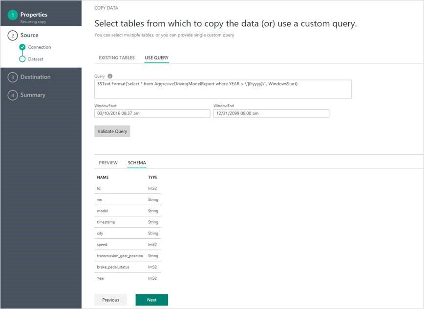
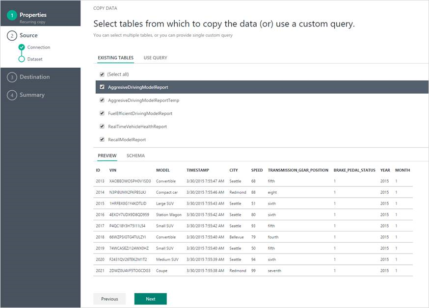

<properties
    pageTitle="Données usine copie Azure Assistant | Microsoft Azure"
    description="Découvrez comment utiliser l’Assistant données usine Azure copier pour copier des données à partir de sources de données prises en charge dans les récepteurs."
    services="data-factory"
    documentationCenter=""
    authors="spelluru"
    manager="jhubbard"
    editor="monicar"/>

<tags
    ms.service="data-factory"
    ms.workload="data-services"
    ms.tgt_pltfrm="na"
    ms.devlang="na"
    ms.topic="article"
    ms.date="10/03/2016"
    ms.author="spelluru"/>

# Données Azure Factory - Assistant copie
L’Assistant de copie Azure données usine consiste à simplifier le processus de réception de données, ce qui sont généralement une première étape dans un scénario d’intégration des données de bout en bout. Lorsque vous passez par l’Assistant de copie Azure données par défaut, vous n’avez pas besoin de comprendre les définitions JSON pour services liés, les jeux de données et pipelines. Toutefois, une fois toutes les étapes de l’Assistant, l’Assistant crée automatiquement un pipeline pour copier des données à partir de la source de données sélectionnée vers la destination sélectionnée. En outre, l’Assistant copie vous aide à valider les données étant ingérées au moment de la création, qui enregistre la plupart du temps, particulièrement quand vous soyez traiter les données pour la première fois à partir de la source de données. Pour démarrer l’Assistant copie, cliquez sur la vignette de **Copier les données** dans la page d’accueil de votre usine de données.

## Un Assistant intuitif pour copier les données
Cet Assistant permet de déplacer facilement des données d’un large éventail de sources aux destinations en minutes. Après avoir suivi les étapes de l’Assistant, un pipeline avec une activité de copie est automatiquement créé pour vous ainsi que des entités Data Factory dépendantes (liées services et des groupes de données). Aucune des étapes supplémentaires ne sont nécessaires pour créer le pipeline.   

> [AZURE.NOTE] Reportez-vous à l’article [didacticiel de l’Assistant copie](data-factory-copy-data-wizard-tutorial.md) pour obtenir des instructions étape par étape créer une opportunité d’exemple pour copier des données à partir d’un Azure blob à une table de base de données SQL Azure. 

L’Assistant est conçu avec des données volumineux à l’esprit à partir du début. Il est simple et efficace pour créer des pipelines Data Factory qui transfèrent des centaines de dossiers, des fichiers ou des tables à l’aide de l’Assistant Copier des données. L’Assistant prend en charge les trois fonctionnalités suivantes : aperçu automatique des données, capture schéma et le mappage et filtrage des données. 

## Aperçu automatique des données 
L’Assistant copie vous permet de passer en revue une partie des données provenant de la source de données sélectionnées vous permettant de vérifier si les données sont les bonnes données que vous souhaitez copier. En outre, si la source de données se trouve dans un fichier texte, l’Assistant copie analyse le fichier texte pour en savoir plus de ligne et séparateurs de colonnes et de schéma automatiquement. 

## Mappage et la capture de schéma 
Le schéma de données d’entrée ne peut pas correspond au schéma des données de sortie dans certains cas. Dans ce scénario, vous devez mapper les colonnes à partir du schéma source à des colonnes dans le schéma de destination. 

L’Assistant copie mappe automatiquement des colonnes dans le schéma source vers des colonnes dans le schéma de destination. Vous pouvez ignorer les mappages et utiliser les listes déroulantes (ou) spécifier si une colonne doit être ignorée lors de la copie les données.   

## Filtrage des données  
L’Assistant vous permet de filtrer les données source pour sélectionner uniquement les données devant être copié dans le magasin de données de destination/récepteur. Le filtrage permet de réduire le volume de données à copier dans le magasin de données récepteur et par conséquent améliore le débit de l’opération de copie. Il propose un moyen souple pour filtrer les données dans une base de données relationnel à l’aide de SQL query language (ou) fichiers dans un dossier d’objets blob Azure à l’aide de [variables et des fonctions Data Factory](data-factory-functions-variables.md).   

### Filtrer des données dans une base de données  
Dans l’exemple, la requête SQL utilise le `Text.Format` fonction et `WindowStart` variable. 

### Filtrer des données dans un dossier d’objets blob Azure
Vous pouvez utiliser des variables dans le chemin du dossier pour copier des données à partir d’un dossier est déterminé lors de l’exécution en fonction des [variables système](data-factory-functions-variables.md#data-factory-system-variables). Les variables pris en charge sont : **{year}**, **{mois}**, **{day}**, **{heure}**, **{minute}**et **{personnalisé}**. Exemple : inputfolder / {year} / {mois} / {jour}.

Supposons que vous avez entrée dossiers au format suivant :

    2016/03/01/01
    2016/03/01/02
    2016/03/01/03
    ...

Cliquez sur le bouton **Parcourir** pour le **fichier ou un dossier**, accédez à un de ces dossiers (par exemple, 2016 -> 03 -> 01 -> 02), cliquez sur **Choisir**. Vous devriez voir `2016/03/01/02` dans la zone de texte. À présent, remplacez **2016** **{year}**, **03** avec **{mois}**, **01** à **{day}**et **02** **{**heure} et appuyez sur Tab. Vous devriez voir les listes déroulantes pour sélectionner le format pour ces quatre variables :

   

Comme indiqué dans l’écran suivant, vous pouvez également utiliser une variable **personnalisé** et une [prise en charge des chaînes de format](https://msdn.microsoft.com/library/8kb3ddd4.aspx). Pour sélectionner un dossier avec cette structure, utilisez le bouton **Parcourir** tout d’abord. Remplacer une valeur par **{personnalisé}**, puis appuyez sur Tab pour afficher la zone de texte où vous pouvez taper la chaîne de format.     

## Prise en charge des données centralisées et types d’objets
À l’aide de l’Assistant copie, vous pouvez déplacer efficacement des centaines de dossiers, des fichiers ou des tables.

## Options de planification
Vous pouvez exécuter l’opération de copie une fois ou selon un planning (toutes les heures, tous les jours, et ainsi de suite). Ces deux options peuvent servir à la largeur des connecteurs sur en local, cloud et bureau locale.

Une opération de copie unique permet de déplacement des données à partir d’une source vers une destination qu’une seule fois. Elle s’applique aux données de toute taille et de n’importe quel format pris en charge. La copie planifiée vous permet de copier des données sur une périodicité prescrite. Vous pouvez utiliser les paramètres enrichis (par exemple, les nouvelles tentatives, délai d’attente et d’alertes) pour configurer la copie planifiée.

## Étapes suivantes
Pour un bref aperçu de l’utilisation de l’Assistant de copie de données par défaut pour créer un pipeline avec une activité copie, voir [didacticiel : créer une opportunité à l’aide de l’Assistant copie](data-factory-copy-data-wizard-tutorial.md).
