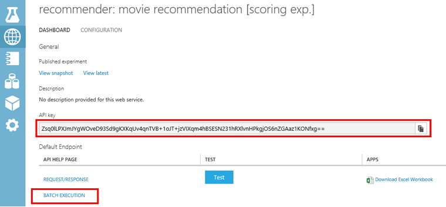
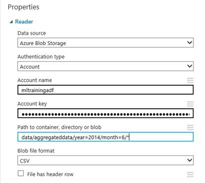
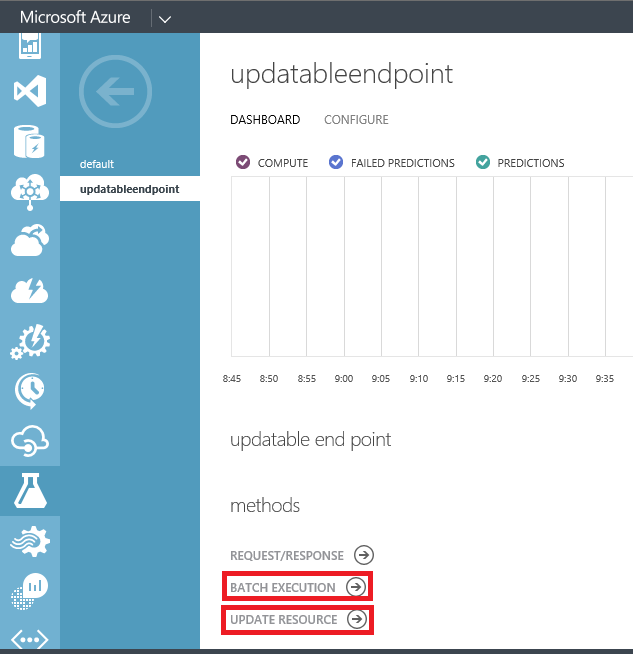

<properties 
    pageTitle="Utiliser les activités d’apprentissage automatique | Microsoft Azure" 
    description="Décrit comment créer créer prédictives pipelines à l’aide de Azure Data Factory et apprentissage automatique Azure" 
    services="data-factory" 
    documentationCenter="" 
    authors="sharonlo101" 
    manager="jhubbard" 
    editor="monicar"/>

<tags 
    ms.service="data-factory" 
    ms.workload="data-services" 
    ms.tgt_pltfrm="na" 
    ms.devlang="na" 
    ms.topic="article" 
    ms.date="09/06/2016" 
    ms.author="shlo"/>

# Créer des pipelines prédictives à l’aide d’activités d’apprentissage automatique Azure   
> [AZURE.SELECTOR]
[Hive](data-factory-hive-activity.md)  
[Cochon](data-factory-pig-activity.md)  
[MapReduce](data-factory-map-reduce.md)  
[Diffusion en continu Hadoop](data-factory-hadoop-streaming-activity.md)
[Apprentissage automatique](data-factory-azure-ml-batch-execution-activity.md) 
[Procédure stockée](data-factory-stored-proc-activity.md)
[Données Lake Analytique U SQL](data-factory-usql-activity.md)
[.NET personnalisé](data-factory-use-custom-activities.md)

## Introduction

[Apprentissage automatique Azure](https://azure.microsoft.com/documentation/services/machine-learning/) vous permet de créer, tester et déployer des solutions prédictive analytique. À partir d’un point de vue globale, il est traité en trois étapes : 

1. **Créer une expérience de formation**. Vous effectuez cette étape à l’aide du Studio ML Azure. Le studio ML est un environnement collaboratif de développement visuel que vous utilisez pour former et test d’un modèle prédictive analytique à l’aide de données d’apprentissage.
2. **Convertir en une expérience prédictive**. Une fois votre modèle a été formé avec des données existantes et vous êtes prêt à utiliser pour évaluer les nouvelles données, vous préparez et optimiser votre expérience d’évaluation.
3. **Déployer comme un service web**. Vous pouvez publier votre expérience score comme un service web Azure. Vous pouvez envoyer des données à votre modèle via ce point de fin du service web et recevoir des prédictions résultat à partir du modèle.  

Azure Data Factory vous permet de créer aisément des pipelines qui utilisent un publiés [Apprentissage automatique Azure] [ azure-machine-learning] service pour analytique prédictive web. Consultez les articles [présentation Azure Data Factory](data-factory-introduction.md) et [créer votre première pipeline](data-factory-build-your-first-pipeline.md) pour commencer rapidement avec le service Azure Data Factory. 

Utilisation de l' **Activité des lots de l’exécution** dans un pipeline Azure Data Factory, vous pouvez appeler un service web Azure ML pour réaliser des prévisions sur les données de lot. Consultez la section [service à l’aide de l’activité de l’exécution du lot appelant un ML Azure web](#invoking-an-azure-ml-web-service-using-the-batch-execution-activity) pour plus d’informations.

Dans le temps, les modèles prédictives dans les ML Azure score expériences doivent être s à l’aide de nouveaux jeux de données d’entrée. Vous pouvez former un modèle d’Azure ML à partir d’un pipeline de données par défaut en procédant comme suit : 

1. Publier l’expérience de formation (expérience pas prédictive) sous la forme d’un service web. Vous effectuez cette étape dans Azure ML Studio comme vous le faisiez pour exposer expérience prédictive sous forme d’un service web dans l’exemple précédent.
2. Utilisez l’activité de l’exécution du lot Azure ML pour appeler le service web de l’expérience de formation. En fait, vous pouvez utiliser l’activité de l’exécution du lot Azure ML pour appeler le service web de formation et score service web. 
  
Une fois que vous avez fini avec reconversion, à mettre à jour le service web scores (expérience prédictive exposé comme un service web) et le modèle que vous venez formé. Voici les étapes : 

1. Ajouter un point de terminaison ceux par défaut du service web score. Le point de terminaison par défaut du service web ne peut pas être mis à jour, vous devez créer un point de terminaison ceux définis par défaut à l’aide du portail Azure. Voir l’article [Créer une extrémité](../machine-learning/machine-learning-create-endpoint.md) pour obtenir des informations conceptuelles et procédures.
2. Mettre à jour des services ML Azure lié existants pour notation pour utiliser le point de terminaison ceux définis par défaut. Commencer à utiliser le nouveau point de terminaison pour utiliser le service web qui est mis à jour.
3. Utilisez l' **Activité des ressources de mettre à jour ML Azure** pour mettre à jour le service web avec le modèle que vous venez formé.  

Pour plus d’informations, reportez-vous à la section [modèles de mise à jour Azure ML à l’aide de l’activité de ressources de mise à jour](#updating-azure-ml-models-using-the-update-resource-activity) . 

## Appel d’un service web à l’aide d’activité des lots de l’exécution

Vous permet d’organiser le déplacement de données et du traitement Azure Data Factory et puis exécutez l’exécution du lot à l’aide d’apprentissage automatique Azure. Voici les étapes de niveau supérieur :

1. Créer un service d’apprentissage automatique Azure lié. Vous devez les éléments suivants :
    1. **Demande URI** pour l’exécution du lot API. Vous pouvez trouver l’URI demander en cliquant sur le lien de **L’exécution du lot** dans la page des services web.
    1. **Clé d’API** pour le service web apprentissage automatique Azure publié. Vous pouvez trouver la clé de l’API en cliquant sur le service web que vous avez publié. 
 2. Utilisez l’activité **AzureMLBatchExecution** .

    

    

### Scénario : Expériences à l’aide de charge des entrées/sorties de service de Web qui font référence aux données dans le stockage Blob Azure
Dans ce scénario, le service Web de formation Azure Machine rend prévisions à l’aide des données à partir d’un fichier dans un stockage d’objets blob Azure et stocke les résultats de la prévision dans le stockage blob. Le JSON suivant définit un pipeline Data Factory avec une activité AzureMLBatchExecution. L’activité a le dataset **DecisionTreeInputBlob** comme entrée et **DecisionTreeResultBlob** comme sortie. Le **DecisionTreeInputBlob** est passé comme entrée au service web à l’aide de la propriété JSON **webServiceInput** . Le **DecisionTreeResultBlob** est passé comme résultat au service Web à l’aide de la propriété JSON **webServiceOutputs** .  

> [AZURE.IMPORTANT] 
> Si le service web prend plusieurs entrées, utilisez la propriété **webServiceInputs** au lieu d’utiliser **webServiceInput**. Consultez la section [service Web requiert plusieurs entrées](#web-service-requires-multiple-inputs) pour obtenir un exemple de l’utilisation de la propriété webServiceInputs.
>  
> Jeux de données qui est référencées par la **webServiceInput**/**webServiceInputs** et **webServiceOutputs** propriétés ( **typeProperties**) doivent également être incluses dans les activités **entrées** et les **sorties**.
> 
> Dans votre expérience Azure ML, saisie de service web et les ports de sortie et les paramètres globaux portent des noms par défaut (« input1 », « input2 ») que vous pouvez personnaliser. Les noms que vous utilisez pour webServiceInputs, webServiceOutputs et globalParameters paramètres doivent correspondre exactement les noms dans les expériences. Vous pouvez afficher la charge utile de demande exemple sur la page aide de l’exécution du lot pour votre point de terminaison Azure ML vérifier le mappage attendu. 

    {
      "name": "PredictivePipeline",
      "properties": {
        "description": "use AzureML model",
        "activities": [
          {
            "name": "MLActivity",
            "type": "AzureMLBatchExecution",
            "description": "prediction analysis on batch input",
            "inputs": [
              {
                "name": "DecisionTreeInputBlob"
              }
            ],
            "outputs": [
              {
                "name": "DecisionTreeResultBlob"
              }
            ],
            "linkedServiceName": "MyAzureMLLinkedService",
            "typeProperties":
            {
                "webServiceInput": "DecisionTreeInputBlob",
                "webServiceOutputs": {
                    "output1": "DecisionTreeResultBlob"
                }                
            },
            "policy": {
              "concurrency": 3,
              "executionPriorityOrder": "NewestFirst",
              "retry": 1,
              "timeout": "02:00:00"
            }
          }
        ],
        "start": "2016-02-13T00:00:00Z",
        "end": "2016-02-14T00:00:00Z"
      }
    }

> [AZURE.NOTE] Uniquement les entrées et sorties de l’activité AzureMLBatchExecution peuvent être passés en tant que paramètres du service Web. Par exemple, dans l’extrait JSON ci-dessus, DecisionTreeInputBlob est une entrée de l’activité AzureMLBatchExecution, qui est passée comme entrée au service Web via le paramètre webServiceInput.   

### Exemple

Cet exemple utilise le stockage Azure pour stocker les données d’entrée et de sortie. 

Nous vous recommandons que vous accédez à [créer votre première pipeline avec Data Factory] [ adf-build-1st-pipeline] didacticiels avant d’utiliser cet exemple. L’éditeur d’usine de données permet de créer des objets de données par défaut (services liés, jeux de données, pipeline) dans cet exemple.   
 

1. Créer un **service liée** pour le **Stockage Azure**. Si les fichiers d’entrée et de sortie se trouvent dans les comptes de stockage différents, vous devez deux services liées. Voici un exemple JSON :

        {
          "name": "StorageLinkedService",
          "properties": {
            "type": "AzureStorage",
            "typeProperties": {
              "connectionString": "DefaultEndpointsProtocol=https;AccountName=[acctName];AccountKey=[acctKey]"
            }
          }
        }

2. Créer **Saisie** Azure Data Factory **dataset**. Contrairement à certaines autres Data Factory jeux de données, ces jeux de données doit contenir des valeurs **folderPath** et **nom de fichier** . Vous pouvez utiliser la partition à l’origine de chaque exécution du lot (chaque tranche de données) traiter ou produire d’entrée unique et fichiers de sortie. Vous devrez peut-être inclure certaines activités en amont pour transformer l’entrée dans le format de fichier CSV et le placer dans le compte de stockage pour chaque secteur. Dans ce cas, vous ne voulez pas inclure les paramètres **externes** et **externalData** affichés dans l’exemple suivant, et votre DecisionTreeInputBlob serait le jeu de données de sortie d’une autre activité.

        {
          "name": "DecisionTreeInputBlob",
          "properties": {
            "type": "AzureBlob",
            "linkedServiceName": "StorageLinkedService",
            "typeProperties": {
              "folderPath": "azuremltesting/input",
              "fileName": "in.csv",
              "format": {
                "type": "TextFormat",
                "columnDelimiter": ","
              }
            },
            "external": true,
            "availability": {
              "frequency": "Day",
              "interval": 1
            },
            "policy": {
              "externalData": {
                "retryInterval": "00:01:00",
                "retryTimeout": "00:10:00",
                "maximumRetry": 3
              }
            }
          }
        }
    
    Votre fichier csv d’entrée doit avoir la ligne d’en-tête de colonne. Si vous utilisez l' **Activité de copie** pour créer/déplacer la csv dans le stockage blob, vous devez définir la propriété de récepteur **blobWriterAddHeader** **true**. Par exemple :
    
         sink: 
         {
             "type": "BlobSink",     
             "blobWriterAddHeader": true 
         }
     
    Si le fichier csv ne comporte pas la ligne d’en-tête, vous pouvez rencontrer l’erreur suivante : **d’erreur dans l’activité : erreur de lecture de chaîne. Jeton inattendu : StartObject. Chemin d’accès '', ligne 1, placez 1**.
3. Créer la **sortie** Azure Data Factory **dataset**. Cet exemple utilise la partition pour créer un chemin d’accès de sortie unique pour chaque exécution de secteur. Sans partition, l’activité risque de remplacer le fichier.

        {
          "name": "DecisionTreeResultBlob",
          "properties": {
            "type": "AzureBlob",
            "linkedServiceName": "StorageLinkedService",
            "typeProperties": {
              "folderPath": "azuremltesting/scored/{folderpart}/",
              "fileName": "{filepart}result.csv",
              "partitionedBy": [
                {
                  "name": "folderpart",
                  "value": {
                    "type": "DateTime",
                    "date": "SliceStart",
                    "format": "yyyyMMdd"
                  }
                },
                {
                  "name": "filepart",
                  "value": {
                    "type": "DateTime",
                    "date": "SliceStart",
                    "format": "HHmmss"
                  }
                }
              ],
              "format": {
                "type": "TextFormat",
                "columnDelimiter": ","
              }
            },
            "availability": {
              "frequency": "Day",
              "interval": 15
            }
          }
        }

4. Créer un **service liée** du type : **AzureMLLinkedService**, fournissant l’API clé et URL de l’exécution du lot du modèle.
        
        {
          "name": "MyAzureMLLinkedService",
          "properties": {
            "type": "AzureML",
            "typeProperties": {
              "mlEndpoint": "https://[batch execution endpoint]/jobs",
              "apiKey": "[apikey]"
            }
          }
        }
5. Enfin, créez un pipeline contenant une activité **AzureMLBatchExecution** . En cours d’exécution, pipeline effectue les opérations suivantes :
    1. Obtient l’emplacement du fichier d’entrée de vos groupes de données d’entrée.
    2. Appelle l’exécution de commandes d’apprentissage automatique Azure API
    3. Copie la sortie de l’exécution du lot au blob figurant dans votre jeu de données de sortie. 

    > [AZURE.NOTE] Activité AzureMLBatchExecution peut avoir zéro, un ou plusieurs entrées et une ou plusieurs sorties.

        {
          "name": "PredictivePipeline",
          "properties": {
            "description": "use AzureML model",
            "activities": [
              {
                "name": "MLActivity",
                "type": "AzureMLBatchExecution",
                "description": "prediction analysis on batch input",
                "inputs": [
                  {
                    "name": "DecisionTreeInputBlob"
                  }
                ],
                "outputs": [
                  {
                    "name": "DecisionTreeResultBlob"
                  }
                ],
                "linkedServiceName": "MyAzureMLLinkedService",
                "typeProperties":
                {
                    "webServiceInput": "DecisionTreeInputBlob",
                    "webServiceOutputs": {
                        "output1": "DecisionTreeResultBlob"
                    }                
                },
                "policy": {
                  "concurrency": 3,
                  "executionPriorityOrder": "NewestFirst",
                  "retry": 1,
                  "timeout": "02:00:00"
                }
              }
            ],
            "start": "2016-02-13T00:00:00Z",
            "end": "2016-02-14T00:00:00Z"
          }
        }

    Dates/heures de **début** et de **fin** doivent être au [format ISO](http://en.wikipedia.org/wiki/ISO_8601). Par exemple : 2014-10-14T16:32:41Z. L’heure de **fin** est facultative. Si vous ne spécifiez pas de valeur pour la propriété **end** , il est calculé comme «**début + 48 heures.**» Pour exécuter le pipeline indéfiniment, spécifiez **9999-09-09** comme la valeur de la propriété de **fin** . Pour plus d’informations sur les propriétés JSON, voir [Référence de l’écriture de script JSON](https://msdn.microsoft.com/library/dn835050.aspx) .

    > [AZURE.NOTE] Définition d’une entrée pour la AzureMLBatchExecution activité est facultative. 

### Scénario : Expériences à l’aide de Modules de lecture/écriture à faire référence aux données dans divers stockages

Un autre scénario courant lorsque vous créez des expériences ML Azure consiste à utiliser le lecteur et Writer modules. Le module de lecteur est utilisé pour charger les données dans une expérience et le module writer pour enregistrer les données à partir de vos expériences. Pour plus d’informations sur les modules de lecteur et writer, consultez les rubriques [lecteur](https://msdn.microsoft.com/library/azure/dn905997.aspx) et [Writer](https://msdn.microsoft.com/library/azure/dn905984.aspx) sur MSDN Library.     

Lorsque vous utilisez les lecteur et writer modules, il est recommandé d’utiliser un paramètre du service Web pour chaque propriété de ces modules de lecture/écriture. Ces paramètres web permettent de configurer les valeurs lors de l’exécution. Par exemple, vous pouvez créer une expérience avec un module de lecteur qui utilise une base de données SQL Azure : XXX.database.windows.net. Une fois que le service web a été déployé, que vous souhaitez activer les consommateurs du service web spécifier un autre Azure SQL Server, appelé YYY.database.windows.net. Vous pouvez utiliser un paramètre du service Web pour autoriser cette valeur doit être configuré.

> [AZURE.NOTE] Entrée du service Web et la sortie sont différents des paramètres de service Web. Dans le premier scénario, vous avez vu comment une entrée et sortie peuvent être spécifiés pour un service Web de ML Azure. Dans ce scénario, vous passez les paramètres d’un service Web qui correspondent aux propriétés des modules de lecture/écriture. 

Examinons un exemple d’utilisation des paramètres de service Web. Vous disposez d’un service web apprentissage automatique Azure déployé qui utilise un module de lecture pour lire les données à partir d’une des sources de données prises en charge par apprentissage automatique Azure (par exemple : base de données SQL Azure). Après que l’exécution du lot est exécutée, les résultats sont écrits à l’aide d’un module Writer (de base de données SQL Azure).  Aucune entrées de service web et des sorties ne sont définis dans les expériences. Dans ce cas, nous vous recommandons de configurer les paramètres de service web pertinentes pour les modules lecteur et writer. Cette configuration permet la lecture/écriture modules doit être configuré lors de l’utilisation de l’activité AzureMLBatchExecution. Vous spécifiez les paramètres de service Web dans la section **globalParameters** dans l’activité JSON comme suit. 

    "typeProperties": {
        "globalParameters": {
            "Param 1": "Value 1",
            "Param 2": "Value 2"
        }
    }

Vous pouvez également utiliser les [Fonctions d’usine de données](https://msdn.microsoft.com/library/dn835056.aspx) pour le passage de valeurs pour les paramètres de service Web comme le montre l’exemple suivant :

    "typeProperties": {
        "globalParameters": {
           "Database query": "$$Text.Format('SELECT * FROM myTable WHERE timeColumn = \\'{0:yyyy-MM-dd HH:mm:ss}\\'', Time.AddHours(WindowStart, 0))"
        }
    }
 
> [AZURE.NOTE] Les paramètres du service Web respectent la casse, assurez-vous que les noms que vous spécifiez dans l’activité JSON correspondent à ceux présentés par le service Web. 

### À l’aide d’un module de lecteur pour lire les données à partir de plusieurs fichiers dans Blob Azure
Données volumineuses canalisations avec activités, par exemple cochon et Hive peut produire un ou plusieurs fichiers de sortie sans extensions. Par exemple, lorsque vous spécifiez une table Hive externe, les données pour la table Hive externes peuvent être stockées dans le stockage blob Azure avec la 000000_0 nom suivant. Vous pouvez utiliser le module de lecteur d’une expérience pour lire plusieurs fichiers et les utiliser pour les prévisions. 

Lorsque vous utilisez le module de lecteur d’une expérience d’apprentissage automatique Azure, vous pouvez spécifier des objets Blob Azure comme entrée. Les fichiers dans le stockage blob Azure peuvent être les fichiers de sortie (exemple : 000000_0) qui sont produites par un script cochon et Hive s’exécutant sur HDInsight. Le lecteur module vous permet de lire les fichiers (avec sans extension) en configurant la **chemin d’accès au conteneur de répertoire/blob**. Les points de **chemin d’accès au conteneur** aux points de conteneur et **répertoire/blob** au dossier contenant les fichiers comme le montre l’image suivante. L’astérisque, \*) **Spécifie que tous les fichiers dans le dossier/conteneur (autrement dit, données/aggregateddata/année = mois/2014-6 /\*)** lecture dans le cadre de l’expérience.

### Exemple 
#### Pipeline avec une activité AzureMLBatchExecution avec les paramètres de Service Web

    {
      "name": "MLWithSqlReaderSqlWriter",
      "properties": {
        "description": "Azure ML model with sql azure reader/writer",
        "activities": [
          {
            "name": "MLSqlReaderSqlWriterActivity",
            "type": "AzureMLBatchExecution",
            "description": "test",
            "inputs": [
              {
                "name": "MLSqlInput"
              }
            ],
            "outputs": [
              {
                "name": "MLSqlOutput"
              }
            ],
            "linkedServiceName": "MLSqlReaderSqlWriterDecisionTreeModel",
            "typeProperties":
            {
                "webServiceInput": "MLSqlInput",
                "webServiceOutputs": {
                    "output1": "MLSqlOutput"
                }
                "globalParameters": {
                    "Database server name": "<myserver>.database.windows.net",
                    "Database name": "<database>",
                    "Server user account name": "<user name>",
                    "Server user account password": "<password>"
                }              
            },
            "policy": {
              "concurrency": 1,
              "executionPriorityOrder": "NewestFirst",
              "retry": 1,
              "timeout": "02:00:00"
            },
          }
        ],
        "start": "2016-02-13T00:00:00Z",
        "end": "2016-02-14T00:00:00Z"
      }
    }
 
Dans l’exemple ci-dessus JSON :

- Le service Web de formation Azure Machine déployé utilise un lecteur et un module writer en lecture/écriture données depuis/vers une base de données SQL Azure. Ce service Web expose les quatre paramètres suivants : nom du serveur, nom de la base de données, le nom de compte d’utilisateur Server et mot de passe utilisateur serveur de base de données.  
- Dates/heures de **début** et de **fin** doivent être au [format ISO](http://en.wikipedia.org/wiki/ISO_8601). Par exemple : 2014-10-14T16:32:41Z. L’heure de **fin** est facultative. Si vous ne spécifiez pas de valeur pour la propriété **end** , il est calculé comme «**début + 48 heures.**» Pour exécuter le pipeline indéfiniment, spécifiez **9999-09-09** comme la valeur de la propriété de **fin** . Pour plus d’informations sur les propriétés JSON, voir [Référence de l’écriture de script JSON](https://msdn.microsoft.com/library/dn835050.aspx) .

### Autres scénarios

#### Service Web requiert plusieurs entrées
Si le service web prend plusieurs entrées, utilisez la propriété **webServiceInputs** au lieu d’utiliser **webServiceInput**. Jeux de données qui est référencées par la **webServiceInputs** doit également être inclus dans les activités **entrées**.
 
Dans votre expérience Azure ML, saisie de service web et les ports de sortie et les paramètres globaux portent des noms par défaut (« input1 », « input2 ») que vous pouvez personnaliser. Les noms que vous utilisez pour webServiceInputs, webServiceOutputs et globalParameters paramètres doivent correspondre exactement les noms dans les expériences. Vous pouvez afficher la charge utile de demande exemple sur la page aide de l’exécution du lot pour votre point de terminaison Azure ML vérifier le mappage attendu.

    {
        "name": "PredictivePipeline",
        "properties": {
            "description": "use AzureML model",
            "activities": [{
                "name": "MLActivity",
                "type": "AzureMLBatchExecution",
                "description": "prediction analysis on batch input",
                "inputs": [{
                    "name": "inputDataset1"
                }, {
                    "name": "inputDataset2"
                }],
                "outputs": [{
                    "name": "outputDataset"
                }],
                "linkedServiceName": "MyAzureMLLinkedService",
                "typeProperties": {
                    "webServiceInputs": {
                        "input1": "inputDataset1",
                        "input2": "inputDataset2"
                    },
                    "webServiceOutputs": {
                        "output1": "outputDataset"
                    }
                },
                "policy": {
                    "concurrency": 3,
                    "executionPriorityOrder": "NewestFirst",
                    "retry": 1,
                    "timeout": "02:00:00"
                }
            }],
            "start": "2016-02-13T00:00:00Z",
            "end": "2016-02-14T00:00:00Z"
        }
    }

#### Service Web ne nécessite pas d’entrée

Azure ML lot exécution web services peuvent être utilisés pour exécuter des flux de travail, des scripts exemple de R ou Python, qui ne nécessitent pas les entrées. Ou, l’expérience peut être configurée avec un module de lecteur qui n’expose pas les GlobalParameters. Dans ce cas, l’activité AzureMLBatchExecution doit être configurée comme suit :

    {
        "name": "scoring service",
        "type": "AzureMLBatchExecution",
        "outputs": [
            {
                "name": "myBlob"
            }
        ],
        "typeProperties": {
            "webServiceOutputs": {
                "output1": "myBlob"
            }              
         },
        "linkedServiceName": "mlEndpoint",
        "policy": {
            "concurrency": 1,
            "executionPriorityOrder": "NewestFirst",
            "retry": 1,
            "timeout": "02:00:00"
        }
    },
   

#### Service Web ne nécessite pas un sorties
Le service web de ML Azure lot d’exécution n’ait pas de sortie de Service Web configuré. Dans cet exemple, il n’existe aucune entrée de Service Web ou de sortie, ni n’importe quel GlobalParameters configurés. Il est toujours une sortie configurée sur l’activité elle-même, mais elle n’est pas indiquée comme une webServiceOutput.

    {
        "name": "retraining",
        "type": "AzureMLBatchExecution",
        "outputs": [
            {
                "name": "placeholderOutputDataset"
            }
        ],
        "typeProperties": {
         },
        "linkedServiceName": "mlEndpoint",
        "policy": {
            "concurrency": 1,
            "executionPriorityOrder": "NewestFirst",
            "retry": 1,
            "timeout": "02:00:00"
        }
    },

#### Lecteurs utilisations du Service Web et les auteurs et l’activité s’exécute uniquement lorsque d’autres activités ont réussi

Azure ML web service lecteur et writer modules peuvent être configurés pour exécuter avec ou sans les GlobalParameters. Toutefois, vous souhaiterez peut-être incorporer des appels de service dans un pipeline qui utilise des dépendances de dataset pour appeler le service uniquement lorsqu’un traitement en amont est terminée. Vous pouvez également déclencher une autre action après que l’exécution du lot terminée à l’aide de cette approche. Dans ce cas, vous pouvez exprimer les dépendances à l’aide d’activité entrées et les sorties, sans celles désigner comme entrées de Service Web ou sorties.

    {
        "name": "retraining",
        "type": "AzureMLBatchExecution",
        "inputs": [
            {
                "name": "upstreamData1"
            },
            {
                "name": "upstreamData2"
            }
        ],
        "outputs": [
            {
                "name": "downstreamData"
            }
        ],
        "typeProperties": {
         },
        "linkedServiceName": "mlEndpoint",
        "policy": {
            "concurrency": 1,
            "executionPriorityOrder": "NewestFirst",
            "retry": 1,
            "timeout": "02:00:00"
        }
    },

Sont les **points** suivants :

-   Si votre point de terminaison expérience utilise un webServiceInput : il est représenté par un jeu de données blob et est inclus dans les entrées d’activité et la propriété webServiceInput. Dans le cas contraire, la propriété webServiceInput est omise. 
-   Si votre point de terminaison expérience utilise webServiceOutput(s) : ils sont représentés par des jeux de données blob et sont inclus dans les sorties d’activité et dans la propriété webServiceOutputs. Renvoie l’activité et webServiceOutputs sont mappées par le nom de chaque sortie à l’expérience. Dans le cas contraire, la propriété webServiceOutputs est omise.
-   Si votre point de terminaison expérience expose globalParameter(s), ils sont fournis sous forme de paires de valeur clé, dans la propriété globalParameters activité. Dans le cas contraire, la propriété globalParameters est omise. Les touches respectent la casse. [Fonctions d’usine données Azure](data-factory-scheduling-and-execution.md#data-factory-functions-reference) peuvent être utilisés dans les valeurs. 
- Jeux de données supplémentaires peut-être figurer dans les propriétés entrées et les sorties activité, sans y faisant référence dans la typeProperties activité. Ces jeux de données en matière d’exécution de l’utilisation des dépendances de secteur mais est ignorés dans le cas contraire par l’activité AzureMLBatchExecution. 

## Mise à jour de modèles à l’aide de la mise à jour de ressources l’activité
Dans le temps, les modèles prédictives dans les ML Azure score expériences doivent être s à l’aide de nouveaux jeux de données d’entrée. Une fois que vous avez fini avec reconversion, à mettre à jour le service web scores avec le modèle ML retrained. La procédure standard pour activer des modèles Azure ML reconversion et mise à jour via les services web est : 

1. Créer une expérience dans [Azure ML Studio](https://studio.azureml.net). 
2. Lorsque vous êtes satisfait du modèle, utilisez Azure ML Studio pour publier des services web pour les deux **formation tester** et scores /**expérience prédictive**.

Le tableau suivant décrit les services web utilisés dans cet exemple.  Pour plus d’informations, voir [former Machine apprentissage modèles par programme](../machine-learning/machine-learning-retrain-models-programmatically.md) .

| Type de service web | Description 
| :------------------ | :---------- 
| **Service web de formation** | Reçoit les données de formation et produit formés modèles. Le résultat de la reconversion est un fichier .ilearner dans un stockage d’objets Blob Azure.  **point de terminaison par défaut** est automatiquement créée pour vous lors de la publication de l’expérience de formation comme un service web. Vous pouvez créer plusieurs points de terminaison mais il utilise uniquement le point de terminaison par défaut |
| **Notation de service web** | Reçoit des exemples de données sans intitulé et apporte des prédictions. La sortie de prévision peut avoir différentes formes, par exemple un fichier .csv ou lignes dans une base de données SQL Azure, selon la configuration de l’expérience. Le point de terminaison par défaut est créé automatiquement lorsque vous publiez l’expérience prédictive comme un service web. Créer deuxième **point de terminaison de ceux définis par défaut et mettre à jour** à l’aide du [portail Azure](https://manage.windowsazure.com). Vous pouvez créer plusieurs points de terminaison, mais cet exemple utilise uniquement un point de terminaison modifiable ceux définis par défaut. Voir l’article [Créer une extrémité](../machine-learning/machine-learning-create-endpoint.md) pour obtenir la procédure.       
 
L’image suivante illustre les relations entre la formation et les points de terminaison de notation dans Azure ML. 

Vous pouvez appeler le **service web de formation** à l’aide de l' **Activité de l’exécution du lot Azure ML**. Appel d’un service web de formation est identique à l’appel d’un service web Azure ML (service web de notation) pour les données score. Les sections précédentes expliquent comment appeler un service web Azure ML à partir d’un pipeline Azure Data Factory en détail. 
  
Vous pouvez appeler le **score du service web** à l’aide de l' **Activité des ressources de mettre à jour ML Azure** pour mettre à jour le service web avec le modèle que vous venez formé. Comme indiqué dans le tableau ci-dessus, vous devez créer et utiliser le point de terminaison de la mise à jour de ceux définis par défaut. En outre, mettre à jour des services liées existantes dans votre usine de données à utiliser le point de terminaison ceux définis par défaut afin qu’ils utilisent toujours le modèle retrained le plus récent. 

Le scénario suivant fournit davantage de détails. Il comporte un exemple de reconversion et mise à jour de modèles Azure ML à partir d’un pipeline Azure Data Factory. 
 
### Scénario : former et mise à jour d’un modèle ML Azure
Cette section fournit un pipeline exemple qui utilise l' **activité de l’exécution du lot Azure ML** pour former un modèle. Le pipeline utilise également l' **activité Azure ML mettre à jour les ressources** pour mettre à jour le modèle dans le service web score. Cette section fournit également extraits JSON pour tous les services liés, jeux de données et pipeline dans l’exemple. 

Voici la vue de diagramme du pipeline exemple. Comme vous pouvez le voir, l’activité de l’exécution du lot Azure ML prend l’entrée de formation et produit une sortie de formation (fichier iLearner). L’activité de ressources de mise à jour ML Azure prend cette sortie de formation et met à jour le modèle dans la notation point de terminaison de service web. L’activité de ressources de mise à jour ne génère pas de sortie. Le placeholderBlob est simplement un dataset de sortie factice est requise par le service Azure Data Factory pour exécuter le pipeline. 

#### Stockage d’objets Blob Azure lié service :
Le stockage Azure contient les données suivantes :

- données de formation. Les données d’entrée pour le service web de formation ML Azure.  
- fichier iLearner. Sortie du service web de formation ML Azure. Ce fichier est également l’entrée de l’activité de ressources de mise à jour.  
   
Voici l’exemple de définition de JSON du service lié : 

    {
        "name": "StorageLinkedService",
        "properties": {
            "type": "AzureStorage",
            "typeProperties": {
                "connectionString": "DefaultEndpointsProtocol=https;AccountName=name;AccountKey=key"
            }
        }
    }

#### Formation dataset d’entrée :
Le jeu de données suivant représente les données d’entrée de formation pour le service web de formation ML Azure. L’activité de l’exécution du lot Azure ML prend ce dataset comme entrée. 

    {
        "name": "trainingData",
        "properties": {
            "type": "AzureBlob",
            "linkedServiceName": "StorageLinkedService",
            "typeProperties": {
                "folderPath": "labeledexamples",
                "fileName": "labeledexamples.arff",
                "format": {
                    "type": "TextFormat"
                }
            },
            "availability": {
                "frequency": "Week",
                "interval": 1
            },
            "policy": {          
                "externalData": {
                    "retryInterval": "00:01:00",
                    "retryTimeout": "00:10:00",
                    "maximumRetry": 3
                }
            }
        }
    }

#### Formation sortie dataset :
Le jeu de données suivant représente le fichier iLearner de sortie à partir du service web de formation ML Azure. L’activité de l’exécution du lot Azure ML génère le jeu de données. Ce groupe de données est également l’entrée de l’activité Azure ML mise à jour ressource.

    {
        "name": "trainedModelBlob",
        "properties": {
            "type": "AzureBlob",
            "linkedServiceName": "StorageLinkedService",
            "typeProperties": {
                "folderPath": "trainingoutput",
                "fileName": "model.ilearner",
                "format": {
                    "type": "TextFormat"
                }
            },
            "availability": {
                "frequency": "Week",
                "interval": 1
            }
        }
    }

#### Service liée point de terminaison de formation ML Azure 
L’extrait de JSON suivant définit un service d’apprentissage automatique Azure liées qui pointe vers le point de terminaison par défaut du service web formation. 

    {   
        "name": "trainingEndpoint",
        "properties": {
            "type": "AzureML",
            "typeProperties": {
                "mlEndpoint": "https://ussouthcentral.services.azureml.net/workspaces/xxx/services/--training experiment--/jobs",
                "apiKey": "myKey"
            }
        }
    }

Dans **Azure ML Studio**, procédez comme suit pour obtenir les valeurs pour **mlEndpoint** et **apiKey**:

1. Cliquez sur **SERVICES WEB** dans le menu de gauche.
2. Cliquez sur le **service web de formation** dans la liste des services web. 
3. Cliquez sur Copier en regard de la zone de texte **clé API** . Collez la clé du Presse-papiers dans l’éditeur de données usine JSON.
4. Dans **Azure ML studio**, cliquez sur le lien de **L’exécution du lot** .
5. Copiez **Demande URI** de la section **demande** et collez-le dans l’éditeur de données usine JSON.   

#### Services liés pour point de terminaison score modifiable Azure ML :
L’extrait de JSON suivant définit un service d’apprentissage automatique Azure liées qui pointe vers le point de terminaison modifiable ceux par défaut du service web score.  

    {
        "name": "updatableScoringEndpoint2",
        "properties": {
            "type": "AzureML",
            "typeProperties": {
                "mlEndpoint": "https://ussouthcentral.services.azureml.net/workspaces/xxx/services/--scoring experiment--/jobs",
                "apiKey": "endpoint2Key",
                "updateResourceEndpoint": "https://management.azureml.net/workspaces/xxx/webservices/--scoring experiment--/endpoints/endpoint2"
            }
        }
    }

Avant de créer et déployer un ML Azure lié service, suivez les étapes décrites dans l’article [Créer une extrémité](../machine-learning/machine-learning-create-endpoint.md) pour créer un deuxième (ceux définis par défaut et mettre à jour) point de terminaison du service web scores.

Après avoir créé le point de terminaison modifiable ceux par défaut, procédez comme suit :

- Cliquez sur **L’exécution du lot** pour obtenir la valeur URI pour la propriété JSON **mlEndpoint** .
- Cliquez sur lien **Ressources de mise à jour** pour obtenir la valeur URI pour la propriété JSON **updateResourceEndpoint** . La clé d’API se trouve sur la page du point de terminaison (dans le coin inférieur droit). 

 
#### Espace réservé de sortie dataset :
L’activité Azure ML mise à jour ressource ne génère pas de sortie. Toutefois, Azure Data Factory requiert un dataset de sortie pour piloter la planification d’un pipeline. Par conséquent, nous utilisons un dataset dummy/espace réservé dans cet exemple.  

    {
        "name": "placeholderBlob",
        "properties": {
            "availability": {
                "frequency": "Week",
                "interval": 1
            },
            "type": "AzureBlob",
            "linkedServiceName": "StorageLinkedService",
            "typeProperties": {
                "folderPath": "any",
                "format": {
                    "type": "TextFormat"
                }
            }
        }
    }

#### Pipeline
Le pipeline comporte deux activités : **AzureMLBatchExecution** et **AzureMLUpdateResource**. L’activité de l’exécution du lot Azure ML prend les données d’apprentissage comme entrée et génère un fichier iLearner comme résultat. L’activité appelle le service web de formation (expérience formation exposé comme un service web) avec les données d’entrée de formation et reçoit le fichier ilearner webservice. Le placeholderBlob est simplement un dataset de sortie factice est requise par le service Azure Data Factory pour exécuter le pipeline. 

    {
        "name": "pipeline",
        "properties": {
            "activities": [
                {
                    "name": "retraining",
                    "type": "AzureMLBatchExecution",
                    "inputs": [
                        {
                            "name": "trainingData"
                        }
                    ],
                    "outputs": [
                        {
                            "name": "trainedModelBlob"
                        }
                    ],
                    "typeProperties": {
                        "webServiceInput": "trainingData",
                        "webServiceOutputs": {
                            "output1": "trainedModelBlob"
                        }              
                     },
                    "linkedServiceName": "trainingEndpoint",
                    "policy": {
                        "concurrency": 1,
                        "executionPriorityOrder": "NewestFirst",
                        "retry": 1,
                        "timeout": "02:00:00"
                    }
                },
                {
                    "type": "AzureMLUpdateResource",
                    "typeProperties": {
                        "trainedModelName": "Training Exp for ADF ML [trained model]",
                        "trainedModelDatasetName" :  "trainedModelBlob"
                    },
                    "inputs": [
                        {
                            "name": "trainedModelBlob"
                        }
                    ],
                    "outputs": [
                        {
                            "name": "placeholderBlob"
                        }
                    ],
                    "policy": {
                        "timeout": "01:00:00",
                        "concurrency": 1,
                        "retry": 3
                    },
                    "name": "AzureML Update Resource",
                    "linkedServiceName": "updatableScoringEndpoint2"
                }
            ],
            "start": "2016-02-13T00:00:00Z",
            "end": "2016-02-14T00:00:00Z"
        }
    }

### Lecteur et Writer Modules

Un scénario courant pour utiliser les paramètres de service Web est l’utilisation de lecteurs de SQL Azure et les auteurs. Le module de lecteur est utilisé pour charger les données dans une expérience de services de gestion des données à l’extérieur Azure Machine apprentissage Studio. Le module writer consiste à enregistrer les données à partir de vos expériences dans les services de gestion des données en dehors d’Azure Machine apprentissage Studio.  

Pour plus d’informations sur la lecture/écriture Azure Blob/Azure SQL, consultez les rubriques [lecteur](https://msdn.microsoft.com/library/azure/dn905997.aspx) et [Writer](https://msdn.microsoft.com/library/azure/dn905984.aspx) sur MSDN Library. L’exemple dans la section précédente utilisé le lecteur d’objets Blob Azure et le Blob Azure writer. Cette section décrit l’utilisation de SQL Azure lecteur et writer SQL Azure.

## Forum aux questions

**Q:** J’ai plusieurs fichiers qui sont générés par mon pipelines de données volumineux. Puis-je utiliser l’activité AzureMLBatchExecution pour travailler sur tous les fichiers ?

**A:** Oui. Consultez la section **à l’aide d’un module de lecture pour lire les données à partir de plusieurs fichiers dans Azure Blob** pour plus d’informations. 

## Activité de notation lot ML Azure
Si vous utilisez l’activité **AzureMLBatchScoring** pour intégrer apprentissage automatique Azure, nous vous recommandons d’utiliser la dernière activité **AzureMLBatchExecution** . 

L’activité AzureMLBatchExecution a été introduite dans la version 2015 août de Azure SDK et Azure PowerShell.

Si vous voulez continuer à utiliser l’activité AzureMLBatchScoring, poursuivez la lecture dans cette section.  

### Activité ML lot score Azure à l’aide de stockage Azure pour entrée/sortie 

    {
      "name": "PredictivePipeline",
      "properties": {
        "description": "use AzureML model",
        "activities": [
          {
            "name": "MLActivity",
            "type": "AzureMLBatchScoring",
            "description": "prediction analysis on batch input",
            "inputs": [
              {
                "name": "ScoringInputBlob"
              }
            ],
            "outputs": [
              {
                "name": "ScoringResultBlob"
              }
            ],
            "linkedServiceName": "MyAzureMLLinkedService",
            "policy": {
              "concurrency": 3,
              "executionPriorityOrder": "NewestFirst",
              "retry": 1,
              "timeout": "02:00:00"
            }
          }
        ],
        "start": "2016-02-13T00:00:00Z",
        "end": "2016-02-14T00:00:00Z"
      }
    }

### Paramètres de Service Web
Pour spécifier des valeurs pour les paramètres de service Web, ajoutez une section **typeProperties** à la section **AzureMLBatchScoringActivty** dans le pipeline de JSON comme le montre l’exemple suivant : 

    "typeProperties": {
        "webServiceParameters": {
            "Param 1": "Value 1",
            "Param 2": "Value 2"
        }
    }

Vous pouvez également utiliser les [Fonctions d’usine de données](https://msdn.microsoft.com/library/dn835056.aspx) pour le passage de valeurs pour les paramètres de service Web comme le montre l’exemple suivant :

    "typeProperties": {
        "webServiceParameters": {
           "Database query": "$$Text.Format('SELECT * FROM myTable WHERE timeColumn = \\'{0:yyyy-MM-dd HH:mm:ss}\\'', Time.AddHours(WindowStart, 0))"
        }
    }
 
> [AZURE.NOTE] Les paramètres du service Web respectent la casse, assurez-vous que les noms que vous spécifiez dans l’activité JSON correspondent à ceux présentés par le service Web. 

## Voir aussi

- [Billet de blog Azure : prise en main Azure Data Factory et d’apprentissage automatique Azure](https://azure.microsoft.com/blog/getting-started-with-azure-data-factory-and-azure-machine-learning-4/)

[adf-build-1st-pipeline]: data-factory-build-your-first-pipeline.md

[azure-machine-learning]: http://azure.microsoft.com/services/machine-learning/

 
