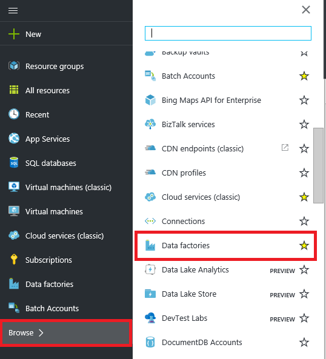
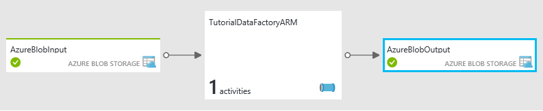

<properties
    pageTitle="Créer votre première usine de données (modèle Gestionnaire de ressources) | Microsoft Azure"
    description="Dans ce didacticiel, vous créez un pipeline de Azure Data Factory exemple à l’aide d’un modèle Azure le Gestionnaire de ressources."
    services="data-factory"
    documentationCenter=""
    authors="spelluru"
    manager="jhubbard"
    editor="monicar"/>

<tags
    ms.service="data-factory"
    ms.workload="data-services"
    ms.tgt_pltfrm="na"
    ms.devlang="na"
    ms.topic="hero-article"
    ms.date="10/12/2016"
    ms.author="spelluru"/>

# Didacticiel : Créer votre première usine données Azure à l’aide du Gestionnaire de ressources Azure modèle
> [AZURE.SELECTOR]
- [Vue d’ensemble et conditions préalables](data-factory-build-your-first-pipeline.md)
- [Portail Azure](data-factory-build-your-first-pipeline-using-editor.md)
- [Visual Studio](data-factory-build-your-first-pipeline-using-vs.md)
- [PowerShell](data-factory-build-your-first-pipeline-using-powershell.md)
- [Modèle de gestionnaire de ressources](data-factory-build-your-first-pipeline-using-arm.md)
- [API REST](data-factory-build-your-first-pipeline-using-rest-api.md)

Dans cet article, vous utilisez un modèle de gestionnaire de ressources Azure pour créer votre première usine données Azure.

## Conditions préalables
- Lire l’article [Vue d’ensemble du didacticiel](data-factory-build-your-first-pipeline.md) et suivez les étapes de **composant requis** .
- Suivez les instructions de l’article [comment installer et configurer Azure PowerShell](../powershell-install-configure.md) pour installer la dernière version d’Azure PowerShell sur votre ordinateur.
- Voir [Création de modèles de gestionnaire de ressources Azure](../resource-group-authoring-templates.md) pour en savoir plus sur les modèles Azure le Gestionnaire de ressources. 

## Dans ce didacticiel
Entité | Description  
------ | ----------- 
Service de stockage lié Azure | Des liens à votre compte de stockage Azure à l’usine de données. Le compte de stockage Azure conserve les données d’entrée et de sortie pour le pipeline dans cet exemple. 
Service lié HDInsight à la demande| Liens un HDInsight à la demande cluster vers le factory de données. Le cluster est automatiquement créé pour traiter les données et est supprimé une fois que le traitement est terminé.
Jeu de données d’entrée Azure Blob | Fait référence au service de stockage Azure lié. Le service lié fait référence à un compte de stockage Azure et Blob Azure dataset Spécifie le conteneur, le dossier et le nom de fichier dans le stockage qui contient les données d’entrée. 
Jeu de données de sortie Blob Azure | Fait référence au service de stockage Azure lié. Le service lié fait référence à un compte de stockage Azure et Blob Azure dataset Spécifie le conteneur, le dossier et le nom de fichier dans le stockage qui contient les données de sortie. 
Pipeline de données | Le pipeline a une activité de type HDInsightHive utilise le jeu de données d’entrée et génère le jeu de données de sortie.   

Une usine de données peut avoir un ou plusieurs pipelines. Une opportunité peut avoir une ou plusieurs activités qu’il contient. Il existe deux types d’activités : [activités de déplacement des données](data-factory-data-movement-activities.md) et des [activités de transformation de données](data-factory-data-transformation-activities.md). Dans ce didacticiel, vous créez un pipeline avec une activité (copier).

La section suivante fournit le modèle de gestionnaire de ressources achevé pour définir entités Data Factory afin que vous puissiez rapidement exécuter le didacticiel et tester le modèle. Pour mieux comprendre comment chaque entité Data Factory est définie, consultez la section [Data Factory entités dans le modèle](#data-factory-entities-in-the-template) .

## Modèle d’usine JSON de données
Le modèle de gestionnaire de ressources de niveau supérieur pour définir une usine de données est la suivante : 

    {
        "$schema": "http://schema.management.azure.com/schemas/2015-01-01/deploymentTemplate.json#",
        "contentVersion": "1.0.0.0",
        "parameters": { ...
        },
        "variables": { ...
        },
        "resources": [
            {
                "name": "[parameters('dataFactoryName')]",
                "apiVersion": "[variables('apiVersion')]",
                "type": "Microsoft.DataFactory/datafactories",
                "location": "westus",
                "resources": [
                    { ... },
                    { ... },
                    { ... },
                    { ... }
                ]
            }
        ]
    }

Créez un fichier JSON nommé **ADFTutorialARM.json** dans le dossier **C:\ADFGetStarted** avec le contenu suivant :

    {
        "contentVersion": "1.0.0.0",
        "$schema": "http://schema.management.azure.com/schemas/2015-01-01/deploymentTemplate.json#",
        "parameters": {
            "storageAccountName": { "type": "string", "metadata": { "description": "Name of the Azure storage account that contains the input/output data." } },
            "storageAccountKey": { "type": "securestring", "metadata": { "description": "Key for the Azure storage account." } },
            "blobContainer": { "type": "string", "metadata": { "description": "Name of the blob container in the Azure Storage account." } },
            "inputBlobFolder": { "type": "string", "metadata": { "description": "The folder in the blob container that has the input file." } },
            "inputBlobName": { "type": "string", "metadata": { "description": "Name of the input file/blob." } },
            "outputBlobFolder": { "type": "string", "metadata": { "description": "The folder in the blob container that will hold the transformed data." } },
            "hiveScriptFolder": { "type": "string", "metadata": { "description": "The folder in the blob container that contains the Hive query file." } },
            "hiveScriptFile": { "type": "string", "metadata": { "description": "Name of the hive query (HQL) file." } }
        },
        "variables": {
            "dataFactoryName": "[concat('HiveTransformDF', uniqueString(resourceGroup().id))]",
            "azureStorageLinkedServiceName": "AzureStorageLinkedService",
            "hdInsightOnDemandLinkedServiceName": "HDInsightOnDemandLinkedService",
            "blobInputDatasetName": "AzureBlobInput",
            "blobOutputDatasetName": "AzureBlobOutput",
            "pipelineName": "HiveTransformPipeline"
        },
        "resources": [
        {
            "name": "[variables('dataFactoryName')]",
            "apiVersion": "2015-10-01",
            "type": "Microsoft.DataFactory/datafactories",
            "location": "West US",
            "resources": [
            {
                "type": "linkedservices",
                "name": "[variables('azureStorageLinkedServiceName')]",
                "dependsOn": [
                    "[variables('dataFactoryName')]"
                ],
                "apiVersion": "2015-10-01",
                "properties": {
                    "type": "AzureStorage",
                    "description": "Azure Storage linked service",
                    "typeProperties": {
                        "connectionString": "[concat('DefaultEndpointsProtocol=https;AccountName=',parameters('storageAccountName'),';AccountKey=',parameters('storageAccountKey'))]"
                    }
                }
            },
            {
                "type": "linkedservices",
                "name": "[variables('hdInsightOnDemandLinkedServiceName')]",
                "dependsOn": [
                    "[variables('dataFactoryName')]",
                    "[variables('azureStorageLinkedServiceName')]"
                ],
                "apiVersion": "2015-10-01",
                "properties": {
                    "type": "HDInsightOnDemand",
                    "typeProperties": {
                        "clusterSize": 1,
                        "version": "3.2",
                        "timeToLive": "00:05:00",
                        "osType": "windows",
                        "linkedServiceName": "[variables('azureStorageLinkedServiceName')]"
                    }
                }
            },
            {
                "type": "datasets",
                "name": "[variables('blobInputDatasetName')]",
                "dependsOn": [
                    "[variables('dataFactoryName')]",
                    "[variables('azureStorageLinkedServiceName')]"
                ],
                "apiVersion": "2015-10-01",
                "properties": {
                    "type": "AzureBlob",
                    "linkedServiceName": "[variables('azureStorageLinkedServiceName')]",
                    "typeProperties": {
                        "fileName": "[parameters('inputBlobName')]",
                        "folderPath": "[concat(parameters('blobContainer'), '/', parameters('inputBlobFolder'))]",
                        "format": {
                            "type": "TextFormat",
                            "columnDelimiter": ","
                        }
                    },
                    "availability": {
                        "frequency": "Month",
                        "interval": 1
                    },
                    "external": true
                }
            },
            {
                "type": "datasets",
                "name": "[variables('blobOutputDatasetName')]",
                "dependsOn": [
                    "[variables('dataFactoryName')]",
                    "[variables('azureStorageLinkedServiceName')]"
                ],
                "apiVersion": "2015-10-01",
                "properties": {
                    "type": "AzureBlob",
                    "linkedServiceName": "[variables('azureStorageLinkedServiceName')]",
                    "typeProperties": {
                        "folderPath": "[concat(parameters('blobContainer'), '/', parameters('outputBlobFolder'))]",
                        "format": {
                            "type": "TextFormat",
                            "columnDelimiter": ","
                        }
                    },
                    "availability": {
                        "frequency": "Month",
                        "interval": 1
                    }
                }
            },
            {
                "type": "datapipelines",
                "name": "[variables('pipelineName')]",
                "dependsOn": [
                    "[variables('dataFactoryName')]",
                    "[variables('azureStorageLinkedServiceName')]",
                    "[variables('hdInsightOnDemandLinkedServiceName')]",
                    "[variables('blobInputDatasetName')]",
                    "[variables('blobOutputDatasetName')]"
                ],
                "apiVersion": "2015-10-01",
                "properties": {
                    "description": "Pipeline that transforms data using Hive script.",
                    "activities": [
                    {
                        "type": "HDInsightHive",
                        "typeProperties": {
                            "scriptPath": "[concat(parameters('blobContainer'), '/', parameters('hiveScriptFolder'), '/', parameters('hiveScriptFile'))]",
                            "scriptLinkedService": "[variables('azureStorageLinkedServiceName')]",
                            "defines": {
                                "inputtable": "[concat('wasb://', parameters('blobContainer'), '@', parameters('storageAccountName'), '.blob.core.windows.net/', parameters('inputBlobFolder'))]",
                                "partitionedtable": "[concat('wasb://', parameters('blobContainer'), '@', parameters('storageAccountName'), '.blob.core.windows.net/', parameters('outputBlobFolder'))]"
                            }
                        },
                        "inputs": [
                            {
                                "name": "[variables('blobInputDatasetName')]"
                            }
                        ],
                        "outputs": [
                            {
                                "name": "[variables('blobOutputDatasetName')]"
                            }
                        ],
                        "policy": {
                            "concurrency": 1,
                            "retry": 3
                        },
                        "scheduler": {
                            "frequency": "Month",
                            "interval": 1
                        },
                        "name": "RunSampleHiveActivity",
                        "linkedServiceName": "[variables('hdInsightOnDemandLinkedServiceName')]"
                    }
                    ],
                    "start": "2016-10-01T00:00:00Z",
                    "end": "2016-10-02T00:00:00Z",
                    "isPaused": false
                }
            }
            ]
        }
        ]
    }

> [AZURE.NOTE] Vous pouvez trouver un autre exemple de modèle du Gestionnaire de ressources pour la création d’une usine de données Azure sur [didacticiel : créer un pipeline avec une activité copie à l’aide d’un modèle de gestionnaire de ressources Azure](data-factory-copy-activity-tutorial-using-azure-resource-manager-template.md).  

## Paramètres JSON 
Créez un fichier JSON nommé **ADFTutorialARM Parameters.json** qui contient des paramètres pour le modèle Azure le Gestionnaire de ressources.  

> [AZURE.IMPORTANT] Spécifiez le nom et la clé de votre compte de stockage Azure pour les paramètres **storageAccountName** et **storageAccountKey** dans ce fichier de paramètres. 

    {
        "$schema": "https://schema.management.azure.com/schemas/2015-01-01/deploymentParameters.json#",
        "contentVersion": "1.0.0.0",
        "parameters": {
            "storageAccountName": {
                "value": "<Name of your Azure Storage account>"
            },
            "storageAccountKey": {
                "value": "<Key of your Azure Storage account>"
            },
            "blobContainer": {
                "value": "adfgetstarted"
            },
            "inputBlobFolder": {
                "value": "inputdata"
            },
            "inputBlobName": {
                "value": "input.log"
            },
            "outputBlobFolder": {
                "value": "partitioneddata"
            },
            "hiveScriptFolder": {
                "value": "script"
            },
            "hiveScriptFile": {
                "value": "partitionweblogs.hql"
            }
        }
    }

> [AZURE.IMPORTANT] Vous pouvez avoir des fichiers JSON paramètre distinct pour le développement, le test et les environnements de production que vous pouvez utiliser avec le même modèle de données usine JSON. En utilisant un script PowerShell, vous pouvez automatiser déploiement entités Data Factory dans ces environnements. 

## Créer factory de données

1. Démarrez **Azure PowerShell** et exécutez la commande suivante : 
    - Exécuter `Login-AzureRmAccount` et entrez le nom d’utilisateur et le mot de passe que vous utilisez pour vous connecter au portail Azure.  
    - Exécuter `Get-AzureRmSubscription` pour afficher tous les abonnements pour ce compte.
    - Exécuter `Get-AzureRmSubscription -SubscriptionName <SUBSCRIPTION NAME> | Set-AzureRmContext` pour sélectionner l’abonnement que vous souhaitez utiliser. Cet abonnement doit être identique à celle utilisée dans le portail Azure.
1. Exécutez la commande suivante pour déployer entités Data Factory en utilisant le modèle de gestionnaire de ressources que vous avez créé à l’étape 1. 

        New-AzureRmResourceGroupDeployment -Name MyARMDeployment -ResourceGroupName ADFTutorialResourceGroup -TemplateFile C:\ADFGetStarted\ADFTutorialARM.json -TemplateParameterFile C:\ADFGetStarted\ADFTutorialARM-Parameters.json

## Pipeline de moniteur
 
1.  Après la connexion au [portail Azure](https://portal.azure.com/), cliquez sur **Parcourir** et sélectionnez **les références de données**.
        
2.  Dans la carte de **Références de données** , cliquez sur le factory de données (**TutorialFactoryARM**) que vous avez créé.   
2.  Dans la carte de **Données usine** pour votre usine de données, cliquez sur **le diagramme**.
        
4.  Dans la **Vue de diagramme**, vous voyez une vue d’ensemble des pipelines et des jeux de données utilisés dans ce didacticiel.
    
     
8. Dans la vue de diagramme, double-cliquez sur le jeu de données **AzureBlobOutput**. Vous constatez que le secteur est en cours de traitement.

    
9. Lorsque le traitement est terminé, vous voyez le secteur dans l’état **prêt** . Création d’un cluster de HDInsight à la demande généralement prend un certain temps (environ 20 minutes). Par conséquent, ils doivent s’attendre le pipeline de prendre **30 minutes** pour traiter le secteur.

     
10. Lorsque le secteur est **prête** , consultez le dossier **partitioneddata** dans le conteneur **adfgetstarted** dans votre espace de stockage blob pour les données de sortie.  

Pour obtenir des instructions sur la façon d’utiliser les cartes de portail Azure pour surveiller le pipeline et les jeux de données que vous avez créé dans ce didacticiel, voir [pipeline et des datasets de moniteur](data-factory-monitor-manage-pipelines.md) .

Vous pouvez également utiliser moniteur et gérer une application pour contrôler vos pipelines de données. Voir [moniteur et gérer les pipelines Azure Data Factory à l’aide de surveillance application](data-factory-monitor-manage-app.md) pour plus d’informations sur l’utilisation de l’application. 

> [AZURE.IMPORTANT] Le fichier d’entrée est supprimé lorsque le secteur est traité avec succès. Par conséquent, si vous souhaitez réexécuter le secteur ou effectuez une nouvelle fois le didacticiel, téléchargez le fichier d’entrée (input.log) dans le dossier inputdata du conteneur adfgetstarted.

## Entités d’usine de données dans le modèle
### Définir par défaut des données
Vous définissez une usine de données dans le modèle de gestionnaire de ressources comme le montre l’exemple suivant :  

    "resources": [
    {
        "name": "[variables('dataFactoryName')]",
        "apiVersion": "2015-10-01",
        "type": "Microsoft.DataFactory/datafactories",
        "location": "West US"
    }

La dataFactoryName est définie comme suit : 
      
      "dataFactoryName": "[concat('HiveTransformDF', uniqueString(resourceGroup().id))]",

Il s’agit d’une chaîne unique basée sur le code de groupe de ressources.  

### Définition d’entités Data Factory
Les entités Data Factory suivantes sont définies dans le modèle JSON : 

- [Service de stockage lié Azure](#azure-storage-linked-service)
- [Service lié HDInsight à la demande](#hdinsight-on-demand-linked-service)
- [Jeu de données d’entrée blob Azure](#azure-blob-input-dataset)
- [Jeu de données de sortie blob Azure](#azure-blob-output-dataset)
- [Pipeline de données avec une activité de copie](#data-pipeline)

#### Service de stockage lié Azure
Vous spécifiez le nom et la clé de votre compte de stockage Azure dans cette section. Pour plus d’informations sur les propriétés JSON permet de définir un service de stockage Azure liées, voir [le stockage Azure lié service](data-factory-azure-blob-connector.md#azure-storage-linked-service) . 

      {
        "type": "linkedservices",
        "name": "[variables('azureStorageLinkedServiceName')]",
        "dependsOn": [
          "[variables('dataFactoryName')]"
        ],
        "apiVersion": "2015-10-01",
        "properties": {
          "type": "AzureStorage",
          "description": "Azure Storage linked service",
          "typeProperties": {
            "connectionString": "[concat('DefaultEndpointsProtocol=https;AccountName=',parameters('storageAccountName'),';AccountKey=',parameters('storageAccountKey'))]"
          }
        }
      }

**ConnectionString** utilise les paramètres storageAccountName et storageAccountKey. Les valeurs de ces paramètres passés à l’aide d’un fichier de configuration. La définition utilise également des variables : azureStroageLinkedService et dataFactoryName définis dans le modèle. 
    
#### Service lié HDInsight à la demande
Reportez-vous [Calculer services liés](data-factory-compute-linked-services.md#azure-hdinsight-on-demand-linked-service) à l’article pour plus d’informations sur les propriétés JSON permet de définir un service lié à la demande de HDInsight.  

      {
        "type": "linkedservices",
        "name": "[variables('hdInsightOnDemandLinkedServiceName')]",
        "dependsOn": [
          "[variables('dataFactoryName')]"
        ],
        "apiVersion": "2015-10-01",
        "properties": {
          "type": "HDInsightOnDemand",
          "typeProperties": {
            "clusterSize": 1,
            "version": "3.2",
            "timeToLive": "00:05:00",
            "osType": "windows",
            "linkedServiceName": "[variables('azureStorageLinkedServiceName')]"
          }
        }
      }

Notez les points suivants : 

- Le Factory de données crée un cluster HDInsight **fonctionnant sous Windows** pour vous avec la JSON ci-dessus. Vous pourriez également lui demander de créer un cluster HDInsight **Linux** . Pour plus d’informations, consultez [Services liés à la demande HDInsight](data-factory-compute-linked-services.md#azure-hdinsight-on-demand-linked-service) . 
- Vous pouvez aussi utiliser **votre propre cluster HDInsight** au lieu d’utiliser un cluster de HDInsight à la demande. Pour plus d’informations, voir [Service liées HDInsight](data-factory-compute-linked-services.md#azure-hdinsight-linked-service) .
- Le cluster HDInsight crée un **conteneur par défaut** dans le stockage blob que vous spécifié dans le JSON (**linkedServiceName**). HDInsight ne supprime pas ce conteneur lorsque le cluster est supprimé. Ce comportement est voulu par la conception. Avec le service de HDInsight lié à la demande, un HDInsight cluster est créé chaque fois qu’un secteur doit être traité sauf s’il existe une existante live cluster (**timeToLive**) et est supprimé lorsque le traitement est terminé.

    Lorsque plusieurs sections sont traitées, vous voyez de nombreux conteneurs dans votre espace de stockage blob Azure. Si vous ne devez pas les de résoudre les problèmes des tâches, vous souhaiterez peut-être les supprimer pour réduire les coûts de stockage. Les noms de ces conteneurs suivent un modèle : « chargeur**yourdatafactoryname**-**linkedservicename**- datetimestamp ». Pour supprimer conteneurs dans votre espace de stockage blob Azure, utilisez les outils tels que [Microsoft stockage Explorer](http://storageexplorer.com/) .

Pour plus d’informations, consultez [Services liés à la demande HDInsight](data-factory-compute-linked-services.md#azure-hdinsight-on-demand-linked-service) .

#### Jeu de données d’entrée blob Azure
Vous spécifiez les noms des objets blob conteneur, dossier et fichier qui contient les données d’entrée. Pour plus d’informations sur les propriétés JSON permet de définir un jeu de données Blob Azure, voir [Propriétés du dataset Blob Azure](data-factory-azure-blob-connector.md#azure-blob-dataset-type-properties) . 

      {
        "type": "datasets",
        "name": "[variables('blobInputDatasetName')]",
        "dependsOn": [
          "[variables('dataFactoryName')]",
          "[variables('azureStorageLinkedServiceName')]"
        ],
        "apiVersion": "2015-10-01",
        "properties": {
          "type": "AzureBlob",
          "linkedServiceName": "[variables('azureStorageLinkedServiceName')]",
          "typeProperties": {
            "fileName": "[parameters('inputBlobName')]",
            "folderPath": "[concat(parameters('blobContainer'), '/', parameters('inputBlobFolder'))]",
            "format": {
              "type": "TextFormat",
              "columnDelimiter": ","
            }
          },
          "availability": {
            "frequency": "Month",
            "interval": 1
          },
          "external": true
        }
      }

Cette définition utilise les paramètres suivants définis dans le modèle de paramètre : blobContainer, inputBlobFolder et inputBlobName. 

#### Jeu de données de sortie Blob Azure
Vous spécifiez les noms d’objets blob conteneur et dossier qui contient les données de sortie. Pour plus d’informations sur les propriétés JSON permet de définir un jeu de données Blob Azure, voir [Propriétés du dataset Blob Azure](data-factory-azure-blob-connector.md#azure-blob-dataset-type-properties) .  

      {
        "type": "datasets",
        "name": "[variables('blobOutputDatasetName')]",
        "dependsOn": [
          "[variables('dataFactoryName')]",
          "[variables('azureStorageLinkedServiceName')]"
        ],
        "apiVersion": "2015-10-01",
        "properties": {
          "type": "AzureBlob",
          "linkedServiceName": "[variables('azureStorageLinkedServiceName')]",
          "typeProperties": {
            "folderPath": "[concat(parameters('blobContainer'), '/', parameters('outputBlobFolder'))]",
            "format": {
              "type": "TextFormat",
              "columnDelimiter": ","
            }
          },
          "availability": {
            "frequency": "Month",
            "interval": 1
          }
        }
      }

Cette définition utilise les paramètres suivants définis dans le modèle de paramètre : blobContainer et outputBlobFolder. 

#### Pipeline de données
Vous définissez une opportunité qui transforment les données en exécutant le script Hive sur un cluster Azure HDInsight à la demande. Pour des descriptions des éléments JSON permet de définir un pipeline dans cet exemple, consultez [Pipeline JSON](data-factory-create-pipelines.md#pipeline-json) . 

    {
        "type": "datapipelines",
        "name": "[variables('pipelineName')]",
        "dependsOn": [
          "[variables('dataFactoryName')]",
          "[variables('azureStorageLinkedServiceName')]",
          "[variables('hdInsightOnDemandLinkedServiceName')]",
          "[variables('blobInputDatasetName')]",
          "[variables('blobOutputDatasetName')]"
        ],
        "apiVersion": "2015-10-01",
        "properties": {
          "description": "Pipeline that transforms data using Hive script.",
          "activities": [
            {
              "type": "HDInsightHive",
              "typeProperties": {
                "scriptPath": "[concat(parameters('blobContainer'), '/', parameters('hiveScriptFolder'), '/', parameters('hiveScriptFile'))]",
                "scriptLinkedService": "[variables('azureStorageLinkedServiceName')]",
                "defines": {
                  "inputtable": "[concat('wasb://', parameters('blobContainer'), '@', parameters('storageAccountName'), '.blob.core.windows.net/', parameters('inputBlobFolder'))]",
                  "partitionedtable": "[concat('wasb://', parameters('blobContainer'), '@', parameters('storageAccountName'), '.blob.core.windows.net/', parameters('outputBlobFolder'))]"
                }
              },
              "inputs": [
                {
                  "name": "[variables('blobInputDatasetName')]"
                }
              ],
              "outputs": [
                {
                  "name": "[variables('blobOutputDatasetName')]"
                }
              ],
              "policy": {
                "concurrency": 1,
                "retry": 3
              },
              "scheduler": {
                "frequency": "Month",
                "interval": 1
              },
              "name": "RunSampleHiveActivity",
              "linkedServiceName": "[variables('hdInsightOnDemandLinkedServiceName')]"
            }
          ],
          "start": "2016-10-01T00:00:00Z",
          "end": "2016-10-02T00:00:00Z",
          "isPaused": false
        }
      }

## Réutiliser le modèle 
Dans le didacticiel, vous avez créé un modèle pour la définition des données usine entités et un modèle pour passer des valeurs de paramètres. Pour utiliser le même modèle à déployer entités Data Factory différents environnements, vous créez un fichier de paramètres pour chaque environnement et utilisez lors du déploiement sur cet environnement.     

Exemple :  

    New-AzureRmResourceGroupDeployment -Name MyARMDeployment -ResourceGroupName ADFTutorialResourceGroup -TemplateFile ADFTutorialARM.json -TemplateParameterFile ADFTutorialARM-Parameters-Dev.json

    New-AzureRmResourceGroupDeployment -Name MyARMDeployment -ResourceGroupName ADFTutorialResourceGroup -TemplateFile ADFTutorialARM.json -TemplateParameterFile ADFTutorialARM-Parameters-Test.json

    New-AzureRmResourceGroupDeployment -Name MyARMDeployment -ResourceGroupName ADFTutorialResourceGroup -TemplateFile ADFTutorialARM.json -TemplateParameterFile ADFTutorialARM-Parameters-Production.json

Notez que la première commande utilise le fichier de paramètres pour l’environnement de développement, un deuxième pour l’environnement de test et troisième celui de l’environnement de production.  

Vous pouvez également réutiliser le modèle pour effectuer des tâches répétitives. Par exemple, vous devez créer plusieurs références de données avec un ou plusieurs pipelines qui implémentent la même logique mais chaque usine de données utilise le stockage Azure différents et des comptes de base de données SQL Azure. Dans ce scénario, utilisez le même modèle dans le même environnement (développement, test ou production) avec les fichiers de paramètres différente pour créer des références de données. 

## Modèle de gestionnaire de ressources pour la création d’une passerelle
Voici un exemple de modèle de gestionnaire de ressources pour la création d’une passerelle logique dans l’arrière-plan. Installer une passerelle sur votre ordinateur local ou un ordinateur virtuel IaaS Azure et inscrire la passerelle avec service Factory de données en utilisant une clé. Pour plus d’informations, voir [déplacer des données entre en local et le nuage](data-factory-move-data-between-onprem-and-cloud.md) .

    {
        "contentVersion": "1.0.0.0",
        "$schema": "http://schema.management.azure.com/schemas/2015-01-01/deploymentTemplate.json#",
        "parameters": {
        },
        "variables": {
            "dataFactoryName":  "GatewayUsingArmDF",
            "apiVersion": "2015-10-01",
            "singleQuote": "'"
        },
        "resources": [
            {
                "name": "[variables('dataFactoryName')]",
                "apiVersion": "[variables('apiVersion')]",
                "type": "Microsoft.DataFactory/datafactories",
                "location": "eastus",
                "resources": [
                    {
                        "dependsOn": [ "[concat('Microsoft.DataFactory/dataFactories/', variables('dataFactoryName'))]" ],
                        "type": "gateways",
                        "apiVersion": "[variables('apiVersion')]",
                        "name": "GatewayUsingARM",
                        "properties": {
                            "description": "my gateway"
                        }
                    }            
                ]
            }
        ]
    }

Ce modèle crée une usine de données nommée GatewayUsingArmDF avec une passerelle nommée : GatewayUsingARM. 

## Voir aussi
| Rubrique | Description |
| :---- | :---- |
| [Activités de Transformation des données](data-factory-data-transformation-activities.md) | Cet article fournit la liste des activités de transformation de données (par exemple, de transformation HDInsight Hive vous avez utilisées dans ce didacticiel) pris en charge par Azure Data Factory. |
| [Planification et l’exécution](data-factory-scheduling-and-execution.md) | Cet article décrit les aspects de la planification et l’exécution du modèle d’application Azure Data Factory. |
| [Pipelines](data-factory-create-pipelines.md) | Cet article vous aide à comprendre les pipelines et activités dans Azure Data Factory et comment les utiliser pour créer de bout en bout pilotées par les données des flux de travail pour votre scénario ou entreprise. |
| [Jeux de données](data-factory-create-datasets.md) | Cet article vous aide à comprendre les groupes de données dans Azure Data Factory.
| [Surveiller et gérer les pipelines à l’aide d’application de surveillance](data-factory-monitor-manage-app.md) | Cet article décrit comment contrôler, gérer et déboguer pipelines à l’aide de la surveillance et l’application de gestion. 

  

