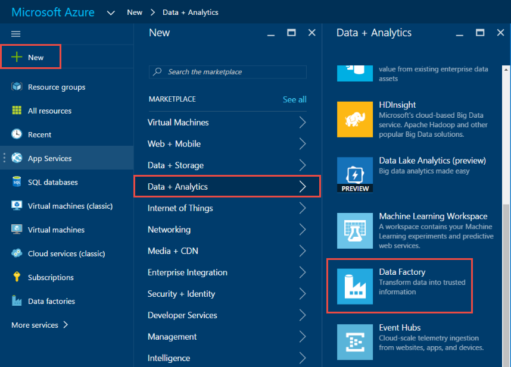
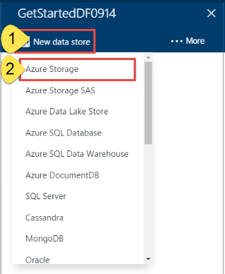
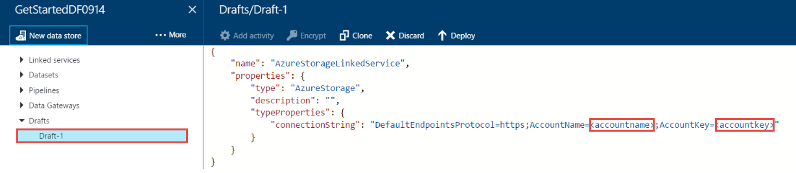
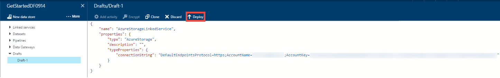
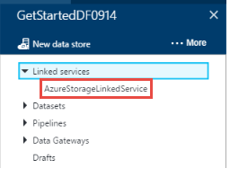
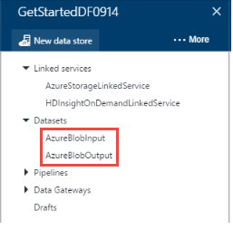
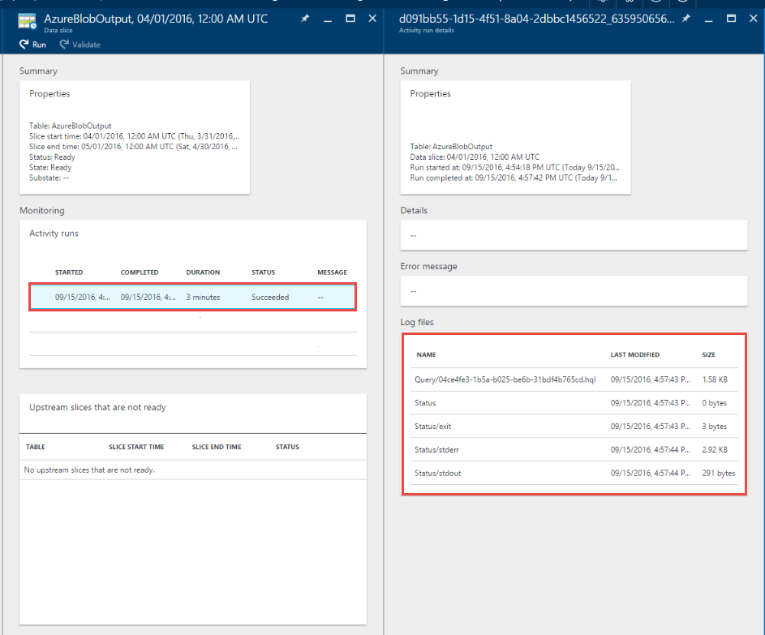

<properties
    pageTitle="Créer votre première usine de données (Azure portal) | Microsoft Azure"
    description="Dans ce didacticiel, vous créez un pipeline de Azure Data Factory exemple à l’aide de l’éditeur de données par défaut dans le portail Azure."
    services="data-factory"
    documentationCenter=""
    authors="spelluru"
    manager="jhubbard"
    editor="monicar"/>

<tags
    ms.service="data-factory"
    ms.workload="data-services"
    ms.tgt_pltfrm="na"
    ms.devlang="na"
    ms.topic="hero-article" 
    ms.date="09/14/2016"
    ms.author="spelluru"/>

# Didacticiel : Créer votre première usine données Azure à l’aide du portail Azure
> [AZURE.SELECTOR]
- [Vue d’ensemble et conditions préalables](data-factory-build-your-first-pipeline.md)
- [Portail Azure](data-factory-build-your-first-pipeline-using-editor.md)
- [Visual Studio](data-factory-build-your-first-pipeline-using-vs.md)
- [PowerShell](data-factory-build-your-first-pipeline-using-powershell.md)
- [Modèle de gestionnaire de ressources](data-factory-build-your-first-pipeline-using-arm.md)
- [API REST](data-factory-build-your-first-pipeline-using-rest-api.md)

Dans cet article, vous allez apprendre à utiliser le [portail Azure](https://portal.azure.com/) pour créer votre première usine données Azure. 

## Conditions préalables        
1. Lire l’article [Vue d’ensemble du didacticiel](data-factory-build-your-first-pipeline.md) et suivez les étapes de **composant requis** .
2. Cet article ne fournit pas une vue d’ensemble conceptuelle du service Azure Data Factory. Nous vous recommandons de parcourir l’article [Introduction aux Azure Data Factory](data-factory-introduction.md) pour une présentation détaillée du service.  

## Créer factory de données
Une usine de données peut avoir un ou plusieurs pipelines. Une opportunité peut avoir une ou plusieurs activités qu’il contient. Par exemple, une copie pour copier les données d’une source dans un magasin de données de destination et une activité HDInsight Hive à exécuter un script Hive pour transformer les données d’entrée produit exporter des données. Commençons par créer le factory de données dans cette étape. 

1.  Connectez-vous au [portail Azure](https://portal.azure.com/).
2.  Cliquez sur **Nouveau** dans le menu de gauche, cliquez sur **données + Analytique**, puis cliquez sur **Data Factory**.
        
    

2.  Dans la carte **nouvelle factory de données** , entrez **GetStartedDF** pour le nom.

    

    > [AZURE.IMPORTANT] 
    > Le nom de la factory données Azure doit être **globalement unique**. Si vous recevez l’erreur : **nom d’usine données « GetStartedDF » n’est pas disponible**. Modifier le nom de la factory de données (par exemple, yournameGetStartedDF) et essayez de créer à nouveau. Consultez la rubrique de [Données Factory - règles d’appellation](data-factory-naming-rules.md) pour les règles d’appellation pour les objets de données par défaut.
    > 
    > Le nom de la factory de données peut être enregistré comme un nom **DNS** à l’avenir et donc deviennent visible publiquement.

3.  Sélectionnez l' **abonnement Azure** où vous souhaitez le factory de données à créer. 
4.  Sélectionnez existant **groupe de ressources** ou créer un groupe de ressources. Dans le didacticiel, créez un groupe de ressources nommé : **ADFGetStartedRG**. 
5.  Cliquez sur **créer** dans la carte **nouvelle factory de données** .

    > [AZURE.IMPORTANT] Pour créer des instances de données par défaut, vous devez être membre du rôle de [Collaborateur usine](../active-directory/role-based-access-built-in-roles.md/#data-factory-contributor) au niveau du groupe de ressources/abonnement. 
6.  Vous voyez le factory de données en cours de création dans le **Startboard** du portail Azure comme suit :   

    
7. Félicitations ! Vous avez créé votre première usine de données. Après que le factory de données a été créé avec succès, vous voyez la page par défaut de données, qui indique le contenu de la factory de données.   

    

Avant de créer une opportunité dans le factory de données, vous devez tout d’abord créer quelques entités Data Factory. Vous créez tout d’abord services liés pour lier des données stores/calcule à votre magasin de données, de définir d’entrée et de sortie jeux de données pour représenter les données d’entrée/sortie dans banques de données liées, puis créer le pipeline avec une activité qui utilise ces jeux de données. 

## Créer des services liées
Dans cette étape, vous liez votre compte de stockage Azure et un cluster Azure HDInsight à la demande à votre usine de données. Le compte de stockage Azure conserve les données d’entrée et de sortie pour le pipeline dans cet exemple. Le service HDInsight lié est utilisé pour exécuter un script Hive spécifié dans l’activité du pipeline dans cet exemple. Identifier quelles [données stockent](data-factory-data-movement-activities.md)/[Calculer services](data-factory-compute-linked-services.md) sont utilisées dans votre scénario et lier ces services à l’usine de données en créant des services liés.  

### Créer le service de stockage Azure lié
Dans cette étape, vous liez votre compte de stockage Azure à votre usine de données. Dans ce didacticiel, vous utilisez le même compte de stockage Azure pour stocker les données d’entrée/sortie et le fichier de script HQL. 

1.  Cliquez sur **auteur et déployer** sur la carte de **Données par défaut** pour **GetStartedDF**. Vous devriez voir l’éditeur d’usine de données. 
     
    
2.  Cliquez sur **nouveau magasin de données** et choisissez le **stockage Azure**.

    

3.  Vous devriez voir le script JSON pour la création d’un service de stockage Azure liées dans l’éditeur. 
    
    
     
4. Remplacez le **nom du compte** avec le nom de votre compte de stockage Azure et la **clé de compte** avec la touche d’accès du compte de stockage Azure. Pour savoir comment obtenir votre clé d’accès de stockage, voir [Afficher, copier et stockage régénérer les touches d’accès](../storage/storage-create-storage-account.md#view-copy-and-regenerate-storage-access-keys)
5. Dans la barre de commande pour déployer le service lié, cliquez sur **déployer** .

    

   Une fois que le service lié est déployé correctement, la fenêtre **brouillon-1** doit disparaître et vous constatez **AzureStorageLinkedService** dans l’arborescence à gauche. 
       

 
### Créer le service Azure HDInsight lié
Dans cette étape, vous liez un cluster de HDInsight à la demande à votre usine de données. Le cluster HDInsight est automatiquement créé lors de l’exécution et supprimé une fois que procéder transformation et inactif pour le laps de temps spécifié. 

1. Dans l' **Éditeur de Factory de données**, cliquez sur **... Plus**, cliquez sur **Nouveau calcul**et sélectionnez **cluster HDInsight à la demande**.

    
2. Copier et coller l’extrait de code suivante à la fenêtre **brouillon-1** . L’extrait de code JSON décrit les propriétés qui sont utilisées pour créer la HDInsight cluster à la demande. 

        {
          "name": "HDInsightOnDemandLinkedService",
          "properties": {
            "type": "HDInsightOnDemand",
            "typeProperties": {
              "version": "3.2",
              "clusterSize": 1,
              "timeToLive": "00:30:00",
              "linkedServiceName": "AzureStorageLinkedService"
            }
          }
        }
    
    Le tableau suivant décrit les propriétés JSON utilisées dans l’extrait de code :
    
  	| Propriété | Description |
  	| :------- | :---------- |
  	| Version | Spécifie que la version de la HDInsight créé pour être 3,2. | 
  	| ClusterSize | Spécifie la taille du cluster HDInsight. | 
  	| Propriété TimeToLive | Spécifie que la durée d’inactivité pour le cluster HDInsight, avant d’être supprimé. |
  	| linkedServiceName | Spécifie le compte de stockage utilisé pour stocker les journaux qui sont générés par HDInsight. |

    Notez les points suivants : 
    
    - Le Factory de données crée un cluster HDInsight de **Windows** pour vous avec la JSON. Vous pourriez également lui demander de créer un cluster HDInsight **Linux** . Pour plus d’informations, consultez [Services liés à la demande HDInsight](data-factory-compute-linked-services.md#azure-hdinsight-on-demand-linked-service) . 
    - Vous pouvez aussi utiliser **votre propre cluster HDInsight** au lieu d’utiliser un cluster de HDInsight à la demande. Pour plus d’informations, voir [Service liées HDInsight](data-factory-compute-linked-services.md#azure-hdinsight-linked-service) .
    - Le cluster HDInsight crée un **conteneur par défaut** dans le stockage blob que vous spécifié dans le JSON (**linkedServiceName**). HDInsight ne supprime pas ce conteneur lorsque le cluster est supprimé. Ce comportement est voulu par la conception. Avec le service de HDInsight lié à la demande, un cluster HDInsight est créé chaque fois qu’un secteur est traité sauf s’il existe un cluster live existant (**timeToLive**). Le cluster est supprimé automatiquement lorsque le traitement est terminé.
    
        Lorsque plusieurs sections sont traitées, vous voyez de nombreux conteneurs dans votre espace de stockage blob Azure. Si vous ne devez pas les de résoudre les problèmes des tâches, vous souhaiterez peut-être les supprimer pour réduire les coûts de stockage. Les noms de ces conteneurs suivent un modèle : « chargeur**yourdatafactoryname**-**linkedservicename**- datetimestamp ». Pour supprimer des conteneurs dans votre espace de stockage blob Azure, utilisez les outils tels que [Microsoft stockage Explorer](http://storageexplorer.com/) .

    Pour plus d’informations, consultez [Services liés à la demande HDInsight](data-factory-compute-linked-services.md#azure-hdinsight-on-demand-linked-service) .
3. Dans la barre de commande pour déployer le service lié, cliquez sur **déployer** . 

    

4. Vérifiez que vous voyez **AzureStorageLinkedService** et **HDInsightOnDemandLinkedService** dans l’arborescence afficher sur la gauche.

    

## Créer des groupes de données
Dans cette étape, vous créez des groupes de données pour représenter l’entrée et sortie des données pour le traitement Hive. Ces jeux de données font référence à **AzureStorageLinkedService** que vous avez créé précédemment dans ce didacticiel. Les points de service liées à un compte de stockage Azure et des datasets spécifient conteneur, dossier, nom de fichier dans le stockage qui contient d’entrée et sortie des données.   

### Créer le jeu de données d’entrée

1. Dans l' **Éditeur de Factory de données**, cliquez sur **... Plus** sur la barre de commandes, cliquez sur **Nouveau groupe de données**, puis sélectionnez **stockage d’objets Blob Azure**.

    
2. Copier et coller l’extrait de code suivante à la fenêtre brouillon-1. Dans l’extrait JSON, vous créez un jeu de données appelée **AzureBlobInput** qui représente les données d’entrée pour une activité dans le pipeline. En outre, vous spécifiez que les données d’entrée sont trouve dans le conteneur blob appelé **adfgetstarted** et le dossier nommé **inputdata**.
        
        {
            "name": "AzureBlobInput",
            "properties": {
                "type": "AzureBlob",
                "linkedServiceName": "AzureStorageLinkedService",
                "typeProperties": {
                    "fileName": "input.log",
                    "folderPath": "adfgetstarted/inputdata",
                    "format": {
                        "type": "TextFormat",
                        "columnDelimiter": ","
                    }
                },
                "availability": {
                    "frequency": "Month",
                    "interval": 1
                },
                "external": true,
                "policy": {}
            }
        } 

    Le tableau suivant décrit les propriétés JSON utilisées dans l’extrait de code :

  	| Propriété | Description |
  	| :------- | :---------- |
  	| type | La propriété est définie sur AzureBlob, car les données se trouvent dans le stockage blob Azure. |  
  	| linkedServiceName | fait référence à la AzureStorageLinkedService que vous avez créée. |
  	| nom de fichier | Cette propriété est facultative. Si vous omettez cette propriété, tous les fichiers à partir de la folderPath sont sélectionnées. Dans ce cas, uniquement l’input.log est traité. |
  	| type | Les fichiers journaux sont disponibles au format texte, afin que nous utilisons format du texte. | 
  	| columnDelimiter | colonnes dans les fichiers journaux sont délimités par caractère virgule () |
  	| fréquence/intervalle | fréquence définie mois et l’intervalle est 1, ce qui signifie que les secteurs d’entrée sont disponibles tous les mois. | 
  	| externes | Cette propriété est définie sur true si les données d’entrée ne sont pas générées par le service de données par défaut. | 
        
3. Dans la barre de commande pour déployer le jeu de données nouvellement créé, cliquez sur **déployer** . Vous devriez voir le jeu de données dans l’arborescence à gauche. 

### Créer le jeu de données de sortie
À présent, vous créez le jeu de données de sortie pour représenter les données de sortie stockées dans le stockage Blob Azure. 

1. Dans l' **Éditeur de Factory de données**, cliquez sur **... Plus** sur la barre de commandes, cliquez sur **Nouveau groupe de données**, puis sélectionnez **stockage d’objets Blob Azure**.  
2. Copier et coller l’extrait de code suivante à la fenêtre brouillon-1. Dans l’extrait JSON, vous créez un jeu de données appelée **AzureBlobOutput**et en spécifiant la structure des données qui sont générées par le script Hive. En outre, vous spécifiez que les résultats sont stockés dans le conteneur blob appelé **adfgetstarted** et le dossier nommé **partitioneddata**. La section **disponibilité** indique que le jeu de données de sortie est produite sur une base mensuelle.
    
        {
          "name": "AzureBlobOutput",
          "properties": {
            "type": "AzureBlob",
            "linkedServiceName": "AzureStorageLinkedService",
            "typeProperties": {
              "folderPath": "adfgetstarted/partitioneddata",
              "format": {
                "type": "TextFormat",
                "columnDelimiter": ","
              }
            },
            "availability": {
              "frequency": "Month",
              "interval": 1
            }
          }
        }

    Consultez la section **créer le jeu de données d’entrée** pour obtenir une description de ces propriétés. Vous ne définissez pas la propriété externe sur un jeu de données de sortie que le jeu de données est généré par le service de données par défaut.
3. Dans la barre de commande pour déployer le jeu de données nouvellement créé, cliquez sur **déployer** .
4. Vérifiez que le jeu de données est créée avec succès.

    

## Créer des opportunités
Dans cette étape, vous créez votre premier pipeline avec une activité **HDInsightHive** . Secteur d’entrée n’est disponible chaque mois (fréquence : mois, intervalle : 1), secteur de sortie est généré tous les mois et la propriété du Planificateur de l’activité est également définie sur mensuel. Les paramètres pour le jeu de données de sortie et le planificateur d’activité doivent correspondre. Jeu de données de sortie n’existe actuellement que lecteurs l’Échéancier, vous devez créer un jeu de données de sortie même si l’activité ne génère pas de sortie. Si l’activité n’accepte aucune entrée, vous pouvez ignorer la création du groupe de données d’entrée. Les propriétés utilisées dans le JSON suivant sont expliquées à la fin de cette section. 

1. Dans l' **Éditeur de Factory de données**, cliquez sur **points de suspension (...) Plus de commandes** , puis cliquez sur **nouveau pipeline**.
    
    
2. Copier et coller l’extrait de code suivante à la fenêtre brouillon-1.

    > [AZURE.IMPORTANT] Remplacez **storageaccountname** par le nom de votre compte de stockage dans le JSON.
        
        {
            "name": "MyFirstPipeline",
            "properties": {
                "description": "My first Azure Data Factory pipeline",
                "activities": [
                    {
                        "type": "HDInsightHive",
                        "typeProperties": {
                            "scriptPath": "adfgetstarted/script/partitionweblogs.hql",
                            "scriptLinkedService": "AzureStorageLinkedService",
                            "defines": {
                                "inputtable": "wasb://adfgetstarted@<storageaccountname>.blob.core.windows.net/inputdata",
                                "partitionedtable": "wasb://adfgetstarted@<storageaccountname>.blob.core.windows.net/partitioneddata"
                            }
                        },
                        "inputs": [
                            {
                                "name": "AzureBlobInput"
                            }
                        ],
                        "outputs": [
                            {
                                "name": "AzureBlobOutput"
                            }
                        ],
                        "policy": {
                            "concurrency": 1,
                            "retry": 3
                        },
                        "scheduler": {
                            "frequency": "Month",
                            "interval": 1
                        },
                        "name": "RunSampleHiveActivity",
                        "linkedServiceName": "HDInsightOnDemandLinkedService"
                    }
                ],
                "start": "2016-04-01T00:00:00Z",
                "end": "2016-04-02T00:00:00Z",
                "isPaused": false
            }
        }
 
    Dans l’extrait JSON, vous créez un pipeline qui se compose d’une activité unique qui utilise Hive pour traiter les données sur un cluster HDInsight.
    
    Le fichier de script Hive, **partitionweblogs.hql**, est stocké dans le compte de stockage Azure (spécifié par scriptLinkedService, appelé **AzureStorageLinkedService**) et dans le dossier de **scripts** dans conteneur **adfgetstarted**.

    La section **définit** est utilisée pour spécifier les paramètres de runtime sont passés au script hive comme valeurs de configuration Hive (par ex. ${hiveconf : inputtable}, ${hiveconf:partitionedtable}).

    Les propriétés **start** et **end** du pipeline spécifie la période active du pipeline.

    Dans l’activité JSON, vous indiquez que le script Hive s’exécute sur le cluster spécifié par le **linkedServiceName** – **HDInsightOnDemandLinkedService**.

    > [AZURE.NOTE] Pour plus d’informations sur les propriétés JSON utilisées dans l’exemple, consultez [structure d’un Pipeline](data-factory-create-pipelines.md#anatomy-of-a-pipeline) . 

3. Vérifiez les points suivants : 
    1. fichier **Input.log** existe dans le dossier **inputdata** du conteneur **adfgetstarted** dans le stockage blob Azure
    2. fichier **partitionweblogs.hql** existe dans le dossier de **script** du conteneur **adfgetstarted** dans le stockage blob Azure. Complète la condition préalable les étapes dans la [Vue d’ensemble du didacticiel](data-factory-build-your-first-pipeline.md) si vous ne voyez pas ces fichiers. 
    3. Vérifiez que vous avez remplacé **storageaccountname** avec le nom de votre compte de stockage dans le pipeline de JSON. 
2. Dans la barre de commande pour déployer le pipeline de, cliquez sur **déployer** . Étant donné que les heures de **début** et **fin** sont définies par le passé et **isPaused** est définie sur false, le pipeline (activité dans le pipeline) s’exécute immédiatement après le déploiement. 
4. Vérifiez que vous voyez le pipeline dans l’arborescence.

    
5. Félicitations, vous avez créé votre première pipeline.

## Pipeline de moniteur

### Pipeline de moniteur à l’aide de la vue de diagramme

6. Cliquez sur **X** pour fermer les cartes de données usine éditeur et pour revenir à la carte de données par défaut, puis cliquez sur **diagramme**.
  
    
7. Dans la vue de diagramme, vous voyez une vue d’ensemble des pipelines et des jeux de données utilisés dans ce didacticiel.
    
     
8. Pour afficher toutes les activités dans le pipeline, avec le bouton droit pipeline dans le diagramme, puis cliquez sur Ouvrir Pipeline. 

    
9. Vérifiez que vous voyez l’activité HDInsightHive dans le pipeline. 
  
    

    Pour revenir à la vue précédente, cliquez sur **usine de données** dans le menu de navigation en haut. 
10. Dans la **Vue de diagramme**, double-cliquez sur le jeu de données **AzureBlobInput**. Vérifiez que le secteur est **prête** . Il peut prendre quelques minutes pour le secteur s’affiche dans l’état prêt. Si elle n’a pas lieu une fois que vous attendez un certain temps, voyez si vous avez le fichier d’entrée (input.log) placé dans le conteneur droite (adfgetstarted) et un dossier (inputdata).

    
11. Cliquez sur **X** pour fermer la carte **AzureBlobInput** . 
12. Dans la **Vue de diagramme**, double-cliquez sur le jeu de données **AzureBlobOutput**. Vous constatez que le secteur est en cours de traitement.

    
9. Lorsque le traitement est terminé, vous voyez le secteur dans l’état **prêt** .
    
>[AZURE.IMPORTANT] Création d’un cluster de HDInsight à la demande généralement prend un certain temps (environ 20 minutes). Par conséquent, ils doivent s’attendre le pipeline de prendre **30 minutes** pour traiter le secteur.    

     
    
10. Lorsque le secteur est **prête** , consultez le dossier **partitioneddata** dans le conteneur **adfgetstarted** dans votre espace de stockage blob pour les données de sortie.  
 
    
11. Cliquez sur le secteur pour afficher des détails à ce sujet dans une carte de **tranche de données** .

      
12. Cliquez sur une activité exécuter dans la **liste des activités s’exécute** pour afficher des détails sur une activité exécuter (activité Hive dans notre scénario) dans une fenêtre **d’activité détails de l’exécution** .   

      
    
    Parmi les fichiers journaux, vous pouvez voir la requête Hive qui a été exécutée et les informations d’état. Ces journaux sont utiles pour le dépannage des problèmes.
Voir [moniteur et gérer les pipelines à l’aide de cartes portails Azure](data-factory-monitor-manage-pipelines.md) article pour plus d’informations. 

> [AZURE.IMPORTANT] Le fichier d’entrée est supprimé lorsque le secteur est traité avec succès. Par conséquent, si vous souhaitez réexécuter le secteur ou effectuez une nouvelle fois le didacticiel, téléchargez le fichier d’entrée (input.log) dans le dossier inputdata du conteneur adfgetstarted.

### Surveiller pipeline à l’aide d’un seul moniteur et gérer une application
Vous pouvez également utiliser le moniteur et gérer les applications à surveiller vos pipelines. Pour plus d’informations sur l’utilisation de cette application, voir [moniteur et gérer les pipelines Azure Data Factory à l’aide de surveillance et application de gestion des](data-factory-monitor-manage-app.md).

1. Cliquez sur **un seul moniteur et gérer** vignette sur la page d’accueil de votre usine de données.

     
2. Vous devez voir **un seul moniteur et gérer des applications**. Modifier **l’heure de début** et **heure de fin** pour mettre en correspondance début (04-01-2016 12:00 AM) et l’heure de fin (04-02-2016 12:00 AM) de votre pipeline, puis cliquez sur **Appliquer**.

     
3. Sélectionnez une fenêtre de l’activité dans la liste **Activité Windows** pour consulter les détails à ce sujet. 
    

## Résumé 
Dans ce didacticiel, vous avez créé une usine de données Azure pour traiter les données en exécutant le script Hive sur un cluster hadoop HDInsight. Vous avez utilisé l’éditeur par défaut des données dans le portail Azure pour effectuer les opérations suivantes :  

1.  Créer une **usine de données**Azure.
2.  Créé deux **services liées**:
    1.  Service de **Stockage azure** lié à lier votre stockage d’objets blob Azure qui contient les fichiers d’entrée/sortie à l’usine de données.
    2.  Service de liées à la demande **Azure HDInsight** à lier un cluster HDInsight Hadoop à la demande à l’usine de données. Azure Data Factory crée un HDInsight Hadoop cluster juste-à-temps pour traiter les données d’entrée et produire des données de sortie. 
3.  Créé deux **jeux de données**, ce qui décrivent les données d’entrée et de sortie pour l’activité HDInsight Hive dans le pipeline. 
4.  Créé un **pipeline** avec une activité **HDInsight Hive** . 

## Étapes suivantes
Dans cet article, vous avez créé un pipeline avec une transformation activité (HDInsight) qui exécute un script Hive sur un cluster de HDInsight à la demande. Pour découvrir comment utiliser une activité copier pour copier des données à partir d’un Blob Azure dans SQL Azure, consultez [didacticiel : copier des données d’un Azure blob Azure SQL](data-factory-copy-data-from-azure-blob-storage-to-sql-database.md).

## Voir aussi
| Rubrique | Description |
| :---- | :---- |
| [Activités de Transformation des données](data-factory-data-transformation-activities.md) | Cet article fournit la liste des activités de transformation de données (par exemple, de transformation HDInsight Hive vous avez utilisées dans ce didacticiel) pris en charge par Azure Data Factory. | 
| [Planification et l’exécution](data-factory-scheduling-and-execution.md) | Cet article décrit les aspects de la planification et l’exécution du modèle d’application Azure Data Factory. |
| [Pipelines](data-factory-create-pipelines.md) | Cet article vous aide à comprendre les pipelines et activités dans Azure Data Factory et comment les utiliser pour créer de bout en bout pilotées par les données des flux de travail pour votre scénario ou entreprise. |
| [Jeux de données](data-factory-create-datasets.md) | Cet article vous aide à comprendre les groupes de données dans Azure Data Factory.
| [Surveiller et gérer les pipelines à l’aide d’application de surveillance](data-factory-monitor-manage-app.md) | Cet article décrit comment contrôler, gérer et déboguer pipelines à l’aide de la surveillance et l’application de gestion. 

  

