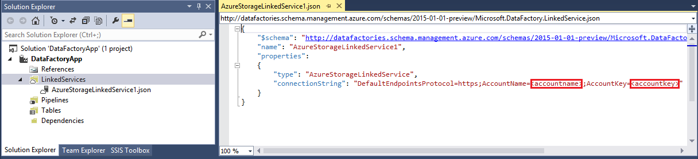
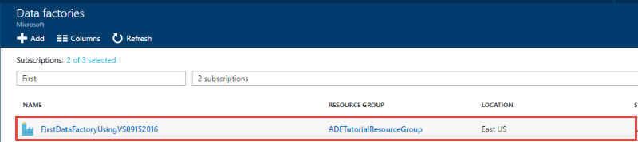
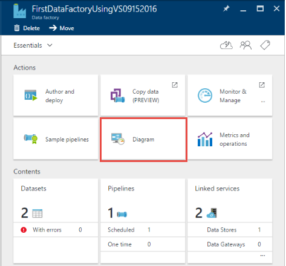

<properties
    pageTitle="Créer votre première usine de données (Visual Studio) | Microsoft Azure"
    description="Dans ce didacticiel, vous créez un pipeline de Azure Data Factory exemple à l’aide de Visual Studio."
    services="data-factory"
    documentationCenter=""
    authors="spelluru"
    manager="jhubbard"
    editor="monicar"/>

<tags
    ms.service="data-factory"
    ms.workload="data-services"
    ms.tgt_pltfrm="na"
    ms.devlang="na"
    ms.topic="hero-article" 
    ms.date="10/17/2016"
    ms.author="spelluru"/>

# Didacticiel : Usine de données créer votre première Azure à l’aide de Microsoft Visual Studio
> [AZURE.SELECTOR]
- [Vue d’ensemble et conditions préalables](data-factory-build-your-first-pipeline.md)
- [Portail Azure](data-factory-build-your-first-pipeline-using-editor.md)
- [Visual Studio](data-factory-build-your-first-pipeline-using-vs.md)
- [PowerShell](data-factory-build-your-first-pipeline-using-powershell.md)
- [Modèle de gestionnaire de ressources](data-factory-build-your-first-pipeline-using-arm.md)
- [API REST](data-factory-build-your-first-pipeline-using-rest-api.md)

Dans cet article, vous utilisez Microsoft Visual Studio pour créer votre première usine données Azure.

## Conditions préalables
1. Lire l’article [Vue d’ensemble du didacticiel](data-factory-build-your-first-pipeline.md) et suivez les étapes de **composant requis** .
2. Vous devez être un **administrateur de l’abonnement Azure** puissent publier entités Factory de données à partir de Visual Studio pour Azure Data Factory.
3. Vous devez disposer des éléments suivants installés sur votre ordinateur : 
    - Visual Studio 2013 ou Visual Studio 2015
    - Téléchargez Azure SDK pour Visual Studio 2013 ou Visual Studio 2015. Accédez à la [Page de téléchargement Azure](https://azure.microsoft.com/downloads/) , puis cliquez sur **VS 2013** ou **VS 2015** dans la section **.NET** .
    - Télécharger le plug-in Azure Data Factory dernière pour Visual Studio : [VS 2013](https://visualstudiogallery.msdn.microsoft.com/754d998c-8f92-4aa7-835b-e89c8c954aa5) ou [VS 2015](https://visualstudiogallery.msdn.microsoft.com/371a4cf9-0093-40fa-b7dd-be3c74f49005). Vous pouvez également modifier le plug-in en procédant comme suit : dans le menu, cliquez sur **Outils** -> **mises à jour et Extensions** -> **Online** -> **Galerie Visual Studio** -> **Microsoft Azure données usine Tools pour Visual Studio** -> **mettre à jour**. 
 
À présent, nous allons utiliser Visual Studio pour créer une usine de données Azure. 

## Créer des projets Visual Studio 
1. Lancez **Visual Studio 2013** ou **Visual Studio 2015**. Cliquez sur **fichier**, pointez sur **Nouveau**, puis cliquez sur **projet**. Vous devriez voir la boîte de dialogue **Nouveau projet** .  
2. Dans la boîte de dialogue **Nouveau projet** , sélectionnez le modèle **DataFactory** , puis cliquez sur **Projet de Factory de données vide**.   

    

3. Entrez un **nom** pour le projet, **emplacement**et un nom pour la **solution**, puis cliquez sur **OK**.

    

## Créer des services liées
Une usine de données peut avoir un ou plusieurs pipelines. Une opportunité peut avoir une ou plusieurs activités qu’il contient. Par exemple, une activité copier pour copier les données d’une source dans un magasin de données de destination et une activité HDInsight Hive à exécuter un script Hive pour transformer les données d’entrée. Voir [banques de données pris en charge](data-factory-data-movement-activities.md##supported-data-stores-and-formats) pour toutes les sources et les récepteurs pris en charge par l’activité de copie. Voir [Calculer services liées](data-factory-compute-linked-services.md) pour la liste des services cluster pris en charge par Data Factory. 

Dans cette étape, vous liez votre compte de stockage Azure et un cluster Azure HDInsight à la demande à votre usine de données. Le compte de stockage Azure conserve les données d’entrée et de sortie pour le pipeline dans cet exemple. Le service HDInsight lié est utilisé pour exécuter un script Hive spécifié dans l’activité du pipeline dans cet exemple. Identifier les données store/cluster services sont utilisées dans votre scénario et attacher ces derniers usine données en créant des services liés.  

Vous spécifiez le nom et les paramètres pour le factory de données ultérieurement lorsque vous publiez votre solution Data Factory.

#### Créer le service de stockage Azure lié
Dans cette étape, vous liez votre compte de stockage Azure à votre usine de données. Pour ce didacticiel, vous utilisez le même compte de stockage Azure pour stocker les données d’entrée/sortie et le fichier de script HQL. 

4. Avec le bouton droit **Services liées** dans l’Explorateur de solutions, pointez sur **Ajouter**, puis cliquez sur **Nouvel élément**.      
5. Dans la boîte de dialogue **Ajouter un nouvel élément** , sélectionnez **Service liée de stockage Azure** dans la liste, puis cliquez sur **Ajouter**. 
3. Remplacez le **nom de compte** et **accountkey** avec le nom de votre compte de stockage Azure et sa clé. Pour savoir comment obtenir votre clé d’accès de stockage, voir [Afficher, copier et stockage régénérer les touches d’accès](../storage/storage-create-storage-account.md#view-copy-and-regenerate-storage-access-keys)

    

4. Enregistrez le fichier **AzureStorageLinkedService1.json** .

#### Créer le service Azure HDInsight lié
Dans cette étape, vous liez un cluster de HDInsight à la demande à votre usine de données. Le cluster HDInsight est automatiquement créé lors de l’exécution et supprimé une fois que procéder transformation et inactif pour le laps de temps spécifié. Vous pouvez aussi utiliser votre propre cluster HDInsight au lieu d’utiliser un cluster de HDInsight à la demande. Pour plus d’informations, voir [Calculer les Services liés](data-factory-compute-linked-services.md) . 

1. Dans l' **Explorateur de solutions**, avec le bouton droit **Services liés**, pointez sur **Ajouter**, puis cliquez sur **Nouvel élément**.
2. Sélectionnez **HDInsight sur demande de Service lié**, puis cliquez sur **Ajouter**. 
3. Remplacez le **JSON** avec les éléments suivants :

        {
          "name": "HDInsightOnDemandLinkedService",
          "properties": {
            "type": "HDInsightOnDemand",
            "typeProperties": {
              "version": "3.2",
              "clusterSize": 1,
              "timeToLive": "00:30:00",
              "linkedServiceName": "AzureStorageLinkedService1"
            }
          }
        }
    
    Le tableau suivant décrit les propriétés JSON utilisées dans l’extrait de code :
    
    Propriété | Description
    -------- | -----------
    Version | Spécifie que la version de la HDInsight créé pour être 3,2. 
    ClusterSize | Spécifie la taille du cluster HDInsight. 
    Propriété TimeToLive | Spécifie que la durée d’inactivité pour le cluster HDInsight, avant d’être supprimé.
    linkedServiceName | Spécifie le compte de stockage utilisé pour stocker les journaux qui sont générés par HDInsight

    Notez les points suivants : 
    
    - Le Factory de données crée un cluster HDInsight de **Windows** pour vous avec la précédente JSON. Vous pourriez également lui demander de créer un cluster HDInsight **Linux** . Pour plus d’informations, consultez [Services liés à la demande HDInsight](data-factory-compute-linked-services.md#azure-hdinsight-on-demand-linked-service) . 
    - Vous pouvez aussi utiliser **votre propre cluster HDInsight** au lieu d’utiliser un cluster de HDInsight à la demande. Pour plus d’informations, voir [Service liées HDInsight](data-factory-compute-linked-services.md#azure-hdinsight-linked-service) .
    - Le cluster HDInsight crée un **conteneur par défaut** dans le stockage blob que vous spécifié dans le JSON (**linkedServiceName**). HDInsight ne supprime pas ce conteneur lorsque le cluster est supprimé. Ce comportement est voulu par la conception. Avec le service de HDInsight lié à la demande, un cluster HDInsight est créé chaque fois qu’un secteur est traité sauf s’il existe un cluster live existant (**timeToLive**). Le cluster est supprimé automatiquement lorsque le traitement est terminé.
    
        Lorsque plusieurs sections sont traitées, vous voyez de nombreux conteneurs dans votre espace de stockage blob Azure. Si vous ne devez pas les de résoudre les problèmes des tâches, vous souhaiterez peut-être les supprimer pour réduire les coûts de stockage. Les noms de ces conteneurs suivent un modèle : « chargeur**yourdatafactoryname**-**linkedservicename**- datetimestamp ». Pour supprimer des conteneurs dans votre espace de stockage blob Azure, utilisez les outils tels que [Microsoft stockage Explorer](http://storageexplorer.com/) .

    Pour plus d’informations, consultez [Services liés à la demande HDInsight](data-factory-compute-linked-services.md#azure-hdinsight-on-demand-linked-service) . 
4. Enregistrez le fichier **HDInsightOnDemandLinkedService1.json** .

## Créer des groupes de données
Dans cette étape, vous créez des groupes de données pour représenter l’entrée et sortie des données pour le traitement Hive. Ces jeux de données font référence à **AzureStorageLinkedService1** que vous avez créé précédemment dans ce didacticiel. Les points de service liées à un compte de stockage Azure et des datasets spécifient conteneur, dossier, nom de fichier dans le stockage qui contient d’entrée et sortie des données.   

#### Créer le jeu de données d’entrée

1. Dans l' **Explorateur de solutions**, avec le bouton droit de **Tables**, pointez sur **Ajouter**, puis cliquez sur **Nouvel élément**. 
2. Sélectionnez **Blob Azure** dans la liste, remplacez le nom du fichier **InputDataSet.json**, puis cliquez sur **Ajouter**.
3. Remplacez le **JSON** dans l’éditeur avec les éléments suivants : 

    Dans l’extrait JSON, vous créez un jeu de données appelée **AzureBlobInput** qui représente les données d’entrée pour une activité dans le pipeline. En outre, vous spécifiez que les données d’entrée sont trouve dans le conteneur blob appelé **adfgetstarted** et le dossier nommé **inputdata**
        
        {
            "name": "AzureBlobInput",
            "properties": {
                "type": "AzureBlob",
                "linkedServiceName": "AzureStorageLinkedService1",
                "typeProperties": {
                    "fileName": "input.log",
                    "folderPath": "adfgetstarted/inputdata",
                    "format": {
                        "type": "TextFormat",
                        "columnDelimiter": ","
                    }
                },
                "availability": {
                    "frequency": "Month",
                    "interval": 1
                },
                "external": true,
                "policy": {}
            }
        } 

    Le tableau suivant décrit les propriétés JSON utilisées dans l’extrait de code :

  	| Propriété | Description |
  	| :------- | :---------- |
  	| type | La propriété est définie sur AzureBlob, car les données se trouvent dans le stockage blob Azure. |  
  	| linkedServiceName | fait référence à la AzureStorageLinkedService1 que vous avez créée. |
  	| nom de fichier | Cette propriété est facultative. Si vous omettez cette propriété, tous les fichiers à partir de la folderPath sont sélectionnées. Dans ce cas, uniquement l’input.log est traité. |
  	| type | Les fichiers journaux sont disponibles au format texte, afin que nous utilisons format du texte. | 
  	| columnDelimiter | colonnes dans les fichiers journaux sont délimités par le caractère virgule () |
  	| fréquence/intervalle | fréquence définie mois et l’intervalle est 1, ce qui signifie que les secteurs d’entrée sont disponibles tous les mois. | 
  	| externes | Cette propriété est définie sur true si les données d’entrée ne sont pas générées par le service de données par défaut. | 
      
    
3. Enregistrez le fichier **InputDataset.json** . 

 
#### Créer le jeu de données de sortie
À présent, vous créez le jeu de données de sortie pour représenter les données de sortie stockées dans le stockage Blob Azure. 

1. Dans l' **Explorateur de solutions**, avec le bouton droit de **tables**, pointez sur **Ajouter**, puis cliquez sur **Nouvel élément**. 
2. Sélectionnez **Blob Azure** dans la liste, remplacez le nom du fichier **OutputDataset.json**, puis cliquez sur **Ajouter**. 
3. Remplacez le **JSON** dans l’éditeur avec les éléments suivants : 

    Dans l’extrait JSON, vous créez un jeu de données appelée **AzureBlobOutput**et en spécifiant la structure des données qui sont générées par le script Hive. En outre, vous spécifiez que les résultats sont stockés dans le conteneur blob appelé **adfgetstarted** et le dossier nommé **partitioneddata**. La section **disponibilité** indique que le jeu de données de sortie est produite sur une base mensuelle.
    
        {
          "name": "AzureBlobOutput",
          "properties": {
            "type": "AzureBlob",
            "linkedServiceName": "AzureStorageLinkedService1",
            "typeProperties": {
              "folderPath": "adfgetstarted/partitioneddata",
              "format": {
                "type": "TextFormat",
                "columnDelimiter": ","
              }
            },
            "availability": {
              "frequency": "Month",
              "interval": 1
            }
          }
        }

    Consultez la section **créer le jeu de données d’entrée** pour obtenir une description de ces propriétés. Vous ne définissez pas la propriété externe sur un jeu de données de sortie que le jeu de données est généré par le service de données par défaut.

4. Enregistrez le fichier **OutputDataset.json** .

### Créer des opportunités
Dans cette étape, vous créez votre premier pipeline avec une activité **HDInsightHive** . Le secteur d’entrée n’est disponible chaque mois (fréquence : mois, intervalle : 1), secteur de sortie est généré tous les mois et la propriété du Planificateur de l’activité est également définie sur mensuel. Les paramètres pour le jeu de données de sortie et le planificateur d’activité doivent correspondre. Jeu de données de sortie n’existe actuellement que lecteurs l’Échéancier, vous devez créer un jeu de données de sortie même si l’activité ne génère pas de sortie. Si l’activité n’accepte aucune entrée, vous pouvez ignorer la création du groupe de données d’entrée. Les propriétés utilisées dans le JSON suivant sont expliquées à la fin de cette section.

1. Dans l' **Explorateur de solutions**, **Pipelines**avec le bouton droit, pointez sur **Ajouter**, puis cliquez sur **un nouvel élément.** 
2. Sélectionnez **Pipeline de Transformation de ruche** dans la liste, puis cliquez sur **Ajouter**. 
3. Remplacez le **JSON** par l’extrait de code suivante.

    > [AZURE.IMPORTANT] Remplacez **storageaccountname** par le nom de votre compte de stockage.

        {
            "name": "MyFirstPipeline",
            "properties": {
                "description": "My first Azure Data Factory pipeline",
                "activities": [
                    {
                        "type": "HDInsightHive",
                        "typeProperties": {
                            "scriptPath": "adfgetstarted/script/partitionweblogs.hql",
                            "scriptLinkedService": "AzureStorageLinkedService1",
                            "defines": {
                                "inputtable": "wasb://adfgetstarted@<storageaccountname>.blob.core.windows.net/inputdata",
                                "partitionedtable": "wasb://adfgetstarted@<storageaccountname>.blob.core.windows.net/partitioneddata"
                            }
                        },
                        "inputs": [
                            {
                                "name": "AzureBlobInput"
                            }
                        ],
                        "outputs": [
                            {
                                "name": "AzureBlobOutput"
                            }
                        ],
                        "policy": {
                            "concurrency": 1,
                            "retry": 3
                        },
                        "scheduler": {
                            "frequency": "Month",
                            "interval": 1
                        },
                        "name": "RunSampleHiveActivity",
                        "linkedServiceName": "HDInsightOnDemandLinkedService"
                    }
                ],
                "start": "2016-04-01T00:00:00Z",
                "end": "2016-04-02T00:00:00Z",
                "isPaused": false
            }
        }

    Dans l’extrait JSON, vous créez un pipeline qui se compose d’une activité unique qui utilise Hive pour traiter les données sur un cluster HDInsight.
    
    Dans l’extrait JSON, vous créez un pipeline qui se compose d’une activité unique qui utilise Hive pour traiter les données sur un cluster HDInsight.
    
    Le fichier de script Hive, **partitionweblogs.hql**, est stocké dans le compte de stockage Azure (spécifié par scriptLinkedService, appelé **AzureStorageLinkedService1**) et dans le dossier de **scripts** dans conteneur **adfgetstarted**.

    La section **définit** est utilisée pour spécifier les paramètres de runtime sont passés au script hive comme valeurs de configuration Hive (par ex. ${hiveconf : inputtable}, ${hiveconf:partitionedtable}).

    Les propriétés **start** et **end** du pipeline spécifie la période active du pipeline.

    Dans l’activité JSON, vous indiquez que le script Hive s’exécute sur le cluster spécifié par le **linkedServiceName** – **HDInsightOnDemandLinkedService**.

    > [AZURE.NOTE] Pour plus d’informations sur les propriétés JSON utilisées dans l’exemple, consultez [structure d’un Pipeline](data-factory-create-pipelines.md#anatomy-of-a-pipeline) . 
3. Enregistrez le fichier **HiveActivity1.json** .

### Ajouter des partitionweblogs.hql et input.log en tant que dépendance 

1. Avec le bouton droit de **dépendances** dans la fenêtre **Explorateur de solutions** , pointez sur **Ajouter**, puis cliquez sur **Un élément existant**.  
2. Accédez à la **C:\ADFGettingStarted** et sélectionnez **partitionweblogs.hql**, **input.log** fichiers, cliquez sur **Ajouter**. Vous avez créé ces deux fichiers dans le cadre de conditions préalables à partir de [Vue d’ensemble du didacticiel](data-factory-build-your-first-pipeline.md).

Lorsque vous publiez la solution à l’étape suivante, le fichier **partitionweblogs.hql** est téléchargé dans le dossier scripts dans le conteneur blob **adfgetstarted** .   

### Publier/déployer entités Data Factory

18. Avec le bouton droit de projet dans l’Explorateur de solutions, puis cliquez sur **Publier**. 
19. Si vous voyez la boîte de dialogue **se connecter à votre compte Microsoft** , entrez vos informations d’identification du compte qui dispose d’abonnement Azure, puis cliquez sur **se connecter**.
20. Vous devriez voir la boîte de dialogue suivante :

    

21. Dans la page par défaut de données de configuration, procédez comme suit : 
    1. Sélectionnez l’option **Créer un nouveau Factory de données** .
    2. Entrez un **nom** unique pour le factory de données. Par exemple : **FirstDataFactoryUsingVS09152016**. Le nom doit être unique.  
    
    
        > [AZURE.IMPORTANT] Si vous recevez l’erreur **nom d’usine données « FirstDataFactoryUsingVS » n’est pas disponible** lors de la publication, modifiez le nom (par exemple, yournameFirstDataFactoryUsingVS). Consultez la rubrique de [Données Factory - règles d’appellation](data-factory-naming-rules.md) pour les règles d’appellation pour les objets de données par défaut.
3. Sélectionnez l’abonnement approprié pour le champ **abonnement** .
     
     
        > [AZURE.IMPORTANT] Si vous ne voyez pas les abonnements, vérifiez que vous connecter avec un compte qui est un administrateur ou la co-création-administrateur de l’abonnement.  
        
    4. Sélectionnez le **groupe de ressources** pour le factory de données à créer. 
    5. Sélectionnez la **région** pour le factory de données. 
    6. Cliquez sur **suivant** pour passer à la page **Publier des éléments** . (Appuyez sur l' **onglet** pour retirer le champ nom à si le bouton **suivant** est désactivé.) 
23. Dans la page **Publier des éléments** , vérifiez que toutes les références de données entités sont sélectionnées, puis cliquez sur **suivant** pour passer à la page de **Résumé** .     
24. Consultez le résumé, cliquez sur **suivant** pour démarrer le processus de déploiement et afficher le **Statut du déploiement**.
25. Dans la page **État du déploiement** , vous devez voir l’état du processus de déploiement. Une fois que le déploiement est terminé, cliquez sur Terminer. 

 
Points importants à noter : 

- Si vous recevez l’erreur : «**cet abonnement n’est pas enregistré pour utiliser l’espace de noms Microsoft.DataFactory**», effectuez l’une des opérations suivantes et essayez de republier : 

    - Dans Azure PowerShell, exécutez la commande suivante pour enregistrer le fournisseur de données par défaut. 
        
            Register-AzureRmResourceProvider -ProviderNamespace Microsoft.DataFactory
    
        Vous pouvez exécuter la commande suivante pour vous assurer que le Factory de données fournisseur est enregistré. 
    
            Get-AzureRmResourceProvider
    - Connexion à l’aide de l’abonnement Azure au [portail Azure](https://portal.azure.com) et accédez à une carte de données par défaut (ou) créer une usine de données dans le portail Azure. Cette action enregistre automatiquement le fournisseur pour vous.
-   Le nom de la factory de données peut être enregistré comme un nom DNS à l’avenir et donc deviennent visible publiquement.
-   Pour créer des instances de données par défaut, vous devez être un administrateur ou la co-création-administrateur de l’abonnement Azure

 
## Pipeline de moniteur

### Pipeline de moniteur à l’aide de la vue de diagramme
6. Connectez-vous au [portail Azure](https://portal.azure.com/), procédez comme suit :
    1. Cliquez sur **plus de services** et cliquez sur **références de données**.
         
    2. Sélectionnez le nom de votre usine de données (par exemple : **FirstDataFactoryUsingVS09152016**) dans la liste des références de données. 
        
7. Dans la page d’accueil de votre usine de données, cliquez sur **le diagramme**.
  
    
7. Dans la vue de diagramme, vous voyez une vue d’ensemble des pipelines et des jeux de données utilisés dans ce didacticiel.
    
     
8. Pour afficher toutes les activités dans le pipeline, avec le bouton droit pipeline dans le diagramme, puis cliquez sur Ouvrir Pipeline. 

    
9. Vérifiez que vous voyez l’activité HDInsightHive dans le pipeline. 
  
    

    Pour revenir à la vue précédente, cliquez sur **usine de données** dans le menu de navigation en haut. 
10. Dans la **Vue de diagramme**, double-cliquez sur le jeu de données **AzureBlobInput**. Vérifiez que le secteur est **prête** . Il peut prendre quelques minutes pour le secteur s’affiche dans l’état prêt. Si elle n’a pas lieu une fois que vous attendez un certain temps, voyez si vous avez le fichier d’entrée (input.log) placé dans le conteneur droite (adfgetstarted) et un dossier (inputdata).

    
11. Cliquez sur **X** pour fermer la carte **AzureBlobInput** . 
12. Dans la **Vue de diagramme**, double-cliquez sur le jeu de données **AzureBlobOutput**. Vous constatez que le secteur est en cours de traitement.

    
9. Lorsque le traitement est terminé, vous voyez le secteur dans l’état **prêt** .

    > [AZURE.IMPORTANT] Création d’un cluster de HDInsight à la demande généralement prend un certain temps (environ 20 minutes). Par conséquent, ils doivent s’attendre le pipeline de prendre **30 minutes** pour traiter le secteur.  

     
    
10. Lorsque le secteur est **prête** , consultez le dossier **partitioneddata** dans le conteneur **adfgetstarted** dans votre espace de stockage blob pour les données de sortie.  
 
    
11. Cliquez sur le secteur pour afficher des détails à ce sujet dans une carte de **tranche de données** .

      
12. Cliquez sur une activité exécuter dans la **liste des activités s’exécute** pour afficher des détails sur une activité exécuter (activité Hive dans notre scénario) dans une fenêtre **d’activité détails de l’exécution** .   
      
    
    Parmi les fichiers journaux, vous pouvez voir la requête Hive qui a été exécutée et les informations d’état. Ces journaux sont utiles pour le dépannage des problèmes.  
 

Pour obtenir des instructions sur la façon d’utiliser le portail Azure pour contrôler les opportunités et les jeux de données que vous avez créé dans ce didacticiel, voir [pipeline et des datasets de moniteur](data-factory-monitor-manage-pipelines.md) .

### Surveiller pipeline à l’aide d’un seul moniteur et gérer une application
Vous pouvez également utiliser le moniteur et gérer les applications à surveiller vos pipelines. Pour plus d’informations sur l’utilisation de cette application, voir [moniteur et gérer les pipelines Azure Data Factory à l’aide de surveillance et application de gestion des](data-factory-monitor-manage-app.md).

1. Cliquez sur surveiller et gérer la vignette.

     
2. Vous devez voir moniteur et gérer l’application. Modifier **l’heure de début** et **heure de fin** pour mettre en correspondance début (04-01-2016 12:00 AM) et l’heure de fin (04-02-2016 12:00 AM) de votre pipeline, puis cliquez sur **Appliquer**.

     
3. Sélectionnez une fenêtre de l’activité dans la liste activité Windows pour consulter les détails à ce sujet. 
    

> [AZURE.IMPORTANT] Le fichier d’entrée est supprimé lorsque le secteur est traité avec succès. Par conséquent, si vous souhaitez réexécuter le secteur ou effectuez une nouvelle fois le didacticiel, téléchargez le fichier d’entrée (input.log) dans le dossier inputdata du conteneur adfgetstarted.
 

## Explorateur de serveurs permet d’afficher les références de données

1. Dans **Visual Studio**, cliquez sur **affichage** dans le menu, puis cliquez sur **Explorateur de serveurs**.
2. Dans la fenêtre Explorateur de serveurs, développez **Azure** et **Data Factory**. Si vous voyez **se connecter à Visual Studio**, entrez le **compte** associé à votre abonnement Azure et cliquez sur **Continuer**. Entrez **votre mot de passe**, puis cliquez sur **se connecter**. Visual Studio tente d’obtenir des informations sur toutes les références de données Azure dans votre abonnement. Vous voyez l’état de cette opération dans la fenêtre de la **Liste de tâches de données par défaut** .

    
3. Vous pouvez avec le bouton droit une usine de données, puis sélectionnez **Exporter Data Factory à nouveau projet** pour créer un projet Visual Studio basé sur une usine de données existante.

    

## Mettre à jour des outils de données par défaut pour Visual Studio

Pour mettre à jour des outils usine de données Azure pour Visual Studio, procédez comme suit :

1. Cliquez sur **Outils** dans le menu et sélectionnez **Extensions et mises à jour**.
2. Sélectionnez les **mises à jour** dans le volet gauche, puis sélectionnez **Galerie Visual Studio**.
3. Sélectionnez **Factory de données Azure tools pour Visual Studio** , puis cliquez sur **mettre à jour**. Si vous ne voyez pas cette entrée, vous possédez déjà la dernière version des outils. 

## Utiliser des fichiers de configuration
Vous pouvez utiliser des fichiers de configuration dans Visual Studio pour configurer les propriétés pour les services/tables/pipelines différemment pour chaque environnement liées. 

Considérez la définition JSON suivante pour un service de stockage Azure lié. Pour spécifier **connectionString** avec différentes valeurs pour nom de compte et accountkey basée sur l’environnement (développement/Test/de Production) à laquelle vous déployez entités Data Factory. Vous pouvez obtenir ce comportement à l’aide du fichier de configuration distinct pour chaque environnement. 

    {
        "name": "StorageLinkedService",
        "properties": {
            "type": "AzureStorage",
            "description": "",
            "typeProperties": {
                "connectionString": "DefaultEndpointsProtocol=https;AccountName=<accountname>;AccountKey=<accountkey>"
            }
        }
    } 

### Ajouter un fichier de configuration
Ajoutez un fichier de configuration pour chaque environnement en effectuant les étapes suivantes :   

1. Cliquez sur le projet Data Factory dans votre solution Visual Studio, pointez sur **Ajouter**, puis cliquez sur **nouvel élément**.
2. Sélectionnez **configuration** dans la liste des modèles installés sur la gauche, sélectionnez **Fichier de Configuration**, entrez un **nom** pour le fichier de configuration, puis cliquez sur **Ajouter**.

    
3. Ajouter des paramètres de configuration et leurs valeurs sous la forme suivante.

        {
            "$schema": "http://datafactories.schema.management.azure.com/vsschemas/V1/Microsoft.DataFactory.Config.json",
            "AzureStorageLinkedService1": [
                {
                    "name": "$.properties.typeProperties.connectionString",
                    "value": "DefaultEndpointsProtocol=https;AccountName=<accountname>;AccountKey=<accountkey>"
                }
            ],
            "AzureSqlLinkedService1": [
                {
                    "name": "$.properties.typeProperties.connectionString",
                    "value":  "Server=tcp:spsqlserver.database.windows.net,1433;Database=spsqldb;User ID=spelluru;Password=Sowmya123;Trusted_Connection=False;Encrypt=True;Connection Timeout=30"
                }
            ]
        }

    Cet exemple configure propriété connectionString d’un service de stockage Azure lié et un service SQL Azure lié. Notez que la syntaxe pour spécifier un nom est [JsonPath](http://goessner.net/articles/JsonPath/).   

    Si JSON possède une propriété qui contient un tableau de valeurs comme indiqué dans le code suivant :  

        "structure": [
            {
                "name": "FirstName",
                "type": "String"
            },
            {
                "name": "LastName",
                "type": "String"
            }
        ],
    
    Configurer les propriétés comme indiqué dans le fichier de configuration suivant (utilisation indexation de base zéro) : 
        
        {
            "name": "$.properties.structure[0].name",
            "value": "FirstName"
        }
        {
            "name": "$.properties.structure[0].type",
            "value": "String"
        }
        {
            "name": "$.properties.structure[1].name",
            "value": "LastName"
        }
        {
            "name": "$.properties.structure[1].type",
            "value": "String"
        }

### Noms de propriétés avec des espaces
Si un nom de la propriété comporte des espaces, utilisez des crochets comme indiqué dans l’exemple suivant (nom de serveur de base de données) : 

     {
         "name": "$.properties.activities[1].typeProperties.webServiceParameters.['Database server name']",
         "value": "MyAsqlServer.database.windows.net"
     }

### Déployer la solution à l’aide d’une configuration
Lorsque vous publiez entités Azure Data Factory dans Visual Studio, vous pouvez spécifier la configuration que vous souhaitez utiliser pour cette opération de publication. 

Pour publier des entités dans un projet Azure Data Factory à l’aide du fichier de configuration :   

1. Droit projet Factory de données, puis cliquez sur **Publier** pour afficher la boîte de dialogue **Publier les éléments** . 
2. Sélectionnez une usine de données existantes ou spécifier des valeurs pour la création d’une usine de données dans la page **par défaut de données de configuration** , puis cliquez sur **suivant**.   
3. Dans la page **Publier des éléments** : vous consultez une liste déroulante avec des configurations disponibles pour le champ **Sélectionnez déploiement Config** .

    

4. Sélectionnez le **fichier de configuration** que vous voulez utiliser et cliquez sur **suivant**. 
5. Vérifiez que vous voyez le nom du fichier JSON dans la page de **Résumé** et cliquez sur **suivant**. 
6. Une fois l’opération de déploiement est terminée, cliquez sur **Terminer** . 

Lorsque vous déployez, les valeurs du fichier de configuration sont utilisées pour définir les valeurs de propriétés dans les fichiers JSON pour entités Data Factory avant de déploiement les entités au service Azure Data Factory.   

## Résumé 
Dans ce didacticiel, vous avez créé une usine de données Azure pour traiter les données en exécutant le script Hive sur un cluster hadoop HDInsight. Vous avez utilisé l’éditeur par défaut des données dans le portail Azure pour effectuer les opérations suivantes :  

1.  Créer une **usine de données**Azure.
2.  Créé deux **services liées**:
    1.  Service de **Stockage azure** lié à lier votre stockage d’objets blob Azure qui contient les fichiers d’entrée/sortie à l’usine de données.
    2.  Service de liées à la demande **Azure HDInsight** à lier un cluster HDInsight Hadoop à la demande à l’usine de données. Azure Data Factory crée un HDInsight Hadoop cluster juste-à-temps pour traiter les données d’entrée et produire des données de sortie. 
3.  Créé deux **jeux de données**, ce qui décrivent les données d’entrée et de sortie pour l’activité HDInsight Hive dans le pipeline. 
4.  Créé un **pipeline** avec une activité **HDInsight Hive** .  

## Étapes suivantes
Dans cet article, vous avez créé un pipeline avec une transformation activité (HDInsight) qui exécute un script Hive sur un cluster de HDInsight à la demande. Pour découvrir comment utiliser une activité copier pour copier des données à partir d’un Blob Azure dans SQL Azure, consultez [didacticiel : copier des données d’un Azure blob Azure SQL](data-factory-copy-data-from-azure-blob-storage-to-sql-database.md).
  
## Voir aussi
| Rubrique | Description |
| :---- | :---- |
| [Activités de Transformation des données](data-factory-data-transformation-activities.md) | Cet article fournit la liste des activités de transformation de données (par exemple, de transformation HDInsight Hive vous avez utilisées dans ce didacticiel) pris en charge par Azure Data Factory. | 
| [Planification et l’exécution](data-factory-scheduling-and-execution.md) | Cet article décrit les aspects de la planification et l’exécution du modèle d’application Azure Data Factory. |
| [Pipelines](data-factory-create-pipelines.md) | Cet article vous aide à comprendre les pipelines et activités dans Azure Data Factory et comment les utiliser pour créer de bout en bout pilotées par les données des flux de travail pour votre scénario ou entreprise. |
| [Jeux de données](data-factory-create-datasets.md) | Cet article vous aide à comprendre les groupes de données dans Azure Data Factory.
| [Surveiller et gérer les pipelines à l’aide d’application de surveillance](data-factory-monitor-manage-app.md) | Cet article décrit comment contrôler, gérer et déboguer pipelines à l’aide de la surveillance et l’application de gestion. 
