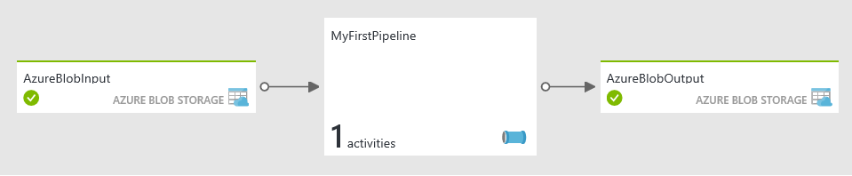

<properties
    pageTitle="Didacticiel Factory de données : première pipeline de données | Microsoft Azure"
    description="Ce didacticiel Azure Data Factory vous montre comment créer et planifier une usine de données qui traite les données à l’aide de script Hive sur un cluster Hadoop."
    services="data-factory"
    keywords="données Azure usine didacticiels, hadoop cluster, hadoop hive"
    documentationCenter=""
    authors="spelluru"
    manager="jhubbard"
    editor=""/>

<tags
    ms.service="data-factory"
    ms.workload="data-services"
    ms.tgt_pltfrm="na"
    ms.devlang="na"
    ms.topic="article" 
    ms.date="09/26/2016"
    ms.author="spelluru"/>

# Didacticiel : Créer votre première pipeline pour traiter les données à l’aide de cluster Hadoop 
> [AZURE.SELECTOR]
- [Vue d’ensemble et conditions préalables](data-factory-build-your-first-pipeline.md)
- [Portail Azure](data-factory-build-your-first-pipeline-using-editor.md)
- [Visual Studio](data-factory-build-your-first-pipeline-using-vs.md)
- [PowerShell](data-factory-build-your-first-pipeline-using-powershell.md)
- [Modèle de gestionnaire de ressources](data-factory-build-your-first-pipeline-using-arm.md)
- [API REST](data-factory-build-your-first-pipeline-using-rest-api.md)

Dans ce didacticiel, vous créez votre première usine données Azure avec un pipeline de données qui traite les données en exécutant le script Hive sur un cluster Azure HDInsight (Hadoop). 

> [AZURE.NOTE] Cet article ne fournit pas une vue d’ensemble conceptuelle de Azure Data Factory. Pour obtenir une présentation générale du service, voir [présentation Azure Data Factory](data-factory-introduction.md). Voir [Data Factory rubriques d’apprentissage](https://azure.microsoft.com/documentation/learning-paths/data-factory/) pour recommandée pour naviguer dans notre contenu pour en savoir plus sur les données par défaut.

## Qu’est décrits dans ce didacticiel ? 
**Azure Data Factory** vous permet composez données **mouvement** et tâches de **traitement des** données en tant que les flux de travail pilotés par des données (également appelés pipelines de données). Vous apprenez à créer votre première activité pipeline avec un traitement des données (ou la transformation de données) de données. Cette activité utilise un cluster HDInsight Hadoop pour transformer et analyser les journaux web exemple.  

Dans ce didacticiel, vous effectuez les opérations suivantes :

1.  Créer une **usine de données**. Une usine de données peut contenir un ou plus de données canalisations ces données déplacer et processus. 
2.  Créer des **services liées**. Vous créez un service lié à lier un magasin de données ou un service de cluster à l’usine de données. Un magasin de données telles que le stockage Azure conserve les données d’entrée/sortie des activités dans le pipeline. Un service de cluster tel que cluster HDInsight Hadoop processus/transformations de données.    
3.  Créez une entrée et sortie des **jeux de données**. Un jeu de données d’entrée représente l’entrée d’une activité dans le pipeline et un jeu de données de sortie représente le résultat de l’activité.
3.  Créer le **pipeline**. Une opportunité peut avoir une ou plusieurs activités (exemples : activité de copie, HDInsight ruche activité). Cet exemple utilise l’activité HDInsight Hive qui exécute un script Hive sur un cluster HDInsight Hadoop. Le script crée une table qui fait référence aux données de journal web brute stockées dans le stockage blob Azure d’abord et ensuite partitions les données brutes par année et mois.

    Il existe deux types d’activités pris en charge par Azure Data Factory. Ils sont : [activités de déplacement des données](data-factory-data-movement-activities.md) et des [activités de transformation de données](data-factory-data-transformation-activities.md). Il est données qu’un seul mouvement activité, l’activité de copie. Dans ce didacticiel, vous n’utilisez pas l’activité de copie. Pour un didacticiel sur l’utilisation de l’activité de copie, voir [didacticiel : copier des données d’un Azure blob Azure SQL](data-factory-copy-data-from-azure-blob-storage-to-sql-database.md). Activité HDInsight Hive que vous utilisez dans ce didacticiel figure parmi les activités de transformation de données pris en charge par Data Factory.  
 
Voici la **vue de diagramme** d’usine données exemple créé dans ce didacticiel. 

Dans ce didacticiel, dossier **inputdata** du conteneur blob Azure **adfgetstarted** contient un fichier nommé input.log. Ce fichier journal porte entrées des trois mois : janvier, février et mars de 2016. Voici les exemples de lignes pour chaque mois dans le fichier d’entrée. 

    2016-01-01,02:01:09,SAMPLEWEBSITE,GET,/blogposts/mvc4/step2.png,X-ARR-LOG-ID=2ec4b8ad-3cf0-4442-93ab-837317ece6a1,80,-,1.54.23.196,Mozilla/5.0+(Windows+NT+6.3;+WOW64)+AppleWebKit/537.36+(KHTML,+like+Gecko)+Chrome/31.0.1650.63+Safari/537.36,-,http://weblogs.asp.net/sample/archive/2007/12/09/asp-net-mvc-framework-part-4-handling-form-edit-and-post-scenarios.aspx,\N,200,0,0,53175,871 
    2016-02-01,02:01:10,SAMPLEWEBSITE,GET,/blogposts/mvc4/step7.png,X-ARR-LOG-ID=d7472a26-431a-4a4d-99eb-c7b4fda2cf4c,80,-,1.54.23.196,Mozilla/5.0+(Windows+NT+6.3;+WOW64)+AppleWebKit/537.36+(KHTML,+like+Gecko)+Chrome/31.0.1650.63+Safari/537.36,-,http://weblogs.asp.net/sample/archive/2007/12/09/asp-net-mvc-framework-part-4-handling-form-edit-and-post-scenarios.aspx,\N,200,0,0,30184,871
    2016-03-01,02:01:10,SAMPLEWEBSITE,GET,/blogposts/mvc4/step7.png,X-ARR-LOG-ID=d7472a26-431a-4a4d-99eb-c7b4fda2cf4c,80,-,1.54.23.196,Mozilla/5.0+(Windows+NT+6.3;+WOW64)+AppleWebKit/537.36+(KHTML,+like+Gecko)+Chrome/31.0.1650.63+Safari/537.36,-,http://weblogs.asp.net/sample/archive/2007/12/09/asp-net-mvc-framework-part-4-handling-form-edit-and-post-scenarios.aspx,\N,200,0,0,30184,871

Lorsque le fichier est traité par le pipeline avec une activité ruche HDInsight, l’activité exécute un script Hive sur le cluster HDInsight que partitions d’entrée de données par année et mois. Le script crée trois dossiers de sortie contenant un fichier avec des entrées de chaque mois.  

    adfgetstarted/partitioneddata/year=2016/month=1/000000_0
    adfgetstarted/partitioneddata/year=2016/month=2/000000_0
    adfgetstarted/partitioneddata/year=2016/month=3/000000_0

À partir des lignes d’exemple ci-dessus, la première partie (avec 2016-01-01) est écrite dans le fichier 000000_0 pendant le mois = 1 dossier. De même, le second exemple est écrite dans le fichier pendant le mois = 2 dossier et la troisième une écrit vers le fichier dans le mois = dossier 3.  

## Conditions préalables
Avant de commencer ce didacticiel, vous devez disposer les conditions préalables suivantes :

1.  **Abonnement azure** - si vous n’avez pas un abonnement Azure, vous pouvez créer un compte d’évaluation gratuit en quelques minutes. Consultez l’article [Gratuit d’évaluation](https://azure.microsoft.com/pricing/free-trial/) sur comment vous pouvez obtenir un compte d’évaluation gratuit.

2.  **Stockage azure** – vous utilisez un compte de stockage Azure pour stocker les données dans ce didacticiel. Si vous n’avez pas un compte de stockage Azure, voir l’article [créer un compte de stockage](../storage/storage-create-storage-account.md#create-a-storage-account) . Après avoir créé le compte de stockage, notez le **nom de compte** et une **touche d’accès rapide**. Voir [Afficher, copier et stockage régénérer les touches d’accès](../storage/storage-create-storage-account.md#view-and-copy-storage-access-keys). 

### Télécharger des fichiers sur le stockage Azure pour le didacticiel
Avant de démarrer le didacticiel, vous devez préparer votre compte de stockage Azure avec les fichiers d’exemples pour le didacticiel.

1. Télécharger le fichier de requête Hive (HQL) au dossier **script** du conteneur blob **adfgetstarted** .
2. Télécharger le fichier d’entrée au dossier **inputdata** du conteneur blob **adfgetstarted** . 

#### Créer le fichier de script HQL 

1. Démarrez **le bloc-notes** , puis collez le script HQL suivant. Ce script Hive crée deux tables : **WebLogsRaw** et **WebLogsPartitioned**. Cliquez sur **fichier** dans le menu, puis sélectionnez **Enregistrer sous**. Basculez vers le dossier **C:\adfgetstarted** sur votre disque dur. Sélectionnez * *tous les fichiers (*.*) **pour la** Enregistrer en tant que tapez** champ. Entrez **partitionweblogs.hql** pour la **nom de fichier**. Vérifiez que la **codage de** champ dans la partie inférieure de la boîte de dialogue est défini sur **ANSI**. Dans le cas contraire, attribuez-lui **ANSI **.  

        set hive.exec.dynamic.partition.mode=nonstrict;
        
        DROP TABLE IF EXISTS WebLogsRaw; 
        CREATE TABLE WebLogsRaw (
          date  date,
          time  string,
          ssitename string,
          csmethod  string,
          csuristem  string,
          csuriquery string,
          sport int,
          susername string,
          cipcsUserAgent string,
          csCookie string,
          csReferer string,
          cshost  string,
          scstatus  int,
          scsubstatus  int,
          scwin32status  int,
          scbytes int,
          csbytes int,
          timetaken int
        )
        ROW FORMAT DELIMITED FIELDS TERMINATED BY ' '
        LINES TERMINATED BY '\n' 
        tblproperties ("skip.header.line.count"="2");
        
        LOAD DATA INPATH '${hiveconf:inputtable}' OVERWRITE INTO TABLE WebLogsRaw;
        
        DROP TABLE IF EXISTS WebLogsPartitioned ; 
        create external table WebLogsPartitioned (  
          date  date,
          time  string,
          ssitename string,
          csmethod  string,
          csuristem  string,
          csuriquery string,
          sport int,
          susername string,
          cipcsUserAgent string,
          csCookie string,
          csReferer string,
          cshost  string,
          scstatus  int,
          scsubstatus  int,
          scwin32status  int,
          scbytes int,
          csbytes int,
          timetaken int
        )
        partitioned by ( year int, month int)
        ROW FORMAT DELIMITED FIELDS TERMINATED BY ',' 
        STORED AS TEXTFILE 
        LOCATION '${hiveconf:partitionedtable}';
        
        INSERT INTO TABLE WebLogsPartitioned  PARTITION( year , month) 
        SELECT
          date,
          time,
          ssitename,
          csmethod,
          csuristem,
          csuriquery,
          sport,
          susername,
          cipcsUserAgent,
          csCookie,
          csReferer,
          cshost,
          scstatus,
          scsubstatus,
          scwin32status,
          scbytes,
          csbytes,
          timetaken,
          year(date),
          month(date)
        FROM WebLogsRaw

En cours d’exécution, l’activité ruche dans le pipeline de données usine passe des valeurs la **inputtable** et paramètres **partitionedtable** comme indiqué dans l’extrait de code suivante :  

        "inputtable": "wasb://adfgetstarted@<storageaccountname>.blob.core.windows.net/inputdata",
        "partitionedtable": "wasb://adfgetstarted@<storageaccountname>.blob.core.windows.net/partitioneddata"

La **storageaccountname** est le nom de votre compte de stockage Azure.
 
#### Créer un exemple de fichier d’entrée
En utilisant le bloc-notes, créez un fichier nommé **input.log** dans **c:\adfgetstarted** avec le contenu suivant : 

    #Software: Microsoft Internet Information Services 8.0
    #Fields: date time s-sitename cs-method cs-uri-stem cs-uri-query s-port cs-username c-ip cs(User-Agent) cs(Cookie) cs(Referer) cs-host sc-status sc-substatus sc-win32-status sc-bytes cs-bytes time-taken
    2016-01-01 02:01:09 SAMPLEWEBSITE GET /blogposts/mvc4/step2.png X-ARR-LOG-ID=2ec4b8ad-3cf0-4442-93ab-837317ece6a1 80 - 1.54.23.196 Mozilla/5.0+(Windows+NT+6.3;+WOW64)+AppleWebKit/537.36+(KHTML,+like+Gecko)+Chrome/31.0.1650.63+Safari/537.36 - http://weblogs.asp.net/sample/archive/2007/12/09/asp-net-mvc-framework-part-4-handling-form-edit-and-post-scenarios.aspx www.sample.com 200 0 0 53175 871 46
    2016-01-01 02:01:09 SAMPLEWEBSITE GET /blogposts/mvc4/step3.png X-ARR-LOG-ID=9eace870-2f49-4efd-b204-0d170da46b4a 80 - 1.54.23.196 Mozilla/5.0+(Windows+NT+6.3;+WOW64)+AppleWebKit/537.36+(KHTML,+like+Gecko)+Chrome/31.0.1650.63+Safari/537.36 - http://weblogs.asp.net/sample/archive/2007/12/09/asp-net-mvc-framework-part-4-handling-form-edit-and-post-scenarios.aspx www.sample.com 200 0 0 51237 871 32
    2016-01-01 02:01:09 SAMPLEWEBSITE GET /blogposts/mvc4/step4.png X-ARR-LOG-ID=4bea5b3d-8ac9-46c9-9b8c-ec3e9500cbea 80 - 1.54.23.196 Mozilla/5.0+(Windows+NT+6.3;+WOW64)+AppleWebKit/537.36+(KHTML,+like+Gecko)+Chrome/31.0.1650.63+Safari/537.36 - http://weblogs.asp.net/sample/archive/2007/12/09/asp-net-mvc-framework-part-4-handling-form-edit-and-post-scenarios.aspx www.sample.com 200 0 0 72177 871 47
    2016-01-01 02:01:09 SAMPLEWEBSITE GET /blogposts/mvc4/step5.png X-ARR-LOG-ID=9b0c14b1-434d-495a-9b0d-46775194257b 80 - 1.54.23.196 Mozilla/5.0+(Windows+NT+6.3;+WOW64)+AppleWebKit/537.36+(KHTML,+like+Gecko)+Chrome/31.0.1650.63+Safari/537.36 - http://weblogs.asp.net/sample/archive/2007/12/09/asp-net-mvc-framework-part-4-handling-form-edit-and-post-scenarios.aspx www.sample.com 200 0 0 37931 871 32
    2016-01-01 02:01:09 SAMPLEWEBSITE GET /blogposts/mvc4/step6.png X-ARR-LOG-ID=f99cff81-ec38-4a13-b2fe-21b10adca996 80 - 1.54.23.196 Mozilla/5.0+(Windows+NT+6.3;+WOW64)+AppleWebKit/537.36+(KHTML,+like+Gecko)+Chrome/31.0.1650.63+Safari/537.36 - http://weblogs.asp.net/sample/archive/2007/12/09/asp-net-mvc-framework-part-4-handling-form-edit-and-post-scenarios.aspx www.sample.com 200 0 0 27146 871 47
    2016-01-01 02:01:09 SAMPLEWEBSITE GET /blogposts/mvc4/step1.png X-ARR-LOG-ID=af94d3b4-8e05-4871-82c4-638f866d4e83 80 - 1.54.23.196 Mozilla/5.0+(Windows+NT+6.3;+WOW64)+AppleWebKit/537.36+(KHTML,+like+Gecko)+Chrome/31.0.1650.63+Safari/537.36 - http://weblogs.asp.net/sample/archive/2007/12/09/asp-net-mvc-framework-part-4-handling-form-edit-and-post-scenarios.aspx www.sample.com 200 0 0 66259 871 140
    2016-02-01 02:01:10 SAMPLEWEBSITE GET /blogposts/mvc4/step7.png X-ARR-LOG-ID=d7472a26-431a-4a4d-99eb-c7b4fda2cf4c 80 - 1.54.23.196 Mozilla/5.0+(Windows+NT+6.3;+WOW64)+AppleWebKit/537.36+(KHTML,+like+Gecko)+Chrome/31.0.1650.63+Safari/537.36 - http://weblogs.asp.net/sample/archive/2007/12/09/asp-net-mvc-framework-part-4-handling-form-edit-and-post-scenarios.aspx www.sample.com 200 0 0 30184 871 47
    2016-02-01 02:01:10 SAMPLEWEBSITE GET /blogposts/mvc4/step7.png X-ARR-LOG-ID=d7472a26-431a-4a4d-99eb-c7b4fda2cf4c 80 - 1.54.23.196 Mozilla/5.0+(Windows+NT+6.3;+WOW64)+AppleWebKit/537.36+(KHTML,+like+Gecko)+Chrome/31.0.1650.63+Safari/537.36 - http://weblogs.asp.net/sample/archive/2007/12/09/asp-net-mvc-framework-part-4-handling-form-edit-and-post-scenarios.aspx www.sample.com 200 0 0 30184 871 47
    2016-02-01 02:01:10 SAMPLEWEBSITE GET /blogposts/mvc4/step7.png X-ARR-LOG-ID=d7472a26-431a-4a4d-99eb-c7b4fda2cf4c 80 - 1.54.23.196 Mozilla/5.0+(Windows+NT+6.3;+WOW64)+AppleWebKit/537.36+(KHTML,+like+Gecko)+Chrome/31.0.1650.63+Safari/537.36 - http://weblogs.asp.net/sample/archive/2007/12/09/asp-net-mvc-framework-part-4-handling-form-edit-and-post-scenarios.aspx www.sample.com 200 0 0 30184 871 47
    2016-02-01 02:01:10 SAMPLEWEBSITE GET /blogposts/mvc4/step7.png X-ARR-LOG-ID=d7472a26-431a-4a4d-99eb-c7b4fda2cf4c 80 - 1.54.23.196 Mozilla/5.0+(Windows+NT+6.3;+WOW64)+AppleWebKit/537.36+(KHTML,+like+Gecko)+Chrome/31.0.1650.63+Safari/537.36 - http://weblogs.asp.net/sample/archive/2007/12/09/asp-net-mvc-framework-part-4-handling-form-edit-and-post-scenarios.aspx www.sample.com 200 0 0 30184 871 47
    2016-02-01 02:01:10 SAMPLEWEBSITE GET /blogposts/mvc4/step7.png X-ARR-LOG-ID=d7472a26-431a-4a4d-99eb-c7b4fda2cf4c 80 - 1.54.23.196 Mozilla/5.0+(Windows+NT+6.3;+WOW64)+AppleWebKit/537.36+(KHTML,+like+Gecko)+Chrome/31.0.1650.63+Safari/537.36 - http://weblogs.asp.net/sample/archive/2007/12/09/asp-net-mvc-framework-part-4-handling-form-edit-and-post-scenarios.aspx www.sample.com 200 0 0 30184 871 47
    2016-02-01 02:01:10 SAMPLEWEBSITE GET /blogposts/mvc4/step7.png X-ARR-LOG-ID=d7472a26-431a-4a4d-99eb-c7b4fda2cf4c 80 - 1.54.23.196 Mozilla/5.0+(Windows+NT+6.3;+WOW64)+AppleWebKit/537.36+(KHTML,+like+Gecko)+Chrome/31.0.1650.63+Safari/537.36 - http://weblogs.asp.net/sample/archive/2007/12/09/asp-net-mvc-framework-part-4-handling-form-edit-and-post-scenarios.aspx www.sample.com 200 0 0 30184 871 47
    2016-02-01 02:01:10 SAMPLEWEBSITE GET /blogposts/mvc4/step7.png X-ARR-LOG-ID=d7472a26-431a-4a4d-99eb-c7b4fda2cf4c 80 - 1.54.23.196 Mozilla/5.0+(Windows+NT+6.3;+WOW64)+AppleWebKit/537.36+(KHTML,+like+Gecko)+Chrome/31.0.1650.63+Safari/537.36 - http://weblogs.asp.net/sample/archive/2007/12/09/asp-net-mvc-framework-part-4-handling-form-edit-and-post-scenarios.aspx www.sample.com 200 0 0 30184 871 47
    2016-02-01 02:01:10 SAMPLEWEBSITE GET /blogposts/mvc4/step7.png X-ARR-LOG-ID=d7472a26-431a-4a4d-99eb-c7b4fda2cf4c 80 - 1.54.23.196 Mozilla/5.0+(Windows+NT+6.3;+WOW64)+AppleWebKit/537.36+(KHTML,+like+Gecko)+Chrome/31.0.1650.63+Safari/537.36 - http://weblogs.asp.net/sample/archive/2007/12/09/asp-net-mvc-framework-part-4-handling-form-edit-and-post-scenarios.aspx www.sample.com 200 0 0 30184 871 47
    2016-03-01 02:01:10 SAMPLEWEBSITE GET /blogposts/mvc4/step7.png X-ARR-LOG-ID=d7472a26-431a-4a4d-99eb-c7b4fda2cf4c 80 - 1.54.23.196 Mozilla/5.0+(Windows+NT+6.3;+WOW64)+AppleWebKit/537.36+(KHTML,+like+Gecko)+Chrome/31.0.1650.63+Safari/537.36 - http://weblogs.asp.net/sample/archive/2007/12/09/asp-net-mvc-framework-part-4-handling-form-edit-and-post-scenarios.aspx www.sample.com 200 0 0 30184 871 47
    2016-03-01 02:01:10 SAMPLEWEBSITE GET /blogposts/mvc4/step7.png X-ARR-LOG-ID=d7472a26-431a-4a4d-99eb-c7b4fda2cf4c 80 - 1.54.23.196 Mozilla/5.0+(Windows+NT+6.3;+WOW64)+AppleWebKit/537.36+(KHTML,+like+Gecko)+Chrome/31.0.1650.63+Safari/537.36 - http://weblogs.asp.net/sample/archive/2007/12/09/asp-net-mvc-framework-part-4-handling-form-edit-and-post-scenarios.aspx www.sample.com 200 0 0 30184 871 47
    2016-03-01 02:01:10 SAMPLEWEBSITE GET /blogposts/mvc4/step7.png X-ARR-LOG-ID=d7472a26-431a-4a4d-99eb-c7b4fda2cf4c 80 - 1.54.23.196 Mozilla/5.0+(Windows+NT+6.3;+WOW64)+AppleWebKit/537.36+(KHTML,+like+Gecko)+Chrome/31.0.1650.63+Safari/537.36 - http://weblogs.asp.net/sample/archive/2007/12/09/asp-net-mvc-framework-part-4-handling-form-edit-and-post-scenarios.aspx www.sample.com 200 0 0 30184 871 47
    2016-03-01 02:01:10 SAMPLEWEBSITE GET /blogposts/mvc4/step7.png X-ARR-LOG-ID=d7472a26-431a-4a4d-99eb-c7b4fda2cf4c 80 - 1.54.23.196 Mozilla/5.0+(Windows+NT+6.3;+WOW64)+AppleWebKit/537.36+(KHTML,+like+Gecko)+Chrome/31.0.1650.63+Safari/537.36 - http://weblogs.asp.net/sample/archive/2007/12/09/asp-net-mvc-framework-part-4-handling-form-edit-and-post-scenarios.aspx www.sample.com 200 0 0 30184 871 47
    2016-03-01 02:01:10 SAMPLEWEBSITE GET /blogposts/mvc4/step7.png X-ARR-LOG-ID=d7472a26-431a-4a4d-99eb-c7b4fda2cf4c 80 - 1.54.23.196 Mozilla/5.0+(Windows+NT+6.3;+WOW64)+AppleWebKit/537.36+(KHTML,+like+Gecko)+Chrome/31.0.1650.63+Safari/537.36 - http://weblogs.asp.net/sample/archive/2007/12/09/asp-net-mvc-framework-part-4-handling-form-edit-and-post-scenarios.aspx www.sample.com 200 0 0 30184 871 47

#### Télécharger des fichiers d’entrée et HQL dans votre stockage d’objets Blob Azure

Cette section fournit des instructions sur l’utilisation de **AzCopy** outil pour copier les fichiers input.log et partitionweblogs.hql au stockage d’objets Blob Azure. Vous pouvez utiliser n’importe quel outil de votre choix (par exemple : [Microsoft Azure stockage Explorer](http://storageexplorer.com/), [CloudXPlorer par un logiciel de ClumsyLeaf](http://clumsyleaf.com/products/cloudxplorer) pour effectuer cette tâche.   
     
1. Téléchargez la [dernière version **d’AzCopy**](http://aka.ms/downloadazcopy)ou la [dernière version d’évaluation](http://aka.ms/downloadazcopypr). Reportez-vous à l’article [comment utiliser AzCopy](../storage/storage-use-azcopy.md) pour obtenir des instructions sur l’utilisation de l’utilitaire.
2. Accédez au dossier c:\adfgetstarted, puis exécutez la commande suivante : 

        "C:\Program Files (x86)\Microsoft SDKs\Azure\AzCopy\AzCopy" /Source:. /Dest:https://<storageaccountname>.blob.core.windows.net/adfgetstarted/inputdata /DestKey:<storageaccesskey>  /Pattern:input.log

    Cette commande transfère le fichier **input.log** sur le compte de stockage (conteneur**adfgetstarted** et un dossier **inputdata** ). Remplacez **storageaccountname** par le nom de votre compte de stockage et **storageaccesskey** avec la touche d’accès de stockage.

    > [AZURE.NOTE] Cette commande crée un conteneur nommé **adfgetstarted** dans votre espace de stockage Blob Azure et copie le fichier **input.log** à partir de votre disque local vers le dossier **inputdata** dans le conteneur. 
    
3. Une fois que le fichier a été téléchargé, vous voyez la sortie similaire à celle qui suit à partir de AzCopy.
    
        Finished 1 of total 1 file(s).
        [2015/12/16 23:07:33] Transfer summary:
        -----------------
        Total files transferred: 1
        Transfer successfully:   1
        Transfer skipped:        0
        Transfer failed:         0
        Elapsed time:            00.00:00:01
5. Exécutez la commande suivante pour télécharger le fichier **partitionweblogs.hql** dans le dossier de **script** du conteneur **adfgetstarted** . Voici la commande : 
    
        AzCopy /Source:. /Dest:https://<storageaccountname>.blob.core.windows.net/adfgetstarted/script /DestKey:<storageaccesskey>  /Pattern:partitionweblogs.hql

Vous avez terminé la configuration requise. Vous pouvez créer une usine de données à l’aide d’une des façons suivantes. Cliquez sur l’un des onglets en haut ou les liens suivants pour effectuer le didacticiel. 

- [Portail Azure](data-factory-build-your-first-pipeline-using-editor.md)
- [Visual Studio](data-factory-build-your-first-pipeline-using-vs.md)
- [PowerShell](data-factory-build-your-first-pipeline-using-powershell.md)
- [Modèle de gestionnaire de ressources](data-factory-build-your-first-pipeline-using-arm.md)
- [API REST](data-factory-build-your-first-pipeline-using-rest-api.md)