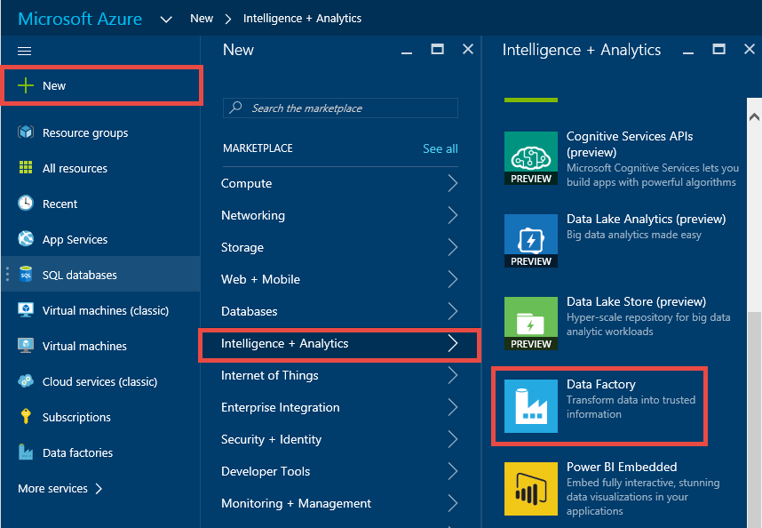
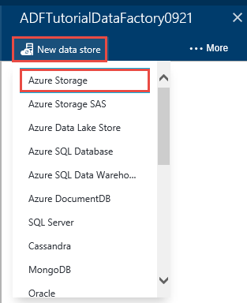
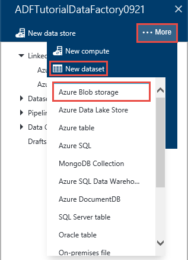
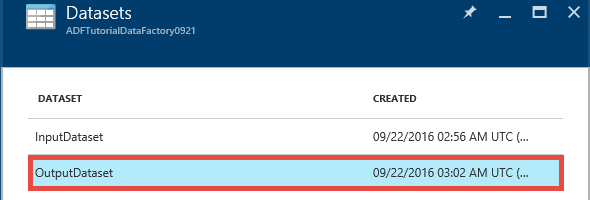

<properties 
    pageTitle="Didacticiel : Créer un pipeline avec une activité copie à l’aide du portail Azure | Microsoft Azure" 
    description="Dans ce didacticiel, vous créez un pipeline Azure Data Factory avec une activité de copie à l’aide de l’éditeur par défaut des données dans le portail Azure." 
    services="data-factory" 
    documentationCenter="" 
    authors="spelluru" 
    manager="jhubbard" 
    editor="monicar"/>

<tags 
    ms.service="data-factory" 
    ms.workload="data-services" 
    ms.tgt_pltfrm="na" 
    ms.devlang="na" 
    ms.topic="get-started-article" 
    ms.date="09/16/2016" 
    ms.author="spelluru"/>

# Didacticiel : Créer un pipeline avec une activité copie à l’aide du portail Azure
> [AZURE.SELECTOR]
- [Vue d’ensemble et conditions préalables](data-factory-copy-data-from-azure-blob-storage-to-sql-database.md)
- [Assistant copie](data-factory-copy-data-wizard-tutorial.md)
- [Portail Azure](data-factory-copy-activity-tutorial-using-azure-portal.md)
- [Visual Studio](data-factory-copy-activity-tutorial-using-visual-studio.md)
- [PowerShell](data-factory-copy-activity-tutorial-using-powershell.md)
- [Modèle de gestionnaire de ressources Azure](data-factory-copy-activity-tutorial-using-azure-resource-manager-template.md)
- [API REST](data-factory-copy-activity-tutorial-using-rest-api.md)
- [API .NET](data-factory-copy-activity-tutorial-using-dotnet-api.md)

Ce didacticiel montre comment créer et surveiller une usine de données Azure à l’aide du portail Azure. Le pipeline en usine données utilise une activité copier pour copier des données depuis le stockage Blob Azure dans la base de données SQL Azure.

Voici les étapes que vous effectuez dans le cadre de ce didacticiel :

Étape | Description
-----| -----------
[Créer une usine de données Azure](#create-data-factory) | Dans cette étape, vous créez une usine de données Azure nommé **ADFTutorialDataFactory**.  
[Créer des services liées](#create-linked-services) | Dans cette étape, vous créez deux services liées : **AzureStorageLinkedService** et **AzureSqlLinkedService**.   La AzureStorageLinkedService lie le stockage Azure et AzureSqlLinkedService des liens de la base de données SQL Azure à la ADFTutorialDataFactory. Les données d’entrée pour le pipeline se trouve dans un conteneur blob dans les données de stockage et de sortie blob Azure être stockées dans un tableau dans la base de données SQL Azure. Par conséquent, vous ajoutez ces deux banques de données en tant que services liés à l’usine de données.      
[Créez une entrée et de sortie des jeux de données](#create-datasets) | Dans l’étape précédente, vous avez créé des services liées qui font référence aux banques de données qui contiennent des données d’entrée/sortie. Dans cette étape, vous définissez deux jeux de données-- **InputDataset** et **OutputDataset** --qui représentent les données d’entrée/sortie qui sont stockées dans les banques de données.   Pour InputDataset, que vous spécifiez le conteneur blob contenant un blob avec la source de données et pour le OutputDataset, vous spécifiez la table SQL qui stocke les données de sortie. Vous spécifiez également d’autres propriétés telles que la structure, la disponibilité et stratégie. 
[Créer une opportunité](#create-pipeline) | Dans cette étape, vous créez un pipeline nommé **ADFTutorialPipeline** dans le ADFTutorialDataFactory.   Vous ajoutez une **activité de copie** dans le pipeline de copie de saisie des données à partir de la Azure blob à la table SQL Azure sortie. L’activité de copie effectue le déplacement des données dans Azure Data Factory. Il est optimisé par un service globalement disponible qui peut copier des données entre différentes banques de données de façon sécurisée, fiable et format SVG. Consultez l’article des [Activités de déplacement des données](data-factory-data-movement-activities.md) pour plus d’informations sur l’activité de copie. 
[Pipeline de moniteur](#monitor-pipeline) | Dans cette étape, vous surveiller secteurs des tables d’entrée et de sortie à l’aide du portail Azure.

## Conditions préalables 
Conditions préalables répertoriées dans l’article [Vue d’ensemble du didacticiel](data-factory-copy-data-from-azure-blob-storage-to-sql-database.md) avant d’effectuer ce didacticiel.

## Créer factory de données
Dans cette étape, vous utilisez le portail Azure pour créer une usine de données Azure nommé **ADFTutorialDataFactory**.

1.  Après la connexion au [portail Azure](https://portal.azure.com/), cliquez sur **Nouveau**, sélectionnez **Intelligence + Analytique**et cliquez sur **Data Factory**. 

      

6. Dans la carte **nouvelle factory de données** :
    1. Entrez **ADFTutorialDataFactory** pour le **nom**. 
    
        

        Le nom de la factory données Azure doit être **globalement unique**. Si vous recevez l’erreur suivante, modifiez le nom de la factory de données (par exemple, yournameADFTutorialDataFactory) et essayez de créer à nouveau. Consultez la rubrique de [Données Factory - règles d’appellation](data-factory-naming-rules.md) pour les règles d’appellation pour les objets de données par défaut.
    
            Data factory name “ADFTutorialDataFactory” is not available  
     
        
    2. Sélectionnez votre **abonnement**Azure.
    3. Pour le groupe de ressources, effectuez l’une des opérations suivantes :
        1. Sélectionnez **utiliser existant**, puis sélectionnez un groupe de ressources existant dans la liste déroulante. 
        2. Sélectionnez **Créer nouveau**et entrez le nom d’un groupe de ressources.   
    
            Parmi les étapes décrites dans ce didacticiel part du principe que vous utilisez le nom : **ADFTutorialResourceGroup** du groupe de ressources. Pour en savoir plus sur les groupes de ressources, voir [utilisation des groupes de ressources pour gérer vos ressources Azure](../azure-resource-manager/resource-group-overview.md).  
    4. Sélectionnez l' **emplacement** pour le factory de données. Uniquement les régions pris en charge par le service de données par défaut sont affichées dans la liste déroulante.
    5. Sélectionnez **attacher aux Startboard**.     
    6. Cliquez sur **créer**.

        > [AZURE.IMPORTANT] Pour créer des instances de données par défaut, vous devez être membre du rôle de [Collaborateur usine](../active-directory/role-based-access-built-in-roles.md/#data-factory-contributor) au niveau du groupe de ressources/abonnement.
        >  
        >  Le nom de la factory de données peut être enregistré comme un nom DNS à l’avenir et donc deviennent visible publiquement.              
9.  Pour afficher les messages de notification d’état, cliquez sur l’icône en cloche dans la barre d’outils. 

     
10. Une fois la création terminée, vous voyez la carte de **Données usine** comme le montre l’image.

    

## Créer des services liées
Services liés lier banques de données ou le calculent des services à une usine de données Azure. Voir [banques de données pris en charge](data-factory-data-movement-activities.md##supported-data-stores-and-formats) pour toutes les sources et les récepteurs pris en charge par l’activité de copie. Voir [Calculer services liées](data-factory-compute-linked-services.md) pour la liste des services cluster pris en charge par Data Factory. Dans ce didacticiel, vous n’utilisez pas de n’importe quel service cluster. 

Dans cette étape, vous créez deux services liées : **AzureStorageLinkedService** et **AzureSqlLinkedService**. AzureStorageLinkedService liées liens service un compte de stockage Azure et AzureSqlLinkedService lie une base de données SQL Azure à **ADFTutorialDataFactory**. Vous créez un pipeline plus loin dans ce didacticiel qui copie les données à partir d’un conteneur blob dans AzureStorageLinkedService à une table SQL dans AzureSqlLinkedService.

### Créer un service lié pour le compte de stockage Azure
1.  Dans la carte de **Données par défaut** , cliquez sur **auteur et déployer** vignette pour lancer l' **éditeur** pour le factory de données.

     
5. Dans l' **éditeur**, cliquez sur le bouton **nouveau magasin de données** dans la barre d’outils et sélectionnez **stockage Azure** dans le menu déroulant. Vous devriez voir le modèle JSON pour la création d’un service de stockage Azure liée dans le volet droit. 

        
6. Remplacer `<accountname>` et `<accountkey>` avec le nom de compte et les valeurs de clé de compte pour votre compte de stockage Azure. 

     
6. Dans la barre d’outils, cliquez sur **déployer** . Vous devriez voir maintenant déployé **AzureStorageLinkedService** dans l’arborescence. 

    

> [AZURE.NOTE]
> Pour plus d’informations sur les propriétés JSON, voir [déplacer des données depuis/vers Blob Azure](data-factory-azure-blob-connector.md#azure-storage-linked-service) .

### Créer un service lié pour la base de données SQL Azure
1. Dans l' **Éditeur de Factory de données**, cliquez sur le bouton **nouveau magasin de données** dans la barre d’outils et sélectionnez **Base de données SQL Azure** dans le menu déroulant. Vous devriez voir le modèle JSON pour créer le service SQL Azure liées dans le volet droit.
2. Remplacer `<servername>`, `<databasename>`, `<username>@<servername>`, et `<password>` avec des noms de votre serveur SQL Azure, base de données, compte d’utilisateur et mot de passe. 
3. Dans la barre d’outils pour créer et déployer **AzureSqlLinkedService**, cliquez sur **déployer** .
4. Vérifiez que vous voyez **AzureSqlLinkedService** dans l’arborescence. 

> [AZURE.NOTE]
> Pour plus d’informations sur les propriétés JSON, voir [déplacer des données depuis/vers le base de données SQL Azure](data-factory-azure-sql-connector.md#azure-sql-linked-service-properties) .

## Créer des groupes de données
Dans l’étape précédente, vous avez créé des services liées **AzureStorageLinkedService** et **AzureSqlLinkedService** pour lier un compte de stockage Azure et la base de données SQL Azure au factory de données : **ADFTutorialDataFactory**. Dans cette étape, vous définissez deux jeux de données-- **InputDataset** et **OutputDataset** --qui représentent les données d’entrée/sortie qui sont stockées dans les banques de données auxquelles il AzureStorageLinkedService et AzureSqlLinkedService respectivement. Pour InputDataset, que vous spécifiez le conteneur blob contenant un blob avec les données sources et pour OutputDataset, vous spécifiez la table SQL qui stocke les données de sortie. 

### Créer le jeu de données d’entrée 
Dans cette étape, vous créez un jeu de données nommée **InputDataset** qui pointe vers un conteneur blob dans le stockage Azure représenté par le service **AzureStorageLinkedService** lié.

1. Dans l' **éditeur** pour le Factory de données, cliquez sur **... Plus**, cliquez sur **Nouveau groupe de données**, puis cliquez sur **stockage d’objets Blob Azure** dans le menu déroulant. 

    
2. Remplacez JSON dans le volet droit par l’extrait de JSON suivant : 

        {
          "name": "InputDataset",
          "properties": {
            "structure": [
              {
                "name": "FirstName",
                "type": "String"
              },
              {
                "name": "LastName",
                "type": "String"
              }
            ],
            "type": "AzureBlob",
            "linkedServiceName": "AzureStorageLinkedService",
            "typeProperties": {
              "folderPath": "adftutorial/",
              "fileName": "emp.txt",
              "format": {
                "type": "TextFormat",
                "columnDelimiter": ","
              }
            },
            "external": true,
            "availability": {
              "frequency": "Hour",
              "interval": 1
            }
          }
        }
        
     Notez les points suivants : 
    
    - jeu de données **type** est défini sur **AzureBlob**.
    - **linkedServiceName** est défini sur **AzureStorageLinkedService**. Vous avez créé ce service lié à l’étape 2.
    - **folderPath** est défini sur le conteneur **adftutorial** . Vous pouvez également spécifier le nom d’un objet blob dans le dossier à l’aide de la propriété **nom de fichier** . Étant donné que vous ne spécifiez pas le nom de l’objet blob, données de tous les objets BLOB dans le conteneur sont considérées comme un d’entrée de données.  
    - le **type** de format est défini sur **format du texte**
    - Il existe deux champs dans le fichier texte – **prénom** et **nom** – séparé par une virgule (**columnDelimiter**) 
    - La **disponibilité** est défini sur **toutes les heures** (**fréquence** est définie sur **heure** et **intervalle** est égale à **1**). Par conséquent, Data Factory recherche les données d’entrée toutes les heures dans le dossier racine du conteneur blob (**adftutorial**) que vous avez spécifié. 
    
    Si vous ne spécifiez un **nom de fichier** pour un jeu de données **d’entrée** , tous les fichiers BLOB à partir du dossier d’entrée (**folderPath**) sont considérés comme entrées. Si vous spécifiez un nom de fichier dans le JSON, uniquement le spécifié fichier/blob est considéré comme asn d’entrée.
 
    Si vous ne spécifiez pas un **nom de fichier** pour une **table de sortie**, les fichiers générés dans le **folderPath** sont nommés au format suivant : données. &lt;Guid\&gt ;. txt (exemple : Data.0a405f8a-93ff-4c6f-b3be-f69616f1df7a.txt.).

    Pour définir **folderPath** et **nom de fichier** dynamiquement en fonction du temps **SliceStart** , utilisez la propriété **partitionedBy** . Dans l’exemple suivant, folderPath utilise année, mois et jour à partir de la SliceStart (heure de début de la section en cours de traitement) et nom de fichier utilise l’heure à partir de la SliceStart. Par exemple, si un secteur en cours de production pour 2016-09-20T08:00:00, NomDossier est définie sur wikidatagateway/wikisampledataout/2016/09/20 et le nom de fichier est défini sur 08.csv. 

            "folderPath": "wikidatagateway/wikisampledataout/{Year}/{Month}/{Day}",
            "fileName": "{Hour}.csv",
            "partitionedBy": 
            [
                { "name": "Year", "value": { "type": "DateTime", "date": "SliceStart", "format": "yyyy" } },
                { "name": "Month", "value": { "type": "DateTime", "date": "SliceStart", "format": "MM" } }, 
                { "name": "Day", "value": { "type": "DateTime", "date": "SliceStart", "format": "dd" } }, 
                { "name": "Hour", "value": { "type": "DateTime", "date": "SliceStart", "format": "hh" } } 
            ],
2. Dans la barre d’outils pour créer et déployer le dataset **InputDataset** , cliquez sur **déployer** . Vérifiez que vous voyez **InputDataset** dans l’arborescence.

> [AZURE.NOTE]
> Pour plus d’informations sur les propriétés JSON, voir [déplacer des données depuis/vers Blob Azure](data-factory-azure-blob-connector.md#azure-blob-dataset-type-properties) .

### Créer le jeu de données de sortie
Dans cette partie de l’étape, vous créez un jeu de données de sortie nommé **OutputDataset**. Points de ce groupe de données à une table SQL dans la base de données SQL Azure représenté par **AzureSqlLinkedService**. 

1. Dans l' **éditeur** pour le Factory de données, cliquez sur **... Plus**, cliquez sur **Nouveau groupe de données**, puis cliquez sur **SQL Azure** dans le menu déroulant. 
2. Remplacez JSON dans le volet droit par l’extrait de JSON suivant :

        {
          "name": "OutputDataset",
          "properties": {
            "structure": [
              {
                "name": "FirstName",
                "type": "String"
              },
              {
                "name": "LastName",
                "type": "String"
              }
            ],
            "type": "AzureSqlTable",
            "linkedServiceName": "AzureSqlLinkedService",
            "typeProperties": {
              "tableName": "emp"
            },
            "availability": {
              "frequency": "Hour",
              "interval": 1
            }
          }
        }
        
     Notez les points suivants : 
    
    - jeu de données **type** est défini sur **AzureSQLTable**.
    - **linkedServiceName** est défini sur **AzureSqlLinkedService** (vous avez créé ce service lié à l’étape 2).
    - **TableName** est défini sur **emp**.
    - Il existe trois colonnes – **ID**, **prénom**et **nom** – dans la table emp dans la base de données. ID est une colonne d’identité, vous devez spécifier uniquement **prénom** et **nom** ici.
    - La **disponibilité** est défini sur **toutes les heures** (**fréquence** définie sur **heure** et **intervalle** la valeur **1**).  Le service de données usine génère un secteur de données de sortie toutes les heures dans la table **emp** dans la base de données SQL Azure.

3. Dans la barre d’outils pour créer et déployer le dataset **OutputDataset** , cliquez sur **déployer** . Vérifiez que vous voyez **OutputDataset** dans l’arborescence. 

> [AZURE.NOTE]
> Pour plus d’informations sur les propriétés JSON, voir [déplacer des données depuis/vers le base de données SQL Azure](data-factory-azure-sql-connector.md#azure-sql-linked-service-properties) .

## Créer des opportunités
Dans cette étape, vous créez un pipeline avec une **Activité de copie** qui utilise **InputDataset** comme entrée et **OutputDataset** sous forme de sortie.

1. Dans l' **éditeur** pour le Factory de données, cliquez sur **... Plus**, puis cliquez sur **nouveau pipeline**. Par ailleurs, vous pouvez contextuel **Pipelines** dans l’arborescence et cliquez sur **nouveau pipeline**.
2. Remplacez JSON dans le volet droit par l’extrait de JSON suivant : 
        
        {
          "name": "ADFTutorialPipeline",
          "properties": {
            "description": "Copy data from a blob to Azure SQL table",
            "activities": [
              {
                "name": "CopyFromBlobToSQL",
                "type": "Copy",
                "inputs": [
                  {
                    "name": "InputDataset"
                  }
                ],
                "outputs": [
                  {
                    "name": "OutputDataset"
                  }
                ],
                "typeProperties": {
                  "source": {
                    "type": "BlobSource"
                  },
                  "sink": {
                    "type": "SqlSink",
                    "writeBatchSize": 10000,
                    "writeBatchTimeout": "60:00:00"
                  }
                },
                "Policy": {
                  "concurrency": 1,
                  "executionPriorityOrder": "NewestFirst",
                  "retry": 0,
                  "timeout": "01:00:00"
                }
              }
            ],
            "start": "2016-07-12T00:00:00Z",
            "end": "2016-07-13T00:00:00Z"
          }
        } 

    Notez les points suivants :

    - Dans la section activités, il n'est qu’une seule activité dont le **type** est défini sur **Copier**.
    - Entrée de l’activité est définie sur **InputDataset** et sortie de l’activité est définie sur **OutputDataset**.
    - Dans la section **typeProperties** , **BlobSource** est spécifiée comme type de source et **SqlSink** est spécifiée comme type de récepteur.

    Remplacez la valeur de la propriété **Démarrer** avec la valeur de jour et de **fin** actuelle avec le jour suivant. Vous pouvez spécifier uniquement la partie date et ignorer la partie heure de l’heure de la date. Par exemple, « 2016-02-03 », ce qui équivaut à « 2016-02-03T00:00:00Z »
    
    Les deux début et fin dates/heures doivent être au [format ISO](http://en.wikipedia.org/wiki/ISO_8601). Par exemple : 2016-10-14T16:32:41Z. L’heure de **fin** est facultative, mais nous l’utiliser dans ce didacticiel. 
    
    Si vous ne spécifiez pas de valeur pour la propriété **end** , il est calculé comme «**début + 48 heures**». Pour exécuter le pipeline indéfiniment, spécifiez **9999-09-09** comme la valeur de la propriété de **fin** .
    
    Dans l’exemple précédent, il existe 24 secteurs données comme chaque tranche de données est généré toutes les heures.
    
4. Dans la barre d’outils pour créer et déployer **ADFTutorialPipeline**, cliquez sur **déployer** . Vérifiez que vous voyez le pipeline dans l’arborescence. 
5. À présent, fermez **l’éditeur de** carte en cliquant sur **X**. Cliquez sur le **X** à nouveau pour voir la page d’accueil **Par défaut des données** pour **ADFTutorialDataFactory**.

**Félicitations !** Vous avez correctement créé une usine de données Azure, services liés, tables et un pipeline et planifiée du pipeline.   
 
### Afficher le factory de données dans une vue de diagramme 
1. Dans la carte de **Données par défaut** , cliquez sur **le diagramme**.

    
2. Vous devriez voir le diagramme similaire à l’image suivante : 

    

    Vous pouvez effectuer un zoom sur, effectuer un zoom arrière, zoom à 100 %, zoom pour ajuster automatiquement positionner pipelines et des tables et afficher les informations de lignage des (met en surbrillance des éléments en amont et en aval des éléments sélectionnés).  Vous pouvez double-cliquer sur un objet (table/sorties ou pipeline) pour afficher les propriétés de celui-ci. 
3. Avec le bouton droit **ADFTutorialPipeline** dans la vue de diagramme, cliquez sur **Ouvrir pipeline**. 

    
4. Vous devriez voir les activités dans le pipeline ainsi que des jeux de données d’entrée et de sortie pour les activités. Dans ce didacticiel, vous n'avez qu’une seule activité dans le pipeline (copie activité) avec InputDataset en tant que jeu de données d’entrée et OutputDataset en tant que jeu de données de sortie.   

    
5. Cliquez sur **usine de données** dans la barre de navigation dans le coin supérieur gauche pour revenir à la vue de diagramme. La vue de diagramme affiche tous les pipelines. Dans cet exemple, vous avez seulement créé un pipeline.   
 

## Pipeline de moniteur
Dans cette étape, le portail Azure vous permet d’analyser que se passe-t-il dans une usine de données Azure. 

### Pipeline de moniteur à l’aide de la vue de diagramme

1. Cliquez sur **X** pour fermer l’affichage **de tâches** pour afficher la page d’accueil par défaut des données pour le factory de données. Si vous avez fermé le navigateur web, procédez comme suit : 
    2. Accédez au [portail Azure](https://portal.azure.com/). 
    2. Double-cliquez sur **ADFTutorialDataFactory** sur la **Startboard** (ou) cliquez sur **références de données** dans le menu de gauche et recherchez ADFTutorialDataFactory. 
3. Vous devriez voir le nombre et le nom des tables et pipeline que vous avez créé sur cette carte.

    
4. À présent, cliquez sur mosaïque de **jeux de données** .
5. Dans la carte de **jeux de données** , cliquez sur **InputDataset**. Ce dataset est le dataset d’entrée pour **ADFTutorialPipeline**.

       
5. Cliquez sur **... (points de suspension)** Pour afficher toutes les sections de données.

      

    Notez que toutes les sections de données jusqu'à l’heure actuelle sont **prêtes** , car le fichier **emp.txt** existe tout le temps dans le conteneur blob : **adftutorial\input**. Vérifiez qu’aucune secteurs n’apparaissant dans la section **secteurs récemment échecs** en bas.

    Listes à la fois **mis à jour récemment secteurs** et **récemment a échoué secteurs** sont triés par l' **heure de dernière mise à jour**. 
    
    Cliquez sur **filtre** dans la barre d’outils pour filtrer les secteurs.  
    
    
6. Fermez les cartes jusqu'à ce que vous voyiez la carte **jeux de données** . Cliquez sur **OutputDataset**. Ce dataset est le dataset de sortie pour **ADFTutorialPipeline**.

    
6. Vous devriez voir la carte **OutputDataset** comme le montre l’image suivante :

     
7. Notez que les secteurs de données jusqu'à l’heure actuelle ont déjà été produits et qu’elles sont **prêtes**. Aucune secteurs n’apparaissent dans la section **secteurs problème** en bas.
8. Cliquez sur **... (Points de suspension)** Pour afficher toutes les sections.

    
9. Cliquez sur un secteur de données à partir de la liste et vous devriez voir la carte **tranche de données** .

    
  
    Si le secteur n’est pas dans l’état **prêt** , vous pouvez voir les secteurs en amont qui ne sont pas prêt et bloquent le secteur en cours d’exécution dans la liste **des secteurs en amont qui ne sont pas prêtes** .
11. Dans la carte de **Données secteur** , vous devriez voir que toutes les activités s’exécute dans la liste dans la partie inférieure. Cliquez sur une **activité exécuter** pour afficher la carte de **l’activité des détails de l’exécution** . 

    
12. Cliquez sur **X** pour fermer toutes les cartes jusqu'à ce que vous accédez à la carte accueil pour **ADFTutorialDataFactory**.
14. (facultatif) Cliquez sur **Pipelines** dans la page d’accueil pour **ADFTutorialDataFactory**et cliquez sur **ADFTutorialPipeline** dans la carte **Pipelines** , effectuer des recherches dans les tables d’entrée (**utilisé**) ou sortie (**produit**).
15. Lancement de **SQL Server Management Studio**, se connecter à la base de données SQL Azure et vérifiez que les lignes sont insérés dans la table **emp** dans la base de données.

    

### Surveiller pipeline à l’aide d’un seul moniteur et gérer une application
Vous pouvez également utiliser le moniteur et gérer les applications à surveiller vos pipelines. Pour plus d’informations sur l’utilisation de cette application, voir [moniteur et gérer les pipelines Azure Data Factory à l’aide de surveillance et application de gestion des](data-factory-monitor-manage-app.md).

1. Cliquez sur **un seul moniteur et gérer** vignette sur la page d’accueil de votre usine de données.

     
2. Vous devez voir **un seul moniteur et gérer des applications**. Modifier **l’heure de début** et **heure de fin** pour inclure début (12-07-2016) et heure (2016-07-13) de votre pipeline de fin, puis cliquez sur **Appliquer**. 

     
3. Sélectionnez une fenêtre de l’activité dans la liste **Activité Windows** pour consulter les détails à ce sujet. 
    

## Résumé 
Dans ce didacticiel, vous avez créé une usine de données Azure pour copier des données à partir d’un Azure blob à une base de données SQL Azure. Vous avez utilisé le portail Azure pour créer le factory de données, services liés, jeux de données et une opportunité. Voici les principales étapes que vous avez effectuées dans ce didacticiel :  

1.  Créer une **usine de données**Azure.
2.  Créé **des services liées**:
    1. Un service de **Stockage Azure** lié à lier votre compte de stockage Azure qui contient les données d’entrée.    
    2. Un service **SQL Azure** lié à lier votre base de données SQL Azure qui contient les données de sortie. 
3.  Créé des **jeux de données** qui décrivent les données d’entrée et les données de sortie de pipelines.
4.  Créé un **pipeline** avec une **Activité de copie** avec **BlobSource** comme source et **SqlSink** en tant que récepteur.  

## Voir aussi
| Rubrique | Description |
| :---- | :---- |
| [Activités de déplacement des données](data-factory-data-movement-activities.md) | Cet article fournit des informations détaillées sur l’activité de copie que vous avez utilisées dans le didacticiel. |
| [Planification et l’exécution](data-factory-scheduling-and-execution.md) | Cet article décrit les aspects de la planification et l’exécution du modèle d’application Azure Data Factory. |
| [Pipelines](data-factory-create-pipelines.md) | Cet article vous aide à comprendre les pipelines et activités dans Azure Data Factory. |
| [Jeux de données](data-factory-create-datasets.md) | Cet article vous aide à comprendre les groupes de données dans Azure Data Factory.
| [Surveiller et gérer les pipelines à l’aide d’application de surveillance](data-factory-monitor-manage-app.md) | Cet article décrit comment contrôler, gérer et déboguer pipelines à l’aide de la surveillance et l’application de gestion. 

