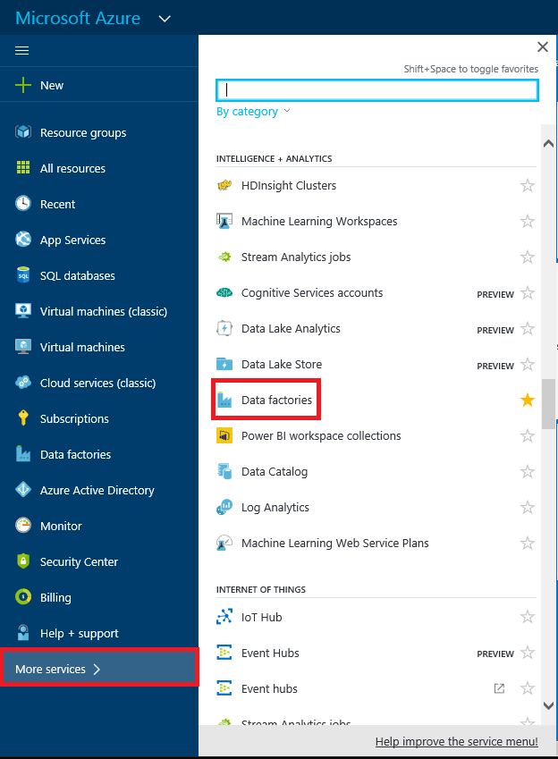
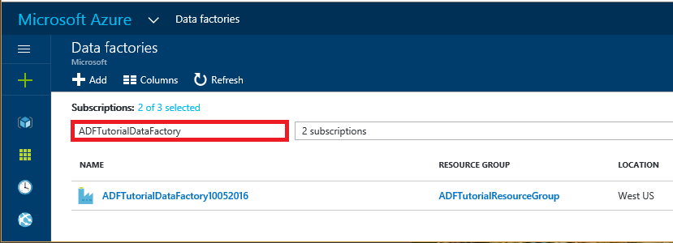

<properties
    pageTitle="Didacticiel : Créer une opportunité à l’aide du Gestionnaire de ressources du modèle | Microsoft Azure"
    description="Dans ce didacticiel, vous créez un pipeline Azure Data Factory avec une activité de copie à l’aide du Gestionnaire de ressources Azure modèle."
    services="data-factory"
    documentationCenter=""
    authors="spelluru"
    manager="jhubbard"
    editor="monicar"/>

<tags
    ms.service="data-factory"
    ms.workload="data-services"
    ms.tgt_pltfrm="na"
    ms.devlang="na"
    ms.topic="get-started-article"
    ms.date="10/10/2016"
    ms.author="spelluru"/>

# Didacticiel : Créer un pipeline avec une activité copie à l’aide du Gestionnaire de ressources Azure modèle
> [AZURE.SELECTOR]
- [Vue d’ensemble et conditions préalables](data-factory-copy-data-from-azure-blob-storage-to-sql-database.md)
- [Assistant copie](data-factory-copy-data-wizard-tutorial.md)
- [Portail Azure](data-factory-copy-activity-tutorial-using-azure-portal.md)
- [Visual Studio](data-factory-copy-activity-tutorial-using-visual-studio.md)
- [PowerShell](data-factory-copy-activity-tutorial-using-powershell.md)
- [Modèle de gestionnaire de ressources Azure](data-factory-copy-activity-tutorial-using-azure-resource-manager-template.md)
- [API REST](data-factory-copy-activity-tutorial-using-rest-api.md)
- [API .NET](data-factory-copy-activity-tutorial-using-dotnet-api.md)

Ce didacticiel montre comment créer et surveiller une usine de données Azure à l’aide d’un modèle Azure le Gestionnaire de ressources. Le pipeline en usine données copie les données depuis le stockage Blob Azure à base de données SQL Azure.

## Conditions préalables
- Parcourir [vue d’ensemble du didacticiel et les conditions préalables](data-factory-copy-data-from-azure-blob-storage-to-sql-database.md) et suivez les étapes de **composant requis** .
- Suivez les instructions de l’article [comment installer et configurer Azure PowerShell](../powershell-install-configure.md) pour installer la dernière version d’Azure PowerShell sur votre ordinateur. Dans ce didacticiel, vous utilisez PowerShell pour déployer entités Data Factory. 
- (facultatif) Voir [Création de modèles de gestionnaire de ressources Azure](../resource-group-authoring-templates.md) pour en savoir plus sur les modèles Azure le Gestionnaire de ressources.

## Dans ce didacticiel

Dans ce didacticiel, vous créez une usine de données avec les entités Data Factory suivantes :

Entité | Description  
------ | ----------- 
Service de stockage lié Azure | Des liens à votre compte de stockage Azure à l’usine de données. Stockage Azure est le magasin de données source et base de données SQL Azure est le magasin de données récepteur de l’activité de copie dans le didacticiel. Il indique le compte de stockage contenant les données d’entrée pour l’activité de copie. 
Service liées de la base de données SQL Azure| Lie votre base de données SQL Azure à l’usine de données. Il indique la base de données SQL Azure qui contient les données de sortie pour l’activité de copie. 
Jeu de données d’entrée Azure Blob | Fait référence au service de stockage Azure lié. Le service lié fait référence à un compte de stockage Azure et Blob Azure dataset Spécifie le conteneur, le dossier et le nom de fichier dans le stockage qui contient les données d’entrée. 
Jeu de données de sortie SQL Azure | Fait référence au service SQL Azure lié. Le service SQL Azure lié fait référence à un serveur SQL Azure et le jeu de données SQL Azure indique le nom de la table qui conserve les données de sortie. 
Pipeline de données | Le pipeline a une activité de type Copier qui prend le dataset blob Azure comme entrée et le jeu de données SQL Azure comme résultat. L’activité de copie copie des données à partir d’un Azure blob à une table dans la base de données SQL Azure.  

Une usine de données peut avoir un ou plusieurs pipelines. Une opportunité peut avoir une ou plusieurs activités qu’il contient. Il existe deux types d’activités : [activités de déplacement des données](data-factory-data-movement-activities.md) et des [activités de transformation de données](data-factory-data-transformation-activities.md). Dans ce didacticiel, vous créez un pipeline avec une activité (copier).

 

La section suivante fournit le modèle de gestionnaire de ressources achevé pour définir entités Data Factory afin que vous puissiez rapidement exécuter le didacticiel et tester le modèle. Pour mieux comprendre comment chaque entité Data Factory est définie, consultez la section [Data Factory entités dans le modèle](#data-factory-entities-in-the-template) .

## Modèle d’usine JSON de données
Le modèle de gestionnaire de ressources de niveau supérieur pour définir une usine de données est la suivante : 

    {
        "$schema": "http://schema.management.azure.com/schemas/2015-01-01/deploymentTemplate.json#",
        "contentVersion": "1.0.0.0",
        "parameters": { ...
        },
        "variables": { ...
        },
        "resources": [
            {
                "name": "[parameters('dataFactoryName')]",
                "apiVersion": "[variables('apiVersion')]",
                "type": "Microsoft.DataFactory/datafactories",
                "location": "westus",
                "resources": [
                    { ... },
                    { ... },
                    { ... },
                    { ... }
                ]
            }
        ]
    }

Créez un fichier JSON nommé **ADFCopyTutorialARM.json** dans le dossier **C:\ADFGetStarted** avec le contenu suivant :

    {
        "contentVersion": "1.0.0.0",
        "$schema": "http://schema.management.azure.com/schemas/2015-01-01/deploymentTemplate.json#",
        "parameters": {
          "storageAccountName": { "type": "string", "metadata": { "description": "Name of the Azure storage account that contains the data to be copied." } },
          "storageAccountKey": { "type": "securestring", "metadata": { "description": "Key for the Azure storage account." } },
          "sourceBlobContainer": { "type": "string", "metadata": { "description": "Name of the blob container in the Azure Storage account." } },
          "sourceBlobName": { "type": "string", "metadata": { "description": "Name of the blob in the container that has the data to be copied to Azure SQL Database table" } },
          "sqlServerName": { "type": "string", "metadata": { "description": "Name of the Azure SQL Server that will hold the output/copied data." } },
          "databaseName": { "type": "string", "metadata": { "description": "Name of the Azure SQL Database in the Azure SQL server." } },
          "sqlServerUserName": { "type": "string", "metadata": { "description": "Name of the user that has access to the Azure SQL server." } },
          "sqlServerPassword": { "type": "securestring", "metadata": { "description": "Password for the user." } },
          "targetSQLTable": { "type": "string", "metadata": { "description": "Table in the Azure SQL Database that will hold the copied data." } 
          } 
        },
        "variables": {
          "dataFactoryName": "[concat('AzureBlobToAzureSQLDatabaseDF', uniqueString(resourceGroup().id))]",
          "azureSqlLinkedServiceName": "AzureSqlLinkedService",
          "azureStorageLinkedServiceName": "AzureStorageLinkedService",
          "blobInputDatasetName": "BlobInputDataset",
          "sqlOutputDatasetName": "SQLOutputDataset",
          "pipelineName": "Blob2SQLPipeline"
        },
        "resources": [
          {
            "name": "[variables('dataFactoryName')]",
            "apiVersion": "2015-10-01",
            "type": "Microsoft.DataFactory/datafactories",
            "location": "West US",
            "resources": [
              {
                "type": "linkedservices",
                "name": "[variables('azureStorageLinkedServiceName')]",
                "dependsOn": [
                  "[variables('dataFactoryName')]"
                ],
                "apiVersion": "2015-10-01",
                "properties": {
                  "type": "AzureStorage",
                  "description": "Azure Storage linked service",
                  "typeProperties": {
                    "connectionString": "[concat('DefaultEndpointsProtocol=https;AccountName=',parameters('storageAccountName'),';AccountKey=',parameters('storageAccountKey'))]"
                  }
                }
              },
              {
                "type": "linkedservices",
                "name": "[variables('azureSqlLinkedServiceName')]",
                "dependsOn": [
                  "[variables('dataFactoryName')]"
                ],
                "apiVersion": "2015-10-01",
                "properties": {
                  "type": "AzureSqlDatabase",
                  "description": "Azure SQL linked service",
                  "typeProperties": {
                    "connectionString": "[concat('Server=tcp:',parameters('sqlServerName'),'.database.windows.net,1433;Database=', parameters('databaseName'), ';User ID=',parameters('sqlServerUserName'),';Password=',parameters('sqlServerPassword'),';Trusted_Connection=False;Encrypt=True;Connection Timeout=30')]"
                  }
                }
              },
              {
                "type": "datasets",
                "name": "[variables('blobInputDatasetName')]",
                "dependsOn": [
                  "[variables('dataFactoryName')]",
                  "[variables('azureStorageLinkedServiceName')]"
                ],
                "apiVersion": "2015-10-01",
                "properties": {
                  "type": "AzureBlob",
                  "linkedServiceName": "[variables('azureStorageLinkedServiceName')]",
                  "structure": [
                    {
                      "name": "Column0",
                      "type": "String"
                    },
                    {
                      "name": "Column1",
                      "type": "String"
                    }
                  ],
                  "typeProperties": {
                    "folderPath": "[concat(parameters('sourceBlobContainer'), '/')]",
                    "fileName": "[parameters('sourceBlobName')]",
                    "format": {
                      "type": "TextFormat",
                      "columnDelimiter": ","
                    }
                  },
                  "availability": {
                    "frequency": "Day",
                    "interval": 1
                  },
                  "external": true
                }
              },
              {
                "type": "datasets",
                "name": "[variables('sqlOutputDatasetName')]",
                "dependsOn": [
                  "[variables('dataFactoryName')]",
                  "[variables('azureSqlLinkedServiceName')]"
                ],
                "apiVersion": "2015-10-01",
                "properties": {
                  "type": "AzureSqlTable",
                  "linkedServiceName": "[variables('azureSqlLinkedServiceName')]",
                  "structure": [
                    {
                      "name": "FirstName",
                      "type": "String"
                    },
                    {
                      "name": "LastName",
                      "type": "String"
                    }
                  ],
                  "typeProperties": {
                    "tableName": "[parameters('targetSQLTable')]"
                  },
                  "availability": {
                    "frequency": "Day",
                    "interval": 1
                  }
                }
              },
              {
                "type": "datapipelines",
                "name": "[variables('pipelineName')]",
                "dependsOn": [
                  "[variables('dataFactoryName')]",
                  "[variables('azureStorageLinkedServiceName')]",
                  "[variables('azureSqlLinkedServiceName')]",
                  "[variables('blobInputDatasetName')]",
                  "[variables('sqlOutputDatasetName')]"
                ],
                "apiVersion": "2015-10-01",
                "properties": {
                  "activities": [
                    {
                      "name": "CopyFromAzureBlobToAzureSQL",
                      "description": "Copy data frm Azure blob to Azure SQL",
                      "type": "Copy",
                      "inputs": [
                        {
                          "name": "[variables('blobInputDatasetName')]"
                        }
                      ],
                      "outputs": [
                        {
                          "name": "[variables('sqlOutputDatasetName')]"
                        }
                      ],
                      "typeProperties": {
                        "source": {
                          "type": "BlobSource"
                        },
                        "sink": {
                          "type": "SqlSink",
                          "sqlWriterCleanupScript": "$$Text.Format('DELETE FROM {0}', 'emp')"
                        },
                        "translator": {
                          "type": "TabularTranslator",
                          "columnMappings": "Column0:FirstName,Column1:LastName"
                        }
                      },
                      "Policy": {
                        "concurrency": 1,
                        "executionPriorityOrder": "NewestFirst",
                        "retry": 3,
                        "timeout": "01:00:00"
                      }
                    }
                  ],
                  "start": "2016-10-02T00:00:00Z",
                  "end": "2016-10-03T00:00:00Z"
                }
              }
            ]
          }
        ]
      }

## Paramètres JSON 
Créez un fichier JSON nommé **ADFCopyTutorialARM Parameters.json** qui contient des paramètres pour le modèle Azure le Gestionnaire de ressources. 

> [AZURE.IMPORTANT] Spécifiez le nom et la clé de votre compte de stockage Azure pour les paramètres **storageAccountName** et **storageAccountKey** .  

    {
        "$schema": "https://schema.management.azure.com/schemas/2015-01-01/deploymentParameters.json#",
        "contentVersion": "1.0.0.0",
        "parameters": { 
            "storageAccountName": { "value": "<Name of the Azure storage account>"  },
            "storageAccountKey": {
                "value": "<Key for the Azure storage account>"
            },
            "sourceBlobContainer": { "value": "adftutorial" },
            "sourceBlobName": { "value": "emp.txt" },
            "sqlServerName": { "value": "<Name of the Azure SQL server>" },
            "databaseName": { "value": "<Name of the Azure SQL database>" },
            "sqlServerUserName": { "value": "<Name of the user who has access to the Azure SQL database>" },
            "sqlServerPassword": { "value": "<password for the user>" },
            "targetSQLTable": { "value": "emp" }
        }
    }

> [AZURE.IMPORTANT] Vous pouvez avoir des fichiers JSON paramètre distinct pour le développement, le test et les environnements de production que vous pouvez utiliser avec le même modèle de données usine JSON. En utilisant un script PowerShell, vous pouvez automatiser déploiement entités Data Factory dans ces environnements.  

## Créer factory de données
1. Démarrez **Azure PowerShell** et exécutez la commande suivante :
    - Exécuter `Login-AzureRmAccount` et entrez le nom d’utilisateur et le mot de passe que vous utilisez pour vous connecter au portail Azure.  
    - Exécuter `Get-AzureRmSubscription` pour afficher tous les abonnements pour ce compte.
    - Exécuter `Get-AzureRmSubscription -SubscriptionName <SUBSCRIPTION NAME> | Set-AzureRmContext` pour sélectionner l’abonnement que vous souhaitez utiliser. 
2. Exécutez la commande suivante pour déployer entités Data Factory en utilisant le modèle de gestionnaire de ressources que vous avez créé à l’étape 1.

        New-AzureRmResourceGroupDeployment -Name MyARMDeployment -ResourceGroupName ADFTutorialResourceGroup -TemplateFile C:\ADFGetStarted\ADFCopyTutorialARM.json -TemplateParameterFile C:\ADFGetStarted\ADFCopyTutorialARM-Parameters.json

## Pipeline de moniteur
1. Connectez-vous au [portail Azure](https://portal.azure.com) à l’aide de votre compte Azure.
2. Cliquez sur **références de données** dans le menu de gauche (ou) cliquez sur **plus de services** et sous catégorie **INTELLIGENCE + les données d’analyse** , cliquez sur **références de données** .

    
3. Dans la page de **références de données** , recherchez et recherchez votre usine de données. 

      
4. Cliquez sur votre usine données Azure. Vous consultez la page d’accueil pour le factory de données.

      
5. Cliquez sur **diagramme** vignette pour afficher la vue de diagramme de votre usine de données.

    
6. Dans la vue de diagramme, double-cliquez sur le jeu de données **SQLOutputDataset**. Vous voyez ce statut du secteur. Une fois l’opération de copie terminée, l’état définir sur **prêt.**

    
7. Lorsque le secteur est **prête** , vérifiez que les données sont copiées dans la table **emp** de la base de données SQL Azure.

Pour obtenir des instructions sur la façon d’utiliser les cartes de portail Azure pour surveiller le pipeline et les jeux de données que vous avez créé dans ce didacticiel, voir [pipeline et des datasets de moniteur](data-factory-monitor-manage-pipelines.md) .

Vous pouvez également utiliser moniteur et gérer une application pour contrôler vos pipelines de données. Voir [moniteur et gérer les pipelines Azure Data Factory à l’aide de surveillance application](data-factory-monitor-manage-app.md) pour plus d’informations sur l’utilisation de l’application.

## Entités d’usine de données dans le modèle

### Définir par défaut des données
Vous définissez une usine de données dans le modèle de gestionnaire de ressource comme le montre l’exemple suivant :  

    "resources": [
    {
        "name": "[variables('dataFactoryName')]",
        "apiVersion": "2015-10-01",
        "type": "Microsoft.DataFactory/datafactories",
        "location": "West US"
    }

La dataFactoryName est définie comme suit : 
      
    "dataFactoryName": "[concat('AzureBlobToAzureSQLDatabaseDF', uniqueString(resourceGroup().id))]"

Il s’agit d’une chaîne unique en fonction de l’ID de groupe de ressources.  

### Définition d’entités Data Factory
Les entités Data Factory suivantes sont définies dans le modèle JSON : 

1. [Service de stockage lié Azure](#azure-storage-linked-service)
2. [Service SQL attachées Azure](#azure-sql-database-linked-service)
3. [Jeu de données blob Azure](#azure-blob-dataset)
4. [Jeu de données SQL Azure](#azure-sql-dataset)
5. [Pipeline de données avec une activité de copie](#data-pipeline)

#### Service de stockage lié Azure
Vous spécifiez le nom et la clé de votre compte de stockage Azure dans cette section. Pour plus d’informations sur les propriétés JSON permet de définir un service de stockage Azure liées, voir [le stockage Azure lié service](data-factory-azure-blob-connector.md#azure-storage-linked-service) . 

    {
        "type": "linkedservices",
        "name": "[variables('azureStorageLinkedServiceName')]",
        "dependsOn": [
            "[variables('dataFactoryName')]"
        ],
        "apiVersion": "2015-10-01",
        "properties": {
            "type": "AzureStorage",
            "description": "Azure Storage linked service",
            "typeProperties": {
                "connectionString": "[concat('DefaultEndpointsProtocol=https;AccountName=',parameters('storageAccountName'),';AccountKey=',parameters('storageAccountKey'))]"
            }
        }
    }

La chaîne de connexion utilise les paramètres storageAccountName et storageAccountKey. Les valeurs de ces paramètres passés à l’aide d’un fichier de configuration. La définition utilise également des variables : azureStroageLinkedService et dataFactoryName définis dans le modèle. 
    
#### Service liées de la base de données SQL Azure
Vous spécifiez le nom du serveur SQL Azure, le nom de la base de données, le nom d’utilisateur et le mot de passe utilisateur dans cette section. Pour plus d’informations sur les propriétés JSON permet de définir un service SQL Azure liées, voir [SQL Azure liées service](data-factory-azure-sql-connector.md#azure-sql-linked-service-properties) .  

    {
        "type": "linkedservices",
        "name": "[variables('azureSqlLinkedServiceName')]",
        "dependsOn": [
          "[variables('dataFactoryName')]"
        ],
        "apiVersion": "2015-10-01",
        "properties": {
            "type": "AzureSqlDatabase",
            "description": "Azure SQL linked service",
            "typeProperties": {
                "connectionString": "[concat('Server=tcp:',parameters('sqlServerName'),'.database.windows.net,1433;Database=', parameters('databaseName'), ';User ID=',parameters('sqlServerUserName'),';Password=',parameters('sqlServerPassword'),';Trusted_Connection=False;Encrypt=True;Connection Timeout=30')]"
            }
        }
    }

La chaîne de connexion utilise sqlServerName, databaseName, sqlServerUserName et paramètres sqlServerPassword dont les valeurs sont passées à l’aide d’un fichier de configuration. La définition utilise également les variables suivantes à partir du modèle : azureSqlLinkedServiceName, dataFactoryName.

#### Jeu de données blob Azure
Vous spécifiez les noms des objets blob conteneur, dossier et fichier qui contient les données d’entrée. Pour plus d’informations sur les propriétés JSON permet de définir un jeu de données Blob Azure, voir [Propriétés du dataset Blob Azure](data-factory-azure-blob-connector.md#azure-blob-dataset-type-properties) . 

    {
        "type": "datasets",
        "name": "[variables('blobInputDatasetName')]",
        "dependsOn": [
          "[variables('dataFactoryName')]",
          "[variables('azureStorageLinkedServiceName')]"
        ],
        "apiVersion": "2015-10-01",
        "properties": {
            "type": "AzureBlob",
            "linkedServiceName": "[variables('azureStorageLinkedServiceName')]",
            "structure": [
            {
                "name": "Column0",
                "type": "String"
            },
            {
                "name": "Column1",
                "type": "String"
            }
            ],
            "typeProperties": {
                "folderPath": "[concat(parameters('sourceBlobContainer'), '/')]",
                "fileName": "[parameters('sourceBlobName')]",
                "format": {
                    "type": "TextFormat",
                    "columnDelimiter": ","
                }
            },
            "availability": {
                "frequency": "Day",
                "interval": 1
            },
            "external": true
        }
    }

#### Jeu de données SQL Azure
Vous indiquez le nom de la table dans la base de données SQL Azure qui contient les données copiées à partir du stockage Blob Azure. Pour plus d’informations sur les propriétés JSON permet de définir un jeu de données SQL Azure, voir [Propriétés de jeu de données SQL Azure](data-factory-azure-sql-connector.md#azure-sql-dataset-type-properties) . 

    {
        "type": "datasets",
        "name": "[variables('sqlOutputDatasetName')]",
        "dependsOn": [
            "[variables('dataFactoryName')]",
            "[variables('azureSqlLinkedServiceName')]"
        ],
        "apiVersion": "2015-10-01",
        "properties": {
            "type": "AzureSqlTable",
            "linkedServiceName": "[variables('azureSqlLinkedServiceName')]",
            "structure": [
            {
                "name": "FirstName",
                "type": "String"
            },
            {
                "name": "LastName",
                "type": "String"
            }
            ],
            "typeProperties": {
                "tableName": "[parameters('targetSQLTable')]"
            },
            "availability": {
                "frequency": "Day",
                "interval": 1
            }
        }
    }

#### Pipeline de données
Vous définissez une opportunité qui copie les données du jeu de données blob Azure au groupe de données SQL Azure. Pour des descriptions des éléments JSON permet de définir un pipeline dans cet exemple, consultez [Pipeline JSON](data-factory-create-pipelines.md#pipeline-json) . 

    {
        "type": "datapipelines",
        "name": "[variables('pipelineName')]",
        "dependsOn": [
            "[variables('dataFactoryName')]",
            "[variables('azureStorageLinkedServiceName')]",
            "[variables('azureSqlLinkedServiceName')]",
            "[variables('blobInputDatasetName')]",
            "[variables('sqlOutputDatasetName')]"
        ],
        "apiVersion": "2015-10-01",
        "properties": {
            "activities": [
            {
                "name": "CopyFromAzureBlobToAzureSQL",
                "description": "Copy data frm Azure blob to Azure SQL",
                "type": "Copy",
                "inputs": [
                {
                    "name": "[variables('blobInputDatasetName')]"
                }
                ],
                "outputs": [
                {
                    "name": "[variables('sqlOutputDatasetName')]"
                }
                ],
                "typeProperties": {
                    "source": {
                        "type": "BlobSource"
                    },
                    "sink": {
                        "type": "SqlSink",
                        "sqlWriterCleanupScript": "$$Text.Format('DELETE FROM {0}', 'emp')"
                    },
                    "translator": {
                        "type": "TabularTranslator",
                        "columnMappings": "Column0:FirstName,Column1:LastName"
                    }
                },
                "Policy": {
                    "concurrency": 1,
                    "executionPriorityOrder": "NewestFirst",
                    "retry": 3,
                    "timeout": "01:00:00"
                }
            }
            ],
            "start": "2016-10-02T00:00:00Z",
            "end": "2016-10-03T00:00:00Z"
        }
    }

## Réutiliser le modèle 
Dans le didacticiel, vous avez créé un modèle pour la définition des données usine entités et un modèle pour passer des valeurs de paramètres. Le pipeline de copie des données à partir d’un compte de stockage Azure à une base de données SQL Azure spécifiée à l’aide des paramètres. Pour utiliser le même modèle à déployer entités Data Factory différents environnements, vous créez un fichier de paramètres pour chaque environnement et utilisez lors du déploiement sur cet environnement.     

Exemple :  

    New-AzureRmResourceGroupDeployment -Name MyARMDeployment -ResourceGroupName ADFTutorialResourceGroup -TemplateFile ADFCopyTutorialARM.json -TemplateParameterFile ADFCopyTutorialARM-Parameters-Dev.json

    New-AzureRmResourceGroupDeployment -Name MyARMDeployment -ResourceGroupName ADFTutorialResourceGroup -TemplateFile ADFCopyTutorialARM.json -TemplateParameterFile ADFCopyTutorialARM-Parameters-Test.json

    New-AzureRmResourceGroupDeployment -Name MyARMDeployment -ResourceGroupName ADFTutorialResourceGroup -TemplateFile ADFCopyTutorialARM.json -TemplateParameterFile ADFCopyTutorialARM-Parameters-Production.json

Notez que la première commande utilise le fichier de paramètres pour l’environnement de développement, un deuxième pour l’environnement de test et troisième celui de l’environnement de production.  

Vous pouvez également réutiliser le modèle pour effectuer des tâches répétitives. Par exemple, vous devez créer plusieurs références de données avec un ou plusieurs pipelines qui implémentent la même logique mais chaque usine de données utilise le stockage Azure différents et des comptes de base de données SQL Azure. Dans ce scénario, utilisez le même modèle dans le même environnement (développement, test ou production) avec les fichiers de paramètres différente pour créer des références de données.   

