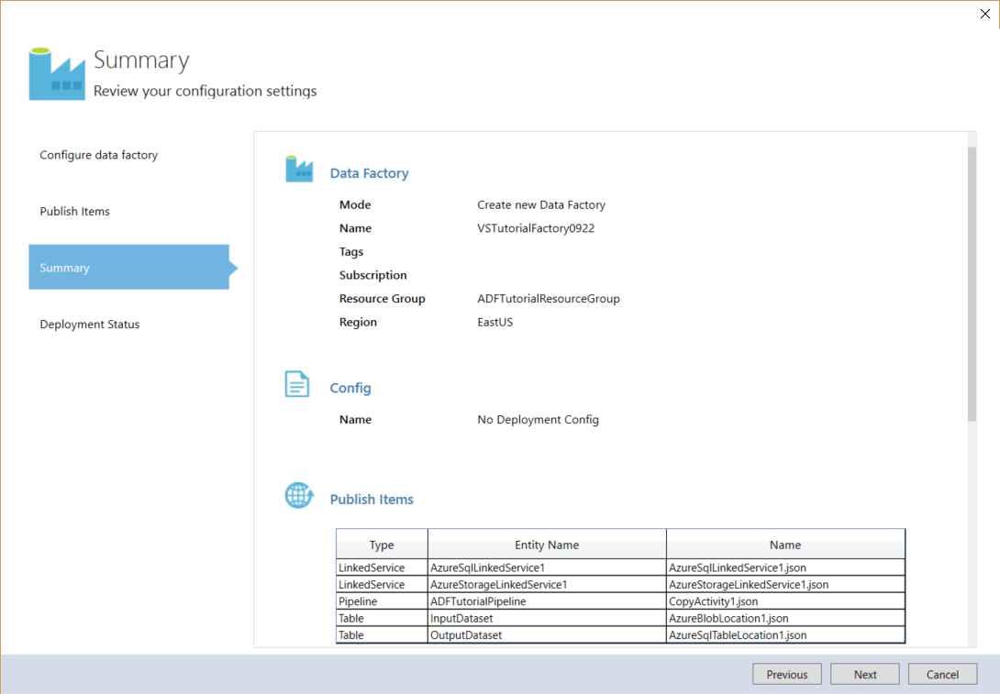
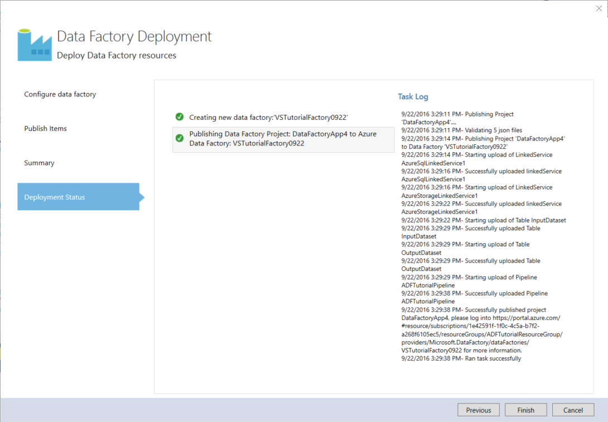
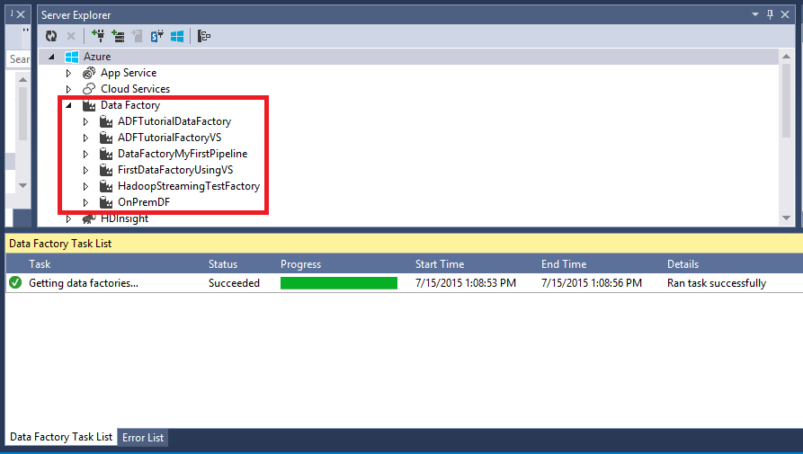
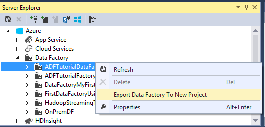

<properties 
    pageTitle="Didacticiel : Créer un pipeline avec une activité copie à l’aide de Visual Studio | Microsoft Azure" 
    description="Dans ce didacticiel, vous créez un pipeline Azure Data Factory avec une activité de copie à l’aide de Visual Studio." 
    services="data-factory" 
    documentationCenter="" 
    authors="spelluru" 
    manager="jhubbard" 
    editor="monicar"/>

<tags 
    ms.service="data-factory" 
    ms.workload="data-services" 
    ms.tgt_pltfrm="na" 
    ms.devlang="na" 
    ms.topic="get-started-article" 
    ms.date="10/17/2016" 
    ms.author="spelluru"/>

# Didacticiel : Créer un pipeline avec une activité copie à l’aide de Visual Studio
> [AZURE.SELECTOR]
- [Vue d’ensemble et conditions préalables](data-factory-copy-data-from-azure-blob-storage-to-sql-database.md)
- [Assistant copie](data-factory-copy-data-wizard-tutorial.md)
- [Portail Azure](data-factory-copy-activity-tutorial-using-azure-portal.md)
- [Visual Studio](data-factory-copy-activity-tutorial-using-visual-studio.md)
- [PowerShell](data-factory-copy-activity-tutorial-using-powershell.md)
- [Modèle de gestionnaire de ressources Azure](data-factory-copy-activity-tutorial-using-azure-resource-manager-template.md)
- [API REST](data-factory-copy-activity-tutorial-using-rest-api.md)
- [API .NET](data-factory-copy-activity-tutorial-using-dotnet-api.md)

Ce didacticiel montre comment créer et surveiller une usine de données Azure à l’aide de Visual Studio. Le pipeline en usine données utilise une activité copier pour copier des données depuis le stockage Blob Azure dans la base de données SQL Azure.

Voici les étapes que vous effectuez dans le cadre de ce didacticiel :

1. Créer deux services liées : **AzureStorageLinkedService1** et **AzureSqlinkedService1**. 

    La AzureStorageLinkedService1 lie un stockage Azure et AzureSqlLinkedService1 des liens à une base de données SQL Azure vers le factory de données : **ADFTutorialDataFactoryVS**. Les données d’entrée pour le pipeline se trouvent dans un conteneur blob dans le stockage blob Azure et données de sortie sont stockées dans un tableau dans la base de données SQL Azure. Par conséquent, vous ajoutez ces deux banques de données en tant que services liés à l’usine de données.
2. Créez deux jeux de données : **InputDataset** et **OutputDataset**, qui représentent les données d’entrée/sortie qui sont stockées dans les banques de données. 

    Pour le InputDataset, vous spécifiez le conteneur blob contenant un blob avec la source de données. Pour le OutputDataset, vous spécifiez la table SQL qui stocke les données de sortie. Vous spécifiez également d’autres propriétés telles que la structure, la disponibilité et stratégie.
3. Créer un pipeline nommé **ADFTutorialPipeline** dans le ADFTutorialDataFactoryVS. 

    Le pipeline a une **Activité de copie de** copie de saisie des données à partir de la Azure BLOB à la table SQL Azure sortie. L’activité de copie effectue le déplacement des données dans Azure Data Factory. L’activité est optimisée par un service globalement disponible qui peut copier des données entre différentes banques de données de façon sécurisée, fiable et format SVG. Consultez l’article des [Activités de déplacement des données](data-factory-data-movement-activities.md) pour plus d’informations sur l’activité de copie. 
4. Créer une usine de données nommée **VSTutorialFactory**. Déployer le factory de données et toutes les entités Data Factory (services liés, des tableaux et le pipeline).    

## Conditions préalables

1. Lire l’article [Vue d’ensemble du didacticiel](data-factory-copy-data-from-azure-blob-storage-to-sql-database.md) et suivez les étapes de **composant requis** . 
2. Vous devez être un **administrateur de l’abonnement Azure** puissent publier entités Data Factory sur Azure Data Factory.  
3. Vous devez disposer des éléments suivants installés sur votre ordinateur : 
    - Visual Studio 2013 ou Visual Studio 2015
    - Téléchargez Azure SDK pour Visual Studio 2013 ou Visual Studio 2015. Accédez à la [Page de téléchargement Azure](https://azure.microsoft.com/downloads/) , puis cliquez sur **VS 2013** ou **VS 2015** dans la section **.NET** .
    - Télécharger le plug-in Azure Data Factory dernière pour Visual Studio : [VS 2013](https://visualstudiogallery.msdn.microsoft.com/754d998c-8f92-4aa7-835b-e89c8c954aa5) ou [VS 2015](https://visualstudiogallery.msdn.microsoft.com/371a4cf9-0093-40fa-b7dd-be3c74f49005). Vous pouvez également modifier le plug-in en procédant comme suit : dans le menu, cliquez sur **Outils** -> **mises à jour et Extensions** -> **Online** -> **Galerie Visual Studio** -> **Microsoft Azure données usine Tools pour Visual Studio** -> **mettre à jour**.

## Créer des projets Visual Studio 
1. Lancez **Visual Studio 2013**. Cliquez sur **fichier**, pointez sur **Nouveau**, puis cliquez sur **projet**. Vous devriez voir la boîte de dialogue **Nouveau projet** .  
2. Dans la boîte de dialogue **Nouveau projet** , sélectionnez le modèle **DataFactory** , puis cliquez sur **Projet de Factory de données vide**. Si vous ne voyez pas le modèle DataFactory, fermez Visual Studio, installez Azure SDK pour Visual Studio 2013 et rouvrez Visual Studio.  

    

3. Entrez un **nom** pour le projet, **emplacement**et un nom pour la **solution**, puis cliquez sur **OK**.

     

## Créer des services liées
Services liés lier banques de données ou le calculent des services à une usine de données Azure. Voir [banques de données pris en charge](data-factory-data-movement-activities.md##supported-data-stores-and-formats) pour toutes les sources et les récepteurs pris en charge par l’activité de copie. Voir [Calculer services liées](data-factory-compute-linked-services.md) pour la liste des services cluster pris en charge par Data Factory. Dans ce didacticiel, vous n’utilisez pas de n’importe quel service cluster. 

Dans cette étape, vous créez deux services liées : **AzureStorageLinkedService1** et **AzureSqlLinkedService1**. AzureStorageLinkedService1 lié liens service un compte de stockage Azure et AzureSqlLinkedService des liens à une base de données SQL Azure vers le factory de données : **ADFTutorialDataFactory**. 

### Créer le service de stockage Azure lié

4. Avec le bouton droit **Services liées** dans l’Explorateur de solutions, pointez sur **Ajouter**, puis cliquez sur **Nouvel élément**.      
5. Dans la boîte de dialogue **Ajouter un nouvel élément** , sélectionnez **Service liée de stockage Azure** dans la liste, puis cliquez sur **Ajouter**. 

    
 
3. Remplacer `<accountname>` et `<accountkey>`* avec le nom de votre compte de stockage Azure et sa clé. 

    

4. Enregistrez le fichier **AzureStorageLinkedService1.json** .

> Pour plus d’informations sur les propriétés JSON, voir [déplacer des données depuis/vers Blob Azure](data-factory-azure-blob-connector.md#azure-storage-linked-service) .

### Créer le service SQL Azure lié

5. Avec le bouton droit sur le nœud des **Services liées** dans l' **Explorateur de solutions** à nouveau, pointez sur **Ajouter**, puis cliquez sur **Nouvel élément**. 
6. Cette fois, sélectionnez **SQL Azure Service lié**, puis cliquez sur **Ajouter**. 
7. Dans le **fichier AzureSqlLinkedService1.json**, remplacez `<servername>`, `<databasename>`, `<username@servername>`, et `<password>` avec des noms de votre serveur SQL Azure, base de données, compte d’utilisateur et mot de passe.    
8.  Enregistrez le fichier **AzureSqlLinkedService1.json** . 

> [AZURE.NOTE]
> Pour plus d’informations sur les propriétés JSON, voir [déplacer des données depuis/vers le base de données SQL Azure](data-factory-azure-sql-connector.md#azure-sql-linked-service-properties) .

## Créer des groupes de données
Dans l’étape précédente, vous avez créé des services liées **AzureStorageLinkedService1** et **AzureSqlLinkedService1** pour lier un compte de stockage Azure et la base de données SQL Azure au factory de données : **ADFTutorialDataFactory**. Dans cette étape, vous définissez deux jeux de données-- **InputDataset** et **OutputDataset** --qui représentent les données d’entrée/sortie qui sont stockées dans les banques de données visées respectivement par AzureStorageLinkedService1 et AzureSqlLinkedService1. Pour InputDataset, vous spécifiez le conteneur blob contenant un blob avec la source de données. Pour OutputDataset, vous spécifiez la table SQL qui stocke les données de sortie.

### Créer le jeu de données d’entrée
Dans cette étape, vous créez un jeu de données nommée **InputDataset** qui pointe vers un conteneur blob dans le stockage Azure représenté par le service **AzureStorageLinkedService1** lié. Un tableau est un jeu de données rectangulaire et est le seul type de jeu de données prises en charge immédiatement. 

9. Avec le bouton droit de **Tables** dans l' **Explorateur de solutions**, pointez sur **Ajouter**, puis cliquez sur **Nouvel élément**.
10. Dans la boîte de dialogue **Ajouter un nouvel élément** , sélectionnez **Blob Azure**, puis cliquez sur **Ajouter**.   
10. Remplacez le texte JSON par le texte suivant et enregistrez le fichier **AzureBlobLocation1.json** . 

        {
          "name": "InputDataset",
          "properties": {
            "structure": [
              {
                "name": "FirstName",
                "type": "String"
              },
              {
                "name": "LastName",
                "type": "String"
              }
            ],
            "type": "AzureBlob",
            "linkedServiceName": "AzureStorageLinkedService1",
            "typeProperties": {
              "folderPath": "adftutorial/",
              "format": {
                "type": "TextFormat",
                "columnDelimiter": ","
              }
            },
            "external": true,
            "availability": {
              "frequency": "Hour",
              "interval": 1
            }
          }
        }

     Notez les points suivants : 
    
    - jeu de données **type** est défini sur **AzureBlob**.
    - **linkedServiceName** est défini sur **AzureStorageLinkedService**. Vous avez créé ce service lié à l’étape 2.
    - **folderPath** est défini sur le conteneur **adftutorial** . Vous pouvez également spécifier le nom d’un objet blob dans le dossier à l’aide de la propriété **nom de fichier** . Étant donné que vous ne spécifiez pas le nom de l’objet blob, données de tous les objets BLOB dans le conteneur sont considérées comme un d’entrée de données.  
    - le **type** de format est défini sur **format du texte**
    - Il existe deux champs dans le fichier texte – **prénom** et **nom** – séparé par une virgule (**columnDelimiter**) 
    - La **disponibilité** est défini sur **toutes les heures** (**fréquence** est définie sur **heure** et **intervalle** est égale à **1**). Par conséquent, Data Factory recherche les données d’entrée toutes les heures dans le dossier racine du conteneur blob (**adftutorial**) que vous avez spécifié. 
    
    Si vous ne spécifiez un **nom de fichier** pour un jeu de données **d’entrée** , tous les fichiers BLOB à partir du dossier d’entrée (**folderPath**) sont considérés comme entrées. Si vous spécifiez un nom de fichier dans le JSON, uniquement le spécifié fichier/blob est considéré comme asn d’entrée.
 
    Si vous ne spécifiez pas un **nom de fichier** pour une **table de sortie**, les fichiers générés dans le **folderPath** sont nommés au format suivant : données. &lt;Guid\&gt ;. txt (exemple : Data.0a405f8a-93ff-4c6f-b3be-f69616f1df7a.txt.).

    Pour définir **folderPath** et **nom de fichier** dynamiquement en fonction du temps **SliceStart** , utilisez la propriété **partitionedBy** . Dans l’exemple suivant, folderPath utilise année, mois et jour à partir de la SliceStart (heure de début de la section en cours de traitement) et nom de fichier utilise l’heure à partir de la SliceStart. Par exemple, si un secteur en cours de production pour 2016-09-20T08:00:00, NomDossier est définie sur wikidatagateway/wikisampledataout/2016/09/20 et le nom de fichier est défini sur 08.csv. 

            "folderPath": "wikidatagateway/wikisampledataout/{Year}/{Month}/{Day}",
            "fileName": "{Hour}.csv",
            "partitionedBy": 
            [
                { "name": "Year", "value": { "type": "DateTime", "date": "SliceStart", "format": "yyyy" } },
                { "name": "Month", "value": { "type": "DateTime", "date": "SliceStart", "format": "MM" } }, 
                { "name": "Day", "value": { "type": "DateTime", "date": "SliceStart", "format": "dd" } }, 
                { "name": "Hour", "value": { "type": "DateTime", "date": "SliceStart", "format": "hh" } } 

> [AZURE.NOTE]
> Pour plus d’informations sur les propriétés JSON, voir [déplacer des données depuis/vers Blob Azure](data-factory-azure-blob-connector.md#azure-blob-dataset-type-properties) .

### Créer le jeu de données de sortie
Dans cette étape, vous créez un jeu de données de sortie nommé **OutputDataset**. Points de ce groupe de données à une table SQL dans la base de données SQL Azure représenté par **AzureSqlLinkedService1**. 

11. Avec le bouton droit à nouveau de **Tables** dans l' **Explorateur de solutions** , pointez sur **Ajouter**, puis cliquez sur **Nouvel élément**.
12. Dans la boîte de dialogue **Ajouter un nouvel élément** , sélectionnez **SQL Azure**, puis cliquez sur **Ajouter**. 
13. Remplacez le texte JSON par le JSON suivant et enregistrez le fichier **AzureSqlTableLocation1.json** .

        {
          "name": "OutputDataset",
          "properties": {
            "structure": [
              {
                "name": "FirstName",
                "type": "String"
              },
              {
                "name": "LastName",
                "type": "String"
              }
            ],
            "type": "AzureSqlTable",
            "linkedServiceName": "AzureSqlLinkedService1",
            "typeProperties": {
              "tableName": "emp"
            },
            "availability": {
              "frequency": "Hour",
              "interval": 1
            }
          }
        }

     Notez les points suivants : 
    
    - jeu de données **type** est défini sur **AzureSQLTable**.
    - **linkedServiceName** est défini sur **AzureSqlLinkedService** (vous avez créé ce service lié à l’étape 2).
    - **TableName** est défini sur **emp**.
    - Il existe trois colonnes – **ID**, **prénom**et **nom** – dans la table emp dans la base de données. ID est une colonne d’identité, vous devez spécifier uniquement **prénom** et **nom** ici.
    - La **disponibilité** est défini sur **toutes les heures** (**fréquence** définie sur **heure** et **intervalle** la valeur **1**).  Le service de données usine génère un secteur de données de sortie toutes les heures dans la table **emp** dans la base de données SQL Azure.

> [AZURE.NOTE]
> Pour plus d’informations sur les propriétés JSON, voir [déplacer des données depuis/vers le base de données SQL Azure](data-factory-azure-sql-connector.md#azure-sql-linked-service-properties) .

## Créer des opportunités 
Vous avez créé des tables et les services liés d’entrée/sortie jusqu'à présent. À présent, vous créez un pipeline avec une **Activité copier** pour copier des données à partir de la Azure blob à base de données SQL Azure. 

1. Avec le bouton droit **Pipelines** dans l' **Explorateur de solutions**, pointez sur **Ajouter**, puis cliquez sur **Nouvel élément**.  
15. Sélectionnez **Pipeline de copie de données** dans la boîte de dialogue **Ajouter un nouvel élément** , puis cliquez sur **Ajouter**. 
16. Remplacez le JSON par le JSON suivant et enregistrez le fichier **CopyActivity1.json** .
            
        {
          "name": "ADFTutorialPipeline",
          "properties": {
            "description": "Copy data from a blob to Azure SQL table",
            "activities": [
              {
                "name": "CopyFromBlobToSQL",
                "type": "Copy",
                "inputs": [
                  {
                    "name": "InputDataset"
                  }
                ],
                "outputs": [
                  {
                    "name": "OutputDataset"
                  }
                ],
                "typeProperties": {
                  "source": {
                    "type": "BlobSource"
                  },
                  "sink": {
                    "type": "SqlSink",
                    "writeBatchSize": 10000,
                    "writeBatchTimeout": "60:00:00"
                  }
                },
                "Policy": {
                  "concurrency": 1,
                  "executionPriorityOrder": "NewestFirst",
                  "style": "StartOfInterval",
                  "retry": 0,
                  "timeout": "01:00:00"
                }
              }
            ],
            "start": "2015-07-12T00:00:00Z",
            "end": "2015-07-13T00:00:00Z",
            "isPaused": false
          }
        }

    Notez les points suivants :

    - Dans la section activités, il n'est qu’une seule activité dont le **type** est défini sur **Copier**.
    - Entrée de l’activité est définie sur **InputDataset** et sortie de l’activité est définie sur **OutputDataset**.
    - Dans la section **typeProperties** , **BlobSource** est spécifiée comme type de source et **SqlSink** est spécifiée comme type de récepteur.

    Remplacez la valeur de la propriété **Démarrer** avec la valeur de jour et de **fin** actuelle avec le jour suivant. Vous pouvez spécifier uniquement la partie date et ignorer la partie heure de l’heure de la date. Par exemple, « 2016-02-03 », ce qui équivaut à « 2016-02-03T00:00:00Z »
    
    Les deux début et fin dates/heures doivent être au [format ISO](http://en.wikipedia.org/wiki/ISO_8601). Par exemple : 2016-10-14T16:32:41Z. L’heure de **fin** est facultative, mais nous l’utiliser dans ce didacticiel. 
    
    Si vous ne spécifiez pas de valeur pour la propriété **end** , il est calculé comme «**début + 48 heures**». Pour exécuter le pipeline indéfiniment, spécifiez **9999-09-09** comme la valeur de la propriété de **fin** .
    
    Dans l’exemple précédent, il existe 24 secteurs données comme chaque tranche de données est généré toutes les heures.

## Publier/déployer entités Data Factory
Dans cette étape, vous publiez entités Data Factory (services liées, jeux de données et pipeline) que vous avez créée. Vous également spécifiez le nom de la nouvelle factory de données doit être créé pour mettre en attente de ces entités.  

18. Avec le bouton droit de projet dans l’Explorateur de solutions, puis cliquez sur **Publier**. 
19. Si vous voyez la boîte de dialogue **se connecter à votre compte Microsoft** , entrez vos informations d’identification du compte qui dispose d’abonnement Azure, puis cliquez sur **se connecter**.
20. Vous devriez voir la boîte de dialogue suivante :

    
21. Dans la page par défaut de données de configuration, procédez comme suit : 
    1. Sélectionnez l’option **Créer un nouveau Factory de données** .
    2. Entrez **VSTutorialFactory** pour **nom**.  
    
        > [AZURE.IMPORTANT]  
        > Le nom de la factory données Azure doit être globalement unique. Si vous recevez un message d’erreur sur le nom de données lors de la publication, modifier le nom d’usine de données (par exemple, yournameVSTutorialFactory) et essayez à nouveau de publication. Consultez la rubrique de [Données Factory - règles d’appellation](data-factory-naming-rules.md) pour les règles d’appellation pour les objets de données par défaut.     
    3. Cliquez sur votre abonnement Azure pour le champ **abonnement** .
     
        > [AZURE.IMPORTANT]Si vous ne voyez pas les abonnements, vérifiez que vous connecter avec un compte qui est un administrateur ou la co-création-administrateur de l’abonnement.  
    4. Sélectionnez le **groupe de ressources** pour le factory de données à créer. 5. Sélectionnez la **région** pour le factory de données. Uniquement les régions pris en charge par le service de données par défaut sont affichées dans la liste déroulante.
6. Cliquez sur **suivant** pour passer à la page **Publier des éléments** .
    
           
23. Dans la page **Publier des éléments** , vérifiez que toutes les références de données entités sont sélectionnées, puis cliquez sur **suivant** pour passer à la page de **Résumé** .
    
         
24. Consultez le résumé, cliquez sur **suivant** pour démarrer le processus de déploiement et afficher le **Statut du déploiement**.

    
25. Dans la page **État du déploiement** , vous devez voir l’état du processus de déploiement. Une fois que le déploiement est terminé, cliquez sur Terminer. 
     Notez les points suivants : 

- Si vous recevez l’erreur : «**cet abonnement n’est pas enregistré pour utiliser l’espace de noms Microsoft.DataFactory**», effectuez l’une des opérations suivantes et essayez de republier : 

    - Dans Azure PowerShell, exécutez la commande suivante pour enregistrer le fournisseur de données par défaut. 
        
            Register-AzureRmResourceProvider -ProviderNamespace Microsoft.DataFactory
    
        Vous pouvez exécuter la commande suivante pour vous assurer que le Factory de données fournisseur est enregistré. 
    
            Get-AzureRmResourceProvider
    - Connexion à l’aide de l’abonnement au [portail Azure](https://portal.azure.com) Azure et accédez à une carte de données par défaut (ou) créer une usine de données dans le portail Azure. Cette action enregistre automatiquement le fournisseur pour vous.
-   Le nom de la factory de données peut être enregistré comme un nom DNS à l’avenir et donc deviennent visible publiquement.

> [AZURE.IMPORTANT] Pour créer des instances de données par défaut, vous devez être un administrateur/Co-création-administrateur de l’abonnement Azure

## Résumé
Dans ce didacticiel, vous avez créé une usine de données Azure pour copier des données à partir d’un Azure blob à une base de données SQL Azure. Vous avez utilisé Visual Studio pour créer le factory de données, services liés, jeux de données et une opportunité. Voici les principales étapes que vous avez effectuées dans ce didacticiel :  

1.  Créer une **usine de données**Azure.
2.  Créé **des services liées**:
    1. Un service de **Stockage Azure** lié à lier votre compte de stockage Azure qui contient les données d’entrée.    
    2. Un service **SQL Azure** lié à lier votre base de données SQL Azure qui contient les données de sortie. 
3.  Créé **des groupes de données**, qui décrivent les données d’entrée et les données de sortie de pipelines.
4.  Créé un **pipeline** avec une **Activité de copie** avec **BlobSource** comme source et **SqlSink** en tant que récepteur. 

## Explorateur de serveurs permet d’afficher les références de données

1. Dans **Visual Studio**, cliquez sur **affichage** dans le menu, puis cliquez sur **Explorateur de serveurs**.
2. Dans la fenêtre Explorateur de serveurs, développez **Azure** et **Data Factory**. Si vous voyez **se connecter à Visual Studio**, entrez le **compte** associé à votre abonnement Azure et cliquez sur **Continuer**. Entrez **votre mot de passe**, puis cliquez sur **se connecter**. Visual Studio tente d’obtenir des informations sur toutes les références de données Azure dans votre abonnement. Vous voyez l’état de cette opération dans la fenêtre de la **Liste de tâches de données par défaut** .
    
3. Vous pouvez avec le bouton droit sur une usine de données, puis sélectionnez Exporter Data Factory à nouveau projet pour créer un projet Visual Studio basé sur une usine de données existante.
      

## Mettre à jour des outils de données par défaut pour Visual Studio
Pour mettre à jour des outils usine de données Azure pour Visual Studio, procédez comme suit :

1. Cliquez sur **Outils** dans le menu et sélectionnez **Extensions et mises à jour**. 
2. Sélectionnez les **mises à jour** dans le volet gauche, puis sélectionnez **Galerie Visual Studio**.
4. Sélectionnez **Factory de données Azure tools pour Visual Studio** , puis cliquez sur **mettre à jour**. Si vous ne voyez pas cette entrée, vous possédez déjà la dernière version des outils. 

Pour obtenir des instructions sur la façon d’utiliser le portail Azure pour contrôler les opportunités et les jeux de données que vous avez créé dans ce didacticiel, voir [pipeline et des datasets de moniteur](data-factory-copy-activity-tutorial-using-azure-portal.md#monitor-pipeline) .

## Voir aussi
| Rubrique | Description |
| :---- | :---- |
| [Activités de déplacement des données](data-factory-data-movement-activities.md) | Cet article fournit des informations détaillées sur l’activité de copie que vous avez utilisées dans le didacticiel. |
| [Planification et l’exécution](data-factory-scheduling-and-execution.md) | Cet article décrit les aspects de la planification et l’exécution du modèle d’application Azure Data Factory. |
| [Pipelines](data-factory-create-pipelines.md) | Cet article vous aide à comprendre les pipelines et activités dans Azure Data Factory |
| [Jeux de données](data-factory-create-datasets.md) | Cet article vous aide à comprendre les groupes de données dans Azure Data Factory.
| [Surveiller et gérer les pipelines à l’aide d’application de surveillance](data-factory-monitor-manage-app.md) | Cet article décrit comment contrôler, gérer et déboguer pipelines à l’aide de la surveillance et l’application de gestion. 
